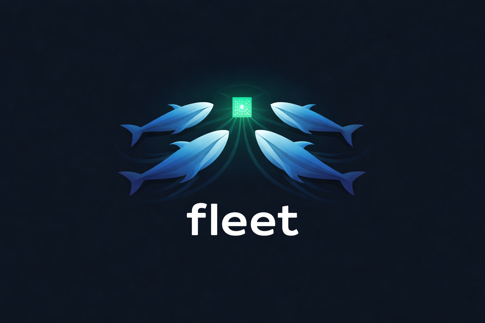

<p align="center">
  
</p>

# Fleet

Fleet was built to simplify deploying multiple Docker Compose stacks to a single server where all stacks need to share ports 80 and 443. Fleet manages the ingress layer for you — a shared Caddy reverse proxy is automatically bootstrapped and configured so each stack gets its own domain and HTTPS without port conflicts.

Fleet is a TypeScript CLI tool for deploying Docker Compose applications to remote servers over SSH. It uploads your Compose and environment files, starts containers, and configures a [Caddy](https://caddyserver.com) reverse proxy with automatic HTTPS — all from a single `fleet deploy` command driven by a declarative `fleet.yml` configuration file.

Fleet targets developers and small teams who want code-defined deployments without the operational overhead of Kubernetes or a full container orchestration platform.

## How it works

A `fleet deploy` runs a 17-step pipeline that:

1. Loads and validates `fleet.yml` and your Compose file locally
2. Opens an SSH connection to the target server
3. Bootstraps a Caddy reverse proxy container (once, idempotent)
4. Uploads your Compose and environment files
5. Computes SHA-256 hashes of service definitions, image digests, and env files to classify each service as **deploy**, **restart**, or **skip** — avoiding unnecessary container churn
6. Pulls images and starts only the containers that changed
7. Runs health checks and registers routes with Caddy
8. Writes deployment state to `~/.fleet/state.json` on the server

## Installation

```bash
npm install -g @pruddiman/fleet
# or use directly via npx
npx fleet <command>
```

Requires Node.js ≥ 20. The target server requires Docker and Docker Compose V2.

## Quick start

**1. Scaffold a configuration file:**

```bash
fleet init
```

This reads your `docker-compose.yml` and generates a `fleet.yml` interactively.

**2. Validate before deploying:**

```bash
fleet validate
```

Runs pre-flight checks locally with no SSH connection required.

**3. Deploy:**

```bash
fleet deploy
```

## `fleet.yml` reference

```yaml
version: "1"

server:
  host: your-server.example.com
  user: deploy
  port: 22
  identity_file: ~/.ssh/id_ed25519   # or omit to use SSH_AUTH_SOCK

stack:
  name: myapp                         # lowercase letters, digits, hyphens only
  compose_file: docker-compose.yml    # relative to fleet.yml; default: docker-compose.yml

# Three mutually exclusive env modes:

# Mode 1 — inline key-value pairs
env:
  - key: NODE_ENV
    value: production

# Mode 2 — upload a local .env file (recommended for CI/CD)
env:
  file: .env.production

# Mode 3 — export secrets from Infisical
env:
  infisical:
    token: $INFISICAL_TOKEN          # $VAR references are expanded at load time
    project_id: your-project-id
    environment: production
    path: /

routes:
  - domain: myapp.example.com
    port: 3000
    service: myapp
    tls: true
    acme_email: ops@example.com       # recommended for production
    health_check:
      path: /health
      timeout_seconds: 30
      interval_seconds: 5
```

### `server` fields

| Field | Required | Default | Description |
|-------|----------|---------|-------------|
| `host` | Yes | — | Server hostname or IP address |
| `port` | No | `22` | SSH port |
| `user` | No | `"root"` | SSH username |
| `identity_file` | No | — | Path to SSH private key; falls back to `SSH_AUTH_SOCK` if omitted |

### `stack` fields

| Field | Required | Default | Description |
|-------|----------|---------|-------------|
| `name` | Yes | — | Docker Compose project name (`-p` flag); must match `/^[a-z\d][a-z\d-]*$/` |
| `compose_file` | No | `"docker-compose.yml"` | Path to Compose file, relative to `fleet.yml` |

### `routes` fields

| Field | Required | Default | Description |
|-------|----------|---------|-------------|
| `domain` | Yes | — | Fully qualified domain name |
| `port` | Yes | — | Container port to proxy traffic to |
| `service` | No | `"default"` | Docker Compose service name |
| `tls` | No | `true` | Enable automatic HTTPS via Let's Encrypt |
| `acme_email` | No | — | Email for ACME account registration |
| `health_check.path` | No | `"/"` | HTTP path to poll after deploy |
| `health_check.timeout_seconds` | No | `60` | Max wait time (1–3600) |
| `health_check.interval_seconds` | No | `2` | Poll interval (1–60) |

## Commands

| Command | Description |
|---------|-------------|
| `fleet init` | Scaffold a `fleet.yml` from an existing Compose file |
| `fleet validate [file]` | Check `fleet.yml` and Compose file for errors (no SSH required) |
| `fleet deploy` | Deploy services to the remote server |
| `fleet env` | Push or refresh secrets on the remote server without redeploying |
| `fleet ps` | Show running container status and deployment timestamps |
| `fleet logs` | Stream live container logs |
| `fleet restart` | Restart a service in a deployed stack |
| `fleet stop` | Stop a stack without destroying it |
| `fleet teardown` | Remove a stack, its containers, and optionally its volumes |
| `fleet proxy status` | Show live Caddy route status, surfacing ghost or missing routes |
| `fleet proxy reload` | Force-reload all Caddy routes from server state |

### `fleet deploy` flags

| Flag | Description |
|------|-------------|
| `--force` | Redeploy all services regardless of hash changes |
| `--dry-run` | Print what would be deployed without making changes |
| `--skip-pull` | Skip `docker pull` before starting containers |
| `--no-health-check` | Skip health checks after deployment |

## CI/CD integration

Fleet is non-interactive and designed for automation. Use git commit SHAs as image tags for traceability and simple rollbacks.

### Recommended pattern

Tag images with the commit SHA, write secrets to a `.env` file, then validate and deploy:

```bash
# Build and push
docker build -t ghcr.io/yourorg/myapp:$GIT_SHA .
docker push ghcr.io/yourorg/myapp:$GIT_SHA

# Write env file
echo "IMAGE_TAG=$GIT_SHA" > .env.production
echo "DATABASE_URL=$DATABASE_URL" >> .env.production

# Validate and deploy
npx fleet validate
npx fleet deploy
```

### SSH key setup

Store your deploy key as a CI secret, write it at pipeline runtime:

```bash
echo "$SSH_PRIVATE_KEY" > /tmp/deploy_key
chmod 600 /tmp/deploy_key
```

Reference it in `fleet.yml`:

```yaml
server:
  host: your-server.example.com
  user: deploy
  identity_file: /tmp/deploy_key
```

### GitHub Actions example

```yaml
name: Build and Deploy
on:
  push:
    branches: [main]

jobs:
  deploy:
    runs-on: ubuntu-latest
    permissions:
      contents: read
      packages: write
    steps:
      - uses: actions/checkout@v4

      - uses: docker/setup-buildx-action@v3

      - uses: docker/login-action@v3
        with:
          registry: ghcr.io
          username: ${{ github.actor }}
          password: ${{ secrets.GITHUB_TOKEN }}

      - uses: docker/build-push-action@v5
        with:
          context: .
          push: true
          tags: ghcr.io/yourorg/myapp:${{ github.sha }}

      - uses: actions/setup-node@v4
        with:
          node-version: "20"

      - run: npm install

      - name: Write environment file
        run: |
          cat <<EOF > .env.production
          IMAGE_TAG=${{ github.sha }}
          DATABASE_URL=${{ secrets.DATABASE_URL }}
          NODE_ENV=production
          EOF

      - run: npx fleet validate

      - name: Write SSH key
        run: |
          echo "${{ secrets.SSH_PRIVATE_KEY }}" > /tmp/deploy_key
          chmod 600 /tmp/deploy_key

      - run: npx fleet deploy
```

## Remote filesystem layout

Fleet stores all deployment artifacts under `/opt/fleet` or `~/fleet` on the remote server:

```
/opt/fleet (or ~/fleet)
├── proxy/
│   └── compose.yml          # Caddy container definition
└── stacks/
    ├── myapp/
    │   ├── docker-compose.yml
    │   └── .env
    └── blog/
        ├── docker-compose.yml
        └── .env

~/.fleet/
└── state.json               # Deployment state (all stacks)
```

## Limitations (v1)

- **Single server per `fleet.yml`** — use separate config files for multiple servers
- **No image building** — build images in your CI pipeline before deploying
- **No deployment history or rollback** — roll back by redeploying a previous commit SHA
- **No blue/green or canary strategies** — in-place container replacement only
- **No concurrency control** — concurrent deploys to the same server can corrupt state
- **No web UI** — CLI only

## Documentation

- [Architecture Overview](docs/architecture.md)
- [Deployment Pipeline](docs/deployment-pipeline.md)
- [Configuration Schema Reference](docs/configuration/schema-reference.md)
- [Environment Variables and Secrets](docs/configuration/environment-variables.md)
- [CI/CD Integration Guide](docs/ci-cd-integration.md)
- [Validation](docs/validation/overview.md)
- [Caddy Proxy](docs/caddy-proxy/overview.md)
- [SSH Connection](docs/ssh-connection/overview.md)
- [State Management](docs/state-management/overview.md)
- [Stack Lifecycle](docs/stack-lifecycle/overview.md)
- [Full documentation index](docs/index.md)
