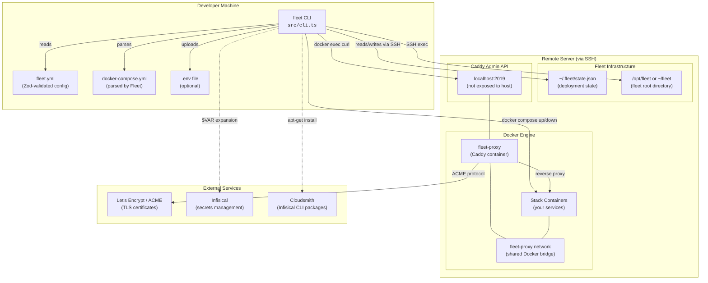
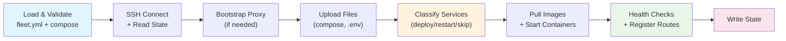
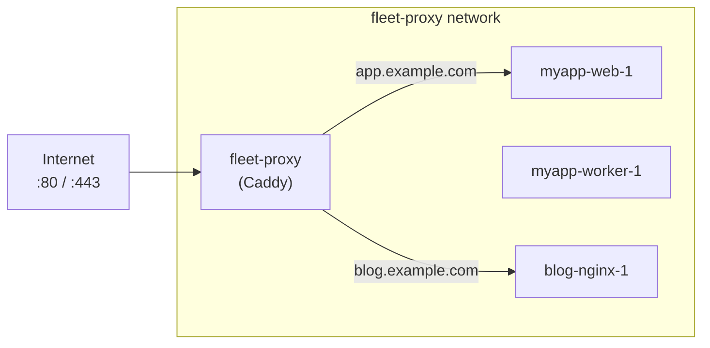

# Fleet — Architecture Overview

Fleet is a TypeScript CLI tool that deploys Docker Compose applications to remote
servers over SSH, provisions a Caddy reverse proxy with automatic HTTPS, and
tracks what is deployed so it can make the smallest possible change on each run.
It targets developers and small teams who want code-defined deployments without
the operational overhead of Kubernetes or a full container orchestration platform.

Fleet exists because deploying a Docker Compose stack to a remote server still
involves a manual, error-prone sequence: SSH in, upload files, pull images, start
containers, configure a reverse proxy, obtain TLS certificates, and remember what
you did last time. Fleet collapses that into a single `fleet deploy` command
driven by a declarative `fleet.yml` configuration file.

## System architecture

Fleet operates as a local CLI that orchestrates remote infrastructure through
SSH. Every command follows the same pattern: load a local `fleet.yml`, open an
SSH connection, and execute Docker and Caddy operations on the target server.



### Key architectural properties

- **Single-server model.** Fleet manages one remote host per `fleet.yml`. There
  is no multi-server orchestration, load balancing, or service mesh.
- **SSH as the only transport.** Every remote operation flows through a single
  SSH connection (or local shell for `localhost`). There is no agent, daemon, or
  sidecar on the server.
- **Caddy as the shared proxy.** All stacks share one Caddy instance on a shared
  Docker network. Routes are managed dynamically via the Caddy Admin REST API.
- **File-based state.** Server-side state lives in a single JSON file
  (`~/.fleet/state.json`), read and written atomically over SSH.
- **Content-addressable classification.** Fleet computes SHA-256 hashes of
  service definitions, image digests, and environment files to determine the
  minimum set of changes on each deploy.

## Data flow

A `fleet deploy` invocation drives data through a 17-step pipeline. The diagram
below shows the major data flow stages; see the
[deployment pipeline](deployment-pipeline.md) and
[deploy sequence](deploy/deploy-sequence.md) docs for the full step-by-step
reference.



| Stage | Key files | Detail page |
|-------|-----------|-------------|
| Load and validate | `src/config/loader.ts`, `src/validation/` | [Configuration](configuration/overview.md), [Validation](validation/overview.md) |
| SSH connect | `src/ssh/factory.ts` | [SSH connection](ssh-connection/overview.md) |
| Bootstrap proxy | `src/deploy/helpers.ts:90` | [Server bootstrap](bootstrap/server-bootstrap.md) |
| Upload files | `src/deploy/helpers.ts:140-192` | [File upload](deploy/file-upload.md) |
| Resolve secrets | `src/deploy/helpers.ts:198-287` | [Secrets resolution](deploy/secrets-resolution.md) |
| Classify services | `src/deploy/classify.ts` | [Classification decision tree](deploy/classification-decision-tree.md) |
| Pull and start | `src/deploy/deploy.ts:228-261` | [Deploy sequence](deploy/deploy-sequence.md) |
| Health checks | `src/deploy/helpers.ts:321-356` | [Health checks](deploy/health-checks.md) |
| Register routes | `src/deploy/helpers.ts:361-403` | [Caddy route management](deploy/caddy-route-management.md) |
| Write state | `src/state/state.ts:74-91` | [State lifecycle](state-management/state-lifecycle.md) |

## Infrastructure

### Docker networking model

Fleet creates a single external Docker bridge network named `fleet-proxy`. The
Caddy reverse proxy container and every deployed stack's containers are attached
to this network, enabling Caddy to reach services by their Docker Compose
container names (e.g., `mystack-web-1`).



Ports 80 and 443 on the host are reserved for the Caddy container. Service
containers must not bind these ports — the
[validation system](validation/overview.md) enforces this with the
`RESERVED_PORT_CONFLICT` check.

### Caddy reverse proxy

Caddy provides automatic HTTPS via ACME/Let's Encrypt and runtime configuration
via its Admin REST API. Fleet never restarts the Caddy container to change
routing — it uses the `/load`, `/config/`, and `/id/{caddyId}` API endpoints.

The Admin API listens on `localhost:2019` inside the container and is
intentionally not exposed to the host network. All API access goes through
`docker exec fleet-proxy curl ...`, with SSH as the trust boundary. See the
[Caddy proxy documentation](caddy-proxy/overview.md) for the full architecture.

Configuration survives container restarts via `caddy run --resume` and named
Docker volumes (`caddy_data` for TLS certificates, `caddy_config` for autosaved
configuration). See [TLS and ACME](caddy-proxy/tls-and-acme.md) for certificate
lifecycle details.

### Remote filesystem layout

Fleet stores all deployment artifacts under a resolved "fleet root" directory on
the remote server. See [Fleet root](fleet-root/overview.md) for the resolution
logic.

```
/opt/fleet (or ~/fleet)
├── proxy/
│   └── compose.yml          # Caddy container definition
└── stacks/
    ├── myapp/
    │   ├── docker-compose.yml
    │   └── .env
    └── blog/
        ├── docker-compose.yml
        └── .env

~/.fleet/
└── state.json                # Deployment state (all stacks)
```

## Key design decisions

### Selective deployment via content-addressable hashing

Fleet avoids unnecessary container restarts by computing three types of hashes
for each service:

| Hash type | Computed where | Mechanism |
|-----------|---------------|-----------|
| Definition hash | Locally (Node.js `crypto`) | SHA-256 of 10 runtime-affecting Compose fields |
| Image digest | Remotely (`docker image inspect`) | Registry-provided content digest |
| Environment hash | Remotely (`sha256sum .env`) | Hash of the `.env` file on disk |

These hashes are compared against stored values in `state.json` to classify each
service into one of three buckets: **deploy** (recreate container), **restart**
(re-read env without recreating), or **skip** (no change). The six-step priority
decision tree is documented in
[service classification and hashing](deploy/service-classification-and-hashing.md)
and the [classification decision tree](deploy/classification-decision-tree.md).

### Three-tier remote execution

Commands flow through three layers of indirection:

1. **Local Fleet CLI** calls `exec()` on the SSH connection
2. **SSH session** runs `docker exec` on the remote Docker daemon
3. **Docker exec** runs `curl` against the Caddy Admin API inside the container

This design keeps the Caddy Admin API unexposed to the network while enabling
full configuration control. The tradeoff is that failures at each layer produce
different error signatures, making debugging more complex. See the
[SSH connection](ssh-connection/overview.md) and
[proxy status and reload](proxy-status-reload/overview.md) docs for details.

### Three environment/secrets strategies

The `env` field in `fleet.yml` accepts a union of three mutually exclusive
shapes, each resolving to a `.env` file on the server with `0600` permissions:

| Strategy | Config shape | Upload mechanism |
|----------|-------------|-----------------|
| Inline entries | `env: [{key: K, value: V}]` | Heredoc via SSH |
| File reference | `env: {file: "./path"}` | Base64-encoded upload |
| Infisical export | `env: {infisical: {...}}` | Remote CLI invocation |

The same `resolveSecrets()` function is used by both `fleet deploy` (step 9) and
`fleet env` (standalone refresh). See [secrets resolution](deploy/secrets-resolution.md)
and [environment and secrets management](env-secrets/overview.md) for details.

## Cross-cutting concerns

### SSH connection layer

The `Connection` interface (`src/ssh/types.ts`) is the most pervasive dependency
in the codebase — imported by 19+ files across 12 modules. A factory function
auto-selects between SSH (via `node-ssh`) for remote hosts and `child_process`
for `localhost`. Every module that touches the remote server depends on this
abstraction.

**Authentication:** Supports private key files (via `identity_file` in
`fleet.yml`) or SSH agent forwarding (via `SSH_AUTH_SOCK`). No password
authentication. See [SSH authentication](ssh-connection/authentication.md).

**Lifecycle:** Callers must explicitly close connections in `finally` blocks.
There is no connection pooling, timeout configuration, or reconnection logic.
See [connection lifecycle](ssh-connection/connection-lifecycle.md).

### State management

`~/.fleet/state.json` on each target server is the single source of truth for
what Fleet has deployed. It records:

- Fleet root path and Caddy bootstrap status
- Per-stack: compose file path, deployment timestamp, routes, and per-service
  hashes (definition, image digest, env, deployment/skip timestamps)

State is read at the start and written at the end of each deploy. The write uses
an atomic pattern (write to `.tmp` then `mv`). **There is no file locking** — 
concurrent deploys to the same host can race. Schema evolution uses optional
Zod fields for backward compatibility.

See [state management](state-management/overview.md) and
[schema reference](state-management/schema-reference.md) for the full data
model.

### Configuration (`fleet.yml`)

The Zod-validated `fleet.yml` is the contract that every command depends on. It
is loaded by 15+ source files and defines server connection, stack identity,
environment strategy, domain routing, TLS settings, and health check parameters.
The `$VAR` expansion mechanism resolves environment variables in Infisical config
fields at load time.

See [configuration overview](configuration/overview.md) and
[schema reference](configuration/schema-reference.md).

### Validation

Fleet runs 10 pre-flight checks against both `fleet.yml` and the referenced
Docker Compose file. Validation runs in two contexts:

- `fleet validate` — standalone pre-flight command
- `fleet deploy` step 1 — errors block deployment, warnings pass through

Checks cover stack naming, domain format, port conflicts, service existence, and
env configuration conflicts. There is no plugin mechanism. See
[validation overview](validation/overview.md) and
[validation codes](validation/validation-codes.md).

### Error handling

Every CLI command uses an identical `try/catch` pattern that prints the error
message and exits with code 1. There is no centralized error handler, structured
error codes for CLI output, or automatic cleanup on failure. Destructive
operations (stop, teardown) that fail mid-sequence leave the system in a
partially modified state with no rollback. See
[failure recovery](deploy/failure-recovery.md) and
[stack lifecycle failure modes](stack-lifecycle/failure-modes.md).

### Monitoring and observability

Fleet itself does not include monitoring, alerting, or structured logging. The
primary observability tools are:

- `fleet ps` — live container status and deployment timestamps
  ([process status](process-status/overview.md))
- `fleet logs` — real-time Docker Compose log streaming
  ([logs command](process-status/logs-command.md))
- `fleet proxy status` — reconciles live Caddy routes against expected state,
  surfacing ghost and missing routes
  ([proxy status](proxy-status-reload/proxy-status.md))
- Caddy access logs via `docker logs fleet-proxy`
- Direct state inspection via `cat ~/.fleet/state.json` on the server

### TLS and certificate management

TLS is handled entirely by Caddy via the ACME protocol (Let's Encrypt by
default). An optional `acme_email` field in `fleet.yml` configures the ACME
account. Certificates are stored in the `caddy_data` Docker volume. Losing this
volume forces re-provisioning, which may hit Let's Encrypt rate limits.

There is no built-in certificate monitoring, rotation alerting, or staging CA
support. See [TLS and ACME](caddy-proxy/tls-and-acme.md).

### Secrets management

Secrets enter the system through three paths (inline, file, Infisical), all
resolved to a `.env` file with `0600` permissions. The Infisical CLI is
bootstrapped on the remote server via a Cloudsmith-hosted Debian package — this
assumes a Debian/Ubuntu target and requires outbound HTTPS to `dl.cloudsmith.io`.

Infisical tokens support `$VAR` expansion from local environment variables,
keeping sensitive values out of `fleet.yml`. However, there is no built-in token
rotation, expiration monitoring, or audit logging. See
[Infisical integration](env-secrets/infisical-integration.md).

### Concurrency and locking

Fleet provides no concurrency control. The read-check-write cycle for
`state.json` is not atomic, and there is no file locking or distributed lock.
Concurrent `fleet deploy` invocations targeting the same server can produce
corrupted state. Users must ensure serial execution (e.g., via CI/CD pipeline
serialization).

## Component index

The table below maps Fleet's major subsystems to their source directories and
documentation pages.

| Component | Source | Documentation |
|-----------|--------|---------------|
| CLI entry point | `src/cli.ts`, `src/commands/` | [CLI overview](cli-entry-point/overview.md) |
| Operational commands (ps, logs, restart, stop, teardown) | `src/commands/`, `src/ps/`, `src/logs/`, `src/restart/`, `src/stop/`, `src/teardown/` | [Operational commands](cli-commands/operational-commands.md) |
| Configuration schema and loading | `src/config/` | [Configuration](configuration/overview.md) |
| Docker Compose parsing | `src/compose/` | [Compose parsing](compose/overview.md) |
| Validation | `src/validation/` | [Validation](validation/overview.md) |
| Deployment pipeline | `src/deploy/` | [Deployment pipeline](deployment-pipeline.md) |
| Service classification and hashing | `src/deploy/classify.ts`, `src/deploy/hashes.ts` | [Classification](deploy/service-classification-and-hashing.md) |
| Server bootstrap | `src/bootstrap/`, `src/deploy/helpers.ts:90` | [Bootstrap](bootstrap/server-bootstrap.md) |
| Caddy proxy configuration | `src/caddy/`, `src/proxy/` | [Caddy proxy](caddy-proxy/overview.md) |
| Proxy status and reload | `src/proxy-status/`, `src/reload/` | [Proxy status/reload](proxy-status-reload/overview.md) |
| SSH connection layer | `src/ssh/` | [SSH connection](ssh-connection/overview.md) |
| State management | `src/state/` | [State management](state-management/overview.md) |
| Fleet root resolution | `src/fleet-root/` | [Fleet root](fleet-root/overview.md) |
| Environment and secrets | `src/env/`, `src/deploy/infisical.ts` | [Env/secrets](env-secrets/overview.md) |
| Stack lifecycle (restart, stop, teardown) | `src/restart/`, `src/stop/`, `src/teardown/` | [Stack lifecycle](stack-lifecycle/overview.md) |
| Process status (ps, logs) | `src/ps/`, `src/logs/` | [Process status](process-status/overview.md) |
| Project initialization | `src/init/` | [Project init](project-init/overview.md) |
| CI/CD integration | — | [CI/CD guide](ci-cd-integration.md) |

## Dependency graph

The diagram below shows how Fleet's internal modules depend on each other. Arrows
point from consumer to dependency.

```mermaid
graph TD
    CLI["CLI Entry Point"]
    Deploy["Deployment Pipeline"]
    Classify["Service Classification"]
    Boot["Server Bootstrap"]
    Caddy["Caddy Proxy Config"]
    ProxyOps["Proxy Status/Reload"]
    SSH["SSH Connection"]
    State["State Management"]
    Config["Configuration"]
    Compose["Compose Parsing"]
    Valid["Validation"]
    FleetRoot["Fleet Root"]
    Env["Env/Secrets"]
    Lifecycle["Stack Lifecycle"]
    ProcStatus["Process Status"]
    Init["Project Init"]

    CLI --> Deploy
    CLI --> Init
    CLI --> Valid
    CLI --> Env
    CLI --> ProxyOps
    CLI --> Lifecycle
    CLI --> ProcStatus

    Deploy --> Config
    Deploy --> Compose
    Deploy --> Valid
    Deploy --> SSH
    Deploy --> State
    Deploy --> FleetRoot
    Deploy --> Caddy
    Deploy --> Classify
    Deploy --> Env

    Classify --> Compose
    Classify --> State
    Classify --> SSH

    Boot --> SSH
    Boot --> State
    Boot --> FleetRoot
    Boot --> Caddy

    Caddy --> SSH
    Caddy --> FleetRoot

    ProxyOps --> SSH
    ProxyOps --> State
    ProxyOps --> Config
    ProxyOps --> Caddy

    Env --> SSH
    Env --> State
    Env --> Config
    Env --> Deploy

    Lifecycle --> SSH
    Lifecycle --> State
    Lifecycle --> Config
    Lifecycle --> Caddy

    ProcStatus --> SSH
    ProcStatus --> State
    ProcStatus --> Config

    Init --> Compose
    Init --> Config

    Valid --> Config
    Valid --> Compose

    State --> SSH
    FleetRoot --> SSH
