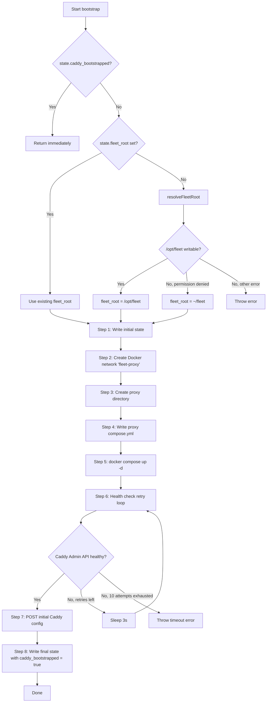
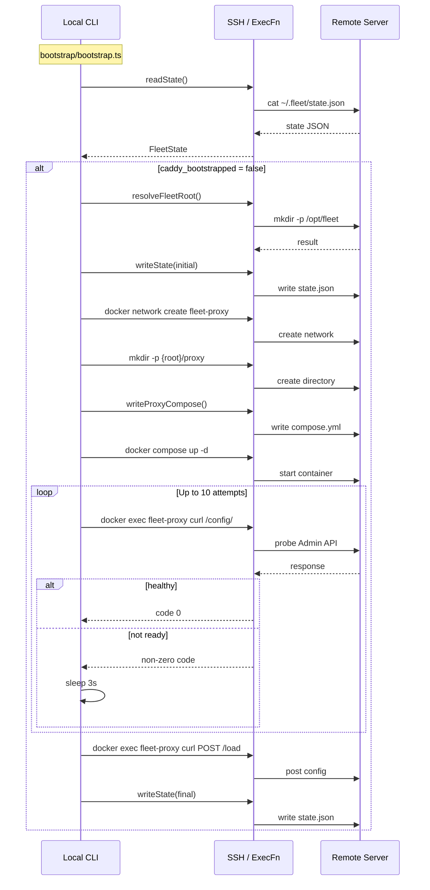

# Bootstrap Sequence

The bootstrap function in `src/bootstrap/bootstrap.ts` orchestrates an 8-step
initialization sequence. Every step executes remotely through the [`ExecFn`](../ssh-connection/overview.md)
abstraction -- the function runs in the local CLI process, but all commands
execute on the target server via SSH (or locally if using a local exec adapter).

## Sequence diagram



## Step-by-step breakdown

### Step 1: Read state and resolve fleet root

**Source:** `src/bootstrap/bootstrap.ts:23-40`

The function reads the server's [state file](../state-management/overview.md)
(`~/.fleet/state.json`) using `readState()`. If `caddy_bootstrapped` is already
`true`, the function returns immediately -- this is the idempotency guard.

If `fleet_root` is not set in the existing state, the function calls
`resolveFleetRoot()` to determine where Fleet files should live. The
[resolution logic](../fleet-root/overview.md) (in `src/fleet-root/resolve.ts:11-43`)
tries `/opt/fleet` first and falls back to `~/fleet` if the primary path fails
due to a permission error.

The initial state (with `fleet_root` set but `caddy_bootstrapped: false`) is
persisted before proceeding. This ensures that if a later step fails, the
fleet root is already recorded for the next attempt.

### Step 2: Create Docker network

**Source:** `src/bootstrap/bootstrap.ts:43`

```
docker network create fleet-proxy || true
```

Creates the `fleet-proxy` Docker bridge network. The `|| true` suffix makes
this idempotent -- if the network already exists, the command succeeds silently.

This network is declared as `external: true` in the proxy's
`compose.yml` and is the shared network through which the Caddy proxy container
communicates with application service containers. Every deployed service is
connected to this network during the deployment process (see the
[deployment pipeline](../deployment-pipeline.md)).

### Step 3: Create proxy directory

**Source:** `src/bootstrap/bootstrap.ts:46-51`

```
mkdir -p {fleetRoot}/proxy
```

Creates the directory where the proxy compose file will be stored. The `PROXY_DIR`
constant is `proxy` (from `src/fleet-root/constants.ts`). On a typical server,
this creates `/opt/fleet/proxy` or `~/fleet/proxy`.

### Step 4: Write proxy compose file

**Source:** `src/bootstrap/bootstrap.ts:54`

Calls `writeProxyCompose()` from `src/proxy/compose.ts`, which generates and
writes a Docker Compose file to `{fleetRoot}/proxy/compose.yml` (see
[Proxy Docker Compose](../caddy-proxy/proxy-compose.md)). The generated compose
file defines:

- **Service:** `fleet-proxy` using the `caddy:2-alpine` Docker image
- **Ports:** `80:80` and `443:443` (HTTP and HTTPS)
- **Network:** Joins the external `fleet-proxy` network
- **Volumes:** `caddy_data` (for TLS certificates) and `caddy_config`
  (for Caddy configuration persistence)
- **Command:** `caddy run --resume` (resumes the last saved configuration on
  container restart)

The file is written atomically using a temporary file and `mv` to prevent
partial writes.

### Step 5: Start Caddy container

**Source:** `src/bootstrap/bootstrap.ts:57-65`

```
docker compose -f {fleetRoot}/proxy/compose.yml -p fleet-proxy up -d
```

Starts the Caddy container in detached mode. The `-p fleet-proxy` flag sets the
Docker Compose project name, which determines the prefix for container and
network names.

### Step 6: Wait for Caddy Admin API

**Source:** `src/bootstrap/bootstrap.ts:67-89`

After the container starts, Caddy needs a moment to initialize. The function
polls the Caddy Admin API with a retry loop:

- **Maximum attempts:** 10
- **Retry interval:** 3 seconds
- **Total timeout:** 30 seconds

Each probe executes:

```
docker exec fleet-proxy curl -s -f http://localhost:2019/config/
```

The `curl -f` flag causes a non-zero exit code on HTTP errors (4xx/5xx), so a
zero exit code confirms the Admin API is responsive. The probe runs inside the
container via `docker exec`, so it accesses `localhost:2019` from the container's
own network namespace. The Admin API is not exposed to the host network.

If all 10 attempts fail, the function throws an error with a descriptive
timeout message.

### Step 7: Post initial Caddy configuration

**Source:** `src/bootstrap/bootstrap.ts:92-100`

Once the [Caddy Admin API](../caddy-proxy/caddy-admin-api.md) is healthy, the
function posts an initial configuration using the `POST /load` endpoint. The
configuration is built by `buildBootstrapCommand()` from
`src/caddy/commands.ts:15-47` and includes:

```json
{
  "apps": {
    "http": {
      "servers": {
        "fleet": {
          "listen": [":443", ":80"],
          "routes": []
        }
      }
    }
  }
}
```

If `acme_email` is provided in the options, a
[TLS automation policy](../caddy-proxy/tls-and-acme.md) is added:

```json
{
  "apps": {
    "tls": {
      "automation": {
        "policies": [
          {
            "issuers": [
              {
                "module": "acme",
                "email": "user@example.com"
              }
            ]
          }
        ]
      }
    }
  }
}
```

The configuration is posted via `docker exec` running `curl` with the JSON
payload piped through a heredoc. This ensures the request happens inside the
container, targeting the Admin API at `http://localhost:2019/load`.

### Step 8: Persist completed state

**Source:** `src/bootstrap/bootstrap.ts:102-107`

The final state is written with `caddy_bootstrapped: true`. This flag prevents
the bootstrap sequence from running again on subsequent deploys.

## Partial failure behavior

Because the bootstrap function writes state at two points (Steps 1 and 8),
the system can be in the following states after a failure:

| Failure point | State on disk | Recovery |
|---------------|---------------|----------|
| Before Step 1 | No state change | Re-run bootstrap |
| After Step 1, before Step 8 | `fleet_root` set, `caddy_bootstrapped: false` | Re-run bootstrap; Docker network and container may already exist (all steps are idempotent except the config POST) |
| After Step 8 | `caddy_bootstrapped: true` | No recovery needed; bootstrap complete |

The Docker network creation (Step 2) and compose up (Step 5) are inherently
idempotent. The config POST (Step 7) replaces any existing configuration, so
it is also safe to repeat.

## Comparison with deploy pipeline bootstrap

The deployment pipeline's `bootstrapProxy()` in `src/deploy/helpers.ts:90-134`
performs a simplified version of this sequence:



The deploy pipeline version (`deploy/helpers.ts`) skips the health-check retry
loop entirely and does not persist state directly (it returns the updated state
for the caller to persist). This means the deploy pipeline version will fail
immediately if the Caddy Admin API is not ready when the config POST is
attempted.

## Related documentation

- [Bootstrap Integrations](./bootstrap-integrations.md) -- external dependencies
  used during bootstrap
- [Bootstrap Troubleshooting](./bootstrap-troubleshooting.md) -- diagnosing and
  recovering from bootstrap failures
- [Server Bootstrap](./server-bootstrap.md) -- high-level bootstrap overview
- [Caddy Reverse Proxy Architecture](../caddy-proxy/overview.md) -- the proxy
  system initialized by bootstrap
- [Caddy Admin API Reference](../caddy-proxy/caddy-admin-api.md) -- endpoints
  used during Steps 6-7
- [TLS and ACME](../caddy-proxy/tls-and-acme.md) -- certificate configuration
  set during Step 7
- [Fleet Root Resolution](../fleet-root/overview.md) -- how Step 1 determines
  the fleet root directory
- [State Management Overview](../state-management/overview.md) -- how state is
  read and persisted in Steps 1 and 8
- [Deployment Pipeline](../deployment-pipeline.md) -- the simplified bootstrap
  performed during deployment
- [Deploy Sequence](../deploy/deploy-sequence.md) -- the 17-step deploy
  pipeline where bootstrap integrates as Step 5
- [Deploy Command](../cli-entry-point/deploy-command.md) -- the CLI command
  that triggers bootstrap on first deploy
- [Configuration Overview](../configuration/overview.md) -- how `fleet.yml`
  provides the server connection and ACME email used during bootstrap
- [Caddy Route Management](../deploy/caddy-route-management.md) -- how routes
  are registered after bootstrap completes
