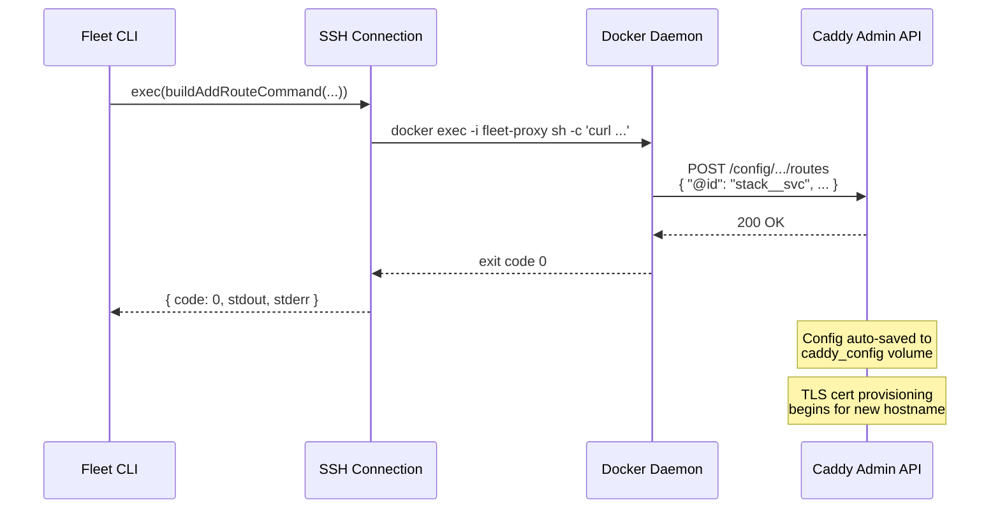

# Caddy Admin API Reference

Fleet manages Caddy's routing configuration entirely through the
[Caddy Admin API](https://caddyserver.com/docs/api), a REST interface that
listens on `localhost:2019` inside the `fleet-proxy` container. This page
documents every API endpoint Fleet uses, how the command builders map to those
endpoints, and the execution model.

## Access Pattern

All API calls follow the same execution model:

```
docker exec [-i] fleet-proxy curl -s -f [options] http://localhost:2019/{path}
```

- `docker exec` -- Runs `curl` inside the Caddy container, avoiding any network
  exposure of the admin API.
- `-s` -- Silent mode (no progress output).
- `-f` -- Fail silently on HTTP errors (non-zero exit code on 4xx/5xx).
- `-i` -- Used only when piping a JSON body via heredoc (stdin).

The command builders in `src/caddy/commands.ts` produce these shell command
strings. They are never executed directly -- consumer modules pass them to an
SSH `exec` function (see [Connection API](../ssh-connection/connection-api.md)
for the `ExecFn` interface).

## Endpoint Map

### POST /load -- Bootstrap Configuration

**Builder:** `buildBootstrapCommand()` (`src/caddy/commands.ts:15-48`)

Replaces the entire Caddy configuration with an initial skeleton:

```json
{
  "apps": {
    "http": {
      "servers": {
        "fleet": {
          "listen": [":443", ":80"],
          "routes": []
        }
      }
    }
  }
}
```

If `acme_email` is provided in `BootstrapOptions`, a TLS automation block is
appended (see [TLS and ACME](./tls-and-acme.md) for certificate lifecycle
details):

```json
{
  "apps": {
    "tls": {
      "automation": {
        "policies": [{
          "issuers": [{
            "module": "acme",
            "email": "admin@example.com"
          }]
        }]
      }
    }
  }
}
```

**Caddy behavior:** `POST /load` atomically replaces the entire running
configuration. This is a safe operation during bootstrap because the routes
array is empty. After the POST succeeds, Caddy immediately autosaves the
config to the `caddy_config` volume.

**Consumers:**
- `bootstrap()` in `src/bootstrap/bootstrap.ts:91-100` (step 7)
- `bootstrapProxy()` in `src/deploy/helpers.ts:118-125`

### POST /config/apps/http/servers/fleet/routes -- Add Route

**Builder:** `buildAddRouteCommand()` (`src/caddy/commands.ts:50-74`)

Appends a new route to the `fleet` server's routes array. The route JSON
includes an `@id` tag for later direct access:

```json
{
  "@id": "mystack__web",
  "match": [{ "host": ["app.example.com"] }],
  "handle": [{
    "handler": "reverse_proxy",
    "upstreams": [{ "dial": "mystack-web-1:3000" }]
  }]
}
```

**Caddy behavior:** POSTing to an array path appends the element. The `@id`
field registers the route at `/id/mystack__web` for direct access. Adding a
route with a hostname triggers Caddy's automatic HTTPS -- certificate
provisioning begins immediately.

**Consumers:**
- `registerRoutes()` in `src/deploy/helpers.ts:377-388`
- `reloadRoutes()` in `src/reload/reload.ts:53-61`

### DELETE /id/{caddy_id} -- Remove Route

**Builder:** `buildRemoveRouteCommand()` (`src/caddy/commands.ts:76-78`)

Removes a route by its `@id` tag. The URL pattern is:

```
DELETE http://localhost:2019/id/{stackName}__{serviceName}
```

**Caddy behavior:** Deleting via `/id/{name}` removes the element from
whatever array contains it -- no need to know the route's array index.
Returns 404 if the ID does not exist.

**Error handling:** Fleet always calls DELETE before POST (delete-then-add
pattern) and silently ignores failures. This makes route registration
idempotent -- whether the route exists or not, the sequence converges to the
desired state.

**Consumers:**
- `registerRoutes()` in `src/deploy/helpers.ts:373-374`
- `reloadRoutes()` in `src/reload/reload.ts:50`

### GET /config/apps/http/servers/fleet/routes -- List Routes

**Builder:** `buildListRoutesCommand()` (`src/caddy/commands.ts:80-82`)

Returns the current routes array as JSON. Used by
[`proxy-status`](../proxy-status-reload/proxy-status.md) to query live
state.

**Consumer:**
- `proxyStatus()` in `src/proxy-status/proxy-status.ts:210`

### GET /config/ -- Get Full Config

**Builder:** `buildGetConfigCommand()` (`src/caddy/commands.ts:84-86`)

Returns the entire Caddy configuration as JSON. Used for:

1. **Health probing** during bootstrap -- the response confirms the admin API
   is accepting requests (`src/bootstrap/bootstrap.ts:73-74`).
2. **Version extraction** -- `parseCaddyVersion()` reads the top-level
   `version` field (`src/proxy-status/proxy-status.ts:14-24`).

**Consumer:**
- `bootstrap()` in `src/bootstrap/bootstrap.ts:73-74` (health check)
- `proxyStatus()` in `src/proxy-status/proxy-status.ts:209`

## Constants

Defined in `src/caddy/constants.ts`:

| Constant | Value | Purpose |
|---|---|---|
| `CADDY_CONTAINER_NAME` | `"fleet-proxy"` | Docker container name for `docker exec` |
| `CADDY_ADMIN_URL` | `"http://localhost:2019"` | Admin API base URL (inside container) |
| `CADDY_API_ROUTES_PATH` | `"/config/apps/http/servers/fleet/routes"` | Path to the routes array |
| `CADDY_API_CONFIG_PATH` | `"/config/"` | Path to the full config object |
| `CADDY_API_LOAD_PATH` | `"/load"` | Path for full config replacement |
| `CADDY_API_ID_PATH` | `"/id"` | Base path for `@id`-based access |
| `CADDY_SERVER_NAME` | `"fleet"` | Caddy server name in the config tree |

## Request Flow Diagram



## JSON Payload Delivery

For endpoints that require a JSON body (bootstrap and add-route), Fleet uses a
heredoc pattern to pipe the payload via stdin:

```bash
docker exec -i fleet-proxy sh -c 'curl -s -f -X POST \
  -H "Content-Type: application/json" \
  -d @- http://localhost:2019/load' << 'FLEET_JSON'
{ ... }
FLEET_JSON
```

The `-i` flag on `docker exec` enables stdin forwarding. The `@-` in `curl`
reads the request body from stdin. The `'FLEET_JSON'` delimiter is quoted to
prevent shell variable expansion in the JSON payload.

For simpler operations (delete, list, get-config), the command uses plain
`docker exec` without `-i` since no request body is needed.

## Error Handling

| Scenario | Behavior |
|---|---|
| Route DELETE returns 404 | Silently ignored -- the route may not exist yet |
| Route POST fails | `registerRoutes()` throws with the stderr message |
| Bootstrap POST fails | `bootstrap()` throws, aborting the sequence |
| Health probe fails | Retried up to 10 times at 3-second intervals (30s total) |
| Container not running | `reloadRoutes()` throws with a user-facing message |

## Related documentation

- [Architecture Overview](./overview.md) -- Network topology and design
  decisions
- [Proxy Compose](./proxy-compose.md) -- Caddy container Docker Compose
  configuration
- [TLS and ACME](./tls-and-acme.md) -- How route addition triggers certificate
  provisioning
- [Troubleshooting](./troubleshooting.md) -- Debugging API failures
- [Bootstrap Integrations](../bootstrap/bootstrap-integrations.md) -- How the
  bootstrap process uses the Admin API
- [Deploy Caddy Route Management](../deploy/caddy-route-management.md) -- Route
  registration during deployment
- [Proxy Status Command](../proxy-status-reload/proxy-status.md) -- Live route
  reconciliation
- [Official Caddy Admin API docs](https://caddyserver.com/docs/api)
