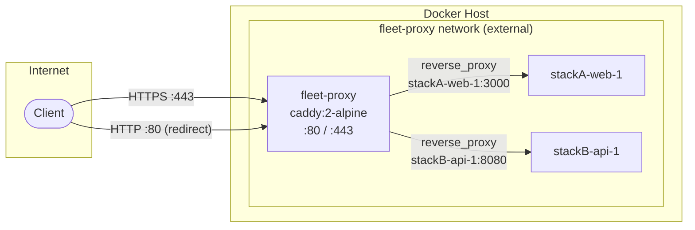
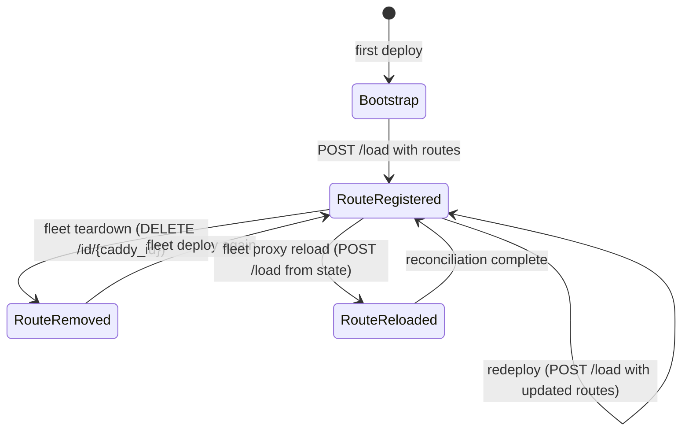

# Caddy Reverse Proxy Architecture

Fleet uses [Caddy](https://caddyserver.com/) as a shared reverse proxy that fronts
every deployed service with automatic HTTPS. The proxy runs as a single Docker
container managed outside any application stack, providing a stable ingress layer
that survives individual stack deploys and teardowns.

## Why Caddy?

| Concern | How Caddy addresses it |
|---|---|
| **TLS certificates** | Automatic provisioning and renewal via Let's Encrypt and ZeroSSL -- zero configuration required once DNS points to the server. |
| **API-driven config** | A localhost-only REST admin API allows Fleet to add and remove routes at runtime without restarting the proxy or writing config files to disk. |
| **Config durability** | `caddy run --resume` reloads the last persisted config on startup, so routes survive container restarts without Fleet intervention. |
| **Lightweight footprint** | The `caddy:2-alpine` image is ~40 MB and has no external dependencies. |

## Component Map

The proxy subsystem is implemented across six source files in two packages:

```
src/
  caddy/
    commands.ts   — Shell command builders for Caddy Admin API operations
    constants.ts  — Container name, admin URL, and API path constants
    types.ts      — TypeScript interfaces (BootstrapOptions, AddRouteOptions)
    index.ts      — Barrel re-export
  proxy/
    compose.ts    — Docker Compose YAML generation and atomic remote write
    index.ts      — Barrel re-export
```

These are **pure library modules** -- they generate strings (shell commands, YAML)
but never execute them directly. Execution happens in consumer modules that hold
an SSH `exec` function:

- [Bootstrap sequence](../bootstrap/bootstrap-sequence.md) --
  `src/bootstrap/bootstrap.ts`
- [Deploy sequence](../deploy/deploy-sequence.md) --
  `src/deploy/helpers.ts`
- [Proxy reload](../proxy-status-reload/overview.md) --
  `src/reload/reload.ts`
- [Proxy status](../proxy-status-reload/proxy-status.md) --
  `src/proxy-status/proxy-status.ts`

## Network Topology



Key design decisions visible in the diagram:

1. **External Docker network** -- The `fleet-proxy` network is created with
   `docker network create` before any stack is deployed. Every application
   container is attached to it after `docker compose up` via
   `docker network connect` (`src/deploy/helpers.ts:292-315`). See the
   [deployment pipeline](../deployment-pipeline.md) for details.

2. **Container-name addressing** -- Upstream targets use Docker's built-in DNS
   (e.g., `stackA-web-1:3000`) rather than published ports, keeping traffic
   internal to the Docker network.

3. **Single container, multiple routes** -- All routes live in a single Caddy
   server named `fleet`. Routes are identified by an `@id` tag
   (`{stackName}__{serviceName}`) for targeted add/remove operations.

## Route Lifecycle



Route registration uses **atomic full-config replacement** via `POST /load`:

1. `GET /config/` -- Read the full Caddy config to preserve TLS settings.
2. Replace the `routes` array with routes derived from Fleet state (source of
   truth).
3. `POST /load` -- Atomically replace the entire config. Per the
   [Caddy API docs](https://caddyserver.com/docs/api#post-load), this operation
   blocks until complete, incurs zero downtime, and automatically rolls back if
   the new config is invalid.

This pattern is used consistently in both `registerRoutes()`
(`src/deploy/helpers.ts:377-445`) and `reloadRoutes()`
(`src/reload/reload.ts:18-87`). See the
[Route Reload documentation](../proxy-status-reload/route-reload.md) for
detailed mechanics.

The only operation that uses per-route API calls is **teardown**, which removes
individual routes via `DELETE /id/{caddy_id}` (`src/teardown/teardown.ts`).

## Configuration Durability

Caddy persists its running configuration to disk after every Admin API change.
Fleet leverages this through:

1. **`caddy run --resume`** -- The Docker Compose command
   (`src/proxy/compose.ts:21`) tells Caddy to load its last autosaved config on
   startup.
2. **Docker volumes** -- `caddy_data` (TLS certificates) and `caddy_config`
   (autosaved config) are named volumes that persist across container restarts.
3. **State tracking** -- Fleet records `caddy_bootstrapped: true` in
   [`state.json`](../state-management/overview.md) after successful bootstrap,
   preventing duplicate bootstrap attempts.

The combination means that after a server reboot, `docker compose up -d` (via
`restart: unless-stopped`) brings Caddy back with all routes intact -- no Fleet
action required.

## Caddy ID Scheme

Every route is tagged with a Caddy `@id` following the pattern:

```
{stackName}__{domainSlug}
```

Built by `buildCaddyId()` in `src/caddy/commands.ts:11-17`. The domain slug is
created by replacing non-alphanumeric characters with hyphens, stripping
leading/trailing hyphens, and lowercasing. For example, `app.example.com`
becomes `app-example-com`, producing an ID like `myapp__app-example-com`.

Per the [Caddy API docs](https://caddyserver.com/docs/api#using-id-in-json),
the `@id` field registers the object at `/id/{name}` for direct access,
eliminating the need to traverse the full config path
(`/config/apps/http/servers/fleet/routes/0`).

This ID enables:

- **Direct deletion** via `DELETE /id/{caddy_id}` without needing the route's
  array index (used during teardown in `src/teardown/teardown.ts`).
- **State reconciliation** -- `proxy-status` can match live routes against
  `state.json` entries by hostname.
- **Collision detection** -- `detectHostCollisions()` in
  `src/deploy/helpers.ts:60-82` prevents two stacks from claiming the same
  domain.

## Host Collision Detection

Fleet prevents two stacks from registering routes for the same domain. Before
route registration, `detectHostCollisions()` (`src/deploy/helpers.ts:60-82`)
scans all stacks in `FleetState` and checks whether any domain in the new
stack's routes is already claimed by another stack. If a collision is found, the
deploy aborts with a descriptive error before any Caddy API calls are made.

This check operates at the Fleet state level, not at the Caddy config level.
This means it relies on `state.json` being accurate. Ghost routes in Caddy
(routes not tracked in state) would not be detected by this check.

## Security Model

The Caddy Admin API binds to `localhost:2019` inside the container. Fleet
accesses it via `docker exec ... curl`, meaning:

- **No network exposure** -- The admin API is never reachable from outside the
  container.
- **No authentication** -- Since access requires `docker exec` privileges (i.e.,
  root or docker group membership on the host), Caddy's default no-auth policy
  is appropriate.
- **SSH as the trust boundary** -- All Fleet operations reach the server over
  SSH. The security perimeter is the SSH connection, not the Caddy API.

## Unused Type Fields and Exported Functions

`AddRouteOptions` in `src/caddy/types.ts:5-13` declares optional `tls` and
`acme_email` fields. These fields are **not used** by `buildAddRouteCommand()` --
the function does not include them in the generated route JSON. They exist as
placeholders for a potential future feature where per-route TLS configuration
overrides the server-level ACME settings.

Additionally, two command builder functions in `src/caddy/commands.ts` are
exported via `src/caddy/index.ts` but are **not imported or called** anywhere
in the codebase:

- `buildReplaceRoutesCommand()` (`src/caddy/commands.ts:79-82`) -- Generates a
  `PATCH` request to replace the routes array. Fleet uses `POST /load`
  (full config replacement) instead.
- `buildCreateRoutesCommand()` (`src/caddy/commands.ts:84-87`) -- Generates a
  `PUT` request to insert into the routes array. Fleet uses `POST /load`
  instead.

Similarly, `buildAddRouteCommand()` (`src/caddy/commands.ts:73-77`) generates a
`POST` to the routes path (appending a single route). While it is exported and
available, the current codebase does not use it -- both deploy and reload use
the `POST /load` pattern for atomic full-config replacement.

These functions may be reserved for future use, interactive operations, or
manual debugging. They remain valid Caddy API operations and could be used to
manage individual routes without replacing the full config.

Currently, all TLS behavior is controlled at the server level during bootstrap
(see [TLS and ACME](./tls-and-acme.md)).

## Related documentation

- [Caddy Admin API Reference](./caddy-admin-api.md) -- Endpoint mapping and
  command builder details
- [Proxy Docker Compose](./proxy-compose.md) -- Container configuration,
  volumes, and networking
- [TLS and ACME](./tls-and-acme.md) -- Certificate lifecycle and Let's Encrypt
  integration
- [Troubleshooting](./troubleshooting.md) -- Debugging commands and recovery
  procedures
- [Bootstrap Sequence](../bootstrap/bootstrap-sequence.md) -- Full 8-step
  bootstrap flow
- [Proxy Status and Reload](../proxy-status-reload/overview.md) -- Route
  reconciliation and health reporting
- [Route Reload](../proxy-status-reload/route-reload.md) -- Delete-then-add
  reconciliation of all routes
- [Proxy Status](../proxy-status-reload/proxy-status.md) -- Operational status
  checking and live route reconciliation against Fleet state
- [Deploy Command](../cli-entry-point/deploy-command.md) -- CLI command that
  triggers route registration during deployment
- [Deployment Pipeline](../deployment-pipeline.md) -- Full deploy workflow
  including route registration
- [State Management Overview](../state-management/overview.md) -- Where route
  and bootstrap state is persisted
- [Fleet Root Resolution](../fleet-root/overview.md) -- How the proxy directory
  path is determined
- [Caddy Route Management (Deploy)](../deploy/caddy-route-management.md) --
  how routes are managed during the deployment pipeline
- [Project Init Integrations](../project-init/integrations.md) -- external
  libraries and services used during project initialization
