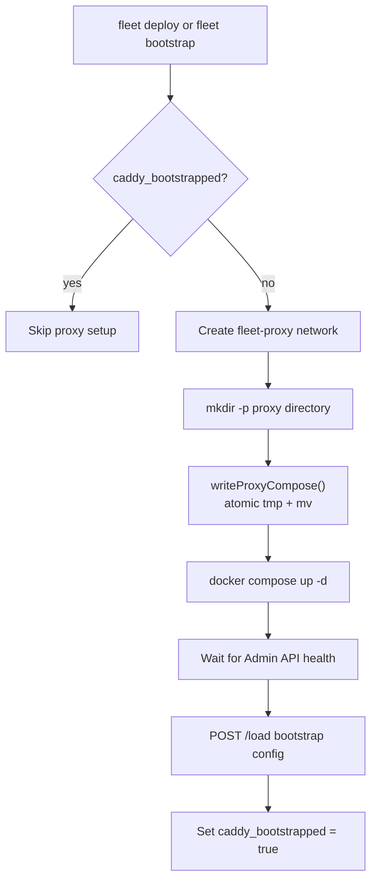

# Proxy Docker Compose Configuration

Fleet generates a Docker Compose file for the Caddy reverse proxy container and
writes it to the remote server using an atomic write pattern. This page documents
the generated configuration, the volume strategy, networking setup, and the
write mechanism. For broader Caddy architecture context, see the
[Caddy Proxy Overview](./overview.md).

## Generated Compose File

`generateProxyCompose()` in `src/proxy/compose.ts:7-31` produces the following
YAML:

```yaml
services:
  fleet-proxy:
    image: caddy:2-alpine
    container_name: fleet-proxy
    restart: unless-stopped
    ports:
      - "80:80"
      - "443:443"
    networks:
      - fleet-proxy
    volumes:
      - caddy_data:/data
      - caddy_config:/config
    command: caddy run --resume

networks:
  fleet-proxy:
    external: true

volumes:
  caddy_data:
  caddy_config:
```

### Configuration Decisions

#### Image: `caddy:2-alpine`

The Alpine variant of Caddy 2.x. The `2-` prefix pins to the latest 2.x
release while excluding future major version bumps. At ~40 MB, Alpine keeps
the image pull fast.

#### Container name: `fleet-proxy`

Hardcoded in `CADDY_CONTAINER_NAME` (`src/caddy/constants.ts:1`). This name is
used by every `docker exec` command to target the proxy container. Changing it
would require updating the constant and redeploying.

#### Restart policy: `unless-stopped`

The container restarts automatically after a host reboot or Docker daemon
restart, **unless** it was explicitly stopped with `docker stop`. This provides
self-healing without interfering with intentional shutdowns.

#### Ports: 80 and 443

Published directly on the host. Port 80 is required for:

- HTTP-to-HTTPS redirects (Caddy handles this automatically)
- ACME HTTP-01 challenge validation during certificate provisioning

Port 443 serves all HTTPS traffic.

No other ports are published. The Caddy Admin API (port 2019) is only
accessible inside the container via `docker exec`. See
[Proxy Status](../proxy-status-reload/proxy-status.md) for how Fleet queries
Caddy routes through this interface.

#### Command: `caddy run --resume`

This is the key to configuration durability:

- `caddy run` starts Caddy in the foreground (required for Docker).
- `--resume` tells Caddy to load its last autosaved configuration from the
  config directory (`/config` inside the container). Per the
  [official Caddy CLI docs](https://caddyserver.com/docs/command-line#caddy-run),
  this flag "uses the last loaded configuration that was autosaved, overriding
  the `--config` flag (if present). Using this flag guarantees config durability
  through machine reboots or process restarts. It is most useful in API-centric
  deployments."
- If no saved config exists (first start), Caddy starts with a blank
  configuration and enables the admin API on `localhost:2019`, allowing Fleet to
  POST the bootstrap config.

This means all routes configured via the Admin API survive container restarts
without Fleet needing to replay them. The `--resume` flag is essential for
Fleet's API-driven workflow -- without it, Caddy would start with an empty
config after every restart, causing all routes to disappear until
`fleet proxy reload` is run.

## Volumes

| Volume | Container path | Purpose | Persistence requirements |
|---|---|---|---|
| `caddy_data` | `/data` | TLS certificates, private keys, OCSP staples | **Critical** -- loss requires re-issuance from Let's Encrypt (rate-limited) |
| `caddy_config` | `/config` | Autosaved Caddy configuration | **Important** -- loss requires re-bootstrap and route re-registration |

Both are Docker named volumes, meaning they persist across container
recreation (`docker compose down` + `up`). They are **not** bind mounts, so
their backing storage is managed by Docker in `/var/lib/docker/volumes/`.

### Backup Considerations

- `caddy_data` contains private keys and should be backed up securely. Loss
  triggers certificate re-issuance, which is subject to Let's Encrypt
  [rate limits](https://letsencrypt.org/docs/rate-limits/) (50 certificates
  per registered domain per week). See [TLS and ACME](./tls-and-acme.md)
  for details on what the data volume stores.
- `caddy_config` can be regenerated by running `fleet deploy` (which triggers
  bootstrap) followed by deploying all stacks. Backup is recommended but not
  critical.

## Networking

### External Network: `fleet-proxy`

The Docker network is declared as `external: true`, meaning it must exist
before `docker compose up` runs. Fleet creates it explicitly:

```bash
docker network create fleet-proxy || true
```

This happens in:
- `bootstrap()` at `src/bootstrap/bootstrap.ts:43`
- `bootstrapProxy()` at `src/deploy/helpers.ts:104`

The `|| true` suffix makes creation idempotent -- it succeeds silently if the
network already exists.

### Why External?

An external network allows the proxy container and application stack containers
to communicate even though they are managed by separate Docker Compose
projects. Without an external network, each Compose project would create its
own isolated network.

### Container Attachment

Application containers are attached to `fleet-proxy` after stack deployment
via `attachNetworks()` (`src/deploy/helpers.ts:292-315`):

```bash
docker network connect fleet-proxy {stackName}-{serviceName}-1
```

The function silently ignores "already connected" errors, making it safe to
call on redeployment.

## Atomic Write Pattern

`writeProxyCompose()` (`src/proxy/compose.ts:33-56`) writes the compose file to
the remote server using a tmp-then-rename strategy:

```
mkdir -p {dir}
cat << 'FLEET_EOF' > {filePath}.tmp
{content}
FLEET_EOF
mv {filePath}.tmp {filePath}
```

This pattern ensures:

1. **Atomicity** -- The `mv` operation is atomic on most filesystems. Readers
   either see the old file or the new file, never a partial write.
2. **Crash safety** -- If the write is interrupted (SSH drops, process killed),
   only the `.tmp` file is left; the original compose file remains intact.
3. **Heredoc quoting** -- The `'FLEET_EOF'` delimiter is single-quoted to
   prevent shell expansion of any `$` characters in the YAML content.

The destination path is `{fleetRoot}/{PROXY_DIR}/compose.yml`, where
`PROXY_DIR` is imported from `src/fleet-root`. See
[Directory Layout](../fleet-root/directory-layout.md) for the full on-server
directory structure.

## Remote Execution via `ExecFn`

`writeProxyCompose()` accepts an `ExecFn` parameter (`src/proxy/compose.ts:35`)
rather than executing commands directly. The `ExecFn` type
(`src/ssh/types.ts:7`) is a simple function signature (see
[Connection API Reference](../ssh-connection/connection-api.md) for full
interface documentation):

```typescript
type ExecFn = (command: string) => Promise<ExecResult>;
```

The `createConnection()` factory (`src/ssh/factory.ts:6-11`) provides two
implementations:

| Server host | Implementation | How it works |
|---|---|---|
| Remote (any hostname) | `createSshConnection()` (`src/ssh/ssh.ts`) | Executes commands over SSH using the `node-ssh` library |
| `localhost` / `127.0.0.1` | `createLocalConnection()` (`src/ssh/local.ts`) | Executes commands as local child processes, bypassing SSH |

The local execution path enables development and testing without requiring an
SSH server. All proxy and Caddy operations work identically in both modes
because they only depend on the `ExecFn` interface.

Consumer modules that hold an `ExecFn` and use the proxy compose functionality:

- [Bootstrap sequence](../bootstrap/bootstrap-sequence.md) --
  `src/bootstrap/bootstrap.ts`
- [Deploy helpers](../deploy/caddy-route-management.md) --
  `src/deploy/helpers.ts`

## Compose File Lifecycle



The compose file is written once during bootstrap and is not modified
afterward. Route changes go through the Admin API, not through compose file
updates.

## Related documentation

- [Architecture Overview](./overview.md) -- Network topology and design
  decisions
- [Caddy Admin API](./caddy-admin-api.md) -- How Fleet communicates with
  Caddy after the container starts
- [TLS and ACME](./tls-and-acme.md) -- What the `caddy_data` volume stores
  and why it matters
- [Caddy Proxy Troubleshooting](./troubleshooting.md) -- Diagnosing proxy
  container issues
- [Bootstrap Sequence](../bootstrap/bootstrap-sequence.md) -- The full
  bootstrap flow that triggers compose file creation
- [Bootstrap Troubleshooting](../bootstrap/bootstrap-troubleshooting.md) --
  Common bootstrap failure modes and recovery
- [Fleet Root Resolution](../fleet-root/resolution-flow.md) -- How the
  fleet root directory (containing the proxy dir) is resolved
- [Deploy Sequence](../deploy/deploy-sequence.md) -- The 17-step deploy
  pipeline; Step 5 triggers proxy bootstrap
- [State Management Overview](../state-management/overview.md) -- How
  `caddy_bootstrapped` flag is tracked in state
- [Deployment Troubleshooting](../deploy/troubleshooting.md) -- diagnosing
  proxy bootstrap failures during deployment
- [Stack Lifecycle Teardown](../stack-lifecycle/teardown.md) -- how the
  fleet-proxy network is preserved during teardown
