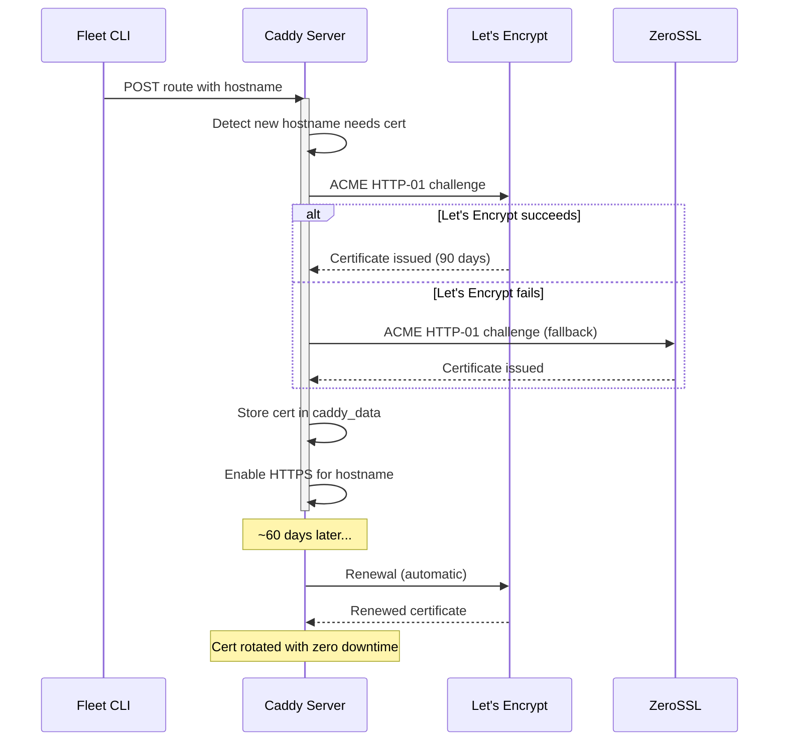

# TLS and ACME Certificate Management

Fleet delegates all TLS certificate management to Caddy's
[Automatic HTTPS](https://caddyserver.com/docs/automatic-https) feature. This
page documents how certificates are provisioned, renewed, and stored, what
operators need to ensure, and how the optional ACME email configuration works.

## How Automatic HTTPS Works

When Fleet registers a route with a hostname (e.g., `app.example.com`), Caddy
automatically:

1. **Provisions a TLS certificate** from Let's Encrypt (primary) and ZeroSSL
   (fallback) using the ACME protocol.
2. **Configures HTTPS** for that hostname on port 443.
3. **Redirects HTTP to HTTPS** on port 80.
4. **Renews the certificate** before expiry (certificates are valid for 90
   days; Caddy renews around 30 days before expiry).
5. **Staples OCSP responses** for improved TLS handshake performance.

No Fleet code handles any of this -- it is entirely Caddy's built-in behavior,
triggered by the presence of hostnames in route matchers.

## Prerequisites for Certificate Provisioning

For automatic HTTPS to work, the following must be true at deploy time:

| Requirement | Details |
|---|---|
| **DNS points to the server** | The domain's A/AAAA record must resolve to the server's public IP. Caddy validates domain ownership via HTTP-01 challenge. |
| **Port 80 is reachable** | Let's Encrypt sends HTTP-01 challenge requests to port 80. Firewalls, security groups, and cloud load balancers must allow inbound TCP/80. |
| **Port 443 is reachable** | Required for serving HTTPS traffic. |
| **`caddy_data` volume persists** | Certificates and private keys are stored here. Volume loss forces re-issuance. |

If any prerequisite is not met, Caddy will retry certificate issuance with
exponential backoff for up to 30 days. Routes remain functional over plain
HTTP during this period (Caddy does not block on certificate availability).

## ACME Email Configuration

The `acme_email` option provides a contact email to Let's Encrypt for:

- Expiry notifications (sent ~20 days before certificate expiry as a safety
  net).
- Account recovery.
- Notification of revocation events.

### Where It Is Configured

The email is set during [bootstrap](../bootstrap/server-bootstrap.md) and applies server-wide:

1. **`BootstrapOptions.acme_email`** in `src/caddy/types.ts:1-3` --
   Optional field on the bootstrap options interface.

2. **`buildBootstrapCommand()`** in `src/caddy/commands.ts:15-48` --
   When `acme_email` is provided, the bootstrap JSON includes a TLS automation
   policy with an ACME issuer:

   ```json
   {
     "apps": {
       "tls": {
         "automation": {
           "policies": [{
             "issuers": [{
               "module": "acme",
               "email": "admin@example.com"
             }]
           }]
         }
       }
     }
   }
   ```

3. **Consumer code** -- Both `bootstrap()` (`src/bootstrap/bootstrap.ts:92-93`)
   and `bootstrapProxy()` (`src/deploy/helpers.ts:119-121`) pass the email
   through to the command builder.

### Per-Route TLS Fields (Unused)

`AddRouteOptions` in `src/caddy/types.ts:5-13` declares optional `tls` and
`acme_email` fields. These are **not used** by `buildAddRouteCommand()` -- the
function does not include them in the generated route JSON.

These fields exist as placeholders for a potential future feature where
individual routes could override the server-level TLS policy (e.g., using a
different ACME email or disabling TLS for internal-only routes). Currently, all
routes inherit the server-level TLS configuration set during bootstrap.

The `tls` field from `RouteConfig` is only used in `printSummary()`
(`src/deploy/helpers.ts:534`) to determine the display protocol
(`https://` vs. `http://`).

## Certificate Storage

Caddy stores all certificate-related data in the **data directory**, which maps
to the `caddy_data` Docker volume at `/data` inside the container.

Contents of the data directory:

| Path | Contents |
|---|---|
| `/data/caddy/certificates/` | TLS certificates organized by CA |
| `/data/caddy/certificates/acme-v02.api.letsencrypt.org-directory/` | Let's Encrypt certificates |
| `/data/caddy/certificates/acme.zerossl.com-v2-DV90/` | ZeroSSL certificates |
| `/data/caddy/ocsp/` | OCSP staple cache |
| `/data/caddy/locks/` | Distributed lock files |

Per Caddy's [conventions](https://caddyserver.com/docs/conventions), the data
directory must **not** be treated as a cache. Deleting it causes:

- Loss of TLS private keys.
- Forced re-issuance of all certificates.
- Potential rate limit exhaustion on Let's Encrypt.

## Certificate Lifecycle



## Let's Encrypt Rate Limits

Operators should be aware of these
[rate limits](https://letsencrypt.org/docs/rate-limits/):

| Limit | Value | Impact |
|---|---|---|
| Certificates per registered domain | 50 per week | Affects wildcard and root domain certs |
| Duplicate certificates | 5 per week | Same exact set of hostnames |
| Failed validations | 5 per hour per account per hostname | DNS misconfigurations can trigger this |
| New registrations | 500 per 3 hours per IP | Relevant during mass deployment |

In practice, Fleet's one-route-per-service model stays well within these limits.
The primary risk is **data volume loss** -- if `caddy_data` is deleted and all
certificates must be re-issued simultaneously, the 50 per week limit could
become a bottleneck for deployments with many domains.

## Operational Considerations

### First Deploy Latency

The first deploy of a new domain takes slightly longer because Caddy must:

1. Complete the ACME HTTP-01 challenge (~5-15 seconds).
2. Download the signed certificate.
3. Configure the TLS listener.

Subsequent deploys for the same domain reuse the existing certificate.

### Certificate Renewal Failures

If renewal fails (e.g., DNS changed, port 80 blocked), Caddy:

1. Retries with exponential backoff.
2. Falls back to ZeroSSL if Let's Encrypt fails.
3. Continues serving with the existing certificate until it expires.
4. Logs warnings to stderr (visible via `docker logs fleet-proxy`).

The ACME email receives expiry notifications as a last-resort alert.

### Staging vs. Production

For testing, operators can configure Caddy to use Let's Encrypt's staging
environment by modifying the bootstrap config. Fleet does not currently expose
this option, but it can be implemented by extending `BootstrapOptions` to
include a `staging` flag that changes the ACME issuer URL.

## Related Documentation

- [Architecture Overview](./overview.md) -- How TLS fits into the overall
  proxy design
- [Proxy Docker Compose](./proxy-compose.md) -- Volume configuration for
  certificate persistence
- [Caddy Admin API](./caddy-admin-api.md) -- How routes trigger certificate
  provisioning
- [Troubleshooting](./troubleshooting.md) -- Debugging certificate issues
- [Server Bootstrap](../bootstrap/server-bootstrap.md) -- How the Caddy
  container and ACME configuration are initialized
- [Configuration Schema Reference](../configuration/schema-reference.md) --
  The `acme_email` and `tls` fields in route configuration
- [Deploy Integrations](../deploy/integrations.md) -- Caddy integration
  details from the deployment pipeline perspective
- [Bootstrap Integrations](../bootstrap/bootstrap-integrations.md) -- how
  bootstrap coordinates with other Fleet subsystems including Caddy setup
- [Caddy Route Management](../deploy/caddy-route-management.md) -- route
  registration and removal during deployment
- [Project Init Integrations](../project-init/integrations.md) -- how project
  initialization interacts with TLS and route configuration
- [Official Caddy Automatic HTTPS docs](https://caddyserver.com/docs/automatic-https)
