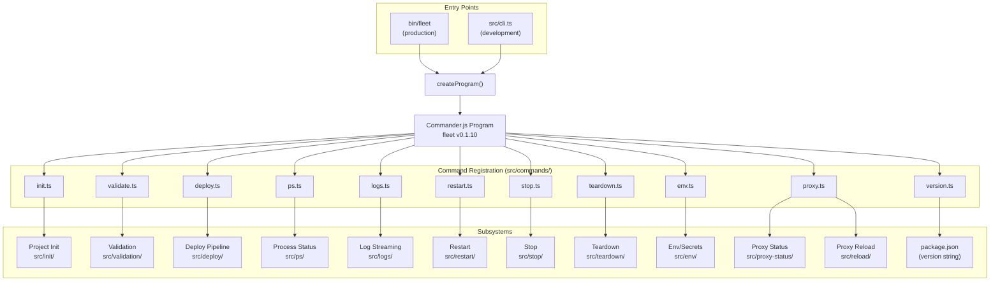
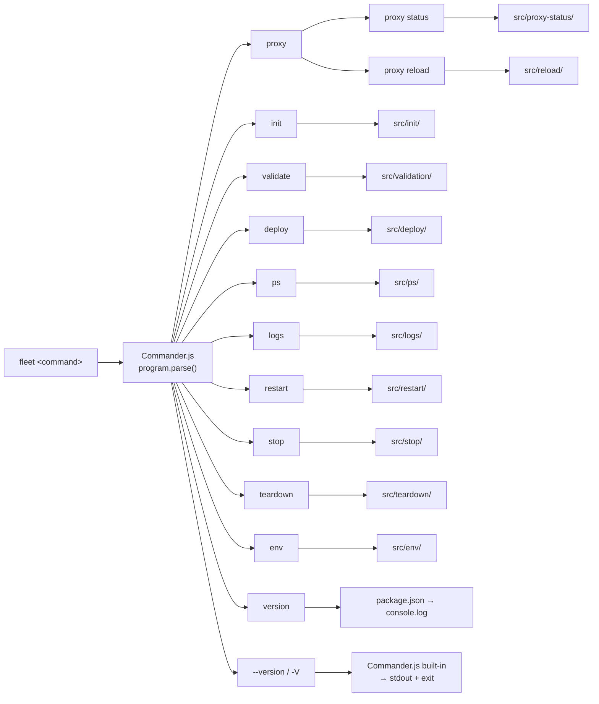

# CLI Architecture

This document describes the architecture of Fleet's CLI layer: how commands are
registered, how they delegate to subsystems, and how the integrations fit
together.

## Component diagram

The following diagram shows the CLI program at the center with arrows to each
command module and the subsystem it delegates to:

## Command dispatch tree

The following flowchart shows how user input is routed to each subcommand,
illustrating the full branching surface of the CLI:

Note that `fleet --version` and `fleet version` are separate code paths. The
`--version` flag is handled by Commander.js before any subcommand is matched,
while `fleet version` is a registered subcommand. See
[Version Command](version-command.md) for why both exist.

## Command registration pattern

Every command file follows the same structure:

1. Import `Command` from `commander`
2. Import the implementation function from the corresponding subsystem
3. Export a `register(program: Command)` function
4. Inside `register`, chain `.command()`, `.description()`, `.option()` (if any),
   and `.action()`
5. The action handler wraps the implementation call in the standard try/catch
   pattern

The `version` command is a special case: it has no subsystem module and
implements its entire logic inline (a single `require` + `console.log`).

This consistent pattern means adding a new command requires:

1. Create `src/commands/newcommand.ts` with a `register` export
2. Create the implementation module under `src/newcommand/`
3. Add `import { register as registerNewCommand }` to `src/cli.ts`
4. Call `registerNewCommand(program)` in `createProgram()`

## How Commander.js interacts with the `version` subcommand

Commander.js's `.version()` method registers the `-V` and `--version` flags on
the root program. These flags are processed **before** subcommand matching
occurs. The separately registered `version` subcommand is matched **as a
subcommand** during normal command parsing.

There is no conflict between the two because:

- `--version` is an option flag handled at the program level
- `version` is a positional subcommand name

Commander.js's help output shows both: the `--version` flag under "Options" and
the `version` subcommand under "Commands". This is the same pattern used by many
CLI tools (e.g., `npm --version` vs `npm version`).

## `parse()` vs `parseAsync()`

Fleet calls `program.parse(process.argv)` (synchronous) in both entry points
(`bin/fleet:5` and `src/cli.ts:43`). Commander.js documentation recommends
`parseAsync()` when action handlers are async, to ensure proper promise rejection
handling. Fleet's action handlers are async (they use `await` inside try/catch
blocks), but because each handler catches its own errors and calls
`process.exit(1)` on failure, unhandled rejections do not propagate to
Commander.js. The current `parse()` usage works in practice but is technically
fragile -- if a handler forgets to catch an error, the rejection is silently
swallowed.

## Integration map

Fleet integrates with several external systems and libraries. For detailed
integration documentation, see [Integrations](integrations.md). Summary:

### Commander.js (CLI framework)

- **Role**: Parses command-line arguments, generates help output, handles
  unknown options and missing arguments
- **Version**: ^14.0.3 (per `package.json:40`)
- **Key behaviors**:
    - Unknown options cause Commander to display an error with a "Did you mean?"
      suggestion and exit with code 1. Fleet does not override this.
    - Missing required arguments produce an automatic error message.
    - Subcommand groups (like `fleet proxy`) display help listing available
      subcommands when invoked without a subcommand.

### Zod (schema validation)

- **Role**: Validates `fleet.yml` structure at runtime against a TypeScript-
  compatible schema (see [Configuration Integrations](../configuration/integrations.md)
  for Zod usage details)
- **Version**: ^4.3.6 (per `package.json:43`)
- **Used by**: `loadFleetConfig()` in `src/config/loader.ts`, consumed by
  `validate` and indirectly by all commands that load config

### YAML parser

- **Role**: Parses `fleet.yml` and Docker Compose files from YAML to JavaScript
  objects
- **Version**: ^2.8.2 of the `yaml` npm package (per `package.json:42`)
- **Spec support**: YAML 1.2, compatible with Docker Compose's YAML dialect

### Docker Compose (remote execution)

- **Role**: Container orchestration on the remote server
- **Requirement**: Docker Compose V2 (`docker compose` plugin, not the legacy
  `docker-compose` binary) must be installed on the remote server
- **Used by**: deploy, ps, logs, restart, stop, teardown commands

### Caddy (reverse proxy)

- **Role**: Routes HTTP/HTTPS traffic to containers, handles automatic TLS
- **Admin API**: `localhost:2019` inside the `fleet-proxy` container
- **Used by**: deploy (route registration), proxy status, proxy reload, stop
  (route removal), teardown (route removal)

### Infisical (secrets manager)

- **Role**: Optional secrets management for environment variables (see
  [Secrets Resolution](../deploy/secrets-resolution.md) for deploy-time
  integration)
- **CLI installation**: Bootstrapped on demand via `apt-get` on the remote
  server
- **Used by**: env command, deploy command (when `env.infisical` is configured)

### @yao-pkg/pkg (build tooling)

- **Role**: Bundles Fleet into standalone binaries for distribution
- **Targets**: Linux x64, macOS x64, macOS ARM64
- **Entry point**: `bin/fleet`

## Cross-group dependency map

The CLI entry point group depends on these documentation groups:

| Group | Dependency | Documentation |
|-------|------------|---------------|
| Deployment Pipeline | `deploy()` function | [Deploy docs](../deploy/deploy-sequence.md) |
| Project Init | `generateFleetYml()`, `detectComposeFile()`, `slugify()` | [Project init docs](../project-init/overview.md) |
| Configuration | `loadFleetConfig()`, `STACK_NAME_REGEX` | [Configuration docs](../configuration/overview.md) |
| Compose Parsing | `loadComposeFile()` | [Compose parsing docs](../compose/overview.md) |
| Validation | `runAllChecks()`, `Finding` | [Validation docs](../validation/overview.md) |
| Env/Secrets | `pushEnv()` | [Env/secrets docs](../env-secrets/overview.md) |
| Proxy Status & Reload | `proxyStatus()`, `reloadProxy()` | [Proxy docs](../proxy-status-reload/overview.md) |
| Operational Commands | `ps`, `logs`, `restart`, `stop`, `teardown` registration | [Operational commands](../cli-commands/operational-commands.md) |
| State Management | `readState()`, `writeState()`, `getStack()` | [State docs](../state-management/overview.md) |

## Related documentation

- [CLI Overview](overview.md) -- entry points, command table, and distribution
- [Version Command](version-command.md) -- dual-version pattern and path resolution
- [Integrations](integrations.md) -- detailed integration documentation
- [Troubleshooting](troubleshooting.md) -- packaging and runtime issues
- [Deploy Command](deploy-command.md) -- deploy lifecycle
- [Init Command](init-command.md) -- project initialization
- [Env Command](env-command.md) -- secrets management
- [Proxy Commands](proxy-commands.md) -- proxy status and reload
- [CLI Commands Integrations](../cli-commands/integrations.md) -- integration
  details for operational commands
- [Configuration Overview](../configuration/overview.md) -- config module
  architecture
- [Configuration Loading and Validation](../configuration/loading-and-validation.md)
  -- how `fleet.yml` is loaded and validated
- [SSH Connection Overview](../ssh-connection/overview.md) -- SSH connection
  layer architecture
- [Caddy Proxy Overview](../caddy-proxy/overview.md) -- reverse proxy
  architecture
- [Bootstrap Integrations](../bootstrap/bootstrap-integrations.md) -- how the
  bootstrap process interacts with external systems
