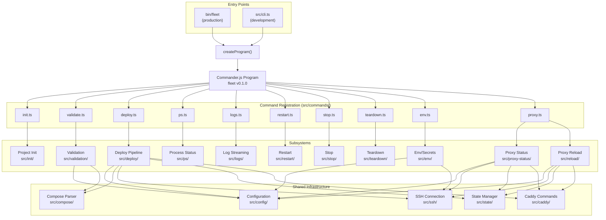

# CLI Architecture

This document describes the architecture of Fleet's CLI layer: how commands are
registered, how they delegate to subsystems, and how the integrations fit
together.

## Component diagram

The following diagram shows the CLI program at the center with arrows to each
command module and the subsystem it delegates to:

## Command registration pattern

Every command file follows the same structure:

1. Import `Command` from `commander`
2. Import the implementation function from the corresponding subsystem
3. Export a `register(program: Command)` function
4. Inside `register`, chain `.command()`, `.description()`, `.option()` (if any),
   and `.action()`
5. The action handler wraps the implementation call in the standard try/catch
   pattern

This consistent pattern means adding a new command requires:

1. Create `src/commands/newcommand.ts` with a `register` export
2. Create the implementation module under `src/newcommand/`
3. Add `import { register as registerNewCommand }` to `src/cli.ts`
4. Call `registerNewCommand(program)` in `createProgram()`

## Integration map

Fleet integrates with several external systems and libraries:

### Commander.js (CLI framework)

- **Role**: Parses command-line arguments, generates help output, handles
  unknown options and missing arguments
- **Version**: ^14.0.3 (per `package.json:38`)
- **Key behaviors**:
    - Unknown options cause Commander to display an error with a "Did you mean?"
      suggestion and exit with code 1. Fleet does not override this.
    - Missing required arguments produce an automatic error message.
    - Subcommand groups (like `fleet proxy`) display help listing available
      subcommands when invoked without a subcommand.
    - Async action handlers work with `.parse()` because Commander internally
      handles promise rejections for commands. However, `parseAsync()` is
      preferred for programs with async actions to ensure proper error
      propagation.

### Zod (schema validation)

- **Role**: Validates `fleet.yml` structure at runtime against a TypeScript-
  compatible schema (see [Configuration Integrations](../configuration/integrations.md)
  for Zod usage details)
- **Version**: ^4.3.6 (per `package.json:40`)
- **Used by**: `loadFleetConfig()` in `src/config/loader.ts`, consumed by
  `validate` and indirectly by all commands that load config

### YAML parser

- **Role**: Parses `fleet.yml` and Docker Compose files from YAML to JavaScript
  objects
- **Version**: ^2.8.2 of the `yaml` npm package (per `package.json:39`)
- **Spec support**: YAML 1.2, compatible with Docker Compose's YAML dialect

### Docker Compose (remote execution)

- **Role**: Container orchestration on the remote server
- **Requirement**: Docker Compose V2 (`docker compose` plugin, not the legacy
  `docker-compose` binary) must be installed on the remote server
- **Used by**: deploy, ps, logs, restart, stop, teardown commands

### Caddy (reverse proxy)

- **Role**: Routes HTTP/HTTPS traffic to containers, handles automatic TLS
- **Admin API**: `localhost:2019` inside the `fleet-proxy` container
- **Used by**: deploy (route registration), proxy status, proxy reload, stop
  (route removal), teardown (route removal)

### Infisical (secrets manager)

- **Role**: Optional secrets management for environment variables (see
  [Secrets Resolution](../deploy/secrets-resolution.md) for deploy-time
  integration)
- **CLI installation**: Bootstrapped on demand via `apt-get` on the remote
  server
- **Used by**: env command, deploy command (when `env.infisical` is configured)

### @yao-pkg/pkg (build tooling)

- **Role**: Bundles Fleet into standalone binaries for distribution
- **Targets**: Linux x64, macOS x64, macOS ARM64
- **Entry point**: `bin/fleet`

## Cross-group dependency map

The CLI entry point group depends on these documentation groups:

| Group | Dependency | Documentation |
|-------|------------|---------------|
| Deployment Pipeline | `deploy()` function | [Deploy docs](../deploy/) |
| Project Init | `generateFleetYml()`, `detectComposeFile()`, `slugify()` | [Project init docs](../project-init/) |
| Configuration | `loadFleetConfig()`, `STACK_NAME_REGEX` | [Configuration docs](../configuration/) |
| Compose Parsing | `loadComposeFile()` | [Compose parsing docs](../compose/) |
| Validation | `runAllChecks()`, `Finding` | [Validation docs](../validation/) |
| Env/Secrets | `pushEnv()` | [Env/secrets docs](../env-secrets/) |
| Proxy Status & Reload | `proxyStatus()`, `reloadProxy()` | [Proxy docs](../proxy-status-reload/overview.md) |
| Operational Commands | `ps`, `logs`, `restart`, `stop`, `teardown` registration | [Operational commands](../cli-commands/operational-commands.md) |

## Related documentation

- [CLI Overview](overview.md) -- entry points and command table
- [Deploy Command](deploy-command.md) -- deploy lifecycle
- [Init Command](init-command.md) -- project initialization
- [Validate Command](validate-command.md) -- validation checks
- [Env Command](env-command.md) -- secrets management
- [Proxy Commands](proxy-commands.md) -- proxy status and reload
- [CLI Commands Integrations](../cli-commands/integrations.md) -- integration
  details for operational commands
- [Configuration Overview](../configuration/overview.md) -- config module
  architecture
- [SSH Connection Overview](../ssh-connection/overview.md) -- SSH connection
  layer architecture
