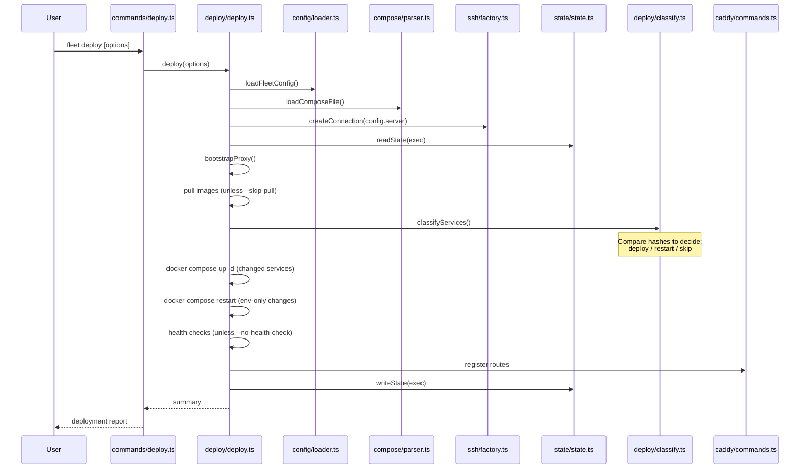

# Deploy Command

The `fleet deploy` command is Fleet's primary operation. It takes a Docker
Compose project defined locally, connects to a remote server via SSH, and
ensures the services described in `fleet.yml` are running with correct reverse
proxy routes.

## Usage

```
fleet deploy [options]
```

### Options

| Flag | Default | Description |
|------|---------|-------------|
| `--skip-pull` | `false` | Skip pulling images before deploying |
| `--no-health-check` | health checks enabled | Skip health checks after deploying |
| `--dry-run` | `false` | Preview changes without applying them |
| `-f, --force` | `false` | Force pull and redeploy all services regardless of changes |

## How `--no-health-check` works with Commander.js

The `--no-health-check` flag uses Commander.js's **negatable boolean** option
convention. When Commander.js sees an option defined as `--no-X`, it creates a
boolean property named `X` that defaults to `true` and is set to `false` when
the flag is present on the command line.

In `src/commands/deploy.ts:9`, the option is declared as `--no-health-check`.
This means:

- Without the flag: `opts.healthCheck` is `true`
- With `--no-health-check`: `opts.healthCheck` is `false`

The code at line 15 translates this to the `DeployOptions` interface:
`noHealthCheck: opts.healthCheck === false`. This explicit comparison is
necessary because Commander.js's negatable booleans don't follow the same
`undefined`-when-absent pattern as normal boolean options.

## Deploy lifecycle

When `fleet deploy` is invoked, the CLI layer at `src/commands/deploy.ts:12-29`
constructs a `DeployOptions` object and passes it to `deploy()` from
`src/deploy`. The full deployment pipeline spans multiple subsystems:



### Step-by-step summary

1. **Load configuration**: Parse `fleet.yml` from the current directory (see
   [Configuration Loading](../configuration/loading-and-validation.md))
2. **Parse compose file**: Load and validate the Docker Compose file referenced
   in `fleet.yml` (see [Compose Parser](../compose/parser.md))
3. **Open SSH connection**: Connect to the remote server using credentials from
   `fleet.yml` (see [SSH Connection Lifecycle](../ssh-connection/connection-lifecycle.md))
4. **Read remote state**: Load `~/.fleet/state.json` from the server (see
   [State Management](../state-management/overview.md))
5. **Bootstrap proxy**: If this is the first deployment, set up the Caddy reverse
   proxy container (see [Server Bootstrap](../bootstrap/server-bootstrap.md))
6. **Pull images**: Pull Docker images on the remote server (skipped with
   `--skip-pull`)
7. **Classify services**: Compare current service definitions, image digests, and
   env file hashes against stored state to determine which services need to be
   deployed, restarted, or skipped (see
   [Service Classification](../deploy/service-classification-and-hashing.md))
8. **Apply changes**: Run `docker compose up -d` for services that need
   (re)deployment; `docker compose restart` for services with only env changes
9. **Health checks**: Poll service health endpoints (skipped with
   `--no-health-check`)
10. **Register routes**: Add or update [Caddy reverse proxy](../caddy-proxy/overview.md)
    routes for each service
11. **Persist state**: Write updated state back to `~/.fleet/state.json`

## The `DeployContext` type

The deployment pipeline passes context through a `DeployContext` object (defined
in `src/deploy/types.ts:13-21`) that bundles seven fields from five subsystems:

| Field | Type | Source |
|-------|------|--------|
| `config` | `FleetConfig` | Configuration loader |
| `compose` | `ParsedComposeFile` | Compose parser |
| `connection` | `Connection` | SSH factory |
| `state` | `FleetState` | State manager |
| `fleetRoot` | `string` | Fleet root resolver |
| `stackDir` | `string` | Computed from fleet root + stack name |
| `warnings` | `string[]` | Accumulated during the pipeline |

## Deploy options reference

### `--skip-pull`

Skips the `docker pull` step for all service images. Use this when images are
already present on the remote server (e.g., built locally or from a previous
pull). This can significantly speed up deployments when image layers haven't
changed.

### `--no-health-check`

Disables the post-deployment health check polling. Health checks are configured
per-route in `fleet.yml` and default to polling the root path (`/`) every 2
seconds for up to 60 seconds. Skipping health checks is useful for services that
take a long time to start or don't expose HTTP endpoints.

### `--dry-run`

Previews what would happen without making any changes. The pipeline runs through
classification but does not execute Docker Compose commands, register routes, or
update state. Use this to verify what Fleet would deploy before committing.

### `--force`

Bypasses the classification logic entirely -- all services are treated as needing
a full (re)deployment regardless of whether their definition hashes, image
digests, or env hashes have changed. This is equivalent to a fresh deploy of the
entire stack.

## Troubleshooting

### "Deploy failed with an unknown error"

This generic message appears when the thrown error is not an instance of
JavaScript's `Error` class. Check the deployment logs and SSH connectivity.

### SSH connection failures

Verify the `server` section in [`fleet.yml`](../configuration/overview.md). Ensure the host is reachable, the
SSH port is correct, and the [identity file](../ssh-connection/authentication.md) (if specified) has correct permissions
(`chmod 600`).

### Service not classified correctly

Run `fleet deploy --dry-run` to see the classification decisions. The
classification is based on three hash comparisons -- see
[Service Classification](../deploy/service-classification-and-hashing.md) for
the full decision tree.

## Related documentation

- [CLI Overview](overview.md) -- command registration and entry points
- [Service Classification](../deploy/service-classification-and-hashing.md) --
  how Fleet decides what to deploy
- [Classification Decision Tree](../deploy/classification-decision-tree.md) --
  the six-step algorithm for deploy/restart/skip decisions
- [Hash Computation Pipeline](../deploy/hash-computation.md) -- how definition,
  image, and env hashes are computed
- [Server Bootstrap](../bootstrap/server-bootstrap.md) -- first-time proxy setup
- [Bootstrap Sequence](../bootstrap/bootstrap-sequence.md) -- detailed 8-step
  bootstrap flow
- [Operational Commands](../cli-commands/operational-commands.md) -- ps, logs,
  restart, stop, teardown
- [Deployment Pipeline](../deployment-pipeline.md) -- full pipeline reference
- [CI/CD Integration](../ci-cd-integration.md) -- using `fleet deploy` in
  CI/CD workflows
- [Validation](../validation/validate-command.md) -- pre-flight checks before
  deploying
- [Deploy Failure Recovery](../deploy/failure-recovery.md) -- recovering from
  deployment failures and partial deploys
- [Validate Command](../validation/validate-command.md) -- standalone
  pre-flight validation checks
- [Environment and Secrets](../env-secrets/overview.md) -- how environment
  files and secrets are resolved during deployment
