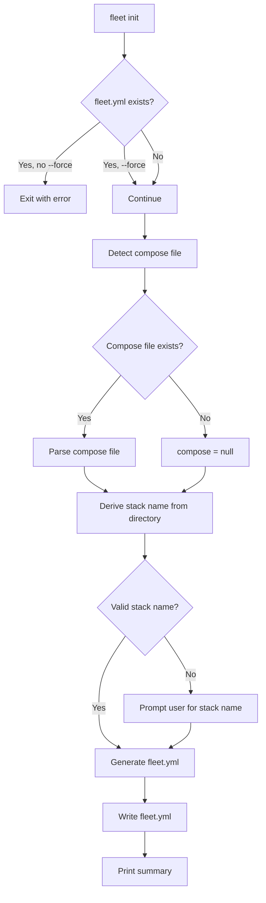

# Init Command

The `fleet init` command scaffolds a new `fleet.yml` configuration file for an
existing Docker Compose project. It examines the compose file to infer routing
information and generates a configuration template ready for customization.

## Usage

```
fleet init [options]
```

### Options

| Flag | Default | Description |
|------|---------|-------------|
| `--force` | `false` | Overwrite an existing `fleet.yml` |

## What `fleet init` does

The init command follows a multi-step decision tree to generate `fleet.yml`:



### Step-by-step

1. **Check for existing `fleet.yml`**: If the file exists and `--force` is not
   set, the command exits with an error message. This prevents accidental
   overwrites.

2. **Detect compose file**: Calls `detectComposeFile()` from the
   [project-init](../project-init/) module to find a compose file in the
   current directory. It looks for standard filenames like `docker-compose.yml`,
   `docker-compose.yaml`, `compose.yml`, and `compose.yaml`.

3. **Parse compose file**: If a compose file is found, it is loaded and parsed
   via `loadComposeFile()`. If parsing fails, the error is printed and the
   command exits.

4. **Derive stack name**: The stack name is derived from the current directory
   name using `slugify()`, which converts it to a lowercase, hyphen-separated
   format matching the pattern `^[a-z\d][a-z\d-]*$`. If the directory name
   cannot produce a valid slug (e.g., starts with special characters), the
   command falls back to an interactive prompt.

5. **Interactive prompt**: When the automatic derivation fails, the command
   prompts the user to enter a valid stack name. The prompt validates input
   against `STACK_NAME_REGEX` and loops until a valid name is provided.

6. **Generate fleet.yml**: Calls `generateFleetYml()` with the stack name,
   compose filename, and parsed compose data. The generator infers routes from
   services that have exposed ports.

7. **Write and summarize**: Writes the generated YAML to `fleet.yml` and prints
   a summary showing the stack name, compose file, routed services, and skipped
   services.

## How routes are derived from a compose file

The init command classifies services based on whether they expose ports:

- **Routed services**: Services with `ports` entries get a route in `fleet.yml`.
  Each route needs a domain and port configured manually after generation.
- **Skipped services**: Services without ports (e.g., background workers,
  databases) are not routed through the reverse proxy.

The actual route generation logic lives in `src/init/generator.ts` in the
[project-init](../project-init/) group. See
[YAML Generation Internals](../project-init/fleet-yml-generation.md) for
a detailed walkthrough of how the document is constructed.

## Interactive prompt behavior

The `promptStackName()` function at `src/commands/init.ts:10-31` uses Node.js's
`readline` module to create an interactive prompt on stdin/stdout.

### CI/CD environments

The interactive prompt reads from `process.stdin`. In non-interactive
environments (CI/CD pipelines, scripts), stdin is typically not a TTY. Behavior
depends on how the process is invoked:

- **Piped input**: If stdin has data piped in, `readline` reads it as the
  answer.
- **No input available**: The prompt hangs indefinitely waiting for input.

To avoid issues in CI/CD, ensure your project directory name produces a valid
stack name (lowercase alphanumeric with hyphens, not starting with a hyphen), so
the interactive prompt is never triggered. Alternatively, create `fleet.yml`
manually or via a template.

### Filesystem permissions

The file write at `src/commands/init.ts:84` uses `fs.writeFileSync`. If the
user lacks write permission to the current directory, Node.js throws an `EACCES`
error. This error is not explicitly caught by the init command -- it propagates
as an unhandled exception and exits the process with a stack trace.

## Stack name validation

Stack names must match the regex `^[a-z\d][a-z\d-]*$` (defined in
`src/config/schema.ts:46`):

- Must start with a lowercase letter or digit
- May contain lowercase letters, digits, and hyphens
- Must not start with a hyphen

This constraint exists because the stack name is used as:

- The Docker Compose project name (`-p` flag)
- Part of Caddy route identifiers (`{stackName}__{serviceName}`)
- Directory names on the remote server

## Example output

```
Created fleet.yml
  Stack name: my-app
  Compose file: docker-compose.yml
  Routes inferred: 2
    Routed services: web, api
    Skipped services (no ports): worker, redis

Remember to run `fleet validate` after editing fleet.yml.
```

## Related documentation

- [CLI Overview](overview.md) -- command registration and entry points
- [Validate Command](../validation/validate-command.md) -- validate the generated `fleet.yml`
- [Deploy Command](deploy-command.md) -- deploy after initialization
- [Project Initialization Overview](../project-init/overview.md) -- end-to-end
  init workflow
- [YAML Generation Internals](../project-init/fleet-yml-generation.md) -- how
  the `fleet.yml` document is constructed
- [Compose File Detection](../project-init/compose-file-detection.md) -- how
  compose files are discovered
- [Configuration Schema Reference](../configuration/schema-reference.md) --
  stack name constraints and route schema
- [Docker Compose Parsing](../compose/overview.md) -- how compose files are
  parsed and queried
- [Project Init Integrations](../project-init/integrations.md) -- how the
  init module integrates with other Fleet subsystems
