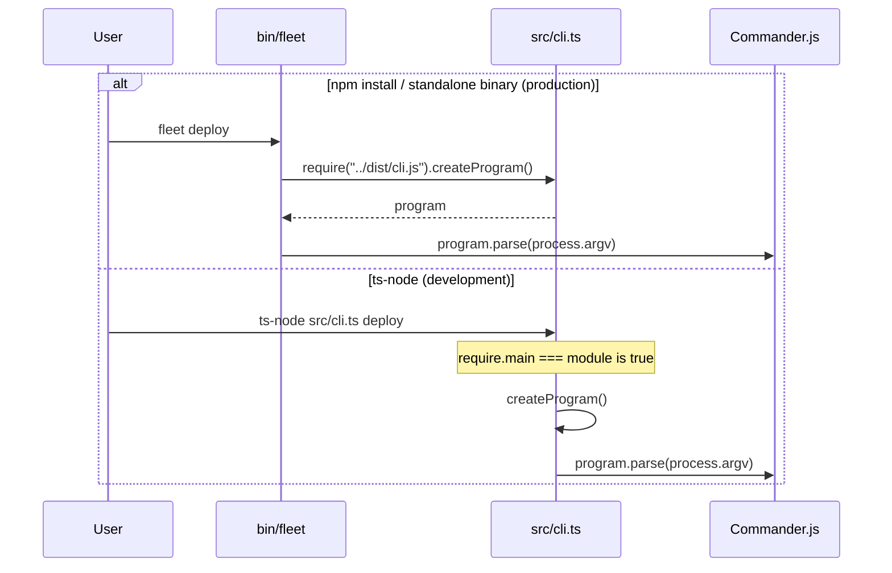

# CLI Entry Point and Command Registration

Fleet is a TypeScript CLI tool for managing Docker Compose-based deployments on
remote servers via SSH, with a Caddy reverse proxy for automatic HTTPS routing.
This document describes the CLI's top-level entry point, how commands are
registered, and how the program reaches users as both an npm package and a
standalone binary.

## Why the CLI exists

Fleet's value proposition is a single command (`fleet deploy`) that takes a
Docker Compose project and deploys it to a remote server with automatic [reverse
proxy configuration](../caddy-proxy/overview.md). The CLI is the primary user interface for every Fleet
operation -- from project initialization to deployment, secret management, proxy
inspection, and stack lifecycle control.

## How the CLI is structured

The entry point is `src/cli.ts`, which creates a [Commander.js](https://www.npmjs.com/package/commander) `Command` program,
registers eleven subcommands, and exports a `createProgram()` factory function.
Each subcommand lives in a dedicated file under `src/commands/` and follows the
same pattern: export a `register(program)` function that adds a command (or
command group) to the program tree. See [CLI Architecture](architecture.md) for
the full component diagram.

### Command surface area

| Command | Source | Subsystem | Description |
|---------|--------|-----------|-------------|
| `fleet init` | `src/commands/init.ts` | [Project Initialization](../project-init/) | Scaffold a new `fleet.yml` from a compose file |
| `fleet validate` | `src/commands/validate.ts` | [Validation](../validation/) | Check `fleet.yml` and compose file for errors |
| `fleet deploy` | `src/commands/deploy.ts` | [Deployment Pipeline](../deploy/) | Deploy services to the remote server |
| `fleet env` | `src/commands/env.ts` | [Environment & Secrets](../env-secrets/) | Push or refresh secrets on the remote server |
| `fleet proxy status` | `src/commands/proxy.ts` | [Proxy Status & Reload](../proxy-status-reload/) | Show live Caddy route status |
| `fleet proxy reload` | `src/commands/proxy.ts` | [Proxy Status & Reload](../proxy-status-reload/) | Force-reload all Caddy routes from state |
| `fleet ps` | `src/commands/ps.ts` | [Process Status](../cli-commands/operational-commands.md) | Show running container status |
| `fleet logs` | `src/commands/logs.ts` | [Process Status](../cli-commands/operational-commands.md) | Stream live container logs |
| `fleet restart` | `src/commands/restart.ts` | [Stack Lifecycle](../cli-commands/operational-commands.md) | Restart a service in a deployed stack |
| `fleet stop` | `src/commands/stop.ts` | [Stack Lifecycle](../cli-commands/operational-commands.md) | Stop a stack without destroying it |
| `fleet teardown` | `src/commands/teardown.ts` | [Stack Lifecycle](../cli-commands/operational-commands.md) | Remove a stack, its containers, and optionally its volumes |
| `fleet version` | `src/commands/version.ts` | (built-in) | Print the Fleet version to stdout |

### Registration order

Commands are registered in `src/cli.ts:26-36` in the order: `init`, `validate`,
`deploy`, `ps`, `logs`, `restart`, `stop`, `teardown`, `env`, `proxy`,
`version`. This order affects help output but has no runtime behavior impact.

## Two ways to get the version

Fleet provides two distinct mechanisms for users to query the current version:

1. **`fleet --version`** (or `fleet -V`) -- Commander.js's built-in version
   option, set at `src/cli.ts:23` via `program.version(packageJson.version)`.
   This prints the version and exits immediately; the output includes just the
   version string (e.g., `0.1.10`).

2. **`fleet version`** -- A dedicated subcommand registered from
   `src/commands/version.ts:4-11`. This reads `package.json` independently and
   prints the version via `console.log`.

The duplication is intentional for user convenience: `--version` is the standard
flag convention that Commander.js users expect, while the `version` subcommand
follows the pattern used by tools like `docker version` and `git version`. Both
paths read from `package.json` at runtime, so they always agree -- but they
resolve the file at different relative paths from `__dirname` (one level up in
`cli.ts`, two levels up in `commands/version.ts`). See
[Version Command](version-command.md) for details on path resolution and
packaging implications.

## How Fleet resolves the target server

The CLI itself accepts no `--host` or `--server` flag. The remote server is
**always** loaded from the `server` section of `fleet.yml` in the current
working directory. The schema (defined in `src/config/schema.ts:3-8`, documented
in the [Configuration Schema Reference](../configuration/schema-reference.md))
requires:

- `host` (string, required) -- the server hostname or IP
- `port` (integer, defaults to `22`) -- SSH port
- `user` (string, defaults to `"root"`) -- SSH username
- `identity_file` (string, optional) -- path to the SSH private key

This means every Fleet command that contacts a server (all except `init`,
`validate`, and `version`) requires a valid `fleet.yml` in `process.cwd()`.

## Dual-entry pattern

Fleet has two entry points that both call `createProgram()`:

1. **`bin/fleet`** (5 lines) -- the production entry point, loaded via
   `dist/cli.js` after TypeScript compilation. This is what runs when users
   invoke `fleet` after npm installation or from a standalone binary.

2. **`src/cli.ts:41-44`** -- uses `require.main === module` to parse args
   directly when the file is executed with `ts-node` during development (the
   `dev` script in `package.json` runs `ts-node src/cli.ts`).



This pattern follows the
[Node.js CommonJS convention for detecting the main module](https://nodejs.org/api/modules.html#accessing-the-main-module).
It allows `createProgram()` to be imported for testing without triggering
argument parsing as a side effect.

## Installation and distribution

Fleet is distributed through two channels:

### npm package

The scoped package `@pruddiman/fleet` is published to the npm registry with
`publishConfig.access` set to `"public"`. Installation makes the `fleet` command
available globally:

```bash
npm install -g @pruddiman/fleet
```

The `bin` field in `package.json` maps the `fleet` command name to `bin/fleet`.
The `prepublishOnly` hook runs `npm run build` (which invokes `tsc`) to ensure
the `dist/` directory is up to date before publishing. The `files` array
(`dist/`, `bin/`) controls which files are included in the published tarball --
notably, `package.json` is always included by npm regardless of the `files`
array.

### Standalone binaries

Fleet uses [@yao-pkg/pkg](https://github.com/yao-pkg/pkg) to produce
self-contained executables that do not require Node.js on the target machine.
The `build:binaries` script runs `pkg . --out-path releases`, producing
executables in the `releases/` directory for three targets:

| Target | Platform | Architecture |
|--------|----------|--------------|
| `node18-linux-x64` | Linux | x86-64 |
| `node18-macos-x64` | macOS | x86-64 |
| `node18-macos-arm64` | macOS | ARM (Apple Silicon) |

See [Integrations](integrations.md) for details on how `pkg` bundles assets and
the implications of the Node 18 vs Node 20 version mismatch, and
[Troubleshooting](troubleshooting.md) for known packaging issues.

### How versions are bumped

There is no automated version bumping or changelog generation configured in the
repository. The version field in `package.json` is updated manually. There is no
CI/CD pipeline configuration in the repository for automated publishing or
binary building -- both `npm publish` and `npm run build:binaries` are run
manually.

## Node.js version requirements

`package.json` declares `engines.node` as `>=20`. However, npm does not enforce
engine requirements by default -- users must set `engine-strict=true` in their
`.npmrc` for npm to refuse installation on incompatible Node.js versions.

The TypeScript compiler targets `ES2022` (per `tsconfig.json:3`), which requires
Node.js 16.11+ for full support. The `>=20` engine constraint provides a
comfortable margin above this baseline.

The `pkg` targets specify `node18`, which is lower than the declared engine
requirement. This works because Fleet does not currently use any Node 20-only
APIs. If future code uses Node 20 features (like `Array.fromAsync` or the
stable `import.meta.resolve`), the `pkg` targets must be updated or the
standalone binaries will fail at runtime. See
[Troubleshooting](troubleshooting.md#node-version-mismatch-in-standalone-binaries)
for more on this divergence.

## Error handling strategy

Every command handler uses an identical try/catch pattern:

```
try {
  await someOperation();
} catch (error) {
  if (error instanceof Error) {
    console.error(error.message);
  } else {
    console.error("Operation failed with an unknown error.");
  }
  process.exit(1);
}
```

There is **no centralized error handler**, no structured error codes, and no
cleanup-on-failure logic at the CLI layer. Commander.js provides
`exitOverride()` and `configureOutput()` hooks that could centralize this, but
Fleet does not use them.

For unknown options and missing required arguments, Commander.js handles errors
automatically -- it prints a usage error and exits with code 1 without reaching
the action handler. Fleet does not call `.allowUnknownOption()`, so unrecognized
flags are rejected by default. Commander v14 also suggests similar option names
on typos (e.g., `--hepl` suggests `--help`).

## Related documentation

- [Version Command](version-command.md) -- the version subcommand and dual-version pattern
- [Deploy Command](deploy-command.md) -- full deploy lifecycle
- [Init Command](init-command.md) -- project initialization flow
- [Env Command](env-command.md) -- secrets management
- [Proxy Commands](proxy-commands.md) -- proxy status and reload
- [CLI Architecture](architecture.md) -- component diagram and subsystem map
- [Integrations](integrations.md) -- Commander.js, pkg, npm, and runtime JSON loading
- [Troubleshooting](troubleshooting.md) -- packaging issues, path resolution, and common errors
- [Operational Commands](../cli-commands/operational-commands.md) -- ps, logs, restart, stop, teardown
- [CLI Commands Integrations](../cli-commands/integrations.md) -- integration
  details for operational commands
- [CI/CD Integration](../ci-cd-integration.md) -- using Fleet commands in CI
  pipelines
- [Configuration Overview](../configuration/overview.md) -- how `fleet.yml` is
  loaded and validated before commands execute
- [Validation Overview](../validation/overview.md) -- the pre-flight check
  system that `fleet validate` and `fleet deploy` both invoke
