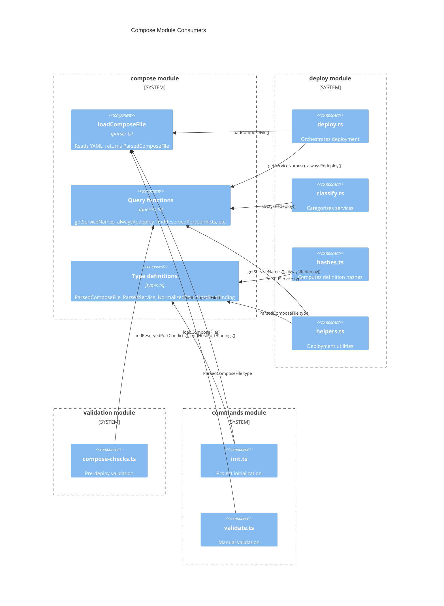

# Compose Module Integration

## What this covers

The compose module is consumed by 10+ files across five other Fleet modules.
This page maps every known consumer, what they import, and how the compose
data flows through the system.

## Why this matters

Understanding cross-module dependencies is essential for maintaining the compose
module. Changes to exported types or function signatures affect multiple
downstream modules. This map makes the impact radius visible.

## Consumer map

### Deployment pipeline

| File | Imports | Usage |
|------|---------|-------|
| [`src/deploy/deploy.ts`](../../src/deploy/deploy.ts) | `loadComposeFile`, `getServiceNames`, `alwaysRedeploy` | Entry point for deployment; loads compose file, enumerates services, checks redeploy policy |
| [`src/deploy/classify.ts`](../../src/deploy/classify.ts) | `alwaysRedeploy` | Classifies services into deployment categories based on restart policy |
| [`src/deploy/hashes.ts`](../../src/deploy/hashes.ts) | `ParsedService` | Type import for computing service definition hashes |
| [`src/deploy/helpers.ts`](../../src/deploy/helpers.ts) | `getServiceNames`, `ParsedComposeFile`, `alwaysRedeploy` | Utility functions that operate on the full compose file during deployment |

### Validation

| File | Imports | Usage |
|------|---------|-------|
| [`src/validation/compose-checks.ts`](../../src/validation/compose-checks.ts) | `findReservedPortConflicts`, `findHostPortBindings` | Pre-deployment checks for port conflicts and reserved port usage |

### CLI commands

| File | Imports | Usage |
|------|---------|-------|
| [`src/commands/init.ts`](../../src/commands/init.ts) | `loadComposeFile`, `ParsedComposeFile` | Project initialization reads compose file to discover services |
| [`src/commands/validate.ts`](../../src/commands/validate.ts) | `loadComposeFile` | Manual validation command loads compose file for inspection |

## Data flow diagram

## Integration patterns

### Parse-once, query-many

The typical consumption pattern is:

1. A command or pipeline entry point calls `loadComposeFile(path)` once.
2. The resulting `ParsedComposeFile` is passed (by reference) to multiple query
   functions and downstream helpers.
3. No module re-parses the compose file; the parsed structure is the single
   source of truth for the duration of that operation.

This pattern means `loadComposeFile` is called at most once per CLI invocation,
and the synchronous I/O cost is paid exactly once.

### Type-only imports

Some consumers (e.g., `src/deploy/hashes.ts`) import only type definitions
(`ParsedService`) without importing any runtime functions. This is a
TypeScript-only dependency that disappears at compile time and has no runtime
cost.

### Validation before deployment

The [validation module](../validation/overview.md) consumes query
functions (`findReservedPortConflicts`, `findHostPortBindings`) to check for
problems before the deployment pipeline begins. This ordering ensures that port
conflicts with the [Caddy proxy](../caddy-proxy/overview.md) (ports 80/443) are caught
early. See [Validation Codes](../validation/validation-codes.md) for the
`PORT_80_CONFLICT` and `PORT_443_CONFLICT` error codes.

## External dependencies

| Dependency | Consumed by | Role |
|-----------|------------|------|
| `yaml` npm package (v2.x) | `parser.ts` | YAML 1.2 parsing. See [parser.md](parser.md#yaml-12-core-schema-implications) for schema details. |
| `fs` (Node.js built-in) | `parser.ts` | Synchronous file reading |
| Docker Compose file format | `parser.ts` | The input format. See [Docker Compose specification](https://docs.docker.com/reference/compose-file/services/) for the full schema. |

## Related documentation

- [Overview](overview.md) -- module context and design decisions
- [Parser internals](parser.md) -- parsing logic and port normalization
- [Query functions](queries.md) -- detailed behavior of each query
- [Type definitions](types.md) -- `ParsedComposeFile`, `ParsedService`, and
  related interfaces
- [Deployment pipeline](../deploy/deploy-sequence.md) -- the primary consumer
  of compose data (17-step deploy sequence)
- [Service Classification](../deploy/service-classification-and-hashing.md) --
  how compose data drives deployment decisions
- [Caddy proxy](../caddy-proxy/overview.md) -- why ports 80/443 are reserved
- [Bootstrap](../bootstrap/bootstrap-sequence.md) -- project setup that precedes
  compose parsing
- [Validation Overview](../validation/overview.md) -- how compose checks fit
  into the validation pipeline
- [Fleet Configuration Checks](../validation/fleet-checks.md) -- fleet.yml
  validation that runs alongside compose checks
- [Configuration Overview](../configuration/overview.md) -- how `FleetConfig`
  references compose services via routes and stack settings
- [Project Initialization](../project-init/overview.md) -- how `fleet init`
  discovers and parses compose files
