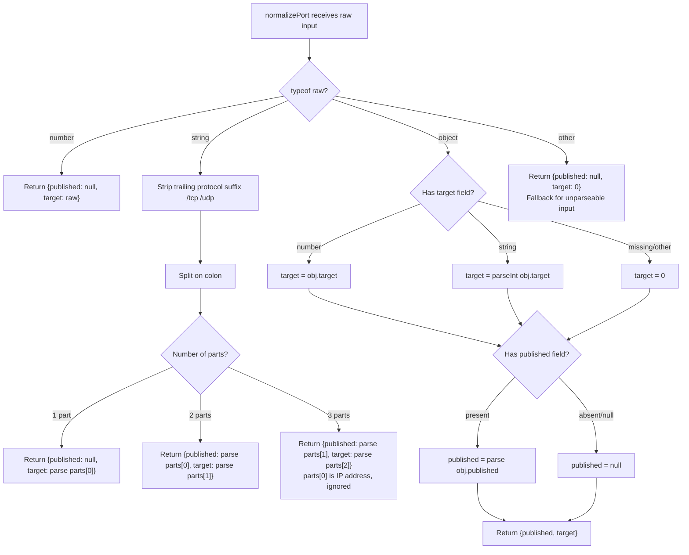

# Compose Parser Internals

## What

The parser ([`src/compose/parser.ts`](../../src/compose/parser.ts)) is
responsible for reading a Docker Compose file from disk, parsing its YAML
content, and transforming it into the typed `ParsedComposeFile` structure that
the rest of Fleet consumes. It exports a single public function:
`loadComposeFile(filePath)`.

## Why

Docker Compose port syntax has four distinct shapes, restart policies interact
with YAML boolean coercion rules, and the full Compose specification contains
dozens of fields Fleet does not need. The parser encapsulates all of this
complexity so that every other module in Fleet can work with clean, normalized
data.

## How

### Loading pipeline

`loadComposeFile` performs three steps:

1. **Read** -- `fs.readFileSync(filePath, "utf-8")` loads the file
   synchronously. If the file does not exist or cannot be read, a descriptive
   error is thrown.
2. **Parse YAML** -- `yaml.parse(content)` converts the string to a JavaScript
   value using the YAML 1.2 core schema. If the YAML is malformed, a
   descriptive error is thrown.
3. **Extract services** -- The parser looks for a top-level `services` key. If
   it exists and is an object, each entry is passed through `parseService()`.
   If `services` is missing or not an object, the result contains an empty
   services map (no error is thrown).

### Service extraction

`parseService()` accepts a raw object and extracts 13 fields into a
`ParsedService`. Noteworthy behaviors:

- **`hasImage`** is `true` only when `image` is a non-empty string.
- **`hasBuild`** is `true` when `build` is any non-null, non-undefined value
  (including an empty object `{}`).
- **`restart`** is taken as-is when it is a string. Under YAML 1.2, bare `no`
  parses to the string `"no"` (not boolean `false`), so no coercion is needed.
- **`restartPolicyMaxAttempts`** is extracted from the nested path
  `deploy.restart_policy.max_attempts`, with null/undefined guards at each
  level.
- All other fields (`command`, `entrypoint`, `environment`, `volumes`,
  `labels`, `healthcheck`) are preserved as `unknown` -- whatever shape YAML
  produced is passed through unchanged.

### Port normalization

`normalizePort()` is the most complex function in the parser. It handles four
input shapes defined by the Docker Compose port specification.

#### Port normalization flowchart

#### Input shape examples

| Compose syntax | Input to `normalizePort` | Result |
|---------------|--------------------------|--------|
| `80` | `80` (number) | `{ published: null, target: 80 }` |
| `"3000"` | `"3000"` (string, 1 part) | `{ published: null, target: 3000 }` |
| `"8080:80"` | `"8080:80"` (string, 2 parts) | `{ published: 8080, target: 80 }` |
| `"8080:80/tcp"` | `"8080:80/tcp"` (string, protocol stripped) | `{ published: 8080, target: 80 }` |
| `"127.0.0.1:8080:80"` | `"127.0.0.1:8080:80"` (string, 3 parts) | `{ published: 8080, target: 80 }` |
| `{target: 80, published: 8080}` | object | `{ published: 8080, target: 80 }` |
| `{target: 80}` | object, no published | `{ published: null, target: 80 }` |

#### Edge cases

- **Protocol suffixes** (`/tcp`, `/udp`) are stripped before splitting on
  colons. The protocol information is discarded.
- **IP bind addresses** (3-part strings like `127.0.0.1:8080:80`) have the IP
  prefix silently ignored. Fleet does not track per-port bind addresses.
- **Unparseable input** falls through to the final return:
  `{ published: null, target: 0 }`. The `target: 0` value acts as a sentinel
  that downstream validation can detect.
- **String targets in object form** are coerced with `parseInt`. If the string
  is not numeric, the result is `NaN`, which propagates silently.

### Dependencies

| Dependency | Version constraint | Role |
|-----------|-------------------|------|
| `yaml` (npm) | 2.x | YAML 1.2 core schema parser. Ensures `no` parses as string, not boolean. |
| `fs` (Node.js built-in) | -- | Synchronous file reading via `readFileSync` |

### YAML 1.2 core schema implications

The `yaml` package's default core schema parses values according to YAML 1.2
rules. Key differences from YAML 1.1 (used by older parsers like PyYAML):

| Value | YAML 1.1 | YAML 1.2 core |
|-------|----------|---------------|
| `no` | `false` (boolean) | `"no"` (string) |
| `yes` | `true` (boolean) | `"yes"` (string) |
| `on` | `true` (boolean) | `"on"` (string) |
| `off` | `false` (boolean) | `"off"` (string) |

This distinction is critical for Fleet because Docker Compose restart policies
include `restart: no`, which must remain the string `"no"` for
`alwaysRedeploy()` to work correctly (see [queries.md](queries.md)).

## Related documentation

- [Overview](overview.md) -- module context and design decisions
- [Types reference](types.md) -- the interfaces produced by the parser
- [Query functions](queries.md) -- functions that consume the parser's output
- [Integration](integration.md) -- which modules call `loadComposeFile`
- [Project Initialization Overview](../project-init/overview.md) -- how compose
  file detection and parsing feeds into `fleet init`
- [Deploy Command](../cli-entry-point/deploy-command.md) -- how the deploy
  pipeline uses parsed compose data
- [Compose Checks](../validation/compose-checks.md) -- validation rules applied
  to parsed compose output
- [Configuration Loading](../configuration/loading-and-validation.md) -- config
  loading pipeline that works alongside compose parsing
- [Validation Troubleshooting](../validation/troubleshooting.md) -- resolving
  validation errors raised against parsed compose output
