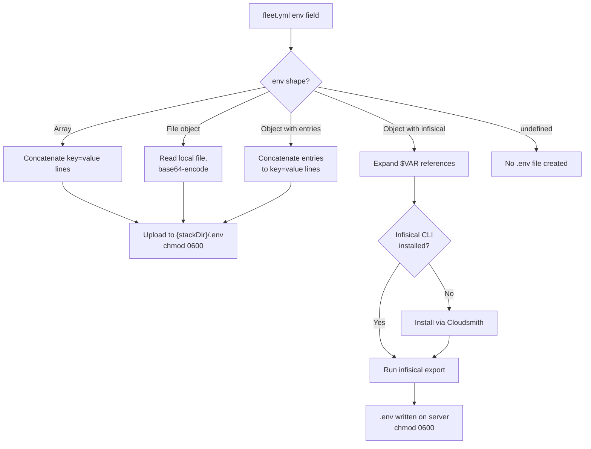

# Environment Variables and Secrets

Fleet supports three mutually exclusive modes for injecting environment
variables and secrets into deployed stacks. This document explains each mode,
why the three-way union exists, how `$VAR` expansion works, and how secrets
are ultimately delivered to your containers.

## Why three modes?

The `env` field in `fleet.yml` is a Zod union type
(`src/config/schema.ts:57`) that accepts three shapes (see
[Schema Reference](./schema-reference.md#env-union-type) for the full
field specification):

```
z.union([
  z.array(envEntrySchema),   // Array mode
  envFileSchema,              // File mode
  envSchema                   // Object mode (entries + infisical)
])
```

Each mode addresses a different operational pattern:

1. **Array mode** -- simple, inline key-value pairs for non-sensitive
   configuration. Good for quick setups where secrets are not involved.
2. **File mode** -- references a local `.env` file that Fleet uploads to the
   server. Recommended for [CI/CD pipelines](../ci-cd-integration.md) where
   secrets are written to a file at build time.
3. **Object mode** -- combines optional inline entries with optional Infisical
   integration for teams using a secrets management platform.

These modes are mutually exclusive at the schema level. You cannot mix array
mode with file mode or object mode in the same config. The
[validation module](../validation/overview.md)
(`src/validation/fleet-checks.ts:4-24`) additionally enforces that within
object mode, `entries` and `infisical` should not both be present, because
`infisical` overwrites the `.env` file that `entries` produces.

## The three modes at a glance

| Mode | `fleet.yml` syntax | Typical use case |
|------|--------------------|------------------|
| **Array** | `env: [{ key, value }, ...]` | Simple, non-sensitive inline config |
| **File** | `env: { file: .env.production }` | CI/CD pipelines that write secrets to a file at build time |
| **Object** | `env: { entries?, infisical? }` | Teams using Infisical or needing a hybrid approach |

All three modes produce a `.env` file with `0600` permissions on the remote
server. For detailed configuration examples, path-traversal protection,
and mode-specific behavior, see
[Env Configuration Shapes](../env-secrets/env-configuration-shapes.md).

### Infisical integration

When `infisical` is configured in object mode, Fleet bootstraps the Infisical
CLI on the remote server (if not already installed) and runs `infisical export`
to produce the `.env` file. The token is passed via environment variable to
avoid exposure in process listings. For full details on CLI bootstrap,
authentication, token management, and network requirements, see
[Infisical Integration](../env-secrets/infisical-integration.md).

## `$VAR` expansion mechanism

All four Infisical fields (`token`, `project_id`, `environment`, `path`)
support `$VAR` expansion at config load time. This is **the only place** in
the entire configuration where environment variable expansion occurs -- other
config fields like `server.host` or `routes[].domain` do not support `$VAR`
references.

### How it works

The expansion logic is in `src/config/loader.ts:37-46`:

1. If a field value starts with `$`, the loader strips the `$` prefix to get
   the variable name.
2. It looks up the variable in `process.env`.
3. If the variable is set, the resolved value replaces the `$VAR` reference.
4. If the variable is not set, the loader throws an error with a clear message:

   ```
   Environment variable "INFISICAL_TOKEN" referenced by
   env.infisical.token in fleet.yml is not set
   ```

### Boundaries and limitations

- **No default values:** There is no `${VAR:-default}` syntax. If the
  variable is not set, the loader fails.
- **No nested references:** `$$VAR` or `${VAR}` syntax is not supported.
  The expansion is a simple prefix check for `$`.
- **Only Infisical fields:** Other config fields (server host, route domains,
  etc.) are not expanded. A literal `$` in those fields is preserved as-is.
- **Expansion happens at load time:** The expansion occurs on the local
  machine where Fleet runs, not on the remote server. The resolved values
  are then used throughout the deployment.

### CI/CD usage

In [CI/CD](../ci-cd-integration.md) contexts, `$VAR` references should be
injected through the pipeline's secret management:

- **GitHub Actions:** Use `secrets.*` in your workflow YAML to set environment
  variables that Fleet can resolve.
- **Shell export:** `export INFISICAL_TOKEN=xxx` before running `fleet deploy`.
- **`.env` file:** Not recommended for Infisical tokens, since the token
  would need to exist locally; prefer the pipeline's native secret injection.

### Security considerations

The error message produced when a variable is missing includes the variable
**name** but never the variable **value** (`src/config/loader.ts:42-44`).
This prevents accidental secret leakage in CI logs. However, the resolved
token is passed to the remote server as part of the `infisical export` command
(via environment variable, not command-line argument), so it is briefly present
in the remote shell's environment during that command execution.

## Decision flowchart

The following diagram shows how Fleet resolves the `env` field from
configuration through to the `.env` file on the remote server:



## File permissions

In all modes, the resulting `.env` file on the remote server is set to `0600`
permissions (owner read/write only). This is critical because the file may
contain secrets -- Infisical tokens, database passwords, API keys, etc.

The `fleet.yml` file itself may also contain sensitive values (literal
Infisical tokens or inline `env` entries). Consider restricting its
permissions on the local filesystem as well, and avoid committing secrets
to version control. Use `$VAR` references or the `env.file` mode to keep
secrets out of `fleet.yml`.

## Related documentation

- [Schema Reference](./schema-reference.md) -- field-by-field details for all
  `env`-related schemas
- [Loading and Validation](./loading-and-validation.md) -- how the loader
  processes and validates the config including `$VAR` expansion
- [Env Secrets Troubleshooting](../env-secrets/troubleshooting.md) -- failure
  modes and recovery procedures for `fleet env` and secrets resolution
- [Env Configuration Shapes](../env-secrets/env-configuration-shapes.md) --
  detailed examples and behavior for each env mode
- [Infisical Integration](../env-secrets/infisical-integration.md) -- CLI
  bootstrap, authentication, and token management
- [CI/CD Integration Guide](../ci-cd-integration.md) -- complete workflow
  examples for each env mode
- [Service Classification](../deploy/service-classification-and-hashing.md) --
  how env hash changes trigger service restarts
- [Security Model](../env-secrets/security-model.md) -- file permissions, path
  traversal, and Docker container access
- [Environment and Secrets Overview](../env-secrets/overview.md) -- the
  standalone `fleet env` command for secrets-only updates
- [Validation Overview](../validation/overview.md) -- pre-flight checks
  including `ENV_CONFLICT` detection
