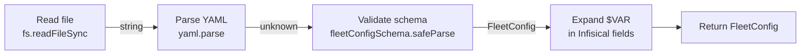

# Configuration Loading and Validation

This document explains how Fleet reads, parses, validates, and transforms the
`fleet.yml` configuration file, including how errors are surfaced to users.

## Loading pipeline

The `loadFleetConfig(filePath)` function (`src/config/loader.ts:6`) executes
three sequential stages. If any stage fails, it throws an `Error` with a
descriptive message.



### Stage 1: File read

```typescript
content = fs.readFileSync(filePath, "utf-8");
```

Source: `src/config/loader.ts:8-11`

The file is read synchronously using `fs.readFileSync`. This is a deliberate
choice for a CLI tool: synchronous I/O simplifies the control flow and has
negligible performance impact for configuration files (which are typically
under 1KB). The function does not accept stdin or URLs -- it requires a
filesystem path.

**Error on failure:**
```
Could not read config file: {filePath}
```

This occurs when the file does not exist, the path is a directory, or the
process lacks read permissions. The underlying `ENOENT`, `EISDIR`, or `EACCES`
error is caught and replaced with a clean message.

### Stage 2: YAML parsing

```typescript
parsed = yaml.parse(content);
```

Source: `src/config/loader.ts:14-18`

The raw string is parsed using the [`yaml`](https://eemeli.org/yaml/) library
(v2.x, declared as `^2.8.2` in `package.json`). This library:

- Supports both YAML 1.1 and YAML 1.2 specifications
- **Defaults to YAML 1.2**, which affects boolean parsing (see below)
- Handles anchors, aliases, merge keys, and multi-document streams
- Never throws on valid YAML input (errors are collected internally)

**Error on failure:**
```
Invalid YAML in config file: {filePath}
```

This occurs when the YAML is syntactically malformed (unbalanced quotes,
invalid indentation, etc.).

#### YAML 1.2 boolean parsing

Under YAML 1.2 (the default), only `true` and `false` are recognized as
boolean values. YAML 1.1 treated `yes`, `no`, `on`, `off`, `y`, `n` as
booleans. This means that in `fleet.yml`:

```yaml
tls: yes    # Parsed as string "yes", NOT boolean true
tls: true   # Parsed as boolean true
```

Since the `tls` field expects a boolean (`src/config/schema.ts:41`), writing
`tls: yes` will cause a Zod validation error in stage 3. Always use `true`
or `false` for boolean values.

#### YAML anchors and aliases

The `yaml` library supports YAML anchors (`&anchor`) and aliases (`*anchor`).
While these are unusual in Fleet configurations, they are not blocked:

```yaml
defaults: &route-defaults
  tls: true
  acme_email: admin@example.com

routes:
  - <<: *route-defaults
    domain: app.example.com
    port: 3000
```

This works because the `yaml` library resolves anchors before returning the
parsed object. However, merge keys (`<<`) require YAML 1.1 semantics; under
the default YAML 1.2 schema, `<<` is treated as a regular key. If you need
merge keys, pass `{ merge: true }` to the parser -- but Fleet does not
currently expose this option.

### Stage 3: Schema validation

```typescript
const result = fleetConfigSchema.safeParse(parsed);
```

Source: `src/config/loader.ts:21-25`

The parsed JavaScript object is validated against the Zod schema. Fleet uses
`safeParse` (not `parse`) to capture validation errors without throwing, then
formats them using `prettifyError` before re-throwing.

**Error on failure:**
```
Invalid Fleet configuration in {filePath}:
{prettified error details}
```

### Stage 4: `$VAR` expansion

Source: `src/config/loader.ts:29-61`

If the parsed config contains an `env.infisical` block, the loader expands
`$VAR` references in all four Infisical fields. See
[Environment Variables](./environment-variables.md#var-expansion-mechanism) for
the full expansion logic and
[Infisical Integration](../env-secrets/infisical-integration.md) for how
expanded values are used during secret fetching.

## How Zod validation errors are formatted

Fleet uses Zod v4's `prettifyError()` function (`src/config/loader.ts:23`) to
convert validation failures into human-readable strings. The output format is:

```
✖ {error message}
  → at {field.path}
```

For example, if `server.host` is missing:

```
Invalid Fleet configuration in fleet.yml:
✖ Required
  → at server.host
```

### Union type error reporting

The three-way union on the `env` field (`src/config/schema.ts:57`) can produce
confusing error messages when validation fails. Zod reports errors for each
branch of the union that didn't match. For example, providing `env: "invalid"`
produces errors explaining why the value doesn't match an array, a file object,
or an entries/infisical object -- all in a single error output.

Zod v4's `prettifyError` handles this by listing all branch failures with
their respective paths. While verbose, this gives the user enough context to
identify which env mode they intended and what went wrong. Each branch failure
is prefixed with `✖` and includes the path, so the user can scan for the
branch that matches their intent.

### Nested validation errors

For deeply nested errors (e.g., an invalid `health_check.timeout_seconds`
within a route), Zod reports the full path:

```
✖ Number must be less than or equal to 3600
  → at routes[0].health_check.timeout_seconds
```

The path notation uses dot-separated keys and bracket-indexed array elements,
matching the structure of the YAML file.

## Validation beyond schema parsing

The `loadFleetConfig()` function only performs schema-level validation. The
`fleet validate` command (`src/commands/validate.ts`) performs additional
semantic checks by calling `runAllChecks()` from the validation module. These
checks include:

| Check | Code | Description |
|-------|------|-------------|
| `checkEnvConflict` | `ENV_CONFLICT` | `env.entries` and `env.infisical` both present |
| `checkFqdnFormat` | `INVALID_FQDN` | Route domain is not a valid FQDN |
| `checkPortRange` | `INVALID_PORT_RANGE` | Route port outside 1-65535 |
| `checkDuplicateHosts` | `DUPLICATE_HOST` | Same domain used by multiple routes |
| `checkInvalidStackName` | `INVALID_STACK_NAME` | Stack name doesn't match `STACK_NAME_REGEX` |

Source: `src/validation/fleet-checks.ts`

These checks produce `Finding` objects with `severity`, `code`, `message`, and
`resolution` fields, which are displayed by the CLI with suggested fixes.

Running `fleet validate` is recommended before `fleet deploy`, especially in
CI/CD pipelines, to catch configuration issues early. See the
[validate command reference](../validation/validate-command.md) and the
[CI/CD integration guide](../ci-cd-integration.md) for pipeline examples.

## Error hierarchy

The following table summarizes the errors that can occur during configuration
loading, in order of occurrence:

| Stage | Error condition | Error message pattern |
|-------|----------------|----------------------|
| File read | File not found or unreadable | `Could not read config file: {path}` |
| YAML parse | Malformed YAML syntax | `Invalid YAML in config file: {path}` |
| Schema validation | Fields missing, wrong types, constraint violations | `Invalid Fleet configuration in {path}:\n{details}` |
| `$VAR` expansion | Referenced environment variable not set | `Environment variable "{name}" referenced by env.infisical.{field} in {path} is not set` |

All errors are thrown as standard JavaScript `Error` objects. The CLI commands
catch these errors and print `error.message` to stderr before exiting with
code 1.

## Synchronous design

The entire loading pipeline is synchronous (`readFileSync`, `yaml.parse`,
`safeParse`, and `process.env` lookup are all synchronous operations). This is
intentional for a CLI tool:

- Configuration files are small (typically under 1KB)
- The loader runs once at the start of every command
- Synchronous code is easier to reason about and debug
- There is no I/O parallelism benefit for a single small file read

## Related documentation

- [Configuration Overview](./overview.md) -- how the config module fits in
  the Fleet architecture
- [Schema Reference](./schema-reference.md) -- field-by-field specification
- [Environment Variables](./environment-variables.md) -- `$VAR` expansion
  details
- [Integrations](./integrations.md) -- details on the Zod and yaml libraries
- [Validate Command](../validation/validate-command.md) -- CLI command that
  exercises the validation pipeline
- [Validation Codes Reference](../validation/validation-codes.md) -- complete
  list of all validation finding codes and resolutions
- [Fleet Configuration Checks](../validation/fleet-checks.md) -- semantic
  checks beyond schema validation
- [Compose Configuration Checks](../validation/compose-checks.md) -- cross-file
  validation against Docker Compose
- [Secrets Resolution](../deploy/secrets-resolution.md) -- how the loaded
  config drives environment variable resolution during deploy
- [Deploy Command](../cli-entry-point/deploy-command.md) -- how configuration
  loading fits into the deploy lifecycle
- [CI/CD Integration](../ci-cd-integration.md) -- using validation in CI
  pipelines
