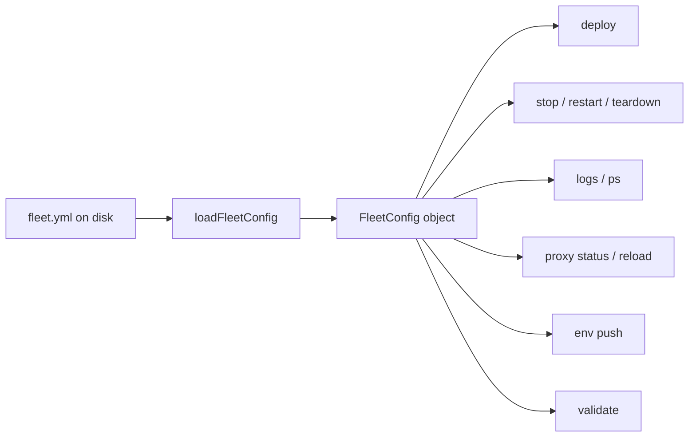

# Fleet Configuration

The `fleet.yml` file is the central contract that every Fleet command depends on.
It declares the remote server to deploy to, the Docker Compose stack to manage,
how environment variables and secrets are injected, and how HTTP routes are
exposed through the Caddy reverse proxy. The configuration module
(`src/config/`) is the single most widely imported module in the codebase -- at
least 15 other source files depend on its types or loader function.

## What it does

The configuration module has three responsibilities:

1. **Schema definition** -- a Zod-based schema in `src/config/schema.ts` that
   declares every valid field a `fleet.yml` file may contain, including types,
   defaults, and constraints.
2. **Loading and validation** -- a loader in `src/config/loader.ts` that reads
   YAML from disk, validates it against the schema, and expands `$VAR`
   references in [Infisical secret fields](../env-secrets/infisical-integration.md).
3. **Public API** -- a barrel re-export in `src/config/index.ts` that exposes
   all types and the `loadFleetConfig()` function to the rest of the codebase.

## Why it exists

Fleet is a CLI tool that deploys [Docker Compose stacks](../compose/overview.md) to remote servers via
[SSH](../ssh-connection/overview.md). Every operational command -- `deploy`, `stop`, `restart`, `logs`, `ps`,
`teardown`, `env`, `proxy status`, `proxy reload`, and `validate` -- begins by
loading `fleet.yml` and extracting the fields it needs. Without a strict,
validated configuration contract, each subsystem would need to perform its own
validation, leading to inconsistent error messages and duplicated logic.

The schema also serves as a single source of truth for Fleet's capabilities:
the set of fields in `fleetConfigSchema` precisely defines what Fleet can be
told to do.

## How it flows through the system



The `FleetConfig` object produced by `loadFleetConfig()` fans out to every
subsystem. Each consumer extracts different portions:

| Subsystem | Fields consumed |
|-----------|---------------|
| [Deployment pipeline](../deploy/service-classification-and-hashing.md) | `server`, `stack`, `env`, `routes` |
| [SSH connection](../ssh-connection/overview.md) | `server.host`, `server.port`, `server.user`, `server.identity_file` |
| [Caddy proxy](../proxy-status-reload/overview.md) | `routes[].domain`, `routes[].tls`, `routes[].acme_email` |
| [Validation](../validation/overview.md) | All fields (full config and compose cross-checks) |
| [Stack lifecycle](../cli-commands/operational-commands.md) | `server`, `stack.name` |
| [Environment secrets](../env-secrets/overview.md) | `env` (all three modes) |
| [Bootstrap](../bootstrap/server-bootstrap.md) | `routes[].acme_email` (first route's ACME email) |
| [Project init](../project-init/overview.md) | Generates `fleet.yml` with discovered values |

## How the config file is located

The `loadFleetConfig()` function accepts an explicit file path as its only
argument (`src/config/loader.ts:6`). It does not search for a config file
itself. The caller is responsible for resolving the path.

In practice, every CLI command resolves the path using
`path.resolve("fleet.yml")`, which resolves relative to `process.cwd()`. The
`fleet validate` command also accepts an optional `[file]` argument that
defaults to `./fleet.yml` (`src/commands/validate.ts:11`).

There is no environment variable or global configuration that overrides this
path. You must run Fleet commands from the directory containing your
`fleet.yml`, or pass the path explicitly to `fleet validate`.

## Version strategy

The schema hard-codes `version: z.literal("1")` (`src/config/schema.ts:54`).
Only version `"1"` is currently supported, and there is no migration mechanism
in the codebase for future versions. If a version `"2"` is introduced, it
would require either:

- A new schema variant and a version-dispatch layer in the loader
- A migration tool that converts v1 configs to v2

Neither exists today. This is a known architectural gap -- if you are planning
breaking changes to the config format, a migration strategy should be designed
first.

## Complete example

The following example exercises every field supported by version `"1"`. The
`fleet init` command (`src/init/generator.ts`) generates a scaffold with
placeholder values when run in a project directory.

```yaml
version: "1"

server:
  host: 203.0.113.10
  port: 22           # default: 22
  user: deploy        # default: "root"
  identity_file: ~/.ssh/id_ed25519  # optional; uses SSH agent if omitted

stack:
  name: my-web-app                  # lowercase alphanumeric + hyphens
  compose_file: docker-compose.yml  # default: "docker-compose.yml"

env:
  entries:
    - key: NODE_ENV
      value: production
  infisical:
    token: $INFISICAL_TOKEN         # $VAR references are expanded
    project_id: $INFISICAL_PROJECT
    environment: production
    path: /                         # default: "/"

routes:
  - domain: app.example.com
    port: 3000
    service: web                    # optional; defaults to "default"
    tls: true                       # default: true
    acme_email: admin@example.com   # optional; enables Let's Encrypt
    health_check:
      path: /health                 # default: "/"
      timeout_seconds: 120          # default: 60, range: 1-3600
      interval_seconds: 5           # default: 2, range: 1-60
```

For the three mutually exclusive `env` modes, see
[Environment Variables and Secrets](./environment-variables.md).

## Related documentation

- [Schema Reference](./schema-reference.md) -- field-by-field specification
  with types, defaults, and constraints
- [Environment Variables and Secrets](./environment-variables.md) -- the three
  `env` modes and Infisical `$VAR` expansion
- [Loading and Validation](./loading-and-validation.md) -- how the loader
  reads YAML, validates with Zod, and surfaces errors
- [Integrations](./integrations.md) -- details on Zod, the yaml parser,
  Infisical, and Node.js filesystem usage
- [Validation Overview](../validation/overview.md) -- how configuration
  validation fits into the broader validation pipeline
- [Fleet Configuration Checks](../validation/fleet-checks.md) -- semantic
  checks that validate the `FleetConfig` object produced by this module
- [Validation Codes](../validation/validation-codes.md) -- all error and
  warning codes with resolutions
- [Deploy Sequence](../deploy/deploy-sequence.md) -- how the loaded config
  drives the 17-step deploy pipeline
- [Env Command](../cli-entry-point/env-command.md) -- the `fleet env` command
  that uses the `env` config section
- [Project Initialization](../project-init/overview.md) -- how `fleet init`
  generates `fleet.yml`
