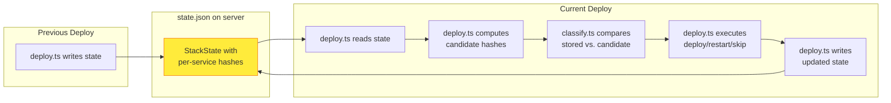
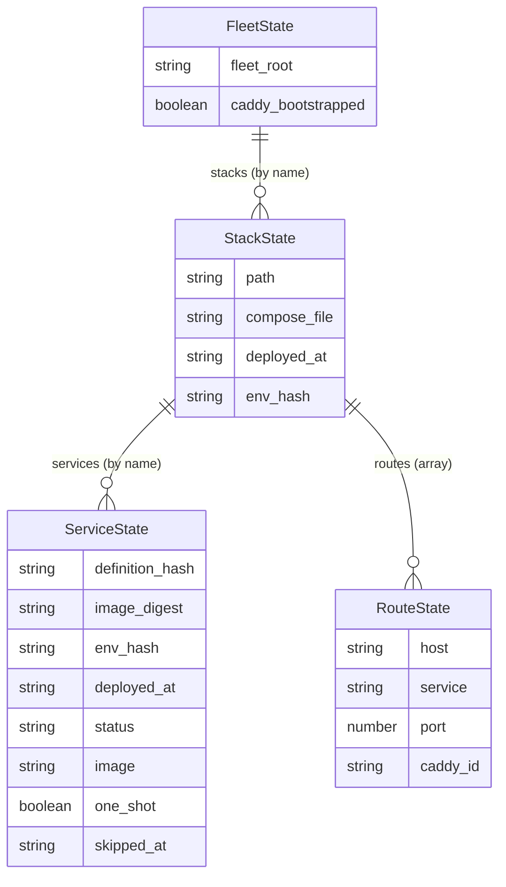

# Service Change Detection

## What This Is

Service change detection is the subsystem that answers the central question of
every `fleet deploy`: **which services actually changed and need action?** It
spans three source files that form a closed loop — types define the contract,
the classifier reads stored state and computes a verdict, and the deployment
pipeline writes updated state for the next cycle.

| File | Responsibility |
|------|---------------|
| `src/state/types.ts` | Defines `FleetState`, `StackState`, `ServiceState`, and `RouteState` — the shared schema for what gets stored between deployments |
| `src/deploy/classify.ts` | Implements the six-step decision tree that sorts each service into deploy, restart, or skip |
| `src/deploy/deploy.ts` | Orchestrates the 17-step pipeline that computes hashes, invokes classification, executes Docker commands, and persists updated state |

## Why It Exists

Without change detection, every `fleet deploy` would recreate all containers
regardless of whether anything changed. For stacks with many services, this
causes unnecessary downtime, wasted bandwidth, and slower deployments. The
change detection system makes deployments **proportional to the actual changes**
rather than the total number of services.

## How the Three Files Work Together

The three files form a feedback loop across deployments:



### 1. State types define the contract (`state/types.ts`)

The `ServiceState` interface defines the fields that are stored per service
between deployments:

- **`definition_hash`**: SHA-256 of the 10 runtime-affecting Compose fields
- **`image_digest`**: Content-addressable digest from the Docker registry
- **`env_hash`**: SHA-256 of the remote `.env` file

These three hashes are the inputs to the classification decision tree. The
type also tracks operational metadata (`deployed_at`, `skipped_at`, `one_shot`,
`status`) used for display and diagnostics.

The `StackState` interface groups services with their routes and stack-level
metadata. The `FleetState` interface is the top-level container for all stacks
on a server.

See the [State Schema Reference](../state-management/schema-reference.md) for
the full field-by-field documentation.

### 2. The classifier reads stored state (`deploy/classify.ts`)

The `classifyServices()` function takes the stored `StackState`, the freshly
computed candidate hashes, and the environment hash change flag. It evaluates
six conditions in strict priority order for each service:

1. **One-shot service** (limited restart policy) -- always redeploy
2. **New service** (not in stored state) -- deploy
3. **Definition hash changed** -- deploy
4. **Image digest changed** (both non-null) -- deploy
5. **Environment hash changed** -- restart
6. **Nothing changed** -- skip

The first matching condition wins. The output is a `ServiceClassification`
with three arrays (`toDeploy`, `toRestart`, `toSkip`) and a `reasons` map.

See the [Classification Decision Tree](classification-decision-tree.md) for the
complete algorithm with flowchart and edge cases.

### 3. The pipeline orchestrates and persists (`deploy/deploy.ts`)

The `deploy()` function:

1. **Reads state** from the remote server at Step 3
2. **Computes hashes** for each service at Step 10 (definition hash locally,
   image digest and env hash remotely via SSH)
3. **Invokes classification** at Step 10 to determine per-service actions
4. **Executes Docker commands** at Step 12 based on classification results
5. **Re-captures image digests** after container startup (post-deploy capture)
   to record the true running image
6. **Builds `ServiceState` records** differentiating deployed, restarted, and
   skipped services
7. **Writes updated state** at Step 16, closing the loop for the next deploy

See the [17-Step Deploy Sequence](deploy-sequence.md) for the full pipeline.

## Key Design Decisions

### Why restart instead of redeploy for env changes

An environment-only change triggers `docker compose restart` rather than
`docker compose up -d`. A restart re-reads the `.env` file without recreating
the container, which avoids pulling images, rebuilding container networking, and
resetting container state. This is significantly faster and less disruptive.

The trade-off is that restart does not apply Compose definition changes —
but the decision tree handles this correctly because definition hash comparison
(Step 3) takes priority over env hash comparison (Step 5).

### Why image digest comparison requires both sides non-null

Locally-built images that were never pushed to a registry have no repository
digests. `docker image inspect` returns `<no value>`, which Fleet normalizes to
`null`. Comparing `null` against a real digest would cause false-positive
redeploys every time. Requiring both sides to be non-null ensures digest
comparison only applies to registry-pulled images.

See [Hash Computation Pipeline](hash-computation.md) for details on how each
hash type is computed.

### Why force mode still computes hashes

When `--force` is passed, classification is bypassed — all services go into
`toDeploy`. However, hashes are still computed so that the state file records
accurate values. Without this, the next non-forced deploy would see stale or
missing hashes and make incorrect classification decisions.

### Why post-deploy digest capture exists

Image digests captured before `docker compose pull` may differ from what the
container actually runs, especially for floating tags (`:latest`, images with no
tag). The post-deploy capture at `src/deploy/deploy.ts:258-270` re-queries
digests after containers start and updates the candidate hashes before state is
written. This ensures the stored digest accurately reflects the running image.

See [Post-Deploy Digest Capture](deploy-sequence.md#post-deploy-digest-capture)
in the deploy sequence for the full explanation.

## State Entity Relationships

The state model is hierarchical, with each level serving a different consumer:



| Level | Primary consumers |
|-------|------------------|
| `FleetState` | Bootstrap (checks `caddy_bootstrapped`), all commands (reads `fleet_root`) |
| `StackState` | Deploy pipeline (reads/writes per-stack data), teardown/stop (removes stacks), `fleet ps` (displays stack info) |
| `ServiceState` | Classification (compares hashes), deploy summary (displays per-service status), `fleet ps` (shows per-service timestamps) |
| `RouteState` | Caddy route management (registers/removes routes by `caddy_id`), teardown (cleans up routes), proxy status (reconciles) |

## Operational Scenarios

### First deployment on a fresh server

The state file does not exist. `readState` returns a default empty state with no
stacks. All services are classified as "new service" (Step 2 of the decision
tree) because the `StackState.services` block is absent. All services deploy.

### Second deployment with no changes

All hashes match. All non-one-shot services are classified as "skip". One-shot
services (if any) still deploy because they always match Step 1. The deploy
summary shows "no changes" for skipped services with relative timestamps.

### Image updated in registry (same tag)

The definition hash is unchanged, but `docker image inspect` returns a new
digest after `docker compose pull`. The classifier detects the digest mismatch
at Step 4 and classifies the service for redeployment. The reason string
includes a truncated digest comparison (e.g., `image changed (sha256: → sha256:`).

### Only `.env` file changed

Definition hashes and image digests are unchanged. The env hash comparison in
the pipeline detects the change and sets `envHashChanged = true`. The classifier
places unchanged services in `toRestart` at Step 5. Services receive
`docker compose restart` instead of `docker compose up -d`.

### Force deploy

All services go into `toDeploy` with reason "forced", regardless of hashes.
A single `docker compose up -d --remove-orphans` replaces per-service commands.
State is written with fresh hashes for all services.

## Debugging Change Detection

### Why was a service redeployed?

Check the deploy summary output for the reason string:

```
Services:
  web       definition changed → deployed
  worker    no changes → skipped (last deployed 5 minutes ago)
  migrate   one-shot → run
```

### Why was a service NOT redeployed when it should have been?

1. **Check the definition hash**: The definition hash only covers
   [10 specific fields](hash-computation.md#which-fields-are-included). Changes
   to excluded fields (e.g., `restart` policy) do not trigger redeployment.
2. **Check image digest**: If the image is locally built, the digest is `null`
   and image-based detection is skipped. Push the image to a registry for digest
   tracking.
3. **Check env hash**: Env changes only trigger a restart, not a full redeploy.
   The container specification itself is unchanged.

### Manually verifying hashes

To see what the stored hashes are for a service:

```bash
ssh user@server "cat ~/.fleet/state.json | jq '.stacks[\"my-app\"].services[\"web\"]'"
```

To compute the definition hash locally for comparison, examine the 10 included
fields in the Compose file and compare against the stored `definition_hash`.
See [Hash Computation Pipeline](hash-computation.md) for the exact algorithm.

## Cross-Group Dependencies

| Group | Relationship | What flows between them |
|-------|-------------|------------------------|
| [Deployment Pipeline](../deployment-pipeline.md) | Parent | `deploy.ts` orchestrates classification at Step 10 and acts on results at Step 12 |
| [Server State Management](../state-management/overview.md) | Data provider | `readState`/`writeState` provide the stored hashes that classification compares against |
| [Docker Compose Parsing](../compose/overview.md) | Upstream | Provides `ParsedComposeFile`, `ParsedService`, and `alwaysRedeploy()` |
| [SSH Connection Layer](../ssh-connection/overview.md) | Infrastructure | Provides `ExecFn` for remote hash computation and Docker commands |
| [Environment and Secrets](../env-secrets/overview.md) | Peer | `resolveSecrets` produces the `.env` file whose hash is compared |
| [Reverse Proxy](../caddy-proxy/overview.md) | Downstream | `RouteState` from `state/types.ts` tracks Caddy route registrations |
| [CLI Entry Point](../cli-entry-point/overview.md) | Caller | The `deploy` command passes `DeployOptions` that control force/dry-run/skip-pull behavior |
| [Atomic File Uploads](file-upload.md) | Infrastructure | `uploadFile`/`uploadFileBase64` write compose files and `.env` files to the server |

## Related documentation

- [Classification Decision Tree](classification-decision-tree.md) -- the
  six-step algorithm in detail
- [Hash Computation Pipeline](hash-computation.md) -- how each hash type is
  computed
- [17-Step Deploy Sequence](deploy-sequence.md) -- the full deployment pipeline
- [Service Classification and Hashing](service-classification-and-hashing.md) --
  the original overview of classification and hashing
- [State Schema Reference](../state-management/schema-reference.md) --
  field-by-field documentation of all state types
- [State Lifecycle](../state-management/state-lifecycle.md) -- how state flows
  through the deploy pipeline
- [Failure Recovery](failure-recovery.md) -- what happens when the pipeline
  fails between container start and state write
- [Deployment Troubleshooting](troubleshooting.md) -- error diagnosis for each
  pipeline step
- [Secrets Resolution](secrets-resolution.md) -- how `.env` files are created
  and their hashes computed
- [Integrations Reference](integrations.md) -- Docker, SSH, Caddy, Zod, and
  Infisical integration details
