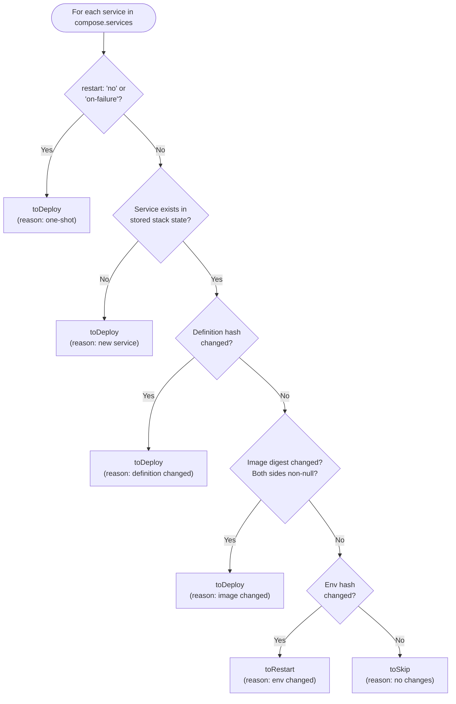

# Classification Decision Tree

## What This Is

The classification decision tree is a six-step, priority-ordered algorithm that
evaluates each service in a Docker Compose file and assigns it to one of three
action buckets: **deploy**, **restart**, or **skip**. It is the core logic that
makes Fleet's selective deployment work.

## Why It Exists

Every `fleet deploy` must decide what to do with each service. Without this
decision tree, Fleet would either redeploy everything (wasteful) or require
manual specification of which services changed (error-prone). The decision tree
automates this by comparing freshly computed hashes against stored state from the
previous deployment.

## How It Works

The decision tree is implemented in `src/deploy/classify.ts:43-104` as the
`classifyServices` function. It iterates over every service in the Compose file
and evaluates six conditions in **strict priority order** — the first match wins.

### Decision Flowchart



### Step-by-Step Explanation

#### Step 1: One-Shot Services Always Redeploy

Services with `restart: "no"` or `restart: "on-failure"` are classified as
"one-shot" and always placed in `toDeploy`, regardless of whether any hashes
match.

**Why**: These services are designed to run once and exit (e.g., database
migrations, seed scripts). Without an explicit redeploy, they would never run
again. The `restart: "on-failure"` variant is included because without a
redeploy, it would not pick up new images or configuration.

The one-shot check delegates to `alwaysRedeploy()` in
`src/compose/queries.ts:57-68`. See
[Compose Query Functions](../compose/queries.md#alwaysredeploy) for details on
how restart policies are evaluated.

#### Step 2: New Service

If the service name is not found in `stackState.services`, it is new and must be
deployed.

**Why**: A service that has never been deployed has no prior state to compare
against. This also handles the initial deployment of a stack where
`stackState.services` is `undefined` — all services are treated as new.

#### Step 3: Definition Hash Changed

If the candidate definition hash differs from the stored `definition_hash`, the
service is redeployed.

**Why**: A definition hash change means the container specification itself has
changed — the image, ports, volumes, environment variables, healthcheck, or other
runtime-affecting fields were modified. The container must be recreated with the
new specification. See [Hash Computation](hash-computation.md) for which fields
are included.

#### Step 4: Image Digest Changed (Both Non-Null)

If the candidate image digest differs from the stored `image_digest`, **and both
values are non-null**, the service is redeployed.

**Why**: A new image was pushed to the registry under the same tag (e.g.,
`nginx:latest` was updated). The container must be recreated to use the new
image.

**Why both must be non-null**: Locally-built images have no repository digests.
When `docker image inspect` is run on a locally-built image, it returns
`<no value>`, which Fleet normalizes to `null`. Comparing `null` against a real
digest (or vice versa) would cause false-positive redeploys every time. By
requiring both sides to be non-null, Fleet ensures that digest comparison only
applies to registry-pulled images.

This behavior is confirmed by tests in `tests/deploy/classify.test.ts:247-298`,
which verify that a `null` candidate digest never triggers a redeploy even when
the stored digest is non-null.

#### Step 5: Environment Hash Changed

If the `envHashChanged` flag is `true` (computed by the deployment pipeline by
comparing the current `.env` file hash against the stored `env_hash`), the
service is restarted.

**Why restart instead of redeploy**: A `docker compose restart` re-reads the
`.env` file without recreating the container, which is significantly faster than
a full redeploy. It avoids pulling images and recreating container networking.
This is the appropriate action because the container specification itself has not
changed — only the runtime environment values have.

The deployment pipeline implements this at `src/deploy/deploy.ts:245-252`, where
restarted services receive `docker compose restart` instead of
`docker compose up -d`.

#### Step 6: Nothing Changed — Skip

If none of the above conditions match, the service is unchanged and skipped
entirely. No Docker commands are executed for this service.

## Function Signature

```
classifyServices(
  compose: ParsedComposeFile,
  stackState: StackState,
  candidateHashes: Record<string, CandidateHashes>,
  envHashChanged: boolean,
): ServiceClassification
```

### Inputs

| Parameter | Type | Description |
|-----------|------|-------------|
| `compose` | `ParsedComposeFile` | The parsed Docker Compose file with all service definitions |
| `stackState` | `StackState` | Previously stored state from `~/.fleet/state.json` on the server |
| `candidateHashes` | `Record<string, CandidateHashes>` | Freshly computed definition hash and image digest per service |
| `envHashChanged` | `boolean` | Whether the `.env` file hash differs from the stored value |

### Output

The `ServiceClassification` interface:

| Field | Type | Description |
|-------|------|-------------|
| `toDeploy` | `string[]` | Services that need `docker compose up -d` |
| `toRestart` | `string[]` | Services that need `docker compose restart` |
| `toSkip` | `string[]` | Services that need no action |
| `reasons` | `Record<string, string>` | Human-readable reason for each service's classification |

### Possible Reason Values

| Reason | Trigger | Action |
|--------|---------|--------|
| `"one-shot"` | `restart: "no"` or `restart: "on-failure"` | Deploy |
| `"new service"` | Not found in stored state | Deploy |
| `"definition changed"` | Definition hash mismatch | Deploy |
| `"image changed (abc1234 → def5678)"` | Image digest mismatch (both non-null) | Deploy |
| `"env changed"` | Environment file hash changed | Restart |
| `"no changes"` | All checks passed | Skip |

## Priority Order Matters

The decision tree is evaluated in strict priority order. This means:

- A **one-shot service** is always redeployed, even if its hashes match. This is
  intentional — migration scripts and one-time tasks must run on every deploy.
- A **definition change** takes precedence over an **image change**. If both
  changed, the reason recorded is "definition changed" (not "image changed").
- An **environment change** only triggers a restart if no other change was
  detected. If the definition also changed, the service gets a full redeploy
  instead of a restart.

## Edge Cases

### Missing `services` Block in Stack State

When `stackState.services` is `undefined` (pre-V1.2 state format or first
deployment), the optional chaining on `stackState.services?.[name]` returns
`undefined`, causing every service to fall through to Step 2 (new service). This
is the correct behavior — all services are deployed from scratch.

### Empty Compose File

When `compose.services` is an empty object, the loop body never executes and all
output arrays are empty. No errors are thrown.

### Force Mode

When `--force` is used, classification is bypassed entirely in
`src/deploy/deploy.ts:183-200`. All services are placed in `toDeploy` with
reason `"forced"`. Hashes are still computed for accurate state recording.

## Testing

The classification logic is thoroughly tested in
`tests/deploy/classify.test.ts`. The test suite covers:

- Each individual branch of the decision tree
- Null image digest handling (both sides null, one side null)
- Missing `services` block on stack state
- Empty compose files
- Mixed classification across multiple services
- Deterministic output ordering (preserves `Object.keys` order)
- Reason string formatting, including shortened digest display

## Related Documentation

- [Service Classification and Hashing Overview](service-classification-and-hashing.md)
- [Hash Computation Pipeline](hash-computation.md) -- How the hashes compared by
  this decision tree are produced
- [Deployment Pipeline](../deployment-pipeline.md) -- How classification results
  drive container operations
- [Server State Management](../state-management/overview.md) -- Where `StackState` is
  persisted and retrieved
- [Compose Query Functions](../compose/queries.md) -- The `alwaysRedeploy()`
  function used in Step 1
- [Deploy Command](../cli-entry-point/deploy-command.md) -- CLI entry point that
  triggers classification
- [Validation](../validation/compose-checks.md) -- Pre-deployment checks on
  compose configuration
