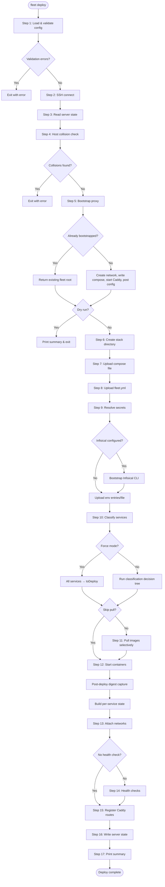

# 17-Step Deploy Sequence

The `deploy()` function in `src/deploy/deploy.ts` orchestrates 17 sequential
steps that transform a local `fleet.yml` and Docker Compose file into running
containers with reverse proxy routes on a remote server. This page documents each
step, its decision points, and how the steps interact.

## Pipeline Flowchart

## Step-by-Step Reference

### Step 1: Load and Validate Configuration

Loads `fleet.yml` from the current working directory and the Docker Compose file
referenced by `config.stack.compose_file`. Runs all [validation checks](../validation/overview.md) via
`runAllChecks()`. If any check has `severity: "error"`, the pipeline exits.
Warnings are collected and displayed in the final summary.

**Source**: `src/deploy/deploy.ts:38-62`

### Step 2: Connect to Server

Establishes an SSH connection to the remote server specified in
`config.server`. The connection provides the `exec` function used by every
subsequent step for remote command execution. See
[SSH Connection Layer](../ssh-connection/overview.md) for connection details.

**Source**: `src/deploy/deploy.ts:64-67`

### Step 3: Read Server State

Reads `~/.fleet/state.json` from the remote server via SSH. If the file does not
exist or is empty, a default empty state is returned with
`caddy_bootstrapped: false` and no stacks. If the file contains invalid JSON, the
pipeline throws an error. See [State Management](../state-management/overview.md)
for the state schema and read/write mechanics.

**Source**: `src/deploy/deploy.ts:69-71`, `src/state/state.ts:48-72`

### Step 4: Check for Host Collisions

Compares every domain in the incoming routes against all other stacks in the
server state. If another stack already claims the same domain, the pipeline exits
with an error listing the conflicts. Routes within the same stack are not flagged.

**Source**: `src/deploy/deploy.ts:73-88`, `src/deploy/helpers.ts:60-82`

### Step 5: Bootstrap Proxy

If `state.caddy_bootstrapped` is `false`, this step:

1. Resolves the [fleet root directory](../fleet-root/resolution-flow.md) (tries `/opt/fleet`, falls back to `~/fleet`)
2. Creates the `fleet-proxy` Docker network
3. Writes the Caddy proxy [`compose.yml`](../caddy-proxy/proxy-compose.md) to the fleet root
4. Starts the Caddy container via `docker compose up -d`
5. Posts the bootstrap JSON configuration to the [Caddy admin API](../caddy-proxy/caddy-admin-api.md) at
   `http://localhost:2019/load`

If already bootstrapped, returns the existing fleet root from state.

**Source**: `src/deploy/deploy.ts:90-95`, `src/deploy/helpers.ts:90-134`

**Important for dry-run**: The proxy bootstrap happens *before* the dry-run exit
point. This means a dry run may still create the Docker network and start the
Caddy container if the proxy was not previously bootstrapped.

### Dry-Run Exit Point

If `--dry-run` was passed, the pipeline prints a summary of what would be
deployed (stack name, fleet root, routes) and exits. No files are uploaded, no
containers are started, and no state is written.

**Source**: `src/deploy/deploy.ts:97-115`

### Step 6: Create Stack Directory

Creates the directory `{fleetRoot}/stacks/{stackName}` on the remote server via
`mkdir -p`.

**Source**: `src/deploy/deploy.ts:119-126`

### Step 7: Upload Compose File

Reads the local Docker Compose file and uploads it to
`{stackDir}/compose.yml` on the remote server using the
[atomic upload pattern](file-upload.md).

**Source**: `src/deploy/deploy.ts:128-134`

### Step 8: Upload fleet.yml

Reads the local `fleet.yml` and uploads it to `{stackDir}/fleet.yml` on
the remote server. This copy serves as a record of the deployed configuration.

**Source**: `src/deploy/deploy.ts:136-142`

### Step 9: Resolve and Upload Secrets

Handles environment variables using one of three strategies. See
[Secrets Resolution](secrets-resolution.md) for full details and
[Environment and Secrets Overview](../env-secrets/overview.md) for the standalone
`fleet env` command.

If the configuration uses Infisical, the Infisical CLI is bootstrapped on the
remote server first. Then secrets are resolved and written to
`{stackDir}/.env` with `0600` permissions.

**Source**: `src/deploy/deploy.ts:144-150`, `src/deploy/helpers.ts:198-287`

### Step 10: Classify Services

Determines which services need deployment, restart, or can be skipped. See
[Service Classification and Hashing](service-classification-and-hashing.md) for
the classification decision tree.

In **force mode**, all services are placed in the `toDeploy` bucket. Hashes are
still computed so that `state.json` records accurate values for the next deploy.

In **selective mode**, each service is evaluated against stored state using three
hash types: definition hash, image digest, and environment hash.

**Source**: `src/deploy/deploy.ts:152-200`, `src/deploy/classify.ts:43-104`

### Step 11: Pull Images

Unless `--skip-pull` is set:

- **Force mode**: Pulls all images at once with `docker compose pull`
- **Selective mode**: Iterates services and pulls those in the `toDeploy` list,
  one-shot services, or services with floating tags. Others are skipped.

A "floating tag" is any image reference that may resolve to different content
over time: images with no tag (defaults to `latest`), explicit `:latest`, or
digest-based `@sha256:` references.

**Source**: `src/deploy/deploy.ts:202-215`, `src/deploy/helpers.ts:593-644`

### Step 12: Start Containers

In **force mode**, runs a single `docker compose up -d --remove-orphans` for
all services.

In **selective mode**:

1. Runs `docker compose up -d {service}` for each service in `toDeploy`
2. Runs `docker compose restart {service}` for each service in `toRestart`
3. Runs `docker compose up -d --remove-orphans --no-recreate` to clean up
   containers for services removed from the compose file

After starting containers, the pipeline re-queries image digests for deployed
services to capture the actual post-pull digest (important for floating-tag
images). Then it builds the per-service `ServiceState` records.

**Source**: `src/deploy/deploy.ts:217-322`

### Step 13: Attach Networks

Connects each routed service container to the `fleet-proxy` Docker network.
Container names follow Docker Compose's default naming convention:
`{stackName}-{serviceName}-1`. The `fleet-proxy` network is a user-defined
bridge that allows the Caddy container to reach application containers by name.

"Already connected" errors are silently ignored, making this step idempotent.

**Source**: `src/deploy/deploy.ts:324-334`, `src/deploy/helpers.ts:292-315`

### Step 14: Health Checks

Unless `--no-health-check` is set, polls each route's health endpoint by running
`curl` inside the target container via `docker exec`. The poll continues at the
configured interval until a 2xx response is received or the timeout expires.

**On timeout, a warning is added rather than failing the deploy.** This design
choice prioritizes deployment completion over strict health enforcement.

See [Health Checks](health-checks.md) for configuration options and details.

**Source**: `src/deploy/deploy.ts:336-357`, `src/deploy/helpers.ts:321-356`

### Step 15: Register Caddy Routes

Performs a delete-then-post cycle for each route using the Caddy admin API. See
[Caddy Route Management](caddy-route-management.md) for details.

**Source**: `src/deploy/deploy.ts:359-365`, `src/deploy/helpers.ts:361-403`

### Step 16: Write Server State

Constructs the `StackState` record with the current deployment timestamp, route
states, per-service states (including hashes), and environment hash. Writes the
full `FleetState` to `~/.fleet/state.json` on the remote server using the
atomic `.tmp` + `mv` pattern.

**Source**: `src/deploy/deploy.ts:367-385`, `src/state/state.ts:74-91`

### Step 17: Print Summary

Outputs a formatted deployment summary showing:

- Per-service status (deployed, restarted, skipped, run) with classification
  reasons
- Aggregate counts
- Route URLs with protocol (https/http)
- Any warnings accumulated during the pipeline
- Total elapsed time

**Source**: `src/deploy/deploy.ts:387-399`, `src/deploy/helpers.ts:434-549`

## The `--env-file` Flag Decision

The `--env-file` flag is passed to `docker compose up` only when the
configuration has an environment source. The `configHasSecrets()` function at
`src/deploy/helpers.ts:409-423` returns `true` if any of these conditions hold:

- `env` is `{ file: string }` (local file upload)
- `env` is a non-empty array of `{ key, value }` pairs
- `env` has non-empty `entries` or an `infisical` configuration

When `configHasSecrets()` returns `false`, no `--env-file` flag is included,
and Docker Compose uses only the environment variables defined within the
compose file itself.

## One-Shot Services

Services with limited restart policies (e.g., `restart: "no"` or
`restart: on-failure` with a max retry count) are classified as "one-shot" via
the `alwaysRedeploy()` function from `src/compose/queries.ts`. These services:

- Are always placed in the `toDeploy` bucket regardless of hash changes
- Are always pulled regardless of selective mode
- Display as "run" rather than "deployed" in the summary output

This ensures that batch jobs, database migrations, and similar tasks are always
executed on each deployment.

## Related documentation

- [Deployment Pipeline Overview](../deployment-pipeline.md)
- [Service Classification and Hashing](service-classification-and-hashing.md)
- [Failure Recovery](failure-recovery.md)
- [Integrations Reference](integrations.md)
- [Health Checks](health-checks.md) -- Step 14 details
- [Caddy Route Management](caddy-route-management.md) -- Step 15 details
- [File Upload](file-upload.md) -- atomic upload pattern used in Steps 7-8
- [Deployment Troubleshooting](troubleshooting.md) -- error diagnosis for each
  step
- [Configuration Overview](../configuration/overview.md) -- how `fleet.yml` is
  loaded at Step 1
- [Validation Overview](../validation/overview.md) -- checks run at Step 1
- [Bootstrap Sequence](../bootstrap/bootstrap-sequence.md) -- standalone
  bootstrap flow related to Step 5
- [State Management Overview](../state-management/overview.md) -- state read
  (Step 3) and write (Step 16)
- [SSH Connection Layer](../ssh-connection/overview.md) -- connection
  established at Step 2
- [Fleet Root Resolution](../fleet-root/resolution-flow.md) -- directory
  resolution during bootstrap at Step 5
- [Proxy Docker Compose](../caddy-proxy/proxy-compose.md) -- compose file
  written during Step 5
- [SSH Connection API](../ssh-connection/connection-api.md) -- connection
  API used by remote execution steps
- [Fleet Root Directory Layout](../fleet-root/directory-layout.md) -- on-server
  directory structure created during bootstrap
