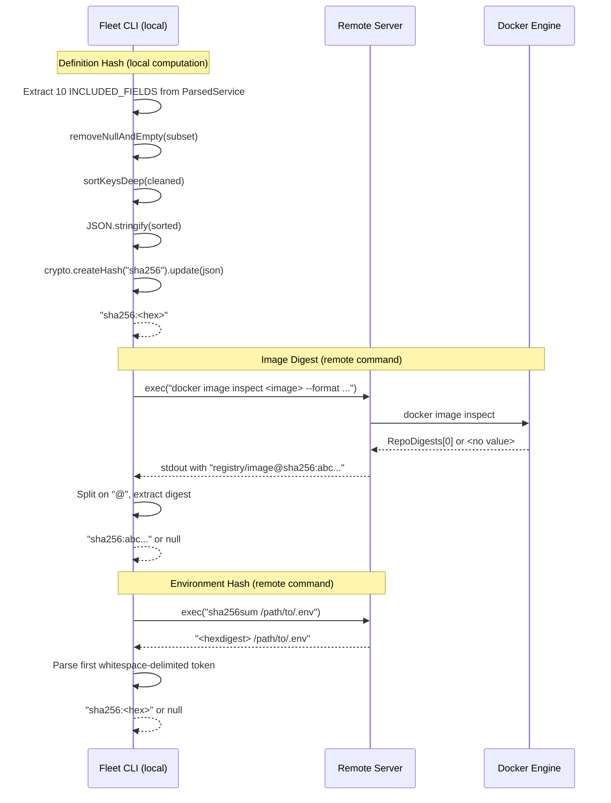

# Hash Computation Pipeline

## What This Is

The hash computation pipeline produces three types of content-addressable hashes
that represent the current state of a service, its image, and its environment
file. These hashes are the inputs to the
[classification decision tree](classification-decision-tree.md) — they determine
whether a service is redeployed, restarted, or skipped.

## Why It Exists

Fleet needs a reliable way to detect changes between deployments. Rather than
diffing Docker Compose files line-by-line (which would be fragile and
order-sensitive), Fleet computes deterministic hashes of the **semantically
meaningful** parts of each service definition. Two definitions that produce the
same hash are functionally identical, regardless of key ordering, whitespace, or
null values.

## How It Works

The pipeline is implemented in `src/deploy/hashes.ts` and produces three hash
types through different mechanisms:

| Hash Type | Function | Runs Where | Mechanism |
|-----------|----------|-----------|-----------|
| Definition hash | `computeDefinitionHash()` | Local (Node.js) | Extract fields, normalize, sort, JSON-serialize, SHA-256 |
| Image digest | `getImageDigest()` | Remote (SSH) | `docker image inspect --format '{{index .RepoDigests 0}}'` |
| Environment hash | `computeEnvHash()` | Remote (SSH) | `sha256sum <path>` on the remote `.env` file |

### Data Flow



## Definition Hash

### Which Fields Are Included

The definition hash covers exactly **10 fields** from `ParsedService`, defined as
the `INCLUDED_FIELDS` constant at `src/deploy/hashes.ts:70-81`:

| Field | Type | Why Included |
|-------|------|-------------|
| `image` | `string?` | Changes the container base image |
| `command` | `unknown?` | Changes the container entrypoint command |
| `entrypoint` | `unknown?` | Overrides the image's default entrypoint |
| `environment` | `unknown?` | Changes runtime environment variables |
| `ports` | `NormalizedPort[]` | Changes exposed/published ports |
| `volumes` | `unknown?` | Changes mounted volumes |
| `labels` | `unknown?` | Changes container metadata (used by service discovery, monitoring) |
| `user` | `string?` | Changes the UID/GID the container runs as |
| `working_dir` | `string?` | Changes the container working directory |
| `healthcheck` | `unknown?` | Changes health monitoring configuration |

### Which Fields Are Excluded (and Why)

Several `ParsedService` fields are deliberately excluded:

| Field | Why Excluded |
|-------|-------------|
| `hasImage` | Derived boolean — indicates whether `image` is set, not a runtime property |
| `hasBuild` | Derived boolean — indicates whether a build context exists |
| `restart` | Affects deployment strategy (one-shot detection), not container runtime behavior |
| `restartPolicyMaxAttempts` | Related to restart policy, not the container specification |

These excluded fields affect how Fleet *decides what to do* with a service, but
they do not change how the container itself runs. Including them would cause
unnecessary redeploys when only deployment metadata changed.

> **Note**: No explicit architectural decision record documents this field
> selection. The rationale above is inferred from the separation of concerns
> between runtime behavior and deployment strategy. If your project adds new
> fields to `ParsedService` that affect container runtime, they should be added
> to `INCLUDED_FIELDS`.

### Normalization Steps

The definition hash pipeline applies two normalization functions before
serialization to ensure deterministic output:

#### 1. `removeNullAndEmpty()` (`src/deploy/hashes.ts:92-115`)

Recursively strips `null`, `undefined`, and empty-string values from objects and
arrays. This ensures that a field explicitly set to `null` and a field that is
entirely absent produce the same hash.

- **Objects**: Keys with null/undefined/empty values are omitted entirely
- **Arrays**: Null/undefined/empty elements are filtered out; surviving elements
  are recursively cleaned
- **Primitives**: Numbers, booleans, and non-empty strings pass through unchanged

#### 2. `sortKeysDeep()` (`src/deploy/hashes.ts:122-140`)

Recursively sorts object keys alphabetically at every nesting level. This ensures
that `{a: 1, b: 2}` and `{b: 2, a: 1}` produce the same hash, even though
`JSON.stringify` is order-dependent.

- **Objects**: Keys are sorted using `Array.prototype.sort()` (alphabetical)
- **Arrays**: Element order is preserved (arrays are ordered data), but each
  element is recursively sorted if it is an object

### Hash Stability

The definition hash is stable across different Node.js versions and platforms
because:

1. **`JSON.stringify` is spec-defined**: The ECMA-262 specification defines
   `JSON.stringify` behavior precisely. After key sorting, the same input always
   produces the same JSON string.
2. **SHA-256 is platform-independent**: `crypto.createHash("sha256")` produces
   identical output for identical input on any platform.
3. **Key sorting eliminates ordering variance**: Different JavaScript engines may
   return `Object.keys()` in different orders for the same object; `sortKeysDeep`
   normalizes this.

**Potential risk**: The `unknown` types on fields like `environment`, `volumes`,
and `labels` in `ParsedService` mean that different YAML parsers could produce
subtly different intermediate representations for the same YAML input. For
example, one parser might represent the YAML string `"true"` as a boolean `true`
while another preserves it as a string. Fleet consistently uses the same parser
(from the [compose parsing](../compose/overview.md) module), so this is not a
practical concern within a single Fleet installation, but hash values are not
portable between different YAML parser implementations.

## Image Digest

### How It Works

The `getImageDigest()` function (`src/deploy/hashes.ts:12-32`) runs
`docker image inspect` on the remote server to retrieve the content-addressable
digest of a Docker image.

```
docker image inspect <image> --format '{{index .RepoDigests 0}}'
```

The output looks like `registry.example.com/image@sha256:abc123...`. Fleet splits
on `@` and extracts the digest portion.

### Null Return Cases

`getImageDigest()` returns `null` in three scenarios:

1. **Non-zero exit code**: The `docker image inspect` command failed (image not
   found locally, Docker daemon not running, etc.)
2. **Empty stdout**: The command succeeded but produced no output
3. **`<no value>` response**: The image exists locally but has no repository
   digests — this happens with locally-built images that were never pushed to or
   pulled from a registry

When the digest is `null`, the
[classification decision tree](classification-decision-tree.md) skips the image
digest comparison entirely (Step 4 requires both sides non-null). This prevents
false-positive redeploys for locally-built images.

### Docker Version Requirements

The `docker image inspect` command with Go template formatting requires Docker
Engine 17.06 or later. Fleet uses the Docker Compose V2 plugin syntax
(`docker compose` not `docker-compose`), which requires Docker Engine 20.10+ with
the Compose plugin installed.

### Troubleshooting `docker image inspect` Failures

| Symptom | Cause | Resolution |
|---------|-------|-----------|
| Exit code 1, "No such image" | Image not pulled yet | Run `docker pull <image>` on the server, or let Fleet's image pull step handle it |
| Exit code 1, "Cannot connect to Docker daemon" | Docker not running | `sudo systemctl start docker` on the remote server |
| Returns `<no value>` | Locally-built image | Expected behavior; Fleet treats this as null and skips digest comparison |
| Exit code 126/127 | Docker CLI not installed | Install Docker Engine on the remote server |

## Environment Hash

### How It Works

The `computeEnvHash()` function (`src/deploy/hashes.ts:43-64`) runs `sha256sum`
on the remote `.env` file:

```
sha256sum /opt/fleet/stacks/<stack-name>/.env
```

The output looks like `abc123...  /path/to/.env`. Fleet extracts the hex digest
(first whitespace-delimited token) and prefixes it with `sha256:`.

### Null Return Cases

`computeEnvHash()` returns `null` when:

1. **Non-zero exit code**: File does not exist, is unreadable, or `sha256sum` is
   not installed
2. **Empty stdout**: Command succeeded but produced no output (unlikely in
   practice)
3. **Unparseable output**: The first token after whitespace splitting is empty

### `sha256sum` Availability

`sha256sum` is part of GNU coreutils and is available on all common Linux
distributions (Debian, Ubuntu, CentOS, Amazon Linux, Alpine). Fleet assumes the
remote server runs Linux.

On macOS (if ever used as a remote target), the equivalent command is
`shasum -a 256`. The current implementation does not handle this case — macOS
remote servers would require modification.

### How Environment Hash Change Is Detected

The deployment pipeline (`src/deploy/deploy.ts:167-170`) computes the
`envHashChanged` flag:

```
envHashChanged =
  existingStackState?.env_hash != null &&
  currentEnvHash != null &&
  existingStackState.env_hash !== currentEnvHash
```

Both the stored and current hashes must be non-null for a change to be detected.
This means:

- First deployment (no stored hash): `envHashChanged = false` — all services
  deploy regardless
- Subsequent deployment with same env: `envHashChanged = false` — services may
  be skipped
- Subsequent deployment with changed env: `envHashChanged = true` — unchanged
  services are restarted

## Performance Considerations

### Per-Service SSH Round-Trips

For each service with an `image` field, `getImageDigest()` executes one SSH
round-trip to run `docker image inspect`. For small stacks (1-5 services), this
latency is negligible. For larger stacks, the serial execution could become a
bottleneck.

The `ExecFn` abstraction (from `src/ssh/types.ts:7`) does not support command
batching, so there is currently no way to inspect multiple images in a single
round-trip. Potential mitigations for large stacks:

- Batch `docker image inspect` into a single compound shell command
- Cache digests for images that haven't been pulled since the last deploy
- Parallelize SSH commands (would require changes to the `ExecFn` interface)

### Definition Hash Computation

Definition hash computation runs locally and is extremely fast. The serialized
JSON of a single service definition is typically under 1 KB, and SHA-256 hashing
at that scale takes microseconds.

### Environment Hash Computation

A single `sha256sum` invocation over SSH is fast regardless of `.env` file size,
since `.env` files are typically small (under 10 KB).

## State Storage

Computed hashes are stored in the `ServiceState` record within
`~/.fleet/state.json` on the remote server. See
[Server State Management](../state-management/overview.md) for details on how
state is read and written, and the
[State Schema Reference](../state-management/schema-reference.md) for field
definitions.

Each `ServiceState` record stores:

| Field | Hash Type | Used By |
|-------|-----------|---------|
| `definition_hash` | Definition hash | Decision tree Step 3 |
| `image_digest` | Image digest | Decision tree Step 4 |
| `env_hash` | Environment hash | Compared at pipeline level for `envHashChanged` |

## FIPS Compliance

The SHA-256 implementation uses Node.js's built-in `crypto` module, which
delegates to OpenSSL. If the Node.js runtime is compiled with FIPS-enabled
OpenSSL (e.g., via `--openssl-fips`), the hash computation is FIPS-compliant.
Standard Node.js distributions do not enable FIPS by default.

For deployment environments that require FIPS compliance, use a FIPS-enabled
Node.js build (available from vendors like Red Hat) or configure OpenSSL FIPS
mode on the machine running the Fleet CLI.

## Related Documentation

- [Service Classification and Hashing Overview](service-classification-and-hashing.md)
- [Classification Decision Tree](classification-decision-tree.md) -- Consumes
  hashes to make deploy/restart/skip decisions
- [Integrations Reference](integrations.md) -- Docker Engine and Node.js crypto
  details
- [Server State Management](../state-management/overview.md) -- Where hashes are persisted
- [State Schema Reference](../state-management/schema-reference.md) -- Field
  definitions for `ServiceState`
- [Docker Compose Parsing](../compose/overview.md) -- Produces `ParsedService`
  objects that are hashed
- [Compose Query Functions](../compose/queries.md) -- Query functions used
  alongside hash computation
- [Deploy Command](../cli-entry-point/deploy-command.md) -- CLI entry point
  that triggers hash computation
- [Environment and Secrets](../env-secrets/overview.md) -- How `.env` files
  are produced before hashing
