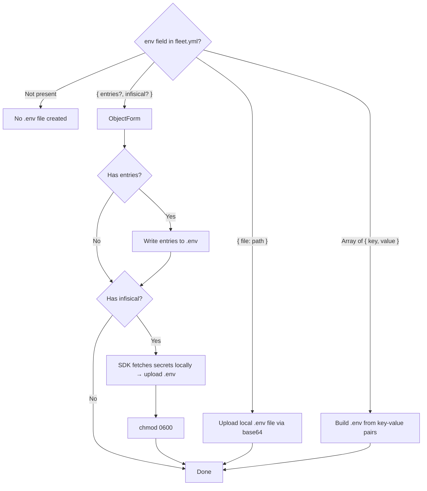

# Secrets Resolution

## What This Covers

Fleet supports three mutually exclusive strategies for providing environment
variables to deployed services. The `resolveSecrets()` function at
`src/deploy/helpers.ts:198-287` handles all three, producing a `.env` file with
`0600` permissions in the stack directory on the remote server.

## Why Three Strategies Exist

Different deployment contexts have different security and operational
requirements:

- **Inline entries**: Simple key-value pairs defined directly in `fleet.yml`.
  Convenient for non-sensitive configuration but unsuitable for secrets since
  they are stored in plain text in the config file.
- **Local file upload**: A `.env` file on the operator's machine is uploaded to
  the server. Works well for CI/CD pipelines that inject secrets into the
  environment and write them to a file before deploying.
- **Infisical export**: Secrets are fetched directly on the remote server from
  the Infisical secrets management platform. The operator never has the secret
  values on their local machine.

## Strategy Selection

The `env` field in `fleet.yml` determines which strategy is used. The field
accepts three shapes, enforced by the
[configuration schema](../configuration/schema-reference.md):

### Strategy summary

| Strategy | `fleet.yml` syntax | Mechanism | Source |
|----------|--------------------|-----------|--------|
| **File upload** | `env: { file: .env.production }` | Base64-encode local file, decode on server | `helpers.ts:208-236` |
| **Inline entries** | `env: [{ key, value }, ...]` | Concatenate key=value lines, upload via heredoc | `helpers.ts:238-252` |
| **Infisical SDK** | `env: { infisical: { ... } }` | Fetch secrets via `@infisical/sdk` locally, upload to server | `helpers.ts:279-298` |

All strategies produce a `{stackDir}/.env` file with `0600` permissions.
File-upload mode includes path-traversal protection (see
[Security Model](../env-secrets/security-model.md) for details). For the upload
mechanisms used by each strategy, see [Atomic File Uploads](file-upload.md). For
full configuration examples, per-strategy behavior, and edge cases, see
[Env Configuration Shapes](../env-secrets/env-configuration-shapes.md).

## Infisical Integration

Fleet integrates with [Infisical](https://infisical.com/docs) for centralized
secrets management via the **`@infisical/sdk` Node.js SDK**. During deployment,
`resolveSecrets()` instantiates the SDK client locally, authenticates with a
pre-obtained access token via `client.auth().accessToken(token)`, and fetches
secrets using `client.secrets().listSecrets()`. The fetched secrets are formatted
as dotenv content and uploaded to the remote server as `{stackDir}/.env` via
base64 encoding. No CLI installation or remote server tooling is required.

The token field supports `$VAR` expansion at config load time for CI/CD
integration.

For full details on authentication, token types, and network requirements, see
[Infisical Integration](../env-secrets/infisical-integration.md) and
[Integrations Reference](integrations.md#infisical).

## The --env-file Flag

When Docker Compose starts containers, the `--env-file` flag tells it to load
environment variables from the specified file. The `configHasSecrets()` function
at `src/deploy/helpers.ts:451-465` determines whether this flag is needed:

- Returns `true` if any env source is configured (file, entries, or Infisical)
- Returns `false` if `env` is absent or empty

When the flag is included, Docker Compose passes the `.env` file contents as
environment variables to all services in the stack. Services can reference these
variables in their compose definitions using `${VAR_NAME}` syntax.

## File Permissions

All `.env` files are written with `0600` permissions (owner read/write only).
This applies to all three strategies:

- **File upload and inline entries**: Permissions are set via the `permissions`
  parameter of the upload functions
- **Infisical export**: Permissions are set by a separate `chmod 0600` command
  after the export completes

## Related documentation

- [17-Step Deploy Sequence](deploy-sequence.md)
- [Atomic File Uploads](file-upload.md) -- heredoc and base64 upload mechanisms
- [Integrations Reference](integrations.md)
- [Deployment Pipeline Overview](../deployment-pipeline.md)
- [Env Configuration Shapes](../env-secrets/env-configuration-shapes.md) --
  detailed per-shape documentation and examples
- [Infisical Integration](../env-secrets/infisical-integration.md) -- deep dive
  on Infisical SDK authentication and secret retrieval
- [Environment and Secrets Overview](../env-secrets/overview.md) -- the complete
  `fleet env` workflow
- [Configuration Environment Variables](../configuration/environment-variables.md)
  -- `$VAR` expansion mechanism
- [Validation Codes Reference](../validation/validation-codes.md) -- includes
  `ENV_CONFLICT` validation code
- [Fleet Configuration Checks](../validation/fleet-checks.md) -- the
  `checkEnvConflict` validation that prevents entries+infisical conflicts
- [Fleet Root Directory Layout](../fleet-root/directory-layout.md) -- where
  `.env` files and secrets are stored on the remote host
- [State Data Model](../env-secrets/state-data-model.md) -- how `env_hash`
  tracks `.env` file changes for change detection
