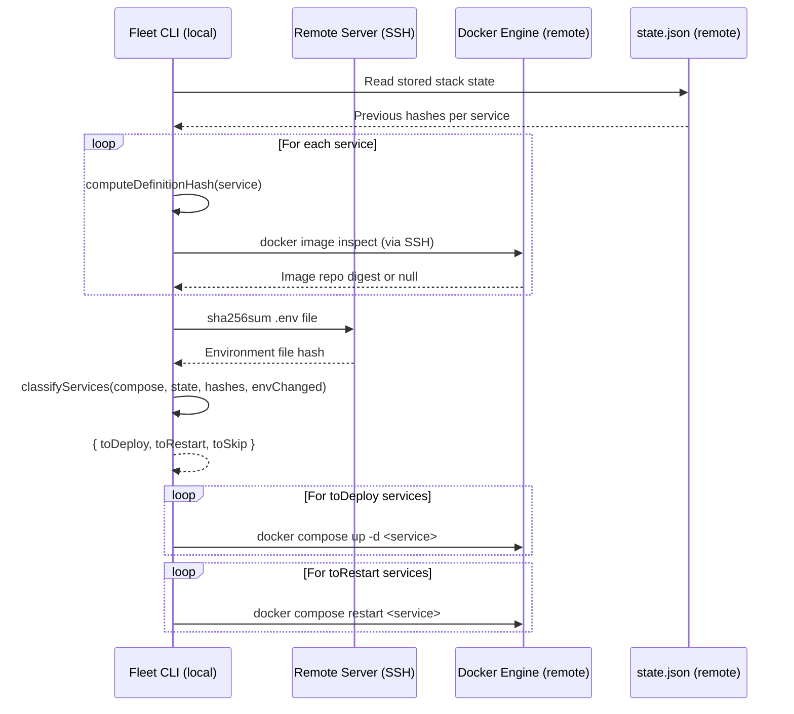

# Service Classification and Hashing

## What This Is

The service classification and hashing subsystem is the intelligence layer of
Fleet's selective deployment strategy. It answers the central question of every
`fleet deploy` invocation: **which services need to be redeployed, which need a
restart, and which can be safely skipped?**

By computing content-addressable hashes of service definitions, Docker image
digests, and remote environment files, Fleet compares the candidate state of each
service against the previously stored stack state. The result is a three-bucket
classification — deploy, restart, or skip — that eliminates unnecessary container
restarts and image pulls.

## Why It Exists

Without selective deployment, every `fleet deploy` would recreate all containers
regardless of whether anything changed. For stacks with many services, this
causes:

- Unnecessary downtime during container recreation
- Wasted bandwidth re-pulling unchanged images
- Slower deployments as the number of services grows

The classification system makes deployments **proportional to the actual changes**
rather than the total number of services.

## How It Fits Together

The three source files form a pipeline consumed by the
[deployment pipeline](../deployment-pipeline.md):

1. **`deploy/hashes.ts`** — Computes three types of hashes (definition, image
   digest, environment) using both local computation and remote SSH commands.
2. **`deploy/classify.ts`** — Evaluates a priority-ordered decision tree to sort
   each service into deploy, restart, or skip buckets.
3. **`deploy/helpers.ts`** — Contains the `resolveSecrets()` function that
   integrates with the [Infisical Node.js SDK](../env-secrets/infisical-integration.md) (`@infisical/sdk`) to fetch secrets
   before environment hashes are computed.

## Source Files

| File | Purpose |
|------|---------|
| `src/deploy/classify.ts` | Decision tree that classifies services into action buckets |
| `src/deploy/hashes.ts` | Hash computation for definitions, image digests, and env files |
| `src/deploy/helpers.ts` | Contains Infisical SDK integration for secret resolution |

## Detailed Documentation

- [Classification Decision Tree](classification-decision-tree.md) — The six-step
  priority-ordered decision logic
- [Hash Computation Pipeline](hash-computation.md) — How the three hash types are
  computed and compared
- [Infisical SDK Integration](integrations.md#infisical) — Secrets management
  via the `@infisical/sdk` Node.js SDK
- [Integrations Reference](integrations.md) — Docker Engine, Infisical, Cloudsmith,
  Node.js crypto, and SSH execution layer

## Cross-Group Dependencies

| Dependency | Direction | What It Provides |
|-----------|-----------|-----------------|
| [Deployment Pipeline](../deployment-pipeline.md) | Consumer | Orchestrates classification at Step 10, acts on results at Step 12 |
| [Docker Compose Parsing](../compose/overview.md) | Upstream | Provides `ParsedComposeFile`, `ParsedService`, and `alwaysRedeploy()` |
| [Server State Management](../state-management/overview.md) | Upstream | Provides `StackState` with stored per-service hashes |
| [SSH Connection Layer](../ssh-connection/overview.md) | Upstream | Provides `ExecFn` for remote command execution |
| [Environment and Secrets](../env-secrets/overview.md) | Peer | Shares Infisical SDK integration for the `fleet env` command |
| [Fleet Configuration](../configuration/overview.md) | Indirect | `config.env.infisical` gates whether Infisical bootstrap runs |

## Key Concepts

### Three Hash Types

Fleet uses three distinct hash types, each computed differently and detecting
different categories of change:

| Hash Type | Where Computed | What It Detects | Change Action |
|-----------|---------------|-----------------|---------------|
| **Definition hash** | Locally via `crypto.createHash("sha256")` | Changes to the 10 runtime-affecting Compose fields | Full redeploy |
| **Image digest** | Remotely via `docker image inspect` | New image pushed to registry under same tag | Full redeploy |
| **Environment hash** | Remotely via `sha256sum` on `.env` file | Changes to secret values or env variables | Container restart |

### Deploy vs. Restart vs. Skip

- **Deploy** (`docker compose up -d <service>`): Recreates the container with the
  new definition and/or image. Required when the container specification itself
  has changed.
- **Restart** (`docker compose restart <service>`): Restarts the existing
  container in-place, which re-reads the `.env` file without pulling images or
  recreating the container. Faster than a full redeploy.
- **Skip**: No action taken. The service is unchanged from the last deployment.

### Force Mode

When [`fleet deploy --force`](../cli-entry-point/deploy-command.md) is used, classification is bypassed — all services
are placed in the `toDeploy` bucket. Hashes are still computed so that
[`state.json`](../state-management/schema-reference.md) records accurate values for the next deployment's comparison.

## Related documentation

- [Service Change Detection Overview](change-detection-overview.md) -- How
  classification, deployment, and state types work together as a system
- [Classification Decision Tree](classification-decision-tree.md) -- The six-step
  priority-ordered decision logic
- [Hash Computation Pipeline](hash-computation.md) -- How the three hash types are
  computed and compared
- [Infisical SDK Integration](integrations.md#infisical) -- Secrets
  management via the `@infisical/sdk` Node.js SDK
- [Integrations Reference](integrations.md) -- Docker Engine, Infisical, Cloudsmith,
  Node.js crypto, and SSH execution layer
- [Deployment Pipeline](../deployment-pipeline.md) -- How classification results
  drive the deploy workflow
- [Deploy Command](../cli-entry-point/deploy-command.md) -- CLI entry point for
  deployments
- [Compose Query Functions](../compose/queries.md) -- `alwaysRedeploy()` and
  service enumeration
- [State Management Overview](../state-management/overview.md) -- Classification
  reads stored per-service hashes from `StackState` and writes updated hashes
  after deployment
- [CI/CD Integration](../ci-cd-integration.md) -- Using selective deployment in
  CI pipelines
