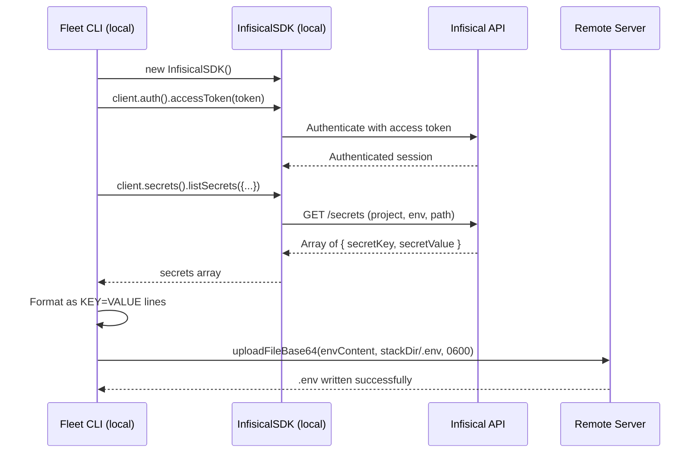

# Infisical Integration

## What Is Infisical

[Infisical](https://infisical.com/docs) is a secrets management platform that
provides centralized storage, access control, versioning, and audit logging for
application secrets. Fleet integrates with Infisical using the
[`@infisical/sdk` Node.js package](https://infisical.com/docs/sdks/languages/node)
to fetch secrets at deploy time and write them as `.env` files on the remote
server.

## Why Fleet Uses Infisical

The Infisical integration exists so that secret values never need to be stored
in `fleet.yml` or in local `.env` files. With the `env.file` or `env.entries`
strategies, the operator must have the secret values available locally. With
Infisical, secrets are fetched directly from the Infisical API by the Fleet
CLI process and uploaded to the remote server -- the operator only needs an
access token, not the actual secret values.

## How It Works

Fleet uses the **Infisical Node.js SDK** (`@infisical/sdk`), not the Infisical
CLI. The SDK runs within the local Fleet process (the machine running
`fleet deploy` or `fleet env`). No software is installed on the remote server
for Infisical integration.

### SDK Authentication and Secret Fetch

The `resolveSecrets()` function at `src/deploy/helpers.ts:279-298` performs
these steps when Infisical is configured:



1. **Instantiate SDK**: `new InfisicalSDK()` at `src/deploy/helpers.ts:282`
2. **Authenticate**: `client.auth().accessToken(token)` at
   `src/deploy/helpers.ts:283` -- sets the pre-obtained access token for all
   subsequent API calls
3. **Fetch secrets**: `client.secrets().listSecrets({...})` at
   `src/deploy/helpers.ts:285-289` -- retrieves all secrets for the specified
   project, environment, and path
4. **Format**: Maps each secret to `KEY=VALUE` format at
   `src/deploy/helpers.ts:291`
5. **Upload**: Uses `uploadFileBase64()` to write the `.env` file to the
   remote server with `0600` permissions at `src/deploy/helpers.ts:293-297`

### What `accessToken()` Does

The `client.auth().accessToken(token)` method manually sets a pre-obtained
access token on the SDK client instance. According to the
[Infisical Node.js SDK documentation](https://infisical.com/docs/sdks/languages/node),
this is used when you already have an access token (e.g., from a Machine
Identity token exchange or from a Token Auth identity). It does **not** perform
a login flow -- it simply configures the SDK to use the provided token for
authentication on subsequent requests.

This is distinct from `client.auth().universalAuth.login()`, which exchanges
a client ID and client secret for a short-lived access token. Fleet uses
`accessToken()` directly, meaning the token must be obtained before Fleet
runs.

## Token Types and Provisioning

### Supported Token Types

Fleet calls `client.auth().accessToken(token)`, which accepts any valid
Infisical access token. The following token types are compatible:

| Token type | How to obtain | Recommended for |
|-----------|--------------|-----------------|
| **Token Auth** | Create a Machine Identity with Token Auth in the Infisical dashboard. The token is a long-lived static string. | Simple setups, development environments |
| **Universal Auth (pre-exchanged)** | Create a Machine Identity with Universal Auth. Exchange the client ID + client secret for an access token via the Infisical API or CLI *before* running Fleet. Pass the resulting short-lived access token. | CI/CD pipelines with pre-flight token exchange |
| **Service Token (legacy)** | Created in the Infisical dashboard under project settings. | **Not recommended** -- being deprecated by Infisical in favor of Machine Identities |

**Important**: Fleet does not perform the Universal Auth client-credentials
exchange itself. If you use Universal Auth, you must exchange the client ID and
client secret for an access token in a prior step (e.g., a CI/CD pipeline step)
and pass the resulting access token to Fleet via the `token` field.

### How to Provision a Token

1. Log in to [Infisical Cloud](https://app.infisical.com/) or your self-hosted
   instance
2. Navigate to **Organization > Access Control > Machine Identities**
3. Create a new Machine Identity (or use an existing one)
4. Configure an authentication method:
    - **Token Auth**: Generate a static access token directly
    - **Universal Auth**: Note the client ID and client secret for later exchange
5. Assign the identity to your project with appropriate role permissions
   (at minimum, read access to the target environment and path)
6. Copy the access token (Token Auth) or exchange credentials for an access
   token (Universal Auth)

### Token Rotation

Fleet does not cache or persist Infisical tokens. Each invocation of
`fleet deploy` or `fleet env` consumes the token value at that moment and
discards it after the SDK call completes. To rotate:

1. Generate a new token or client secret in the Infisical dashboard
   (Settings > Machine Identities)
2. Update the environment variable (e.g., `INFISICAL_TOKEN`) or the literal
   value in `fleet.yml`
3. Run `fleet env` or `fleet deploy` -- the new token takes effect immediately

There is no grace period or dual-token mechanism. The old token stops working
as soon as it is revoked in Infisical; any Fleet invocation using the revoked
token will fail at the `accessToken()` or `listSecrets()` call.

### Rate Limits for `listSecrets()`

The Infisical API enforces rate limits that vary by plan:

| Plan | Rate limit | Relevance |
|------|-----------|-----------|
| Free / Starter | 60 requests/minute per identity | Concurrent deploys of 60+ stacks could exceed this |
| Pro / Enterprise | Higher limits (plan-dependent) | Sufficient for most deployment scenarios |

Each `fleet deploy` or `fleet env` invocation makes exactly **one**
`listSecrets()` call. Concurrent deploys to different stacks (e.g., in a
CI/CD matrix build) each make their own call. If you deploy more than 60
stacks in under a minute with the same identity, consider using separate
Machine Identities per stack or staggering deployments.

## `$VAR` Expansion

All four Infisical fields (`token`, `project_id`, `environment`, `path`)
support `$VAR` expansion at config load time (`src/config/loader.ts:37-46`).
When a field value starts with `$`, the remainder is treated as an environment
variable name and resolved from `process.env`:

```yaml
env:
  infisical:
    token: $INFISICAL_TOKEN          # Resolved from process.env.INFISICAL_TOKEN
    project_id: $INFISICAL_PROJECT   # Resolved from process.env.INFISICAL_PROJECT
    environment: production          # Literal value (no $ prefix)
    path: /
```

If the referenced environment variable is not set, the config loader throws:

```
Environment variable "INFISICAL_TOKEN" referenced by env.infisical.token
in fleet.yml is not set
```

### CI/CD Integration

In CI/CD pipelines, set the Infisical token as a pipeline secret:

- **GitHub Actions**: Add `INFISICAL_TOKEN` as a repository or environment
  secret, then reference it in the workflow
- **GitLab CI**: Add `INFISICAL_TOKEN` as a CI/CD variable (masked)
- **Other CI systems**: Use the native secrets mechanism to inject the variable
  into the build environment

Fleet reads from `process.env` directly at config load time. There is no
`.env` file loading at the CLI level -- the variable must be present in the
actual shell environment.

See [CI/CD Integration](../ci-cd-integration.md) for complete pipeline
examples.

### Local Development

Export the variable in your shell before running Fleet commands:

```bash
export INFISICAL_TOKEN=st.xxxx.yyyy.zzzz
fleet env
```

## Token Security

### Where the Token Lives

The Infisical access token flows through these locations:

| Location | Exposure | Duration |
|----------|----------|----------|
| `process.env` on the Fleet CLI machine | In-memory only | Duration of the `fleet` process |
| Infisical SDK in-memory | In-memory only | Duration of the `listSecrets()` call |
| HTTPS request to Infisical API | Encrypted in transit (TLS) | Milliseconds |

The token is **never** transmitted to the remote server. The SDK runs locally
within the Fleet process, fetches secrets over HTTPS, formats them as
`KEY=VALUE` lines, and uploads only the resulting `.env` content to the remote
server via SSH.

### What Is Transmitted Over SSH

Only the formatted secret *values* (as `KEY=VALUE` content inside a base64-
encoded payload) are sent over the SSH channel. The Infisical token itself,
project ID, environment, and path are never sent to the remote server.

### Mitigation Recommendations

For high-security environments:

1. Use **Machine Identity with Token Auth** and set short expiration times on
   the tokens. Revoke after deployment completes.
2. Use **Universal Auth** with a pre-flight token exchange in your CI/CD
   pipeline. The short-lived access token expires quickly, limiting exposure.
3. Restrict the Machine Identity's project/environment scope to the minimum
   required.
4. Consider running [Infisical self-hosted](https://infisical.com/docs/self-hosting/overview)
   to keep secrets within your network boundary.

## What Happens When the Infisical API Is Unreachable

The `client.secrets().listSecrets()` call at `src/deploy/helpers.ts:285-289`
has no explicit retry, timeout, or circuit-breaker configuration. If the
Infisical API is unreachable (network failure, DNS resolution failure, or
Infisical outage):

1. The SDK throws an unhandled exception (typically a network error or timeout
   from the underlying HTTP client)
2. The exception propagates up through `resolveSecrets()` to the caller
   (`pushEnv()` in `src/env/env.ts` or the deploy pipeline in
   `src/deploy/deploy.ts`)
3. The caller's catch block logs the error and exits with code 1
4. The SSH connection is closed in the `finally` block

**There is no fallback to a cached `.env` file.** If the Infisical API is
unavailable, the deployment fails. The previously deployed `.env` file on the
remote server remains untouched (since the upload step was never reached).

### Monitoring Infisical Availability

To prevent deploy failures due to Infisical outages:

- Monitor the [Infisical status page](https://status.infisical.com/) (for
  Infisical Cloud)
- For self-hosted: set up health checks against your Infisical instance's
  `/api/status` endpoint
- Configure CI/CD pipeline alerts for Fleet deployment failures

### Recovery

If a deployment fails due to Infisical unavailability:

1. Wait for the Infisical API to recover
2. Rerun `fleet deploy` or `fleet env` -- the command is idempotent

No manual cleanup is required because the `.env` file is only written
after secrets are successfully fetched.

## Network Requirements

The **Fleet CLI machine** (not the remote server) needs outbound HTTPS access
to the Infisical API:

| Destination | Purpose | When needed |
|------------|---------|-------------|
| `app.infisical.com` | Secret fetch via SDK | Every deploy/env push with Infisical |
| Self-hosted Infisical URL | Same, for self-hosted instances | Every deploy/env push |

The remote server does **not** need network access to Infisical. Secrets are
fetched locally by the SDK and uploaded to the server via the existing SSH
connection.

## Accessing the Infisical Dashboard

To audit which secrets Fleet is fetching:

1. Log in to [Infisical Cloud](https://app.infisical.com/) or your self-hosted
   instance
2. Navigate to the project identified by `project_id` in your `fleet.yml`
3. Select the environment (e.g., `production`, `staging`)
4. Browse the path specified in `fleet.yml` (defaults to `/`)

The Infisical dashboard provides:

- **Audit logs**: Which machine identities accessed which secrets and when
- **Secret versioning**: History of changes to each secret value
- **Access controls**: Role-based permissions for machine identities
- **Secret rotation**: Automated rotation policies for supported integrations

## SDK Version Requirements

The `@infisical/sdk` package (v5+) requires **Node.js 20 or higher**, matching
Fleet's own engine requirement (`engines.node >= 20` in `package.json`). If you
encounter SDK import errors, verify your Node.js version:

```bash
node --version  # Must be >= 20.0.0
```

## Can Inline Entries and Infisical Be Used Simultaneously?

**Technically yes, but Infisical overwrites the entries.** When both
`env.entries` and `env.infisical` are present in the object-form configuration,
the code at `src/deploy/helpers.ts:268-298` processes them sequentially:

1. Entries are written to `.env` first (via heredoc upload)
2. Infisical secrets are fetched and written to the **same** `.env` file (via
   base64 upload), completely replacing the entries

The validation module at `src/validation/fleet-checks.ts:10-20` detects this
conflict and reports an `ENV_CONFLICT` error before deployment proceeds. The
resolution is to use either entries or Infisical, not both. If you need
variables from both sources, consolidate them into a single Infisical project.

## Related documentation

- [Environment and Secrets Overview](./overview.md) -- the complete `fleet env`
  workflow
- [Environment Configuration Shapes](./env-configuration-shapes.md) -- the
  three `env` field formats
- [Troubleshooting](./troubleshooting.md) -- failure modes and recovery
- [Security Model](./security-model.md) -- file permissions, path traversal,
  and transport security
- [Secrets Resolution (Deploy)](../deploy/secrets-resolution.md) -- how the
  deploy pipeline resolves secrets
- [Configuration Schema Reference](../configuration/schema-reference.md) --
  the `infisical` field specification
- [Configuration Environment Variables](../configuration/environment-variables.md) --
  `$VAR` expansion mechanism
- [SSH Connection Layer](../ssh-connection/overview.md) -- how remote commands
  are executed
- [CI/CD Integration](../ci-cd-integration.md) -- complete pipeline examples
  including Infisical token provisioning in CI
- [Configuration Overview](../configuration/overview.md) -- how the `env`
  section in `fleet.yml` is loaded and validated
- [Deploy Sequence](../deploy/deploy-sequence.md) -- how secrets resolution
  fits into the 17-step deployment pipeline
