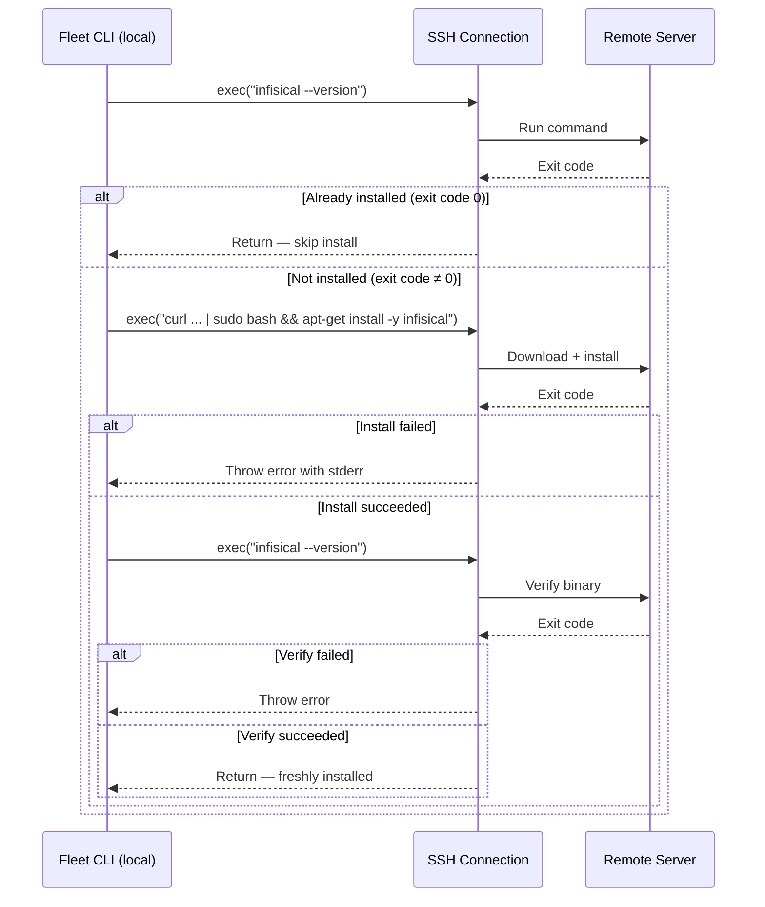

# Infisical Integration

## What Is Infisical

[Infisical](https://infisical.com/docs) is a secrets management platform that
provides centralized storage, access control, versioning, and audit logging for
application secrets. Fleet integrates with Infisical by installing the Infisical
CLI on the remote server and using it to export secrets in dotenv format directly
into the stack's `.env` file.

## Why Fleet Uses Infisical

The Infisical integration exists so that secret values never need to pass through
the operator's local machine. With the `env.file` or `env.entries` strategies,
the operator must have the secret values available locally (either in a file or
in `fleet.yml`). With Infisical, the remote server fetches secrets directly from
the Infisical API, and the operator only needs a service token -- not the actual
secret values.

## How It Works

### CLI Bootstrap

Before secrets can be exported, the Infisical CLI must be present on the remote
server. The `bootstrapInfisicalCli()` function at `src/deploy/infisical.ts:8-33`
implements a three-phase check-install-verify flow:



1. **Check**: Runs `infisical --version`. If exit code 0, the CLI is already
   installed and the function returns immediately.
2. **Install**: Fetches the Debian/Ubuntu APT repository setup script from
   `https://dl.cloudsmith.io/public/infisical/infisical-cli/setup.deb.sh`,
   pipes it to `bash`, then runs `apt-get update && apt-get install -y infisical`.
3. **Verify**: Runs `infisical --version` again to confirm the binary is on PATH.

The bootstrap is called from two locations:

- `src/deploy/deploy.ts:147-148` -- during Step 9 of the deploy pipeline
- `src/env/env.ts:45-47` -- during the `fleet env` push workflow

Both call sites gate the bootstrap behind a check for Infisical configuration:

```typescript
if (config.env && !Array.isArray(config.env) && "infisical" in config.env && config.env.infisical) {
    await bootstrapInfisicalCli(exec);
}
```

### Secret Export

After the CLI is bootstrapped, the `resolveSecrets()` function at
`src/deploy/helpers.ts:266-286` runs the Infisical CLI on the remote server:

```bash
INFISICAL_TOKEN={token} infisical export \
    --projectId={project_id} \
    --env={environment} \
    --path={secretPath} \
    --format=dotenv > {stackDir}/.env
```

The `--format=dotenv` flag produces output in standard `KEY=VALUE` format, which
is redirected into the `.env` file. File permissions are then set to `0600`.

### What Happens When Both `entries` and `infisical` Are Configured

The validation module at `src/validation/fleet-checks.ts:4-25` reports an
`ENV_CONFLICT` error when both `env.entries` and `env.infisical` are present
(see [Validation Codes](../validation/validation-codes.md) for the full catalog).
This is because the runtime behavior would be:

1. Entries are written to `.env` first (via heredoc upload)
2. Infisical export overwrites the `.env` file (using `>`, not `>>`)

The entries would be silently lost. The validation catches this before deployment
and reports a clear error with resolution guidance.

## Token Provisioning and Management

### Token Types

Infisical supports two main token types for machine-to-machine authentication:

| Token type | How it works | Recommended for |
|-----------|-------------|-----------------|
| Service Token (legacy) | Static token string, no expiration by default | Simple setups; being deprecated |
| Machine Identity + Universal Auth | Client ID + client secret exchange for short-lived access token | Production environments |

Fleet's `env.infisical.token` field accepts either type. The value is passed
as the `INFISICAL_TOKEN` environment variable to the CLI, which handles
authentication transparently.

### Token Rotation

To rotate an Infisical token:

1. Generate a new token or client secret in the
   [Infisical dashboard](https://app.infisical.com/)
   (Settings > Machine Identities or Access Tokens)
2. Update the environment variable or `fleet.yml` value
3. Run `fleet env` or `fleet deploy` to use the new token

There is no token caching -- each invocation uses the token value at that moment.
If a token expires between the start of the `fleet env` command and the
`infisical export` execution, the export fails and the command aborts.

### `$VAR` Expansion

All four Infisical fields (`token`, `project_id`, `environment`, `path`)
support `$VAR` expansion at config load time (`src/config/loader.ts:37-46`).
See [Configuration Loading and Validation](../configuration/loading-and-validation.md)
for the full loading pipeline. When a field value starts with `$`, the remainder
is treated as an environment variable name and resolved from `process.env`:

```yaml
env:
  infisical:
    token: $INFISICAL_TOKEN          # Resolved from process.env.INFISICAL_TOKEN
    project_id: $INFISICAL_PROJECT   # Resolved from process.env.INFISICAL_PROJECT
    environment: production          # Literal value (no $ prefix)
    path: /
```

If the referenced environment variable is not set, the config loader throws:

```
Environment variable "INFISICAL_TOKEN" referenced by env.infisical.token in fleet.yml is not set
```

**In CI/CD**: Set `INFISICAL_TOKEN` as a pipeline secret (e.g., GitHub Actions
secret, GitLab CI variable). See the
[CI/CD Integration Guide](../ci-cd-integration.md) for complete pipeline
examples.

**For local development**: Export the variable in your shell before running
Fleet commands:

```bash
export INFISICAL_TOKEN=st.xxxx.yyyy.zzzz
fleet env
```

## Token Security

### Process List Visibility

The token is passed as an environment variable prefix in the command string
rather than as a CLI flag:

```bash
# What Fleet does (env var prefix — not visible in `ps aux` arguments)
INFISICAL_TOKEN=xxx infisical export ...

# What Fleet avoids (flag — visible in `ps aux`)
infisical export --token=xxx ...
```

The code comment at `src/deploy/helpers.ts:269` explicitly notes this design
choice. However, there are caveats:

- The token **is** still interpolated into the command string passed to
  `exec()`. If SSH command logging is enabled on the remote server, the token
  may appear in logs.
- On Linux, the environment of a running process is readable at
  `/proc/{pid}/environ` by the same user or root. The token is visible there
  for the duration of the `infisical export` command.
- The token is transmitted over the SSH channel, which is encrypted.

### Mitigation Recommendations

For high-security environments:

1. Use **Machine Identity with Universal Auth** instead of static service
   tokens. The short-lived access tokens expire quickly, limiting exposure.
2. Restrict SSH access to the deployment user only.
3. Consider running Infisical's self-hosted version to keep secrets within
   your network boundary.

## Network Requirements

The remote server needs outbound HTTPS access to:

| Destination | Purpose | When needed |
|------------|---------|-------------|
| `dl.cloudsmith.io` | APT repository setup script for CLI installation | First bootstrap only |
| `*.cloudsmith.io` | Package downloads during CLI installation | First bootstrap only |
| `app.infisical.com` (or self-hosted URL) | Secret export API calls | Every `fleet env` / `fleet deploy` |

### Cloudsmith Availability

The `curl -1sLf` flags in the installer command deserve attention:

- `-1`: Forces TLSv1 (unusual and potentially insecure; this is the flag from
  Infisical's official installer)
- `-s`: Silent mode
- `-L`: Follow redirects
- `-f`: Fail silently on HTTP errors

Cloudsmith is a public package repository CDN. Fleet deployments that have
already bootstrapped the CLI are not affected by Cloudsmith outages, since Step 1
(version check) succeeds and skips installation. New servers requiring first-time
CLI installation will fail if Cloudsmith is unreachable with the error:

```
Error: Failed to install Infisical CLI: command exited with code <N> — <stderr>
```

There is no retry logic or fallback installation method. The deployment fails
hard. To recover, fix the network/firewall configuration and re-run
`fleet deploy`. Alternatively, pre-install the Infisical CLI on the server using
infrastructure provisioning tools (Ansible, Terraform user data, etc.).

**Rate limiting**: Cloudsmith's public repositories generally do not rate-limit
package downloads, but extremely high-frequency access could theoretically be
throttled.

## Platform Limitations

The installer uses `apt-get`, restricting it to Debian-based distributions:

| Distribution | Supported | Alternative |
|-------------|-----------|-------------|
| Debian / Ubuntu | Yes | Default installer |
| CentOS / RHEL / Amazon Linux | No | Pre-install via `yum`: `curl -1sLf 'https://artifacts-cli.infisical.com/setup.rpm.sh' \| sudo -E bash && sudo yum install infisical` |
| Alpine | No | Pre-install via `apk`: `wget -qO- 'https://artifacts-cli.infisical.com/setup.apk.sh' \| sudo sh && apk update && sudo apk add infisical` |
| macOS | No | Not a typical remote server target |

If your remote server runs a non-Debian distribution, pre-install the Infisical
CLI as part of your server provisioning (Ansible, Terraform user data, cloud-init
script, etc.). Once installed, Fleet's bootstrap Step 1 detects the existing
binary and skips installation.

### Version Pinning

The installation command uses `apt-get install -y infisical` without version
pinning. Different servers provisioned at different times may run different CLI
versions. Infisical recommends pinning in production environments:

```bash
sudo apt-get install -y infisical=0.28.1
```

This is not currently configurable in Fleet. If version consistency matters,
pre-install a pinned version during server provisioning.

### Upgrading the CLI

To upgrade the Infisical CLI on a server that was bootstrapped by Fleet:

```bash
ssh user@server "sudo apt-get update && sudo apt-get install -y infisical"
```

Fleet does not provide a built-in upgrade command. The next time Fleet runs
`bootstrapInfisicalCli`, Step 1 will detect the existing (now upgraded) binary
and skip installation.

## Accessing the Infisical Dashboard

To audit which secrets Fleet is fetching:

1. Log in to [Infisical Cloud](https://app.infisical.com/) (or your self-hosted
   instance)
2. Navigate to the project identified by `project_id` in your `fleet.yml`
3. Select the environment (e.g., `production`, `staging`)
4. The dashboard shows all secrets, change history, and access logs

The Infisical dashboard provides:

- **Audit logs**: Which machine identities accessed which secrets and when
- **Secret versioning**: History of changes to each secret value
- **Access controls**: Role-based permissions for machine identities
- **Secret rotation**: Automated rotation policies for supported integrations

## Related documentation

- [Environment and Secrets Overview](./overview.md) -- the complete `fleet env`
  workflow
- [Environment Configuration Shapes](./env-configuration-shapes.md) -- the
  three `env` field formats
- [Troubleshooting](./troubleshooting.md) -- failure modes and recovery
- [Secrets Resolution (Deploy)](../deploy/secrets-resolution.md) -- how the
  deploy pipeline resolves secrets
- [Configuration Schema Reference](../configuration/schema-reference.md) --
  the `infisical` field specification
- [SSH Connection Layer](../ssh-connection/overview.md) -- how remote commands
  are executed
