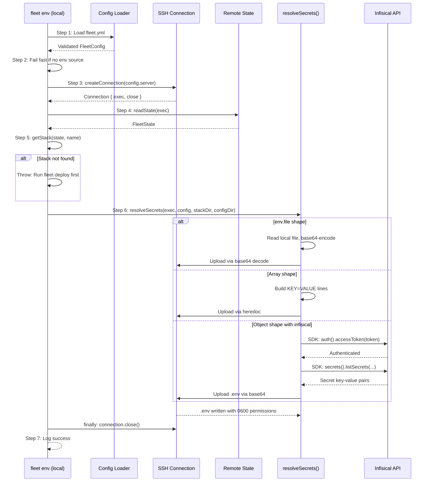

# Environment and Secrets Management

## What This Is

The environment and secrets management system handles the resolution, transport,
and storage of application secrets (`.env` files) across Fleet deployments. It
spans three core source files:

- `src/env/env.ts` -- the `fleet env` CLI command that orchestrates standalone
  secret pushes
- `src/deploy/helpers.ts` -- the `resolveSecrets()` function implementing a
  three-way dispatch over configuration shapes
- `src/state/types.ts` -- the TypeScript interfaces that define the server-side
  state model, including `env_hash` fields used for change detection

## Why It Exists

Deployed services frequently need updated secrets -- rotated database
credentials, new API keys, or refreshed tokens. Rerunning `fleet deploy` for
a secrets-only change is heavyweight: it reclassifies services, may pull images,
and runs health checks. The `fleet env` command provides a targeted path that
only touches the `.env` file, leaving containers and proxy routes untouched.

After running `fleet env`, services must be restarted to pick up the new values.
Use [`fleet restart`](../stack-lifecycle/restart.md) or
[`fleet deploy`](../deploy/deploy-sequence.md) (which detects the env
hash change and issues a `docker compose restart`).

## How It Works

The `pushEnv()` function in `src/env/env.ts:6-65` orchestrates a multi-step
pipeline. Secret resolution itself is handled by `resolveSecrets()` in
`src/deploy/helpers.ts:211-299`, which dispatches to one of three strategies
based on the shape of the `env` field in `fleet.yml`.

### Step-by-step breakdown

| Step | What happens | Source |
|------|-------------|--------|
| 1 | Load and validate `fleet.yml` from the current directory | `src/env/env.ts:13` |
| 2 | Fail fast if no `env` source is configured | `src/env/env.ts:16-20` |
| 3 | Open SSH connection to the remote server | `src/env/env.ts:24` |
| 4 | Read `~/.fleet/state.json` on the remote host | `src/env/env.ts:29` |
| 5 | Look up the stack in state; fail if not deployed | `src/env/env.ts:33-38` |
| 6 | Resolve secrets using the appropriate strategy and write `.env` | `src/env/env.ts:44` |
| 7 | Log success and remind operator to restart services | `src/env/env.ts:47-52` |

The SSH connection is always closed in a `finally` block at
`src/env/env.ts:60-63`, ensuring cleanup even when errors occur.

### Relationship to `fleet deploy`

Both `fleet env` and `fleet deploy` call the same `resolveSecrets()` function
from `src/deploy/helpers.ts:211-299`. The key difference is that `fleet deploy`
also reclassifies services, pulls images, starts containers, registers routes,
and persists state -- while `fleet env` only writes the `.env` file.

When `fleet deploy` detects that only the env hash has changed (and no
definition or image changes occurred), it issues a `docker compose restart`
rather than a full `docker compose up -d`. This restart re-reads the `.env`
file without recreating containers.

## The Three Secret Resolution Strategies

The `env` field in [`fleet.yml`](../configuration/overview.md) accepts three
mutually exclusive shapes. See
[Environment Configuration Shapes](./env-configuration-shapes.md) for complete
details with examples.

| Shape | Config pattern | Upload method | Use case |
|-------|---------------|---------------|----------|
| File reference | `env: { file: ".env.prod" }` | Base64 over SSH | CI/CD pipelines with pre-built `.env` files |
| Inline entries | `env: [{ key: "X", value: "Y" }]` | Heredoc over SSH | Simple, non-sensitive configuration |
| Object with Infisical | `env: { infisical: {...} }` | SDK fetch + base64 upload | Centralized secrets management |

### Infisical uses the Node.js SDK, not the CLI

Fleet fetches Infisical secrets using the
[`@infisical/sdk` Node.js package](https://infisical.com/docs/sdks/languages/node)
running locally within the Fleet process. It does **not** install or invoke the
Infisical CLI on the remote server. The SDK call at
`src/deploy/helpers.ts:282-289` authenticates with a pre-obtained access token,
fetches secrets via the Infisical API, then formats and uploads the resulting
`.env` file to the remote server. See
[Infisical Integration](./infisical-integration.md) for full details.

## Security Model

### File permissions

All `.env` files are written with `0600` permissions (owner read/write only),
regardless of which strategy is used. This prevents other users on the server
from reading the secrets. See [Security Model](./security-model.md) for a
detailed analysis.

### Path traversal protection

When using `env.file`, the resolved path is checked to ensure it stays within
the project directory (`src/deploy/helpers.ts:229-232`). Paths like
`../../etc/passwd` are rejected with a clear error message.

### Infisical token handling

The Infisical access token is consumed by the Node.js SDK within the local
Fleet process. It is never transmitted to the remote server or visible in
remote process lists. See
[Infisical Integration](./infisical-integration.md#token-security) for a
detailed security analysis.

## State and Change Detection

The `env_hash` field in both `StackState` and `ServiceState`
(`src/state/types.ts:16,26`) tracks whether secrets have changed between
deployments. See [State and Change Detection](./state-data-model.md) for
details on how the hash is computed and used.

## Files in This Group

| File | Purpose |
|------|---------|
| `src/env/env.ts` | `pushEnv()` -- CLI-facing orchestration for `fleet env` |
| `src/deploy/helpers.ts` | `resolveSecrets()` -- three-way dispatch over env configuration shapes |
| `src/state/types.ts` | `FleetState`, `StackState`, `ServiceState`, `RouteState` interfaces |

## Related documentation

- [Environment Configuration Shapes](./env-configuration-shapes.md) -- the
  three `env` field formats with examples and validation rules
- [Infisical Integration](./infisical-integration.md) -- SDK authentication,
  token management, and operational guidance
- [State and Change Detection](./state-data-model.md) -- how `env_hash` drives
  the classification decision tree
- [Security Model](./security-model.md) -- file permissions, path traversal,
  and Docker container access
- [Troubleshooting](./troubleshooting.md) -- failure modes, recovery
  procedures, and common issues
- [Configuration Schema Reference](../configuration/schema-reference.md) --
  full field-by-field specification of `fleet.yml`
- [Secrets Resolution (Deploy)](../deploy/secrets-resolution.md) -- how the
  same secrets resolution runs during `fleet deploy`
- [Hash Computation](../deploy/hash-computation.md) -- how environment hashes
  are computed to detect changes
- [Deploy Sequence](../deploy/deploy-sequence.md) -- the 17-step deploy
  pipeline that includes secrets resolution
- [SSH Connection Layer](../ssh-connection/overview.md) -- how remote commands
  are executed
- [CI/CD Integration](../ci-cd-integration.md) -- how to use `fleet env` and
  secrets management in CI/CD pipelines
- [Configuration Integrations](../configuration/integrations.md) -- Zod, YAML
  parser, and config loader integration details
- [Environment Variables and Secrets](../configuration/environment-variables.md) --
  the three env modes and `$VAR` expansion mechanism
- [State Management Overview](../state-management/overview.md) -- how `fleet env`
  reads the stack directory path from server state
