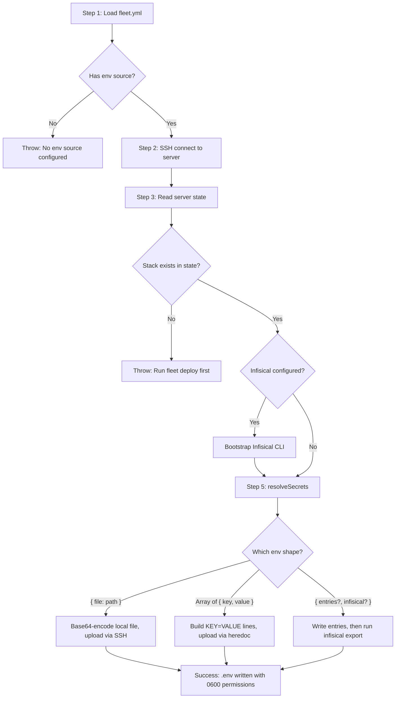

# Environment and Secrets Management

## What This Is

The `fleet env` command pushes or refreshes application secrets (`.env` files)
to a remote server for a deployed stack. It is the standalone equivalent of the
secrets-resolution step that also runs during `fleet deploy`, allowing operators
to update environment variables without triggering a full redeployment.

## Why It Exists

Deployed services frequently need updated secrets -- rotated database
credentials, new API keys, or refreshed tokens. Rerunning `fleet deploy` for
a secrets-only change is heavyweight: it reclassifies services, may pull images,
and runs health checks. The `fleet env` command provides a targeted path that
only touches the `.env` file, leaving containers and proxy routes untouched.

After running `fleet env`, services must be restarted to pick up the new values.
Use [`fleet restart <stack> <service>`](../stack-lifecycle/restart.md) or
[`fleet deploy`](../deploy/deploy-sequence.md) (which detects the env
hash change and issues a `docker compose restart`).

## How It Works

The `pushEnv()` function in `src/env/env.ts:8-72` orchestrates a multi-step
workflow:

### Step-by-step breakdown

| Step | What happens | Source |
|------|-------------|--------|
| 1 | Load and validate `fleet.yml` from the current directory | `src/env/env.ts:13-15` |
| 2 | Fail fast if no `env` source is configured | `src/env/env.ts:17-22` |
| 3 | Open SSH connection to the remote server | `src/env/env.ts:25-27` |
| 4 | Read `~/.fleet/state.json` on the remote host | `src/env/env.ts:30-31` |
| 5 | Look up the stack in state; fail if not deployed | `src/env/env.ts:34-40` |
| 6 | If Infisical is configured, bootstrap the CLI on the remote server | `src/env/env.ts:44-48` |
| 7 | Resolve secrets using the appropriate strategy and write `.env` | `src/env/env.ts:51-52` |

### Relationship to `fleet deploy`

Both `fleet env` and `fleet deploy` call the same `resolveSecrets()` function
from `src/deploy/helpers.ts:198-287`. The deploy pipeline calls it at Step 9
(`src/deploy/deploy.ts:150`), and both guard the Infisical bootstrap with the
same conditional check. The key difference is that `fleet deploy` also
reclassifies services, pulls images, starts containers, registers routes, and
persists state -- while `fleet env` only writes the `.env` file.

When `fleet deploy` detects that only the env hash has changed (and no
definition or image changes occurred), it issues a `docker compose restart`
rather than a full `docker compose up -d`. This restart re-reads the `.env`
file without recreating containers.

## Files in This Group

| File | Purpose |
|------|---------|
| `src/commands/env.ts` | CLI command registration via Commander.js |
| `src/env/env.ts` | Core `pushEnv()` orchestration function |
| `src/env/index.ts` | Barrel re-export |
| `src/deploy/infisical.ts` | Infisical CLI bootstrap (shared with deploy pipeline) |

## The Three Environment Configuration Shapes

The `env` field in [`fleet.yml`](../configuration/overview.md) accepts three mutually exclusive shapes. See
[Environment Configuration Shapes](./env-configuration-shapes.md) for complete
details with examples.

| Shape | Config pattern | Upload method | Use case |
|-------|---------------|---------------|----------|
| File reference | `env: { file: ".env.prod" }` | Base64 over SSH | CI/CD pipelines with pre-built `.env` files |
| Inline entries | `env: [{ key: "X", value: "Y" }]` | Heredoc over SSH | Simple, non-sensitive configuration |
| Object with Infisical | `env: { infisical: {...} }` | Remote CLI export | Centralized secrets management |

## Security Model

### File permissions

All `.env` files are written with `0600` permissions (owner read/write only),
regardless of which strategy is used. This prevents other users on the server
from reading the secrets.

### Path traversal protection

When using `env.file`, the resolved path is checked to ensure it stays within
the project directory (`src/deploy/helpers.ts:216-219`). Paths like
`../../etc/passwd` are rejected with a clear error message.

### Token exposure

The Infisical token is passed as an environment variable prefix in the shell
command rather than as a CLI flag, to avoid exposure in `ps aux` output. See
[Infisical Integration](./infisical-integration.md#token-security) for a
detailed security analysis.

## Related Documentation

- [Environment Configuration Shapes](./env-configuration-shapes.md) -- the
  three `env` field formats with examples and validation rules
- [Infisical Integration](./infisical-integration.md) -- CLI bootstrap,
  authentication, token management, and network requirements
- [Troubleshooting](./troubleshooting.md) -- failure modes, recovery
  procedures, and common issues
- [Configuration Schema Reference](../configuration/schema-reference.md) --
  full field-by-field specification of `fleet.yml`
- [Secrets Resolution (Deploy)](../deploy/secrets-resolution.md) -- how the
  same secrets resolution runs during `fleet deploy`
- [Hash Computation](../deploy/hash-computation.md) -- how environment hashes
  are computed to detect changes
- [Infisical Integration](./infisical-integration.md) --
  detailed bootstrap flow shared with this module
- [Deploy Sequence](../deploy/deploy-sequence.md) -- the 17-step deploy
  pipeline that includes secrets resolution at Step 9
- [SSH Connection Layer](../ssh-connection/overview.md) -- how remote commands
  are executed
- [CI/CD Integration](../ci-cd-integration.md) -- how to use `fleet env` and
  secrets management in CI/CD pipelines
