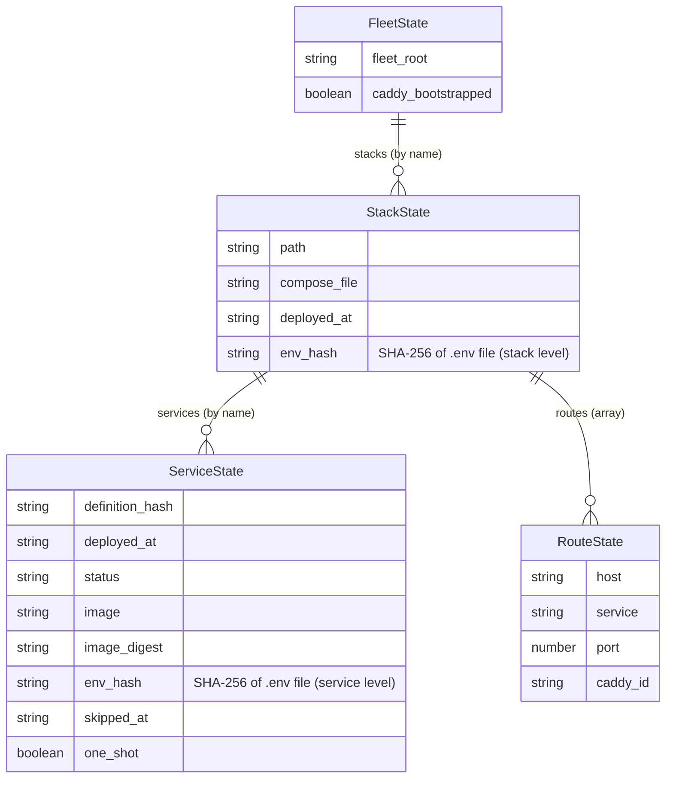

# State and Change Detection

## What This Covers

This page documents Fleet's server-side state data model and how the `env_hash`
field drives the service classification decision tree during `fleet deploy`. It
covers:

- The `FleetState` -> `StackState` -> `ServiceState` / `RouteState` hierarchy
- How `env_hash` exists at **two levels** (stack and service) and why
- How `computeEnvHash()` produces the hash on the remote server
- How `classifyServices()` uses the hash to decide between deploy, restart,
  and skip
- State storage mechanics, backward compatibility, and operational concerns

For the broader state management system (read/write operations, schema
evolution, cross-module dependencies), see the
[State Management Overview](../state-management/overview.md).

## Why State Is Tracked

Fleet tracks deployment state so that each `fleet deploy` only acts on services
that actually changed. For a high-level overview of the change detection system
and how the three source files form a feedback loop, see the
[Service Change Detection Overview](../deploy/change-detection-overview.md).
Without state, Fleet would recreate every container on
every deploy -- causing unnecessary downtime, wasted bandwidth, and slower
deployments.

The state file records three categories of information:

1. **Content hashes** -- SHA-256 hashes of service definitions, image digests,
    and environment files. These are the inputs to the classification decision
    tree.
2. **Operational metadata** -- timestamps, container status, and image references
    used for display and diagnostics.
3. **Infrastructure state** -- Caddy bootstrap status, fleet root path, and
    registered proxy routes.

By comparing freshly computed hashes against stored values, Fleet determines
the minimal set of actions needed for each deployment.

## Entity-Relationship Diagram

The state model is hierarchical. `env_hash` appears at **two distinct levels**
-- once on `StackState` (representing the `.env` file as a whole) and once on
`ServiceState` (recorded when a service was last deployed).



The stack-level `env_hash` is the **authoritative reference** used by the
classification decision tree. The service-level `env_hash` records what the
hash was when each individual service was last deployed.

## State Types

The state model is defined in `src/state/types.ts`. The following highlights
only the fields relevant to env_hash and change detection. For the complete
field-by-field specification of all types, see the
[State Schema Reference](../state-management/schema-reference.md).

### FleetState

The top-level container stored in `~/.fleet/state.json`. Contains
`fleet_root`, `caddy_bootstrapped`, and `stacks`. See
[State Schema Reference](../state-management/schema-reference.md#fleetstate)
for all fields.

### StackState (env-relevant fields)

For all StackState fields, see
[State Schema Reference](../state-management/schema-reference.md#stackstate).

| Field | Type | Role in change detection |
|-------|------|--------------------------|
| `env_hash` | `string` (optional) | SHA-256 hash of the `.env` file at deploy time. The **authoritative reference** compared against the freshly computed hash to produce the `envHashChanged` boolean. Absent on stacks deployed before this field was introduced. |
| `services` | `Record<string, ServiceState>` (optional) | Per-service deployment metadata including per-service env hashes. |

### ServiceState (env-relevant fields)

For all ServiceState fields, see
[State Schema Reference](../state-management/schema-reference.md#servicestate).

| Field | Type | Role in change detection |
|-------|------|--------------------------|
| `definition_hash` | `string` | SHA-256 of the 10 runtime-affecting Compose fields. See [Definition Hash](#definition-hash). |
| `env_hash` | `string` (optional) | SHA-256 of the `.env` file when this service was last deployed. A **snapshot** for diagnostics --- not used for classification decisions. |
| `status` | `string` | Deployment outcome (`"deployed"`, `"restarted"`, `"skipped"`). Reflects the classification result. |
| `one_shot` | `boolean` (optional) | Whether this service has a limited restart policy, causing it to always be redeployed. |

### RouteState

RouteState tracks proxy routes (`host`, `service`, `port`, `caddy_id`). See
[State Schema Reference](../state-management/schema-reference.md#routestate)
for details.

## State Storage

### File location

The state file lives at `~/.fleet/state.json` on the remote server. It is
created during the first `fleet deploy` and updated at the end of every
subsequent deploy, stop, or teardown operation.

### Read mechanics

`readState(exec)` at `src/state/state.ts:48` runs `cat ~/.fleet/state.json`
via SSH. Three outcomes are possible:

1. **File missing or empty** -- returns `defaultState()`:
    `{ fleet_root: "", caddy_bootstrapped: false, stacks: {} }`. This makes the
    first deployment on a fresh server work without manual setup.
2. **Valid JSON, valid schema** -- returns the parsed and validated `FleetState`.
3. **Invalid JSON or failed Zod validation** -- throws an error. The state file
    must be manually repaired or removed.

State is read via SSH exec (`cat`), not via SFTP. This keeps the transport
layer consistent with all other remote commands.

### Write mechanics

`writeState(exec, state)` at `src/state/state.ts:74` uses an atomic two-step
pattern:

1. `mkdir -p ~/.fleet` -- ensure the directory exists
2. Write JSON to `~/.fleet/state.json.tmp` via a heredoc
3. `mv state.json.tmp state.json` -- atomic rename

The `mv` (rename) on the same filesystem is atomic per POSIX `rename(2)`,
meaning readers always see either the complete old state or the complete new
state -- never a partially written file.

### Validation

State is validated on every read using [Zod](https://zod.dev) schemas defined
in `src/state/state.ts:5-38`. Zod validation errors are surfaced as a single
joined error message containing all issue descriptions. See the
[State Schema Reference](../state-management/schema-reference.md) for the
complete field-by-field specification.

## env_hash Computation

The `computeEnvHash(exec, envFilePath)` function at `src/deploy/hashes.ts:43`
computes the SHA-256 hash of the `.env` file on the remote server.

**Mechanism:**

1. Runs `sha256sum {path}` on the remote server via SSH exec
2. Parses the hex digest from the output
3. Returns a string in the format `sha256:{hex}` (e.g.,
    `sha256:a1b2c3d4e5f6...`)
4. Returns `null` if the file does not exist or the command fails

**Key characteristics:**

- The hash is computed **remotely** -- Fleet does not download the `.env` file
    to hash it locally. This ensures the hash reflects the actual file on the
    server, not a local copy.
- The `sha256:` prefix distinguishes the hash format and makes stored values
    self-describing.
- A `null` return means no `.env` file is present on the server, which is
    valid for stacks that do not use environment files.

For details on all three hash types, see the
[Hash Computation Pipeline](../deploy/hash-computation.md).

## How env_hash Drives Classification

The `classifyServices()` function at `src/deploy/classify.ts:43` evaluates a
priority-ordered decision tree for each service. The `env_hash` comparison is
Step 5 of six -- meaning it only applies when no higher-priority condition
(one-shot, new service, definition change, image change) was triggered.

### The envHashChanged flag

The `envHashChanged` parameter passed to `classifyServices()` is a **boolean**,
not a hash comparison. It is computed by the deploy pipeline before
classification:

1. The pipeline calls `computeEnvHash()` on the remote `.env` file to get the
    current hash.
2. It compares this value against the stored `StackState.env_hash` from the
    previous deployment.
3. If they differ (or if one is present and the other is not), `envHashChanged`
    is `true`.

This boolean is applied **uniformly** to all services in the stack. When the
`.env` file changes, every service in the stack that has no other changes is
placed in `toRestart`.

### Classification decision tree

The `env_hash` check is Step 5 of the six-step priority-ordered decision tree.
Steps 1--4 (one-shot, new service, definition change, image change) take
priority; only when none of those conditions match does the classifier check
`envHashChanged`. If true, the service is placed in `toRestart`; otherwise it
is placed in `toSkip`.

See the [Classification Decision Tree](../deploy/classification-decision-tree.md)
for the complete flowchart and detailed step-by-step logic.

### Classification output

`classifyServices()` returns a `ServiceClassification` object:

| Field | Type | Description |
|-------|------|-------------|
| `toDeploy` | `string[]` | Services that need `docker compose up -d <service>` |
| `toRestart` | `string[]` | Services that need `docker compose restart <service>` |
| `toSkip` | `string[]` | Services with no changes |
| `reasons` | `Record<string, string>` | Human-readable reason for each service's classification |

### Why restart instead of redeploy for env changes

An environment-only change triggers `docker compose restart` rather than
`docker compose up -d`. A restart re-reads the `.env` file without recreating
the container, which avoids pulling images, rebuilding container networking, and
resetting container state. This is faster and less disruptive.

The decision tree handles this correctly because definition hash comparison
(Step 3) and image digest comparison (Step 4) take priority over the env hash
check (Step 5). If the service definition also changed, it will be redeployed
rather than restarted.

### The two levels of env_hash

| Level | Field | Purpose |
|-------|-------|---------|
| Stack | `StackState.env_hash` | The **authoritative reference** compared against the current hash to produce the `envHashChanged` boolean. Updated on every deploy. |
| Service | `ServiceState.env_hash` | A **snapshot** of the env hash at the time each service was last deployed. Used for diagnostics and display, not for classification decisions. |

This two-level design means classification uses a single stack-wide boolean
rather than per-service hash comparisons. When the `.env` file changes, all
services in the stack are affected equally (unless a higher-priority condition
applies).

## Definition Hash

The `computeDefinitionHash(service)` function at `src/deploy/hashes.ts:151`
computes a SHA-256 hash of the runtime-affecting fields in a Docker Compose
service definition.

**Process:**

1. Extract 10 fields from the `ParsedService` object:
    `image`, `command`, `entrypoint`, `environment`, `ports`, `volumes`,
    `labels`, `user`, `working_dir`, `healthcheck`
2. Remove null and empty values (`removeNullAndEmpty`)
3. Sort all object keys recursively (`sortKeysDeep`) to ensure deterministic
    ordering
4. Serialize to JSON (`JSON.stringify`)
5. Compute SHA-256 hash, return as `sha256:{hex}`

Changes to fields outside this list (e.g., `restart`, `networks`, `depends_on`)
do **not** trigger redeployment. This is intentional -- those fields do not
affect the container's runtime behavior in ways that require recreation.

For the complete algorithm and edge cases, see the
[Hash Computation Pipeline](../deploy/hash-computation.md).

## Backward Compatibility

Fleet uses optional Zod fields and a default state factory to maintain backward
compatibility across versions.

### Optional fields

The Zod schema in `src/state/state.ts:12-23` marks several `ServiceState`
fields as `.optional()`: `image`, `image_digest`, `env_hash`, `skipped_at`,
and `one_shot`. The `StackState` fields `env_hash` and `services` are also
optional. State files created by older Fleet versions that lack these fields
pass Zod validation without error.

### Default state for missing files

When `readState()` encounters a missing or empty state file, it returns
`defaultState()`: `{ fleet_root: "", caddy_bootstrapped: false, stacks: {} }`.
This allows the first deployment on a fresh server to proceed without manual
state file creation.

### No migration mechanism

Fleet does not include a state migration system. When new fields are added,
they are made optional in the Zod schema and populated on the next deployment.
This forward-compatible approach works well for additive changes but means that
**removing or renaming fields would require manual migration** of existing
state files.

### Unknown field stripping

Zod's `z.object()` uses a **strip** strategy by default. If a state file
contains fields added by a newer Fleet version, an older Fleet CLI will
silently drop those fields at read time and permanently remove them on the next
`writeState()` call. See the
[State Management Overview](../state-management/overview.md) for mitigation
recommendations.

## Backup and Recovery

### No built-in backup

Fleet does not include an automatic backup mechanism for the state file.

### Consequences of state loss

If `~/.fleet/state.json` is deleted or corrupted beyond JSON repair:

- `readState()` returns `defaultState()` (empty stacks map)
- All services are classified as **"new service"** on the next deploy
- Fleet performs a **full redeploy** of every service in every stack
- Proxy routes are re-registered with Caddy (existing routes may be duplicated
    if Caddy was not also reset)

A full redeploy is functionally correct but causes unnecessary container
restarts and brief downtime for services that were already running.

### Manual backup recommendations

Back up the state file before risky operations (Fleet upgrades, server
migrations, manual state edits):

```bash
# Create a timestamped backup
ssh user@server "cp ~/.fleet/state.json ~/.fleet/state.json.bak.$(date +%s)"

# Download a local copy
scp user@server:~/.fleet/state.json ./state-backup.json
```

To restore from a backup:

```bash
scp ./state-backup.json user@server:~/.fleet/state.json
```

### Partial recovery

If you have lost the state file but know which stacks are deployed, running
`fleet deploy` for each stack will rebuild the state. The first deploy after
state loss will classify all services as new, but subsequent deploys will
behave normally because the state was written during the recovery deploy.

## Concurrent Access Risks

### No file locking

Fleet does not implement file-level locking for `~/.fleet/state.json`. The
read-then-modify-then-write pattern in `readState()`/`writeState()` is not
atomic as a unit.

### Race condition

If two Fleet processes target the same server simultaneously:

1. Process A reads state (version N)
2. Process B reads state (version N)
3. Process A writes state (version N+1)
4. Process B writes state (version N+1'), overwriting A's changes

The result is that Process A's state changes (deployed services, updated
hashes, registered routes) are silently lost. On the next deploy, Fleet may
misclassify services because the stored hashes do not reflect the actual
running state.

### Recommendations

- **CI/CD pipelines**: Use concurrency groups or job-level mutex locks to
    ensure only one deployment targets a given server at any time.
- **Manual deployments**: Coordinate with team members to avoid simultaneous
    deploys to the same server.
- **Multiple stacks**: Concurrent deploys to *different* servers are safe.
    Concurrent deploys of *different stacks* to the *same* server are **not
    safe** because they both read and write the same `state.json` file.

## Related documentation

### Environment and secrets

- [Environment and Secrets Overview](./overview.md) -- the complete `fleet env`
  workflow and how it interacts with state
- [Environment Configuration Shapes](./env-configuration-shapes.md) -- the
  three `env` field formats that produce `.env` files
- [Infisical Integration](./infisical-integration.md) -- SDK-based secret
  fetching
- [Troubleshooting](./troubleshooting.md) -- failure modes and recovery for
  env-related operations
- [Security Model](./security-model.md) -- file permissions, path traversal,
  and transport security

### Deploy and classification

- [Classification Decision Tree](../deploy/classification-decision-tree.md) --
  the six-step algorithm in full detail
- [Hash Computation Pipeline](../deploy/hash-computation.md) -- how all three
  hash types are computed
- [Deploy Sequence](../deploy/deploy-sequence.md) -- the deploy pipeline that
  reads, classifies, deploys, and writes state

- [State Operations Guide](../state-management/operations-guide.md) -- how to
  inspect, back up, and recover state
- [State Lifecycle](../state-management/state-lifecycle.md) -- how state flows
  through the deploy pipeline
- [Atomic File Uploads](../deploy/file-upload.md) -- the upload mechanisms
  that write `.env` files whose hashes are tracked
- [Change Detection Overview](../deploy/change-detection-overview.md) -- the
  broader change detection system that uses env_hash

### State management

- [State Management Overview](../state-management/overview.md) -- read/write
  operations, concurrency, and cross-module dependencies
- [State Schema Reference](../state-management/schema-reference.md) --
  field-by-field documentation of all state types
