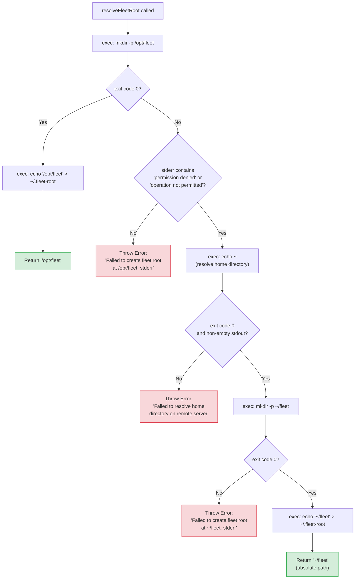
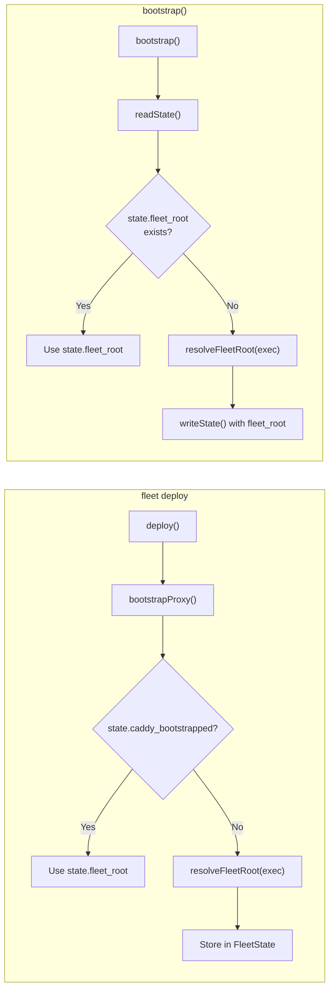
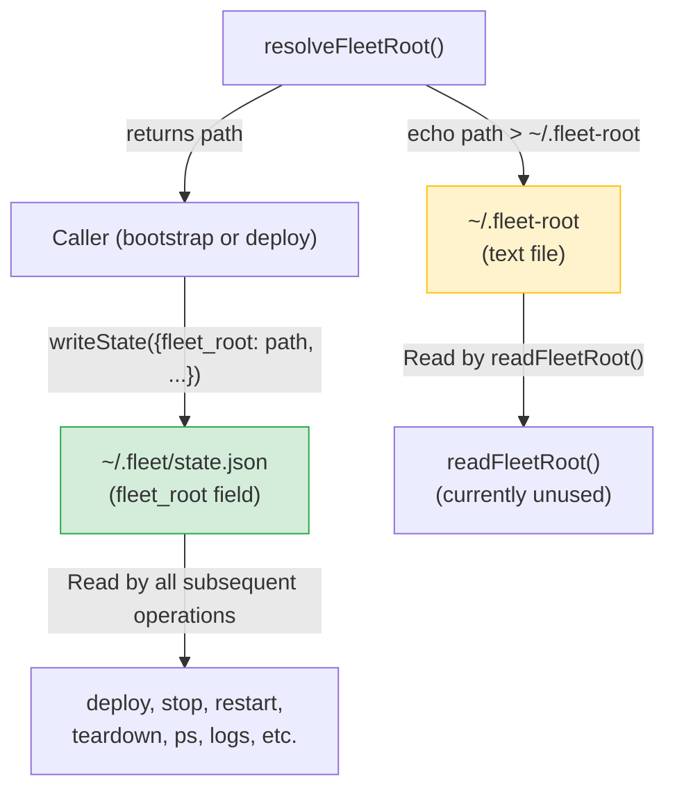

# Fleet Root Resolution Flow

This page documents the step-by-step resolution logic in `resolveFleetRoot`
(`src/fleet-root/resolve.ts:11-43`) and its relationship to the broader
bootstrap and deploy pipelines.

## Resolution decision flowchart

## How resolution fits into bootstrap and deploy

The fleet root is resolved during two distinct code paths, both of which
ultimately call `resolveFleetRoot`:

### Path 1: Deploy pipeline (`src/deploy/helpers.ts:90-134`)

During `fleet deploy`, the `bootstrapProxy` helper checks
`state.caddy_bootstrapped`. If `false`, it calls `resolveFleetRoot(exec)` and
returns the resolved path along with updated state. The deploy pipeline then
uses this path to construct `<fleet-root>/stacks/<stack-name>/` for the stack
directory.

### Path 2: Standalone bootstrap (`src/bootstrap/bootstrap.ts:18-108`)

The standalone `bootstrap()` function reads state and checks whether
`state.fleet_root` is already set. If not, it calls `resolveFleetRoot(exec)`.
This path includes a retry loop for the Caddy health check that the deploy
helper omits.

## Dual-persistence flow

After resolution, the fleet root path is persisted in two locations:

The `FleetState.fleet_root` field in `state.json` is the authoritative source
for all normal operations. The `~/.fleet-root` file is a secondary persistence
mechanism that exists as a potential recovery path.

## Shell commands executed

The resolution function executes the following shell commands via `ExecFn`:

| Step | Command                              | Purpose                           | Failure handling                   |
|------|--------------------------------------|-----------------------------------|------------------------------------|
| 1    | `mkdir -p /opt/fleet`                | Create primary root directory     | Check stderr for permission error  |
| 2a   | `echo '/opt/fleet' > ~/.fleet-root`  | Persist path (primary success)    | Not checked                        |
| 2b   | `echo ~`                             | Resolve home directory path       | Throw if non-zero or empty         |
| 3    | `mkdir -p ~/fleet`                   | Create fallback root directory    | Throw on any failure               |
| 4    | `echo '~/fleet' > ~/.fleet-root`     | Persist path (fallback success)   | Not checked                        |

Note: in step 4, the actual command uses the resolved absolute path (e.g.,
`/home/deploy/fleet`), not the literal `~/fleet` string.

## Error classification

The `isPermissionError` function (`src/fleet-root/resolve.ts:6-9`) performs
case-insensitive matching against the `stderr` output:

- `"permission denied"` — standard POSIX error for insufficient filesystem
  permissions
- `"operation not permitted"` — POSIX `EPERM` error, which can occur with
  security modules (SELinux, AppArmor) or certain mount options

Any other error content in `stderr` causes an immediate throw without attempting
the fallback. This prevents masking genuine filesystem errors (disk full,
corruption, missing mount points) behind the fallback mechanism.

## Related documentation

- [Fleet Root Overview](./overview.md) — module purpose and architecture
- [Directory Layout](./directory-layout.md) — full directory tree reference
- [Troubleshooting](./troubleshooting.md) — diagnosing and fixing resolution
  issues
- [Server Bootstrap](../bootstrap/server-bootstrap.md) — the full bootstrap
  sequence that calls `resolveFleetRoot`
- [Bootstrap Troubleshooting](../bootstrap/bootstrap-troubleshooting.md) —
  common bootstrap failure modes including directory creation failures
- [Deployment Pipeline](../deployment-pipeline.md) — how the deploy command
  uses the resolved root
- [Deploy Sequence](../deploy/deploy-sequence.md) — Step 5 triggers fleet root
  resolution during proxy bootstrap
- [SSH Connection Overview](../ssh-connection/overview.md) — how `ExecFn`
  executes commands on the remote host
- [State Management Overview](../state-management/overview.md) — how
  `fleet_root` is persisted in `state.json`
- [State Schema Reference](../state-management/schema-reference.md) — the
  `fleet_root` field definition in the state schema
- [Bootstrap Integrations](../bootstrap/bootstrap-integrations.md) — how the
  fleet root directory is used during bootstrap
