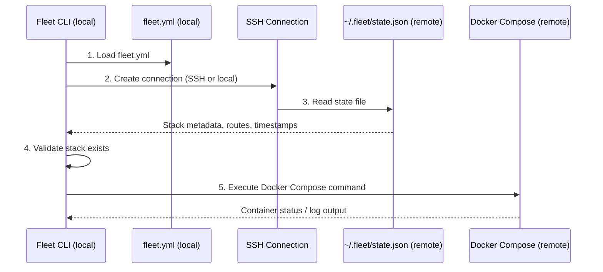

# Process and Service Status

Fleet provides two read-only commands for inspecting running deployments:
**`fleet logs`** for real-time log streaming and **`fleet ps`** for listing
container status, routes, and deployment timestamps. Neither command modifies
server state or container configuration.

## Why these commands exist

After deploying a stack with [`fleet deploy`](../deploy/deploy-sequence.md), operators need to answer two
questions without SSH-ing into the server manually:

1. **What is running?** Which containers are up, which routes are registered,
   and when was each service last deployed?
2. **What are the services saying?** What log output are the containers
   producing right now?

`fleet ps` answers the first question; `fleet logs` answers the second.

## How they work

Both commands follow an identical five-step pipeline executed from the local
machine against a remote (or local) server:

| Step | What happens | Failure behavior |
|------|-------------|------------------|
| Load config | Reads `fleet.yml` from the current working directory | Exits with error if file is missing or invalid |
| SSH connect | Opens connection using `server` config from `fleet.yml` | Exits with error; no retry logic |
| Read state | Runs `cat ~/.fleet/state.json` on the remote host | Returns empty default state if file is missing |
| Validate stack | Checks that the requested stack name exists in state | Exits with error listing available stacks |
| Docker command | Runs `docker compose -p <name> ps` or `logs` remotely | `ps`: falls back to route-based service list; `logs`: stream ends |

## Command comparison

| Aspect | `fleet logs` | `fleet ps` |
|--------|-------------|-----------|
| Stack name | **Required** | Optional (shows all stacks if omitted) |
| Service filter | Optional (filter to one service) | Not supported |
| Output mode | Real-time streaming to stdout/stderr | Formatted table printed once |
| Docker command | `docker compose -p <name> logs -f` | `docker compose -p <name> ps --format json` |
| State mutation | None | None |
| SIGINT handling | Graceful SSH connection close | Standard process termination |

## Source files

| File | Purpose |
|------|---------|
| `src/logs/logs.ts` | Log streaming implementation |
| `src/logs/index.ts` | Barrel export |
| `src/ps/ps.ts` | Container status query, JSON parsing, table formatting |
| `src/ps/types.ts` | TypeScript interfaces for `ServiceStatus` and `StackRow` |
| `src/ps/index.ts` | Barrel export |

## Related documentation

- [Logs command reference](./logs-command.md)
- [Ps command reference](./ps-command.md)
- [Docker Compose integration](./docker-compose-integration.md)
- [State version compatibility](./state-version-compatibility.md)
- [Troubleshooting](./troubleshooting.md)
- [SSH connection layer](../ssh-connection/overview.md)
- [Server state management](../state-management/overview.md)
- [State schema reference](../state-management/schema-reference.md) -- the
  per-service and route fields displayed by `fleet ps`
- [Fleet configuration](../configuration/overview.md)
- [Operational CLI commands](../cli-commands/operational-commands.md)
- [CLI Integrations](../cli-commands/integrations.md) -- how operational
  commands interact with Docker Compose and SSH
- [Deploy Sequence](../deploy/deploy-sequence.md) -- the pipeline that creates
  the deployments these commands inspect
- [Stack Lifecycle Overview](../stack-lifecycle/overview.md) -- stop, restart,
  and teardown operations
