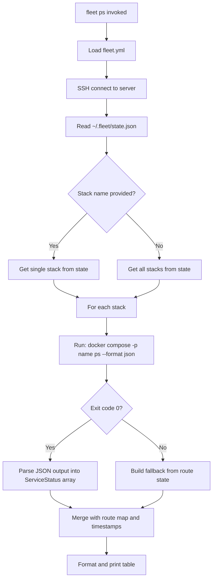

# Ps Command

The `fleet ps` command displays the status of deployed containers, their
registered routes, and deployment timestamps. It merges live Docker container
state with Fleet's persisted [deployment metadata](../state-management/schema-reference.md) to produce a unified view.

## Usage

```
fleet ps [stack]
```

| Argument | Required | Description |
|----------|----------|-------------|
| `[stack]` | No | Filter to a specific stack. If omitted, all deployed stacks are shown. |

### Why is the stack name optional?

Unlike `fleet logs` (which streams data and requires a single target),
`fleet ps` produces a static snapshot. Listing all stacks in a single table
gives operators a complete view of server state. When a stack name is provided,
only that stack's services appear. If the specified stack does not exist in
state, the command prints an error listing all available stack names.

## Output format

The command prints an aligned table with five columns:

```
STACK      SERVICE    STATUS    ROUTES                         DEPLOYED AT
my-app     web        running   app.example.com -> web:3000    5 minutes ago
           worker     running                                  5 minutes ago
           redis      running                                  5 minutes ago  (skipped 2 minutes ago)
other-app  api        running   api.example.com -> api:8080    1 hour ago
```

| Column | Source | Description |
|--------|--------|-------------|
| STACK | Fleet state | Stack name, shown only on the first row per stack |
| SERVICE | Docker Compose | Service name from running containers |
| STATUS | Docker Compose | Container state (e.g., `running`, `exited`, `unknown`) |
| ROUTES | Fleet state | Domain-to-service mappings from `RouteState` |
| DEPLOYED AT | Fleet state | Human-readable relative timestamp |

### Skipped services

When a service was skipped during the most recent deployment (its definition
and environment hashes were unchanged), `fleet ps` shows both timestamps:

```
5 minutes ago  (skipped 2 minutes ago)
```

This means the service was last actually deployed 5 minutes ago, and it was
evaluated but intentionally skipped 2 minutes ago. The skip indicator only
appears when `skipped_at` is more recent than `deployed_at` for that service.

### Timestamp resolution logic

Per-service timestamps are resolved using the following priority:

- If `stackState.services[serviceName]` exists (V1.2+ state format):
    - Show `deployed_at` as a relative time (e.g., "2 hours ago")
    - If `skipped_at` is more recent than `deployed_at`, also show
      "(skipped 30 minutes ago)"
- Else if `stackState.services` is undefined and `stackState.deployed_at`
  exists (pre-V1.2 state format):
    - Show the stack-level `deployed_at` only on the first row
    - Leave subsequent rows blank
- Otherwise, show `"-"`

## Data assembly flow

The `ps` command merges data from three sources to build each table row.
Container status is always queried live from Docker -- it is never read from
cached state. This ensures `fleet ps` reflects the actual state of running
containers, even after operations like [`fleet stop`](../stack-lifecycle/stop.md) or
[`fleet restart`](../cli-commands/operational-commands.md).



### Fallback behavior when Docker Compose fails

If `docker compose ps --format json` returns a non-zero exit code for a stack
(e.g., the Docker daemon is down, or all containers were removed externally),
the command does not fail. Instead, it falls back to a route-based service
list:

1. It extracts unique service names from `stackState.routes`.
2. Each service gets a status of `"unknown"`.
3. If no routes exist either, a single `(unknown)` entry is shown.

This graceful degradation means the user always sees something, but the
`"unknown"` status signals that the live container state could not be queried.

## JSON parsing: `parseDockerComposePs`

The function at `src/ps/ps.ts:16-41` parses the output of
`docker compose ps --format json`. It handles the output by splitting on
newlines and parsing each line as a separate JSON object.

For each parsed JSON object, the function extracts:

- `Service` field (preferred) or `Name` field as fallback, defaulting to
  `"unknown"`
- `State` field, defaulting to `"unknown"`

Lines that are not valid JSON are silently skipped. This resilience handles
Docker Compose versions that may emit warnings or informational messages to
stdout alongside the JSON output.

The results are sorted alphabetically by service name for consistent display.

## Table formatting: `formatTable`

The `formatTable` function at `src/ps/ps.ts:48-71` produces a
column-aligned table using dynamic column widths. Each column is padded to
the maximum width of its header or any data value, with two-space separators
between columns. No borders or decorations are used.

## Type definitions

Defined in `src/ps/types.ts`:

- **`ServiceStatus`**: A service name and its Docker container state.
    Produced by parsing Docker Compose JSON output.
- **`StackRow`**: A fully assembled table row containing stack name, service
    name, status, formatted route string, and deployment timestamp.

## Timestamp display

Timestamps are converted from ISO 8601 strings to human-readable relative
times using `formatRelativeTime` from `src/deploy/helpers.ts`:

| Time difference | Display |
|----------------|---------|
| < 60 seconds | `just now` |
| 1 minute | `1 minute ago` |
| N minutes | `N minutes ago` |
| 1 hour | `1 hour ago` |
| N hours | `N hours ago` |
| 1 day | `1 day ago` |
| N days | `N days ago` |
| Future timestamp | `in the future` |
| Unparseable | `unknown` |

## State format backward compatibility

The `services` field on `StackState` is optional (see `src/state/types.ts:27`).
This was introduced in V1.2 to support per-service deployment tracking.

When `ps` encounters a state entry without the `services` field:

- It cannot determine per-service deployment times
- It falls back to the stack-level `deployed_at` field
- The stack-level timestamp is displayed only on the first service row
- Subsequent service rows show an empty deployed-at column

This means older servers that have not been redeployed since the V1.2 state
migration will still display correctly, albeit with less granular timestamp
information. See [State Version Compatibility](./state-version-compatibility.md)
for full details on state format evolution.

## Docker Compose project name consistency

The `ps` command uses the stack name as the Docker Compose project name
(`docker compose -p <name>`). This must match the project name used during
`fleet deploy`. Fleet enforces this by always using `config.stack.name` from
`fleet.yml` as the project name. The stack name regex
(`/^[a-z\d][a-z\d-]*$/`) ensures the name is a valid Docker Compose project
identifier.

## Related documentation

- [Overview](./overview.md)
- [Logs command reference](./logs-command.md)
- [Docker Compose integration](./docker-compose-integration.md)
- [State version compatibility](./state-version-compatibility.md)
- [Troubleshooting](./troubleshooting.md)
- [State management schema](../state-management/schema-reference.md) -- the
  `StackState` and `ServiceState` fields used for timestamps and routes
- [Operational CLI Commands](../cli-commands/operational-commands.md) -- `fleet ps`
  in the context of all operational commands
- [Deploy helpers](../deploy/deploy-sequence.md)
- [Configuration Schema Reference](../configuration/schema-reference.md) --
  stack name constraints and route schema
- [Service Classification](../deploy/service-classification-and-hashing.md) --
  how services are classified into deploy/restart/skip buckets, affecting the
  `skipped_at` timestamp shown by `fleet ps`
- [Stack Lifecycle: Stop](../stack-lifecycle/stop.md) -- how `fleet stop`
  affects the container status shown by `fleet ps`
- [CLI Entry Point](../cli-entry-point/overview.md) -- broader context for
  all CLI commands including `fleet ps`
