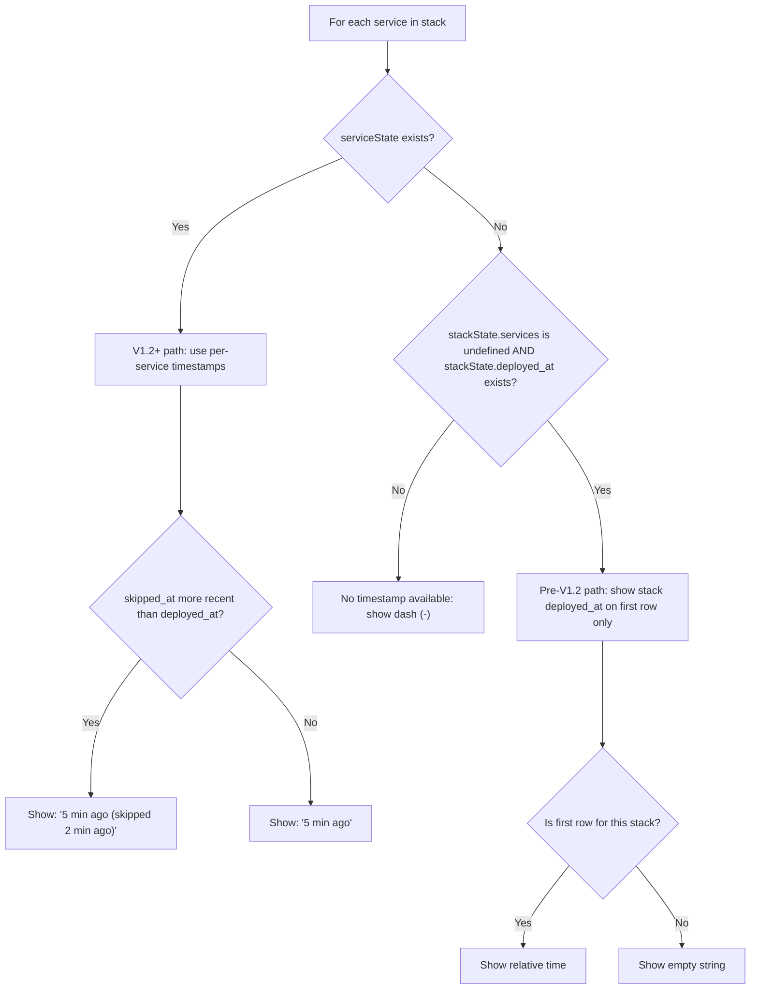

# State Version Compatibility

The `fleet ps` command includes backward-compatibility logic for displaying
deployment timestamps across different versions of Fleet's server-side state
schema. This page documents the state shape variations and how `ps` handles
each.

## State schema evolution

Fleet's server state file (`~/.fleet/state.json`) has evolved across versions.
For the complete schema reference, see
[State Schema Reference](../state-management/schema-reference.md). The key
difference relevant to `fleet ps` is how deployment timestamps are stored.

### Pre-V1.2 state format

In early versions, deployment timestamps were stored at the **stack level**
only:

```json
{
  "stacks": {
    "my-app": {
      "path": "/opt/fleet/stacks/my-app",
      "compose_file": "docker-compose.yml",
      "deployed_at": "2025-01-15T10:30:00.000Z",
      "routes": [...],
      "env_hash": "abc123"
    }
  }
}
```

The `services` field did not exist. There was a single `deployed_at` timestamp
for the entire stack, with no per-service granularity.

### V1.2+ state format

Newer versions add a `services` map with per-service deployment metadata:

```json
{
  "stacks": {
    "my-app": {
      "path": "/opt/fleet/stacks/my-app",
      "compose_file": "docker-compose.yml",
      "deployed_at": "2025-01-15T10:30:00.000Z",
      "routes": [...],
      "env_hash": "abc123",
      "services": {
        "web": {
          "image": "nginx:latest",
          "definition_hash": "sha256:...",
          "image_digest": "sha256:...",
          "env_hash": "sha256:...",
          "deployed_at": "2025-01-15T10:30:00.000Z",
          "skipped_at": null,
          "one_shot": false,
          "status": "deployed"
        },
        "worker": {
          "image": "myapp:latest",
          "definition_hash": "sha256:...",
          "image_digest": "sha256:...",
          "env_hash": "sha256:...",
          "deployed_at": "2025-01-15T10:30:00.000Z",
          "skipped_at": "2025-01-16T08:00:00.000Z",
          "one_shot": false,
          "status": "skipped"
        }
      }
    }
  }
}
```

## How `fleet ps` resolves timestamps

The timestamp resolution logic at `src/ps/ps.ts:150-172` implements a
three-way branching strategy:



### Branch 1: V1.2+ per-service timestamps

When `stackState.services?.[serviceName]` exists (the `services` map is
present and has an entry for this service), the `ps` command uses:

- `serviceState.deployed_at` — when the service was last actually deployed
  or restarted.
- `serviceState.skipped_at` — when the service was last evaluated but
  skipped because its hashes hadn't changed.

If `skipped_at` is more recent than `deployed_at`, both are shown:

```
5 minutes ago  (skipped 2 minutes ago)
```

This tells the operator: "The running containers were deployed 5 minutes ago,
but the most recent deploy run (2 minutes ago) determined no changes were
needed."

### Branch 2: Pre-V1.2 stack-level timestamp

When `stackState.services` is `undefined` (the field does not exist at all,
indicating a pre-V1.2 state file) **and** `stackState.deployed_at` has a
value, the stack-level timestamp is shown on the **first row only** for that
stack. Subsequent service rows show an empty string.

This avoids repeating the same timestamp for every service and accurately
reflects that pre-V1.2 state only tracked a single deployment event per stack.

### Branch 3: No timestamp available

If neither per-service nor stack-level timestamps are available, a dash (`-`)
is shown. This can occur if:

- The state file was manually edited to remove timestamps.
- A corrupted or partially-migrated state file is present.
- The `services` map exists but does not have an entry for this particular
  service name (e.g., the service was added to the Compose file after
  the last deployment).

## Zod schema and TypeScript interface divergence

The Zod schema in `src/state/state.ts:12-23` marks several `ServiceState`
fields as optional for backward compatibility:

- `image`, `image_digest`, `env_hash`, `skipped_at`, `one_shot` are all
  `.optional()` in the Zod schema.

However, the TypeScript interface in `src/state/types.ts:10-19` declares all
these fields as required (non-optional). This means code that consumes
`ServiceState` from the TypeScript type assumes all fields are present, while
the Zod-validated data from older state files may lack them.

The `ps` command handles this safely by using optional chaining
(`stackState.services?.[svc.service]`) and checking `serviceState.skipped_at`
before comparing dates. However, this divergence between schema and type is
a known maintenance concern that could affect other consumers of `ServiceState`.

## What breaks when the state schema evolves further

Adding new optional fields to the Zod schema is non-breaking — older state
files will validate successfully, and the `ps` command's three-way branching
pattern can be extended with additional checks. However:

1. **Making existing optional fields required** would break backward
   compatibility with existing state files on remote servers.
2. **Renaming fields** would require a migration step or additional fallback
   logic.
3. **Changing the `services` map structure** (e.g., nesting services
   under a different key) would require updating the detection logic at
   `src/ps/ps.ts:166` that checks `!stackState.services`.

There is currently no explicit migration mechanism for state files. The schema
evolves implicitly through optional fields and runtime detection of which
fields are present.

## Related documentation

- [Ps command reference](./ps-command.md)
- [Docker Compose Integration](./docker-compose-integration.md) -- Docker
  Compose version requirements and JSON format
- [Process Status Overview](./overview.md) -- module overview
- [Troubleshooting](./troubleshooting.md) -- diagnosing `ps` output issues
- [State management overview](../state-management/overview.md)
- [State schema reference](../state-management/schema-reference.md)
- [State lifecycle](../state-management/state-lifecycle.md) -- schema evolution
  timeline and state flow across operations
- [Service classification](../deploy/classification-decision-tree.md)
