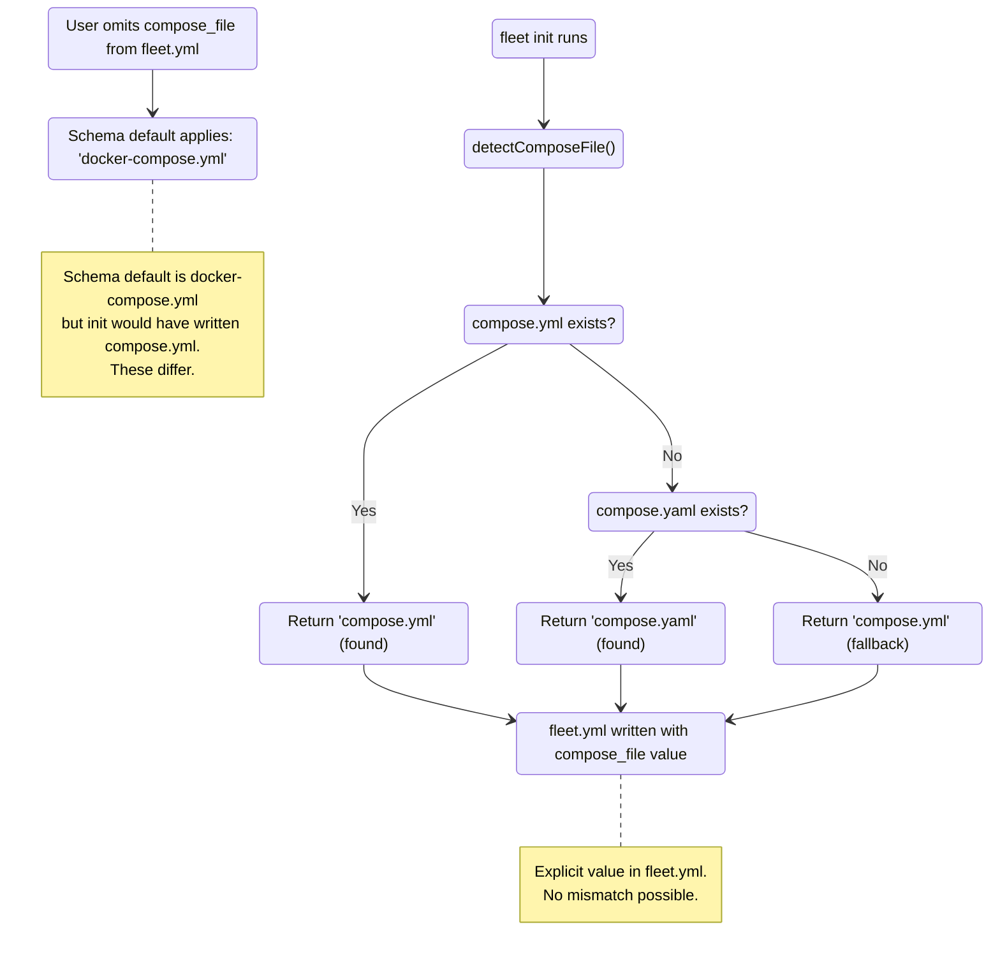

# Compose File Detection

The `detectComposeFile()` function in
[`src/init/utils.ts`](../../src/init/utils.ts) locates the Docker Compose file
in the project directory. It is called during [`fleet init`](../cli-entry-point/init-command.md) to determine which
compose file to reference in the generated `fleet.yml`.

## Detection Algorithm

The function checks for two filenames in a fixed order:

1.  `compose.yml`
2.  `compose.yaml`

If either file exists (checked via `fs.existsSync`), its filename is returned
immediately. If neither exists, the function returns the literal string
`"compose.yml"` as a fallback default.

### What Is Not Checked

The function deliberately does **not** check for:

- `docker-compose.yml` or `docker-compose.yaml` -- the legacy Docker Compose
  filenames
- `docker-compose.override.yml` or other override files
- Environment variable `COMPOSE_FILE`
- Any recursive directory search

This is intentional. Fleet follows the Docker Compose V2 convention where
`compose.yml` is the standard filename. Legacy `docker-compose.yml` files are
supported at the schema level (as the schema default) but are not auto-detected
by the init command.

## Default Mismatch State Diagram

There is a documented discrepancy between the init subsystem and the configuration
schema regarding the default compose filename:

### Mismatch Details

| Source | Default compose filename | Location |
|--------|------------------------|----------|
| `detectComposeFile()` fallback | `compose.yml` | `src/init/utils.ts:40` |
| `stackSchema.compose_file` Zod default | `docker-compose.yml` | `src/config/schema.ts:50` |

### When This Matters

In normal usage through `fleet init`, the mismatch is invisible because the
generated `fleet.yml` always includes an explicit `compose_file` value. The
schema default never applies.

The mismatch surfaces only when a user:

1.  Creates a `fleet.yml` manually (without running `fleet init`)
2.  Omits the `compose_file` field
3.  Expects the default to be `compose.yml` (the modern convention)

In that case, the Zod schema fills in `docker-compose.yml` as the default, which
may not match the actual file on disk.

### Recommendations

- Always specify `compose_file` explicitly in `fleet.yml`
- If using `fleet init`, the correct value is written automatically
- If creating `fleet.yml` manually, check which compose filename your project
  uses and set the field accordingly

## Docker Compose File Naming Conventions

Docker Compose V2 (the `docker compose` CLI plugin) recognizes these filenames in
priority order:

1.  `compose.yaml` (highest priority)
2.  `compose.yml`
3.  `docker-compose.yaml`
4.  `docker-compose.yml`

Fleet's detection order (`compose.yml` before `compose.yaml`) differs from Docker
Compose V2's priority order. This is generally not a problem because projects
rarely have both files, but it is worth noting for edge cases.

## How Compose Files Are Parsed

Once a compose file is detected and confirmed to exist on disk, it is parsed by
`loadComposeFile()` in [`src/compose/parser.ts`](../../src/compose/parser.ts).
The parser reads the file as UTF-8 text, parses YAML using the 1.2 core schema,
extracts the `services` top-level key, and normalizes port mappings into
`NormalizedPort` objects. For full details on port normalization, YAML schema
implications, and edge cases, see [Compose Parser Internals](../compose/parser.md).

## Related documentation

- [Project Initialization Overview](overview.md) -- full init workflow
- [YAML Generation Internals](fleet-yml-generation.md) -- how detected compose
  data feeds into YAML generation
- [Schema Reference](../configuration/schema-reference.md) -- `compose_file`
  field definition and Zod default
- [Utility Functions](utility-functions.md) -- `slugify()` and other init helpers
- [Compose Parser Internals](../compose/parser.md) -- how detected compose
  files are parsed into typed structures
- [Compose Type Definitions](../compose/types.md) -- the data model produced
  by parsing
- [Configuration Overview](../configuration/overview.md) -- how `fleet.yml`
  is structured and loaded
- [Configuration Loading and Validation](../configuration/loading-and-validation.md)
  -- how the generated `fleet.yml` is loaded and validated
- [Validation Overview](../validation/overview.md) -- checks that run against
  the compose file after detection
