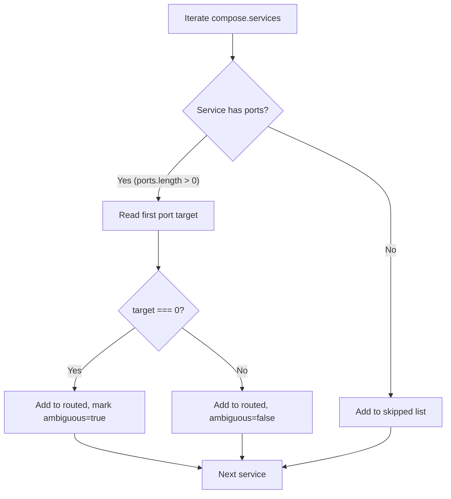

# YAML Generation Internals

The `generateFleetYml()` function in
[`src/init/generator.ts`](../../../src/init/generator.ts) constructs a complete
`fleet.yml` document using the `yaml` npm package's Document API. It produces
human-friendly output with inline TODO comments that guide the user through
required edits.

## Why Use the Document API

The generator does not simply call `yaml.stringify()` on a plain object. It uses
`yaml.Document` and `yaml.createNode()` because the Document API provides
programmatic access to YAML AST nodes, which is the only way to attach comments
to specific keys and values. Plain serialization has no mechanism for comments.

## How Generation Works

### Service Classification Logic

Before building the YAML, the generator classifies each compose service into one
of two categories based on port exposure:



- **Routed services**: Have at least one port mapping. The `target` value from
  the first `NormalizedPort` is used as the route port. If `target` is `0`
  (meaning the port could not be parsed by the
  [compose parser](../compose/parser.md)), the service is still routed but marked
  as ambiguous.

- **Skipped services**: Have no port mappings at all. These are background
  workers, databases, or sidecars that do not need public HTTP routes.

### Port Target of Zero

A `target` value of `0` occurs when the compose parser cannot determine the
container port. This happens in two scenarios:

1.  The long-form port object has a non-numeric or missing `target` field, causing
    `parseInt()` to return `NaN`, which falls through to the `0` default
    (`src/compose/parser.ts:39-44`).

2.  The port entry has a completely unrecognized shape (not a number, string, or
    object), triggering the final fallback at `src/compose/parser.ts:55`.

When the generator encounters `target === 0`, it injects a TODO comment on the
port value in the generated YAML:

```yaml
port: 0 # TODO: Replace with the correct container port
```

### Document Construction

The function builds the YAML in this order:

1.  **Create document and root node** -- A `yaml.Document` is instantiated and
    `doc.createNode()` converts a plain JavaScript object into a YAML AST. The
    object contains:
    - `version: "1"` (always literal string)
    - `server.host: "YOUR_SERVER_IP"` (placeholder)
    - `stack.name` and `stack.compose_file` from function arguments
    - `routes` array built from routed services

2.  **Annotate server.host** -- The `host` value node receives an inline comment:
    `# TODO: Replace with your server IP or hostname`

3.  **Annotate routes section** -- A `commentBefore` is added to the `routes` key
    depending on the scenario:
    - No compose file was found: `# No compose file found. Add your routes manually.`
    - Some services were skipped: `# Skipped services (no port mappings): db, redis`
    - No services had ports: `# No services with port mappings found. Add your routes manually.`

4.  **Annotate per-route fields** -- For each route in the sequence:
    - `domain` value gets: `# TODO: Replace with actual public domain`
    - `port` value gets a TODO comment only if the service was marked ambiguous
    - `acme_email` value gets: `# TODO: Replace with your ACME email for TLS certificates`

### YAML Library Behavior

The `yaml` npm package (v2.x) uses the following defaults when `doc.toString()`
is called:

| Setting | Default value |
|---------|--------------|
| YAML version | 1.2 (core schema) |
| Indentation | 2 spaces |
| Line width | 80 characters |
| Style | Block (not flow) |
| Comment support | Yes, via `comment` and `commentBefore` node properties |

The generator relies on these defaults without overriding them. The output
produces clean, readable YAML with block-style mappings and sequences.

### Comment Injection Mechanics

The `yaml` library exposes two comment properties on AST nodes:

- **`comment`** -- Appended as an inline comment after the node's value on the
  same line. Used for TODO annotations on `host`, `domain`, `port`, and
  `acme_email` values.

- **`commentBefore`** -- Inserted as a line comment above the node's key. Used
  for the routes section header comment that lists skipped services or indicates
  a missing compose file.

To access specific nodes for annotation, the generator uses `content.get(key, true)`
which returns the YAML AST node rather than the plain JavaScript value. It then
traverses `.items` on `YAMLMap` nodes to find specific key-value pairs by matching
`pair.key.value`.

## Example Output

For a project with two services (`web` on port 3000, `db` with no ports) and
stack name `my-app`:

```yaml
version: "1"
server:
  host: YOUR_SERVER_IP # TODO: Replace with your server IP or hostname
stack:
  name: my-app
  compose_file: compose.yml
# Skipped services (no port mappings): db
routes:
  - domain: web.my-app.example.com # TODO: Replace with actual public domain
    port: 3000
    service: web
    acme_email: you@example.com # TODO: Replace with your ACME email for TLS certificates
```

## Route Template Structure

Each generated route uses this template:

| Field | Value | Needs editing |
|-------|-------|--------------|
| `domain` | `{service}.{stack}.example.com` | Yes -- replace with real domain |
| `port` | First port's target from compose | Only if ambiguous (target=0) |
| `service` | Compose service name | No |
| `acme_email` | `you@example.com` | Yes -- replace with real email |

The `tls` field is not included in the generated output. When the generated
`fleet.yml` is later validated, the schema default of `tls: true` applies
automatically. See the [schema reference](../configuration/schema-reference.md)
for all route field defaults.

## Related documentation

- [Project Initialization Overview](overview.md) -- end-to-end init workflow
- [Compose File Detection](compose-file-detection.md) -- how compose files are
  found and the default mismatch
- [Schema Reference](../configuration/schema-reference.md) -- route schema,
  `tls` defaults, and validation rules
- [Integrations Reference](integrations.md) -- yaml library and ACME details
- [Init Command](../cli-entry-point/init-command.md) -- how `fleet init`
  invokes the generator and handles interactive prompts
- [Docker Compose Parsing](../compose/overview.md) -- how compose files are
  parsed, including the port normalization that produces `target` values
- [Validation Overview](../validation/overview.md) -- the checks that validate
  the generated `fleet.yml`
