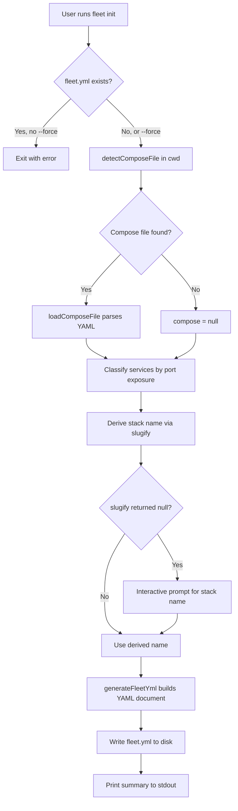

# Project Initialization

The project initialization subsystem generates a starter `fleet.yml` configuration
file from an existing Docker Compose project. It inspects the working directory for
compose files, classifies services by their port exposure, derives a stack name, and
outputs an annotated YAML document ready for editing.

## Why This Exists

Setting up a Fleet project manually requires understanding the
[schema](../configuration/schema-reference.md), knowing which
compose services need routes, and correctly mapping container ports to public domains.
The [`fleet init`](../cli-entry-point/init-command.md) command automates this
scaffolding step so that teams can go from an
existing Docker Compose setup to a deployable Fleet configuration in seconds.

## Module Structure

The initialization logic is split across four source files under `src/init/`:

| File | Responsibility |
|------|---------------|
| [`src/init/types.ts`](../../../src/init/types.ts) | `GenerateFleetYmlOptions` interface definition |
| [`src/init/utils.ts`](../../../src/init/utils.ts) | `slugify()` and `detectComposeFile()` utility functions |
| [`src/init/generator.ts`](../../../src/init/generator.ts) | YAML document construction and comment annotation |
| [`src/init/index.ts`](../../../src/init/index.ts) | Barrel re-exports for the public API |

The CLI command handler lives separately at
[`src/commands/init.ts`](../../../src/commands/init.ts) and orchestrates the full
workflow. For command-level documentation (flags, prompts, exit codes), see the
[CLI init command reference](../cli-entry-point/init-command.md).

## How Initialization Works

The init process follows a linear pipeline:

### Step-by-Step

1.  **Guard check** -- If `fleet.yml` already exists and `--force` was not passed,
    the command exits with code 1.

2.  **Compose detection** -- `detectComposeFile()` checks for `compose.yml` then
    `compose.yaml` in the working directory. If neither exists, it returns the
    literal string `"compose.yml"` as a default filename.

3.  **Compose parsing** -- If the detected file actually exists on disk, it is
    loaded via `loadComposeFile()` from the
    [compose parser](../compose/parser.md). Parse errors cause an immediate exit.

4.  **Service classification** -- Each compose service is categorized:
    - **Routed**: has at least one port mapping; the first port's `target` becomes
      the route port.
    - **Skipped**: has no port mappings; recorded for a YAML comment but no route
      is generated.

5.  **Stack name derivation** -- The current directory's basename is passed through
    `slugify()`, which lowercases the string, replaces non-alphanumeric sequences
    with hyphens, and validates against `STACK_NAME_REGEX` (`/^[a-z\d][a-z\d-]*$/`).

6.  **Interactive fallback** -- If slugify returns `null` (empty result or regex
    mismatch), the user is prompted via stdin to enter a valid name. The prompt
    loops until a matching name is provided.

7.  **YAML generation** -- `generateFleetYml()` constructs a `yaml.Document`,
    populates it with scaffold values, and injects TODO comments on fields that
    need user attention.

8.  **File write and summary** -- The rendered YAML string is written to
    `fleet.yml` and a human-readable summary is printed.

## Compose File Default Mismatch

There is a notable discrepancy between the initialization and configuration
subsystems regarding the default compose filename:

| Subsystem | Default value | Source location |
|-----------|--------------|-----------------|
| `detectComposeFile()` | `compose.yml` | `src/init/utils.ts:40` |
| `stackSchema.compose_file` | `docker-compose.yml` | `src/config/schema.ts:50` |

This means a project initialized with `fleet init` (where no compose file exists on
disk) will have `compose_file: compose.yml` in its generated `fleet.yml`. However,
if that field were omitted and the schema default applied, it would resolve to
`docker-compose.yml` instead.

In practice this rarely causes issues because `fleet init` always writes an explicit
`compose_file` value. The mismatch only surfaces if a user manually creates a
`fleet.yml` without specifying `compose_file` and expects the same default that
`fleet init` would have produced. See the
[Compose Detection vs Schema Defaults diagram](compose-file-detection.md#default-mismatch-state-diagram)
for a visual breakdown.

## Related documentation

- [CLI Init Command Reference](../cli-entry-point/init-command.md) -- command
  flags, prompts, and exit behavior
- [Schema Reference](../configuration/schema-reference.md) -- full `fleet.yml`
  schema including `STACK_NAME_REGEX` and route validation
- [YAML Generation Internals](fleet-yml-generation.md) -- how the YAML document
  is built and annotated with comments
- [Compose File Detection](compose-file-detection.md) -- detection logic, default
  mismatch details, and Docker Compose integration
- [Utility Functions](utility-functions.md) -- `slugify()` internals and stack
  name validation rules
- [Integrations Reference](integrations.md) -- external libraries and services
  used by the init subsystem
- [Configuration Loading and Validation](../configuration/loading-and-validation.md)
  -- how the generated `fleet.yml` is later loaded and validated
- [Compose Parser](../compose/parser.md) -- how compose files are parsed during
  initialization
- [Validation Overview](../validation/overview.md) -- checks performed on
  `fleet.yml` and compose files
- [Deploy Command](../cli-entry-point/deploy-command.md) -- the next step after
  initialization
- [Configuration Overview](../configuration/overview.md) -- full configuration
  architecture and schema design
- [Validation Troubleshooting](../validation/troubleshooting.md) -- diagnosing
  and resolving validation failures
