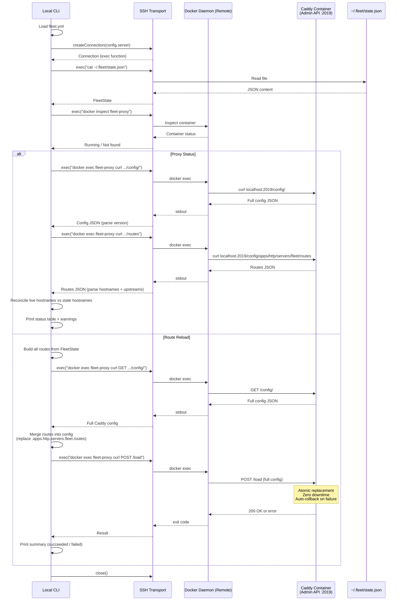
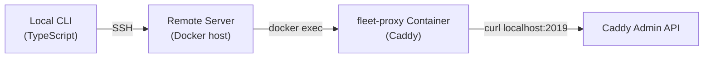

# Proxy Status and Route Reload

## What this is

Fleet manages a [Caddy](https://caddyserver.com/) reverse proxy on the remote
server to route incoming HTTP/HTTPS traffic to deployed Docker containers. The
**proxy status** and **route reload** modules are two CLI operations that let
you inspect and repair that proxy layer:

- `fleet proxy status` -- Queries the live Caddy configuration and compares it
    against the persisted Fleet state to surface discrepancies.
- `fleet proxy reload` -- Forces every route in the Fleet state file to be
    deleted and re-created in Caddy, bringing the proxy into alignment with the
    desired state.

## Why these exist

During normal operation, Fleet's deploy pipeline registers routes in Caddy and
records them in `state.json`. However, the live Caddy configuration and the
persisted state can drift apart in several scenarios:

- A stack was torn down but Caddy cleanup failed (leaving **ghost routes**).
    See [Stack Lifecycle Failure Modes](../stack-lifecycle/failure-modes.md) for
    details on partial failures.
- The Caddy container was restarted without `--resume` successfully restoring
    state (leaving **missing routes**).
- Routes were manually added or removed via the Caddy Admin API.
- A deploy partially failed, leaving some routes registered and others not.

The status command **detects** these problems; the reload command **fixes** them.

## How they work together

Both operations share the same lifecycle:

1. Load `fleet.yml` from the current working directory
2. Open an SSH connection to the remote server (or a local connection if the
    host is `localhost`)
3. Read `~/.fleet/state.json` from the server
4. Interact with the Caddy Admin API via `docker exec` + `curl`
5. Report results and close the connection

## Source files

| File | Purpose |
|------|---------|
| `src/proxy-status/proxy-status.ts` | Status orchestration and reconciliation logic |
| `src/proxy-status/types.ts` | Type definitions for `LiveRoute`, `ContainerStatus`, `ReconciliationResult` |
| `src/proxy-status/index.ts` | Public exports |
| `src/reload/reload.ts` | Route reload orchestration and delete-then-post loop |
| `src/reload/index.ts` | Public exports |

## Three-tier remote execution architecture

All Caddy API interactions traverse three layers of indirection. Understanding
this is essential for debugging:

1. **Local CLI** calls `exec(command)` on the SSH connection object.
2. **SSH transport** runs the command on the remote server. The command is a
    `docker exec fleet-proxy curl ...` invocation.
3. **Docker** executes `curl` inside the Caddy container, where the Admin API
    listens on `localhost:2019`.

Failures at each layer produce different error signatures:

| Layer | Failure symptom | Typical cause |
|-------|----------------|---------------|
| SSH | Connection refused or timeout | Server unreachable, wrong credentials |
| Docker | Non-zero exit code, "No such container" in stderr | `fleet-proxy` container not running |
| Caddy API | HTTP error in curl output (e.g., 404, 500) | Invalid route ID, malformed JSON |

**Why `docker exec` + `curl` instead of direct HTTP?** The Caddy Admin API
binds to `localhost:2019` *inside* the container. This port is intentionally
not exposed to the host network for security. The only way to reach it from
outside the container is via `docker exec`.

## Related documentation

- [Proxy Status Details](./proxy-status.md) -- detailed status reconciliation
    logic and output format
- [Route Reload Details](./route-reload.md) -- the delete-then-post loop and
    error handling
- [Proxy Troubleshooting](./troubleshooting.md) -- common issues with proxy
    status and reload
- [Caddy Reverse Proxy Configuration](../caddy-proxy/overview.md) -- How Caddy commands
    are built and the Docker Compose setup
- [Caddy Admin API](../caddy-proxy/caddy-admin-api.md) -- Admin API endpoints
    used for status queries and route management
- [Server Bootstrap](../bootstrap/server-bootstrap.md) -- How the Caddy container is initially
    created and configured
- [Server State Management](../state-management/overview.md) -- How `state.json` is read
    and written
- [State Schema Reference](../state-management/schema-reference.md) -- The
    `RouteState` and `caddy_id` fields used for reconciliation
- [SSH Connection Layer](../ssh-connection/overview.md) -- How SSH connections are
    established
- [Fleet Configuration](../configuration/overview.md) -- The `fleet.yml` schema
- [CLI Entry Point](../cli-entry-point/proxy-commands.md) -- How `fleet proxy status` and
    `fleet proxy reload` are registered as commands
- [Deploy Failure Recovery](../deploy/failure-recovery.md) -- How `fleet proxy reload`
  helps recover from partial deploy failures
- [Caddy Route Management](../deploy/caddy-route-management.md) -- How routes
  are registered and deleted during the deploy pipeline
