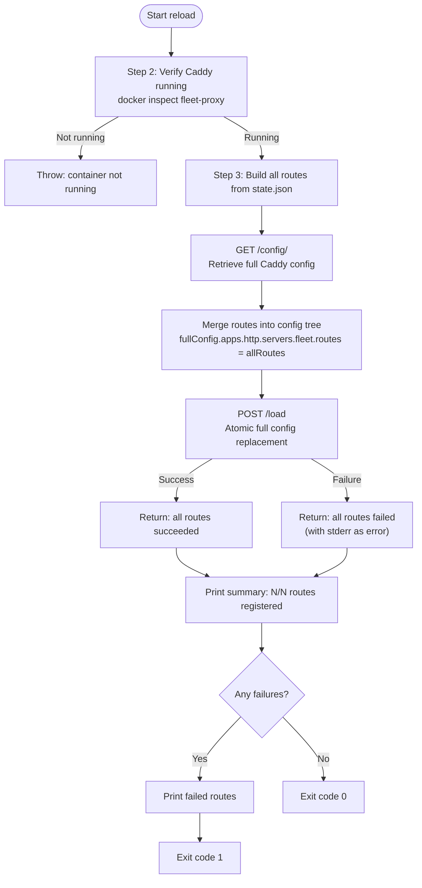
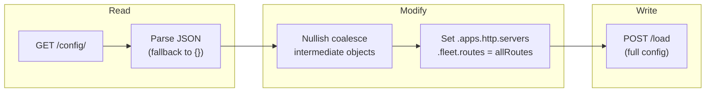

# Route Reload Command

## What it does

`fleet proxy reload` rebuilds the entire Caddy route table from
`state.json` and atomically replaces the running Caddy configuration with a
single `POST /load` request. This is the recommended way to fix **missing
routes** detected by `fleet proxy status` and to converge the live proxy
configuration with the desired state.

## How to run

```sh
fleet proxy reload
```

There are no flags or arguments. The command reads `fleet.yml` from the current
working directory.

## How it works

The command is implemented across two functions in `src/reload/reload.ts`:

- `reloadProxy()` (line 89) -- The CLI entry point that handles connection
    lifecycle, output, and error reporting.
- `reloadRoutes(exec, state)` (line 18) -- The core reload logic, separated
    for testability. This function takes an `ExecFn` and `FleetState` and
    returns a `ReloadResult`.

### Step 1: Load configuration and connect

`reloadProxy()` at `src/reload/reload.ts:89-101`:

1. Loads `fleet.yml` from the current working directory via `loadFleetConfig()`.
2. Opens an SSH connection (or local connection if host is `localhost`) via
   `createConnection(config.server)`.
3. Reads `~/.fleet/state.json` from the server via `readState(exec)`.

### Step 2: Verify Caddy is running

```
docker inspect --format='{{.State.Running}}' fleet-proxy
```

(`src/reload/reload.ts:23-34`)

If the container is not running or the inspect command fails, the function
throws an error:

> Caddy container "fleet-proxy" is not running. Start the proxy first with
> 'fleet deploy'.

This differs from the status command, which merely prints the status and exits
gracefully. The reload command fails hard because it cannot proceed without a
running proxy.

### Step 3: Build complete route table from state

All routes are gathered from every stack in `state.json`
(`src/reload/reload.ts:36-51`):

```typescript
for (const [stackName, stackState] of Object.entries(state.stacks)) {
  for (const route of stackState.routes) {
    allRoutes.push(buildRoute({
      stackName,
      serviceName: route.service,
      domain: route.host,
      upstreamHost: `${stackName}-${route.service}-1`,
      upstreamPort: route.port,
    }));
  }
}
```

Each route object includes an `@id` field built from the stack name and domain
slug (see [Caddy ID format](#the-caddy_id-format) below). The upstream host
follows Docker Compose's container naming convention (see
[Upstream address construction](#upstream-address-construction) below).

### Step 4: Atomic config replacement via POST /load

This is the critical step. Rather than adding or removing routes individually,
`reloadRoutes()` performs a **read-modify-write** cycle that atomically replaces
the entire Caddy configuration (`src/reload/reload.ts:53-79`):



1. **GET full config**: Retrieves the current Caddy configuration via
   `GET /config/` to preserve TLS automation settings, server listener
   configuration, and any other non-route config. If the GET fails or returns
   empty, an empty object is used as the base.

2. **Deep-merge routes**: The route array is set at
   `fullConfig.apps.http.servers.fleet.routes` using nullish coalescing
   assignment (`??=`) to safely create any missing intermediate objects in the
   config tree. This preserves existing TLS settings while replacing all routes.

3. **POST /load**: The entire merged config is posted to Caddy's `/load`
   endpoint. Per the
   [Caddy API documentation](https://caddyserver.com/docs/api#post-load), this
   operation:
    - **Blocks** until the reload completes or fails.
    - **Incurs zero downtime** -- in-flight requests are not dropped.
    - **Rolls back automatically** if the new config fails validation. The old
      config is restored without downtime.
    - Triggers Caddy to **autosave** the new config to the `caddy_config`
      volume, ensuring durability across restarts.

### Step 5: Report results

```
Reload complete: 5/5 routes registered successfully.
```

If the POST /load failed:

```
Reload complete: 0/5 routes registered successfully.

Failed routes:
  - app.example.com (stack: myapp): <error message from stderr>
  - api.example.com (stack: myapp): <error message from stderr>
```

If any route failed, the process exits with code 1.

## Atomicity: all-or-nothing semantics

Unlike a per-route approach, the reload is **all-or-nothing**:

- **Success**: All routes are active simultaneously. There is no window where
    some routes exist and others do not.
- **Failure**: If `POST /load` fails, Caddy automatically rolls back to the
    previous configuration. No routes are changed. All routes are reported as
    failed in the `ReloadResult`.
- **Zero downtime**: Caddy applies configuration changes without dropping
    in-flight connections. Traffic continues to be served throughout the reload.

This is the same pattern used by `registerRoutes()` in
`src/deploy/helpers.ts:377-445` during deployment. Both functions use the
read-modify-write cycle with `POST /load` rather than per-route API calls.

## Why read-modify-write instead of per-route operations?

Fleet deliberately uses `POST /load` (full config replacement) rather than
individual `POST/DELETE` calls to the routes array for several reasons:

1. **Idempotency**: Routes are always derived from `FleetState` (the source of
   truth), not from Caddy's live config. This prevents ghost routes or stale
   entries from accumulating.
2. **No duplicate-ID errors**: The `@id` index is rebuilt from scratch on each
   `/load`, preventing conflicts if a route with the same ID already exists.
3. **Atomic consistency**: All routes converge simultaneously rather than
   through a sequence of individual mutations.
4. **TLS preservation**: By reading the full config first, TLS automation
   policies and other server-level settings are preserved across the reload.

The trade-off is that a failure on `POST /load` rejects all routes, even if
only one route has an issue. In practice this is rare because Fleet constructs
route JSON programmatically with validated inputs.

## The `caddy_id` format

Each route in Caddy is identified by its `@id` field. Fleet builds the ID from
the stack name and a slugified version of the domain:

```
{stackName}__{domainSlug}
```

The domain slug is created by `buildCaddyId()` in `src/caddy/commands.ts:11-17`:

1. Replace all non-alphanumeric characters with hyphens.
2. Strip leading and trailing hyphens.
3. Lowercase the result.

Examples:

| Stack name | Domain | Caddy ID |
|-----------|--------|----------|
| `myapp` | `app.example.com` | `myapp__app-example-com` |
| `myapp` | `api.example.com` | `myapp__api-example-com` |
| `blog` | `blog.example.com` | `blog__blog-example-com` |

This ID is:

- Generated by `buildCaddyId()` in `src/caddy/commands.ts:11-17`
- Stored in `state.json` as `routes[].caddy_id`
- Used by `DELETE /id/{caddy_id}` for targeted route removal during teardown
  (`src/teardown/teardown.ts`)
- Used by Caddy's `/id/` endpoint for direct access to a specific route
  without needing its array index

The double underscore separator (`__`) avoids collisions with valid stack names
and domain slugs (which use single hyphens).

## Upstream address construction

The upstream address (where Caddy forwards traffic) is constructed as:

```
{stackName}-{serviceName}-1:{port}
```

This follows Docker Compose's default container naming convention
(`<project>-<service>-<replica>`). For example:

| Stack name | Service name | Port | Upstream address |
|-----------|-------------|------|-----------------|
| `myapp` | `web` | `3000` | `myapp-web-1:3000` |
| `myapp` | `api` | `8080` | `myapp-api-1:8080` |
| `blog` | `wordpress` | `80` | `blog-wordpress-1:80` |

The `-1` suffix is the container replica number. Fleet always assumes a single
replica per service (no Compose scaling). The upstream host resolves via
Docker's built-in DNS on the `fleet-proxy` network, which both the Caddy
container and service containers must be attached to. See
[Proxy Compose: Networking](../caddy-proxy/proxy-compose.md#networking) for
network topology details.

## Config assembly pattern

Both `reloadRoutes()` (`src/reload/reload.ts:53-68`) and `registerRoutes()`
(`src/deploy/helpers.ts:420-436`) implement the same config assembly pattern:



This pattern is a potential source of subtle issues if Caddy's config structure
changes in future versions, since the code assumes a specific nesting path
(`apps.http.servers.fleet.routes`). The nullish coalescing assignments
(`??=`) guard against missing intermediate objects but do not validate the
overall structure.

## The `ReloadResult` type

Defined in `src/reload/reload.ts:12-16`:

```typescript
interface ReloadResult {
  total: number;
  succeeded: number;
  failed: { host: string; stackName: string; error: string }[];
}
```

Due to the all-or-nothing semantics of `POST /load`, `succeeded` is always
either equal to `total` (success) or `0` (failure). Partial success is not
possible.

## The `ExecFn` abstraction

All remote commands in the reload flow are executed through the `ExecFn`
abstraction (`src/ssh/types.ts:7`), which is a function signature:

```typescript
type ExecFn = (command: string) => Promise<ExecResult>;
```

The `createConnection()` factory (`src/ssh/factory.ts:6-11`) selects the
implementation based on the server host:

- **Remote servers**: Uses `node-ssh` to execute commands over SSH.
- **`localhost` / `127.0.0.1`**: Uses local child process execution, bypassing
  SSH entirely. This enables local development and testing.

The reload function obtains its `ExecFn` via
`createConnection(config.server).exec` at `src/reload/reload.ts:100-101`. The
connection is always closed in a `finally` block (`src/reload/reload.ts:131-133`)
to prevent SSH connection leaks, even if the reload fails.

There is no retry logic for SSH connection failures in the reload path. If the
connection drops mid-reload, the `POST /load` may or may not have been received
by Caddy. Since `POST /load` is atomic on Caddy's side, the worst case is that
the reload needs to be re-run.

## Related documentation

- [Overview: Proxy Status and Route Reload](./overview.md)
- [Proxy Status Command](./proxy-status.md)
- [Troubleshooting Guide](./troubleshooting.md)
- [Caddy Reverse Proxy Architecture](../caddy-proxy/overview.md) -- How the proxy
    system works and route lifecycle
- [Caddy Admin API Reference](../caddy-proxy/caddy-admin-api.md) -- Endpoint
    details for route operations
- [Proxy Commands CLI](../cli-entry-point/proxy-commands.md) -- The `fleet proxy`
    command group
- [State Management Overview](../state-management/overview.md) -- How route state
    is persisted in `state.json`
- [Bootstrap Sequence](../bootstrap/bootstrap-sequence.md) -- Initial proxy setup
    that creates the first empty route configuration
- [Caddy Route Management](../deploy/caddy-route-management.md) -- How routes
    are registered during deployment (uses the same `POST /load` pattern)
- [Deploy Failure Recovery](../deploy/failure-recovery.md) -- Recovery from
    partial deployments where route state may be inconsistent
- [TLS and ACME Certificate Management](../caddy-proxy/tls-and-acme.md) -- How
    TLS settings are preserved across reload operations
- [SSH Connection Lifecycle](../ssh-connection/connection-lifecycle.md) -- How
    the SSH connection is managed during the reload command
- [Official Caddy API docs: POST /load](https://caddyserver.com/docs/api#post-load) --
    Authoritative reference for atomic config replacement behavior
