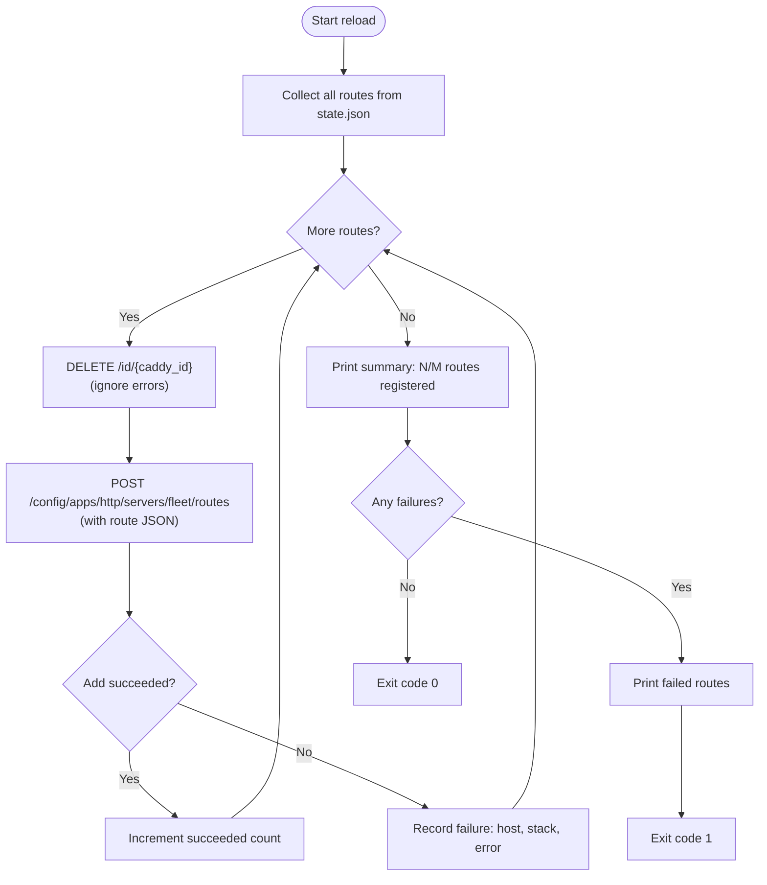

# Route Reload Command

## What it does

`fleet proxy reload` forces all routes recorded in `state.json` to be
re-registered in the Caddy reverse proxy. For each route, it deletes the
existing Caddy route (by ID) and immediately re-creates it. This is the
recommended way to fix **missing routes** detected by `fleet proxy status`.

## How to run

```sh
fleet proxy reload
```

There are no flags or arguments. The command reads `fleet.yml` from the current
working directory.

## How it works

The command is implemented across two functions in `src/reload/reload.ts`:

- `reloadProxy()` (line 82) -- The CLI entry point that handles connection
    lifecycle and output.
- `reloadRoutes(exec, state)` (line 17) -- The core reload logic, separated
    for testability.

### Step 1: Load configuration and connect

Identical to the [proxy status command](./proxy-status.md): loads `fleet.yml`,
opens an SSH connection, reads `state.json`.

### Step 2: Verify Caddy is running

```
docker inspect --format='{{.State.Running}}' fleet-proxy
```

If the container is not running, the command throws an error:

> Caddy container "fleet-proxy" is not running. Start the proxy first with
> 'fleet deploy'.

This differs from the status command, which merely prints the status and exits
gracefully. The reload command fails hard because it cannot proceed without a
running proxy.

### Step 3: Collect routes from state

All routes are gathered from every stack in `state.json`:

```typescript
for (const [stackName, stackState] of Object.entries(state.stacks)) {
  for (const route of stackState.routes) {
    items.push({ stackName, route });
  }
}
```

### Step 4: Delete-then-recreate each route

For each route, the reload performs two operations:



**Delete step**: Calls `DELETE /id/{caddy_id}` on the Caddy Admin API. The
`caddy_id` follows the format `{stackName}__{serviceName}` (double underscore).
Errors during deletion are **intentionally ignored** -- the route may not exist
in Caddy, which is fine.

**Add step**: Posts a new route to
`/config/apps/http/servers/fleet/routes`. The route JSON includes:

```json
{
  "@id": "mystack__web",
  "match": [{ "host": ["app.example.com"] }],
  "handle": [{
    "handler": "reverse_proxy",
    "upstreams": [{ "dial": "mystack-web-1:3000" }]
  }]
}
```

If the add fails (non-zero exit code), the failure is recorded but processing
**continues** with the next route.

### Step 5: Report results

```
Reload complete: 5/6 routes registered successfully.

Failed routes:
  - staging.example.com (stack: myapp): <error message>
```

If any route failed, the process exits with code 1.

## Fault tolerance: no rollback

The reload loop is **fault-tolerant but not transactional**. Key behaviors:

- Each route is processed independently. A failure on one route does not stop
    processing of subsequent routes.
- There is **no rollback**. If 3 out of 6 routes succeed and 3 fail, the proxy
    ends up in a **mixed state** where only some routes are active.
- The delete step always runs before the add step. During the brief window
    between delete and re-create, traffic for that hostname will receive a
    Caddy error response (typically 404 or the Caddy default page).

**Impact on live traffic**: Each route experiences a brief interruption during
the delete-then-add cycle. For a single route this is sub-second, but if you
have many routes, the total reload time is the sum of all individual route
operations (they are processed sequentially, not in parallel).

## The `caddy_id` format

Each route in Caddy is identified by its `@id` field. Fleet uses the format:

```
{stackName}__{serviceName}
```

For example, a service named `web` in a stack named `myapp` gets the ID
`myapp__web`. This ID is:

- Generated by `buildCaddyId()` in `src/caddy/commands.ts:11-13`
- Stored in `state.json` as `routes[].caddy_id`
- Used by `DELETE /id/{caddy_id}` to target a specific route for removal

The double underscore separator avoids collisions with valid stack and service
names (which use single hyphens).

## Upstream address construction

The upstream address (where Caddy forwards traffic) is constructed as:

```
{stackName}-{serviceName}-1:{port}
```

This follows Docker Compose's default container naming convention. For example:

| Stack name | Service name | Port | Upstream address |
|-----------|-------------|------|-----------------|
| `myapp` | `web` | `3000` | `myapp-web-1:3000` |
| `myapp` | `api` | `8080` | `myapp-api-1:8080` |
| `blog` | `wordpress` | `80` | `blog-wordpress-1:80` |

The `-1` suffix is the container replica number (always 1 since Fleet does not
use Compose scaling). The upstream host resolves via Docker's internal DNS on
the `fleet-proxy` network, which both the Caddy container and the service
containers must be attached to.

## The `ReloadResult` type

Defined in `src/reload/reload.ts:11-15`:

```typescript
interface ReloadResult {
  total: number;
  succeeded: number;
  failed: { host: string; stackName: string; error: string }[];
}
```

## Related documentation

- [Overview: Proxy Status and Route Reload](./overview.md)
- [Proxy Status Command](./proxy-status.md)
- [Troubleshooting Guide](./troubleshooting.md)
- [Caddy Reverse Proxy Architecture](../caddy-proxy/overview.md) -- How the proxy
    system works and route lifecycle
- [Caddy Admin API Reference](../caddy-proxy/caddy-admin-api.md) -- Endpoint
    details for route operations
- [Proxy Commands CLI](../cli-entry-point/proxy-commands.md) -- The `fleet proxy`
    command group
- [State Management Overview](../state-management/overview.md) -- How route state
    is persisted in `state.json`
- [Bootstrap Sequence](../bootstrap/bootstrap-sequence.md) -- Initial proxy setup
    that creates the first empty route configuration
- [Caddy Route Management](../deploy/caddy-route-management.md) -- how routes
    are registered and managed during deployment
