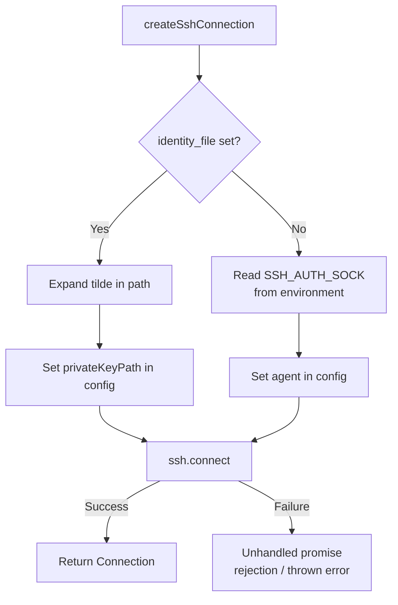

# SSH Authentication and Troubleshooting

Fleet supports two SSH authentication methods: private key file and SSH agent
forwarding. This page explains how each works, how to configure them, and how
to diagnose connection failures.

## Authentication Methods

### Method 1: Private key file (`identity_file`)

When `identity_file` is set in `fleet.yml`, Fleet reads the private key from
that path and passes it to the `node-ssh` library as `privateKeyPath`.

```yaml
server:
  host: "example.com"
  user: "deploy"
  identity_file: "~/.ssh/id_ed25519"
```

**Tilde expansion**: Fleet expands `~` at the start of the path to the current
user's home directory via `os.homedir()` (see `src/ssh/ssh.ts:7-12`). This
handles the common `~/.ssh/...` pattern.

**Limitation**: Only `~/...` expansion is supported. The `~username/...` syntax
(e.g., `~deploy/.ssh/id_rsa`) is **not** supported. If you need to reference
another user's home directory, use an absolute path instead:

```yaml
# Won't work:
identity_file: "~deploy/.ssh/id_rsa"

# Use instead:
identity_file: "/home/deploy/.ssh/id_rsa"
```

**Supported key formats**: The underlying `ssh2` library (which `node-ssh`
wraps) supports OpenSSH, PEM, and PPK key formats. Encrypted keys are
supported if the passphrase is provided through the SSH agent.

### Method 2: SSH agent (`SSH_AUTH_SOCK`)

When no `identity_file` is configured, Fleet falls back to the SSH agent by
reading the `SSH_AUTH_SOCK` environment variable and passing it to `node-ssh`
as the `agent` configuration field (see `src/ssh/ssh.ts:25-27`).

The SSH agent is a background process that holds your private keys in memory,
allowing multiple SSH connections without re-entering passphrases.

#### Verifying your SSH agent

```bash
# Check if SSH_AUTH_SOCK is set
echo $SSH_AUTH_SOCK

# List keys loaded in the agent
ssh-add -l

# If no keys are loaded, add one
ssh-add ~/.ssh/id_ed25519
```

#### What `SSH_AUTH_SOCK` is

`SSH_AUTH_SOCK` is an environment variable that points to a Unix domain socket
file. The SSH agent (`ssh-agent`) listens on this socket for authentication
requests. When Fleet (via `node-ssh` / `ssh2`) needs to authenticate, it sends
the authentication challenge to the agent through this socket, and the agent
signs it with the appropriate private key — the key never leaves the agent
process.

Common values:

| Environment | Typical `SSH_AUTH_SOCK` value |
|---|---|
| macOS | `/private/tmp/com.apple.launchd.xxx/Listeners` |
| Linux (systemd) | `/run/user/1000/ssh-agent.socket` |
| Linux (manual) | `/tmp/ssh-xxx/agent.nnn` |
| GitHub Actions | Set automatically when `ssh-agent` action is used |
| Docker container | Must be explicitly mounted from the host |

## Authentication decision flow



## Troubleshooting Connection Failures

Fleet's SSH layer has **no error handling** around the `ssh.connect()` call
at `src/ssh/ssh.ts:29`. A failed connection throws directly from the
`node-ssh` library. Here are common failure scenarios and their diagnostics:

### Error: "All configured authentication methods failed"

**Cause**: Neither the private key nor the SSH agent could authenticate.

**Resolution**:
1. Verify the `identity_file` path is correct and the file is readable
2. Verify the corresponding public key is in `~/.ssh/authorized_keys` on the
   remote server
3. If using SSH agent, verify keys are loaded: `ssh-add -l`
4. Test manually: `ssh -i <key_path> <user>@<host> -p <port> echo ok`

### Error: "connect ECONNREFUSED" or "connect ETIMEDOUT"

**Cause**: The remote host is unreachable or SSH is not running on the
specified port.

**Resolution**:
1. Verify the host and port in `fleet.yml`
2. Check that the server is running: `ping <host>`
3. Check that SSH is listening: `nc -zv <host> <port>`
4. Check firewall rules on the server

### Error: "No SSH_AUTH_SOCK" or "agent" related error

**Cause**: No `identity_file` is configured and `SSH_AUTH_SOCK` is not set or
points to a stale socket.

**Resolution**:
1. Start the SSH agent: `eval $(ssh-agent -s)`
2. Add your key: `ssh-add ~/.ssh/id_ed25519`
3. Or set `identity_file` explicitly in `fleet.yml`

### CI/CD Environments

In CI/CD pipelines (GitHub Actions, GitLab CI, Jenkins), there is typically no
SSH agent running by default. You **must** either:

- **Set `identity_file` explicitly** in `fleet.yml`, pointing to a key file
  written from a CI secret:
    ```yaml
    # In your CI pipeline:
    # echo "$SSH_PRIVATE_KEY" > /tmp/deploy_key && chmod 600 /tmp/deploy_key
    server:
      host: "production.example.com"
      identity_file: "/tmp/deploy_key"
    ```

- **Start an SSH agent** in your CI pipeline and add the key before running
  Fleet commands. For GitHub Actions, the
  `webfactory/ssh-agent` action handles this automatically.

## Retry and Reconnection Behavior

Fleet has **no retry logic** for SSH connection failures. The `ssh.connect()`
call at `src/ssh/ssh.ts:29` is a single attempt with no retry wrapper. If the
connection fails due to a transient network issue, Fleet will exit with an
error.

**Implications**:
- Network blips during `fleet deploy` cause hard failures
- Long-running operations (like image pulls over SSH) have no reconnection
  mechanism
- If you need retry behavior, wrap your Fleet commands in a shell retry loop

**Potential improvement**: The `node-ssh` `Config` type supports
`readyTimeout` (default: 20000ms) and `keepaliveInterval` options that Fleet
does not currently configure. These could be exposed through `fleet.yml` in
future versions.

## Security Considerations

### Host key verification

Fleet does **not** configure host key verification. The `node-ssh` `Config`
object at `src/ssh/ssh.ts:17-21` does not set `hostVerifier`,
`hostHash`, or `algorithms` options. This means:

- Fleet does not check the remote server's host key fingerprint
- Man-in-the-middle attacks are theoretically possible
- This is acceptable for trusted infrastructure but should be noted for
  security-sensitive deployments

### node-ssh library details

Fleet uses `node-ssh` version `^13.2.1`, which is a Promise-based wrapper
around the `ssh2` library. Key characteristics:

- **No debug logging**: `node-ssh` does not expose SSH-level debug logging.
  For SSH debugging, test your connection manually with `ssh -vvv`
- **Connection events**: The underlying `ssh2` `Client` is accessible at
  `ssh.connection` if you need event hooks, but Fleet does not use this
- **Config options**: `node-ssh`'s `Config` type extends `ssh2`'s
  `ConnectConfig`, supporting options like `readyTimeout`, `keepaliveInterval`,
  `compress`, `algorithms`, and `hostVerifier` — none of which Fleet
  currently exposes

## Related Pages

- [Overview](./overview.md) — Architecture of the SSH connection layer
- [Connection API](./connection-api.md) — The `Connection` interface reference
- [Connection Lifecycle](./connection-lifecycle.md) — Resource management and
  cleanup patterns
- [Configuration Schema](../configuration/schema-reference.md) — The `ServerConfig`
  fields in `fleet.yml`
- [CI/CD Integration Guide](../ci-cd-integration.md) — Complete workflow
  examples for SSH key management in CI/CD pipelines
- [Deploy Integrations: SSH](../deploy/integrations.md#ssh-remote-execution) —
  SSH usage within the deployment pipeline
- [Fleet Root Troubleshooting](../fleet-root/troubleshooting.md) — How SSH user
  permissions affect fleet root resolution
