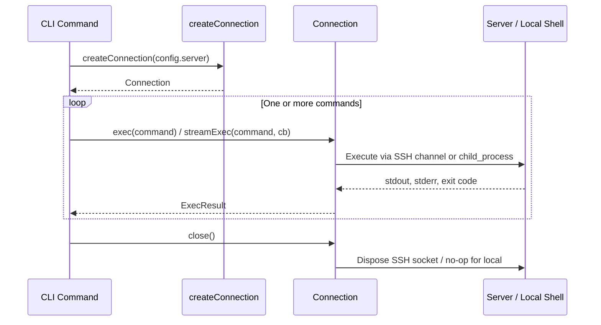
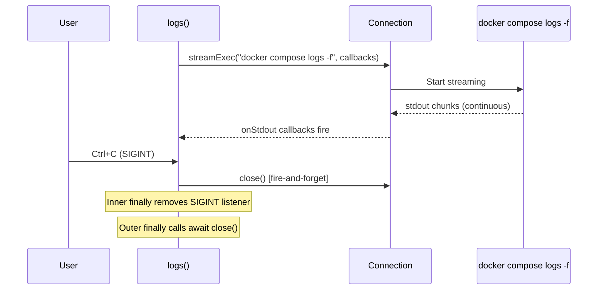

# Connection Lifecycle and Resource Management

This page documents how Fleet manages the lifecycle of SSH and local
connections, including creation, cleanup, error handling, and the
implications of the current design on reliability.

For the `Connection` interface definition and method behavior, see
[connection-api.md](connection-api.md). For authentication during
connection creation, see [authentication.md](authentication.md).

## Lifecycle overview

Every command that communicates with a server follows the same
high-level sequence:

1. Load configuration (`fleet.yml`).
2. Call `createConnection(config.server)` to obtain a `Connection`.
3. Execute one or more commands through `exec` or `streamExec`.
4. Call `connection.close()` to release resources.



There is **no connection pooling**. Each CLI invocation creates exactly
one connection and disposes of it before the process exits. Connections
are never shared between commands or reused across invocations.

## The try/finally cleanup pattern

All nine consumer modules use the same defensive structure to guarantee
that `close()` is called regardless of whether the command succeeds or
throws:

```typescript
let connection: Connection | null = null;
try {
    connection = await createConnection(config.server);
    // ... work ...
} catch (error) {
    console.error(error);
    process.exit(1);
} finally {
    if (connection) {
        await connection.close();
    }
}
```

Key characteristics:

- **Nullable declaration before `try`** -- The connection variable is
  initialized to `null` so the `finally` block can safely skip `close()`
  if `createConnection` itself threw before assigning a value.
- **Null guard in `finally`** -- Prevents calling `close()` on a
  connection that was never established.
- **`process.exit(1)` in `catch`** -- Most consumers call
  `process.exit(1)` after logging the error. In Node.js the `finally`
  block still executes before the process terminates.

### Consumer modules using the standard pattern

| Module | Source file | `createConnection` line | `close()` line |
|--------|-------------|------------------------|----------------|
| deploy | `src/deploy/deploy.ts` | 66 | 409 |
| ps | `src/ps/ps.ts` | 84 | 196 |
| proxy-status | `src/proxy-status/proxy-status.ts` | 188 | 237 |
| reload | `src/reload/reload.ts` | 93 | 125 |
| teardown | `src/teardown/teardown.ts` | 45 | 87 |
| stop | `src/stop/stop.ts` | 45 | 82 |
| restart | `src/restart/restart.ts` | 33 | 65 |
| env | `src/env/env.ts` | 26 | 70 |
| logs | `src/logs/logs.ts` | 19 | 62 |

## The SIGINT-aware pattern (logs module)

The `logs` command (`src/logs/logs.ts`) is the only consumer that uses
`streamExec` for long-running output (`docker compose logs -f`). Because
the stream blocks indefinitely, it requires special handling for
Ctrl+C (SIGINT):



The implementation uses a **nested try/finally** structure
(`src/logs/logs.ts:13-64`):

1. **Outer try/finally** (lines 13-64) -- Creates the connection and
   guarantees `close()` runs on exit.
2. **SIGINT registration** (lines 39-45) -- Before starting the stream,
   a listener is registered that calls `connection.close().catch(() => {})`
   as a fire-and-forget operation. This immediately tears down the SSH
   channel, which causes the `streamExec` promise to resolve.
3. **Inner try/finally** (lines 47-59) -- Wraps the `streamExec` call
   and removes the SIGINT listener in its `finally` block to prevent
   listener leaks.
4. **Outer finally** (lines 60-64) -- Calls `await connection.close()`
   as the canonical cleanup.

`close()` may be called twice (once from the SIGINT handler, once from
the outer `finally`). This is safe because:

- **SSH backend**: `ssh.dispose()` from `node-ssh` is idempotent.
- **Local backend**: `close()` is a no-op.

Unlike the other eight consumers, the `logs` module has **no `catch`
block** -- exceptions propagate to the caller.

## What close() does per backend

| Backend | Implementation | Effect |
|---------|---------------|--------|
| SSH | `ssh.dispose()` at `src/ssh/ssh.ts:60-61` | Terminates the TCP socket and all multiplexed channels. The underlying `ssh2` `Client.end()` is called, sending a `SSH_MSG_DISCONNECT`. |
| Local | No-op at `src/ssh/local.ts:49-51` | Nothing to clean up. `child_process.exec` and `spawn` create per-invocation processes that terminate when the command completes. The `Connection` object holds no persistent resources. |

### What happens if close() is not called

- **SSH backend**: The TCP socket to the remote host remains open until
  the Node.js process exits and the OS reclaims the file descriptor.
  During that window the connection counts against the server's
  `MaxSessions` / `MaxStartups` limits in `sshd_config`. In practice,
  because Fleet CLI processes are short-lived, the socket is reclaimed
  quickly. However, if Fleet were used as a library in a long-running
  process, leaked connections would accumulate.
- **Local backend**: No effect. There is no persistent resource to leak.

## No timeout or retry logic

The current implementation has **no timeout** on any operation and **no
retry logic** for failed or interrupted connections.

### Connection establishment

`ssh.connect()` (`src/ssh/ssh.ts:29`) delegates to the `ssh2` library's
`Client.connect()`. The `ssh2` library has a default `readyTimeout` of
20 seconds (the time allowed for the SSH handshake to complete). Fleet
does not override this value, so the 20-second default applies.

If the remote host is unreachable and does not respond at all (e.g., a
firewall drops packets silently), the TCP SYN will be retried by the
operating system's network stack according to its own timeout settings,
which can take 1-2 minutes on Linux before `ETIMEDOUT` is raised.

There is **no error handling** around `ssh.connect()` at
`src/ssh/ssh.ts:29`. If the connection fails, the rejection propagates
up to the consumer's `catch` block (or becomes an unhandled rejection if
the consumer lacks a `catch`). All nine consumers do have a `catch` or
`finally` that will handle this, but the error message shown to the user
is the raw error from `ssh2` with no additional context.

### Command execution

Neither `exec` nor `streamExec` imposes a timeout. Consequences:

- **SSH `exec`**: If a remote command hangs (e.g., waiting on a lock or
  a blocking I/O operation), the `execCommand` promise never resolves.
  The CLI process blocks indefinitely. The user must manually kill the
  process with Ctrl+C.
- **SSH `streamExec`**: Same behavior, but the `logs` module has a
  SIGINT handler that provides a cleaner exit path.
- **Local `exec`**: Uses `child_process.exec` with default options.
  There is no `timeout` option set, so the command can run indefinitely.
  Note that `child_process.exec` has a default `maxBuffer` of
  approximately 1 MB (1024 * 1024 bytes). If a command produces more
  than 1 MB of stdout or stderr, the process is killed with a
  `ERR_CHILD_PROCESS_STDIO_MAXBUFFER` error.
- **Local `streamExec`**: Uses `child_process.spawn`, which has no
  buffer limit (output is streamed), but also no timeout.

### Reconnection

If an SSH connection drops mid-session (e.g., network interruption, server
restart), the current `exec` or `streamExec` call fails with an error.
There is no automatic reconnection or retry. The user must re-run the
CLI command.

### Recommendations for improvement

If timeout or retry behavior is needed in the future:

- Pass `readyTimeout` and `keepaliveInterval` in the `Config` object at
  `src/ssh/ssh.ts:17-21` to control SSH handshake and keepalive timing.
- Wrap `ssh.execCommand()` calls with `Promise.race()` against a timer
  to enforce per-command timeouts.
- Set the `timeout` option on `child_process.exec` calls for local
  commands.
- Implement exponential backoff retry around `ssh.connect()` for
  transient network failures.

## node-ssh and ssh2 operational details

Fleet uses `node-ssh` v13.2.1 (`src/package.json`), which is a
Promise-based wrapper around the `ssh2` library.

### Configuration options not exposed by Fleet

The `node-ssh` `Config` type extends `ssh2`'s `ConnectConfig`. Fleet
only sets four fields (`host`, `port`, `username`, and either
`privateKeyPath` or `agent`). The following `ssh2` options could be set
but are not:

| Option | Purpose | Default |
|--------|---------|---------|
| `readyTimeout` | Milliseconds to wait for the SSH handshake | 20000 |
| `keepaliveInterval` | Milliseconds between keepalive packets (0 = disabled) | 0 |
| `keepaliveCountMax` | Number of missed keepalives before disconnect | 3 |
| `hostHash` / `hostVerifier` | Host key verification | None (accepts all) |
| `debug` | Debug logging callback | None |
| `timeout` | Socket-level connect timeout | None (OS default) |
| `tryKeyboard` | Enable keyboard-interactive auth | false |
| `passphrase` | Passphrase for encrypted private keys | None |

### Debug logging

To diagnose SSH connection issues at the `ssh2` level, the `debug`
callback can be set in the connect config. Fleet does not currently
expose this. If needed for troubleshooting, add `debug: console.log` to
the `connectConfig` object in `src/ssh/ssh.ts:17-21`.

### Host key verification

Fleet does **not** configure `hostHash` or `hostVerifier` in the SSH
connect config. This means that `ssh2` accepts any host key without
verification. This is a security concern in environments where
man-in-the-middle attacks are possible.

To add host key verification, supply a `hostVerifier` callback that
checks the presented key fingerprint against a known-hosts database. The
`ssh2` library supports `hostHash: 'sha256'` with a `hostVerifier`
function that receives the hashed key as a string.

See also [authentication.md](authentication.md) for related security
considerations.

## child_process operational details

### maxBuffer limit

The local `exec` function at `src/ssh/local.ts:5-15` calls
`child_process.exec` without specifying `maxBuffer`. The Node.js default
is 1024 * 1024 bytes (1 MB). If a command produces more output than
this, Node.js kills the child process and returns an error with code
`ERR_CHILD_PROCESS_STDIO_MAXBUFFER`.

This limit does **not** apply to:

- **Local `streamExec`** -- Uses `child_process.spawn`, which streams
  output through event listeners with no buffering limit.
- **SSH `exec` or `streamExec`** -- Output is received over the SSH
  channel with no Node.js-imposed buffer limit.

If a local command is expected to produce large output (e.g., listing
many containers), use `streamExec` instead of `exec`, or increase
`maxBuffer` in the `exec` call options.

### Shell injection

Both `exec` and `streamExec` in the local backend pass the command
string directly to a shell (`child_process.exec` uses `/bin/sh -c` by
default; `spawn` with `{ shell: true }` does the same). If any part of
the command string is constructed from user input without sanitization,
shell injection is possible.

In Fleet's current usage, command strings are constructed from validated
configuration values (stack names, service names) that pass through Zod
schema validation. However, the `Connection` interface itself provides
no injection protection -- callers are responsible for safe command
construction.

## Cross-references

- [overview.md](overview.md) -- Architecture and module structure
- [authentication.md](authentication.md) -- SSH key and agent
  authentication, security considerations
- [connection-api.md](connection-api.md) -- Type definitions and method
  signatures
- [Deploy command](../cli-entry-point/deploy-command.md) -- Primary CLI
  consumer of SSH connections
- [Proxy commands](../cli-entry-point/proxy-commands.md) -- Proxy status
  and reload commands that use SSH
- [Logs command](../process-status/logs-command.md) -- Uses `streamExec`
  with the SIGINT-aware pattern
- [Stack lifecycle operations](../stack-lifecycle/overview.md) -- Restart,
  stop, and teardown commands use SSH
- [CI/CD integration](../ci-cd-integration.md) -- SSH key handling in
  CI environments
- [State management operations](../state-management/operations-guide.md)
  -- State read/write operations over SSH
