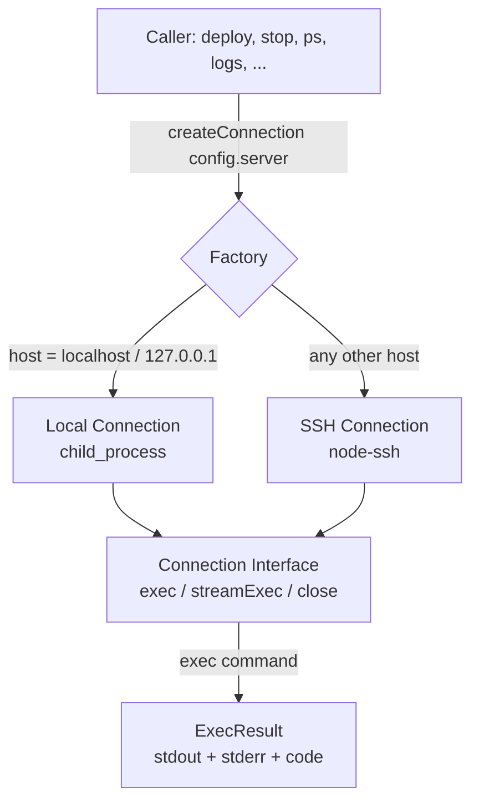

# SSH and Local Connection Layer

## What It Is

The SSH and local connection layer is Fleet's foundational abstraction for
executing shell commands on target servers. It provides a single `Connection`
interface with two concrete implementations — one for remote servers (via SSH)
and one for the local machine (via Node.js `child_process`) — selected
automatically by a factory function based on the configured host address.

## Why It Exists

Every Fleet operation — deploy, stop, restart, teardown, logs, ps, proxy
management, bootstrap, and state persistence — needs to run shell commands on
the target server. Rather than scattering SSH connection logic across 12+
modules, this layer centralizes it behind a uniform interface. Callers never
need to know whether they are operating on a remote host or locally; they call
`exec()` and receive a promise resolving to an `ExecResult`.

## How It Works



### Factory routing

The factory in `src/ssh/factory.ts:6-11` inspects `config.host`:

| Host value | Connection type | Backend |
|---|---|---|
| `localhost` | Local | Node.js `child_process.exec` / `spawn` |
| `127.0.0.1` | Local | Node.js `child_process.exec` / `spawn` |
| Anything else | SSH | `node-ssh` (wraps `ssh2`) |

### Connection lifecycle

Every consumer follows the same pattern:

1. Call `createConnection(config.server)` to obtain a `Connection`
2. Use `connection.exec()` or `connection.streamExec()` to run commands
3. Call `connection.close()` in a `finally` block to release resources

All nine consumer modules (deploy, logs, ps, env, stop, restart, teardown,
proxy-status, reload) use a `try/finally` block to guarantee `close()` is
called even when errors occur. See [Connection Lifecycle](./connection-lifecycle.md)
for details.

## Source Files

| File | Purpose |
|---|---|
| `src/ssh/types.ts` | `Connection` interface and type definitions |
| `src/ssh/factory.ts` | Factory function that selects the connection backend |
| `src/ssh/ssh.ts` | SSH implementation using `node-ssh` |
| `src/ssh/local.ts` | Local implementation using `child_process` |
| `src/ssh/index.ts` | Barrel re-exports |

## Cross-Module Dependencies

This module is one of the most widely consumed in the codebase. At least 19
files across 12 modules depend on its exports:

- [Deployment Pipeline](../deployment-pipeline.md) — `createConnection`, `Connection`, `ExecFn`
- [Server Bootstrap](../bootstrap/server-bootstrap.md) — `ExecFn`
- [State Management](../state-management/overview.md) — `ExecFn`, `ExecResult` (re-exported through `state/types.ts`)
- [Stack Lifecycle](../stack-lifecycle/overview.md) — `createConnection`, `Connection`, `ExecFn`
- [Process Status](../process-status/overview.md) — `createConnection`, `Connection`
- [Proxy Status and Reload](../proxy-status-reload/overview.md) — `createConnection`, `Connection`, `ExecFn`
- [Environment and Secrets](../env-secrets/overview.md) — `createConnection`, `Connection`
- [Caddy Proxy Configuration](../caddy-proxy/overview.md) — `ExecFn`
- [Fleet Root Resolution](../fleet-root/overview.md) — `ExecFn`

## Configuration

The SSH connection is configured through the `server` section of `fleet.yml`,
validated by the Zod schema in `src/config/schema.ts:3-8`:

```yaml
server:
  host: "192.168.1.100"     # Required: hostname or IP
  port: 22                   # Optional: defaults to 22
  user: "root"               # Optional: defaults to "root"
  identity_file: "~/.ssh/id_rsa"  # Optional: path to private key
```

See the [Configuration Schema](../configuration/overview.md) documentation
for the full `ServerConfig` type definition and the
[Configuration Schema Reference](../configuration/schema-reference.md) for
field-by-field details.

## Related documentation

- [Authentication and SSH Agent](./authentication.md) — How SSH authentication
  works, SSH agent setup, and troubleshooting connection failures
- [Connection Interface API](./connection-api.md) — Detailed reference for
  `exec`, `streamExec`, `close`, and their behavioral differences
- [Connection Lifecycle](./connection-lifecycle.md) — Resource management,
  cleanup patterns, and known limitations
- [Fleet Root Overview](../fleet-root/overview.md) — How the fleet root
  module uses `ExecFn` for directory resolution
- [Fleet Root Resolution Flow](../fleet-root/resolution-flow.md) — Step-by-step
  resolution logic executed via SSH
- [State Operations Guide](../state-management/operations-guide.md) — How to
  inspect, back up, and recover state via SSH
- [Bootstrap Integrations](../bootstrap/bootstrap-integrations.md) — How SSH
  is used during bootstrap for Docker and Caddy commands
- [Deploy Sequence](../deploy/deploy-sequence.md) — The 17-step deploy
  pipeline that relies on SSH for all remote operations
- [Configuration Schema Reference](../configuration/schema-reference.md) —
  The `server` section that configures SSH connections
- [Stack Lifecycle Overview](../stack-lifecycle/overview.md) — Stop, restart,
  and teardown operations that use SSH
