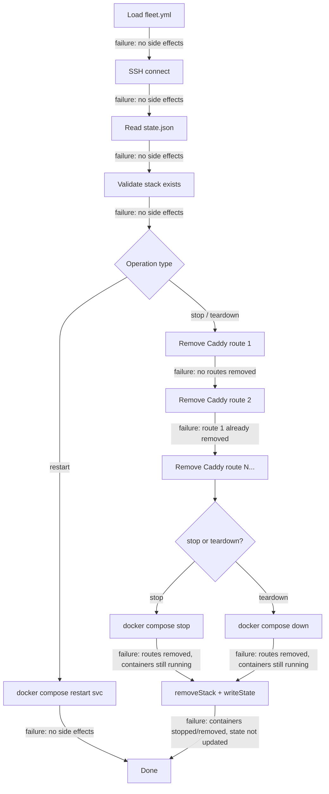

# Failure Modes and Recovery

All three lifecycle operations -- restart, stop, and teardown -- can fail at
various points during execution. Because Fleet does not implement rollback
logic, a failure mid-operation can leave the system in a **partial state** where
some steps have completed and others have not. This document catalogs every
failure scenario, explains what state the system is left in, and provides
concrete recovery steps.

## The three-tier execution model

All commands execute through three layers of indirection:

1. **Local Fleet CLI** calls `exec()` on the SSH connection
2. **SSH connection** runs a command on the remote server
3. **Remote server** may run `docker exec` into the Caddy container

Failures at each tier produce different error signatures:

| Tier | Failure example | Error signature |
|------|----------------|-----------------|
| SSH transport | Network timeout, auth failure | SSH connection error before any command runs |
| Remote shell | Docker daemon down, command not found | Non-zero exit code with stderr message |
| Caddy container | Container stopped, API error | `docker exec` fails with container-level error |

## Why there is no rollback

The stop and teardown operations execute a sequence of side effects (remove
Caddy routes, stop/remove containers, update state file). Each side effect is
performed via a remote `docker exec` or shell command over SSH. If any step
fails, the operation throws an error and aborts immediately without attempting
to undo prior steps.

This design is intentional: reversing a Caddy route removal would require
re-adding the route with the exact same configuration, which would need the
original route data to still be available. Similarly, restarting stopped
containers after a partial stop could mask the original failure. The current
approach prioritizes **fail-fast visibility** over automatic recovery.

## Failure point map

The following diagram shows every step where a failure can occur and what
resources have already been modified at that point:



## Failure scenarios

### 1. Configuration not found or invalid

**When:** Step 1 -- [`loadFleetConfig()`](../configuration/overview.md) cannot find `fleet.yml` or the file
fails Zod schema validation.

**Side effects at failure:** None. No SSH connection has been opened, no remote
commands have been executed.

**Symptoms:**

- Error message: `Could not find fleet.yml` or Zod validation errors listing
  the invalid fields.

**Recovery:** Fix the `fleet.yml` file and retry the command. No remote cleanup
is needed.

### 2. SSH connection failure

**When:** Step 2 -- `createConnection()` cannot reach the server.

**Side effects at failure:** None. The connection was never established, so no
remote state has been modified.

**Symptoms:**

- Error message varies depending on the underlying cause:
    - `ECONNREFUSED` -- the server is not accepting SSH connections on the
      configured port
    - `ECONNRESET` or `ETIMEDOUT` -- network issue or firewall blocking the
      connection
    - `Authentication failed` -- the SSH key or agent is not accepted by the
      server
    - No `identity_file` in config and `SSH_AUTH_SOCK` environment variable
      is unset -- Fleet falls back to agent auth which fails if no agent is
      running

**Recovery:** Verify server connectivity, SSH credentials, and port
configuration in `fleet.yml`. See the
[Integrations Reference -- SSH](./integrations.md#ssh--node-ssh) section and
the [SSH Authentication](../ssh-connection/authentication.md) page for
detailed troubleshooting.

### 3. State file unreadable or corrupt

**When:** Step 3 -- `readState()` fails to parse `~/.fleet/state.json`.

**Side effects at failure:** None. State is read-only at this point.

**Symptoms:**

- `Failed to parse state file: invalid JSON in ~/.fleet/state.json` -- the
  file exists but contains invalid JSON.
- `Invalid state file structure` -- the JSON is valid but does not match the
  expected Zod schema (e.g. missing `fleet_root` or `stacks` fields).

**Note:** If the state file does not exist or is empty, `readState()` returns
a default empty state rather than throwing. This means the stack lookup in the
next step will fail with "Stack not found" instead of a parse error.

**Recovery:** SSH into the server manually and inspect
`~/.fleet/state.json`. If the file is corrupt, restore it from a backup or
reconstruct it by examining the running Docker containers and Caddy routes.
See the [Integrations Reference -- Fleet State](./integrations.md#fleet-state)
section for the expected file structure.

### 4. Stack not found in state

**When:** Step 4 -- `getStack()` returns `undefined` because the stack name
is not a key in `state.stacks`.

**Side effects at failure:** None. This is a read-only validation check.

**Symptoms:**

- `Stack "<name>" not found in server state. Run 'fleet deploy' first.`

**Common causes:**

- The stack name was misspelled.
- The stack was already stopped or torn down (both operations remove the stack
  from state).
- The stack was deployed under a different name.
- The state file was manually edited or replaced.

**Recovery:** Check the exact stack name. If you need to see which stacks are
currently tracked, SSH into the server and run:

```sh
cat ~/.fleet/state.json | jq '.stacks | keys'
```

If the stack's containers are actually running but the state entry is missing,
you can manage the containers directly with `docker compose -p <stack> ...` or
redeploy with `fleet deploy` to re-register the stack.

### 5. Caddy route removal fails partway through

**When:** Step 5 (stop/teardown only) -- one of the sequential
`buildRemoveRouteCommand()` calls returns a non-zero exit code.

**Side effects at failure:** Routes that were processed before the failing one
have already been removed from Caddy's live configuration. Routes after the
failing one (and the failing one itself) still exist. Containers are still
running. Fleet state has not been updated.

**This is the most operationally significant failure mode** because it leaves
the system in a genuinely inconsistent state: some domains are no longer
proxied while the containers they pointed to are still running and the state
file still lists all routes as active.

**Symptoms:**

- `Failed to remove Caddy route "<stackName>__<serviceName>": <stderr>`
- Some domains for the stack return 502 or are unreachable, while others still
  work normally.

**Common causes:**

- The `fleet-proxy` container is not running.
- The route ID does not exist in Caddy (already removed manually or by a
  previous partial failure).
- The Caddy admin API at `localhost:2019` inside the container is not
  responding.

**Recovery:**

1. **Identify which routes were already removed.** List the remaining Caddy
   routes:

    ```sh
    ssh user@server "docker exec fleet-proxy curl -s http://localhost:2019/config/apps/http/servers/fleet/routes" | jq
    ```

2. **Manually remove the remaining routes** for the stack. Route IDs follow
   the format `<stackName>__<serviceName>`:

    ```sh
    ssh user@server "docker exec fleet-proxy curl -s -f -X DELETE http://localhost:2019/id/<stackName>__<serviceName>"
    ```

3. **Then stop or remove the containers** depending on which operation you
   were running:

    ```sh
    # For stop:
    ssh user@server "docker compose -p <stackName> stop"

    # For teardown:
    ssh user@server "docker compose -p <stackName> down"
    # Or with volumes:
    ssh user@server "docker compose -p <stackName> down --volumes"
    ```

4. **Update the state file** by removing the stack entry. SSH into the server,
   edit `~/.fleet/state.json`, and delete the key for the stack from the
   `stacks` object. Alternatively, retry the original Fleet command -- if the
   Caddy routes have been manually removed, the command will fail again on the
   missing routes. In that case, manually edit the state file.

### 6. Docker Compose command fails

**When:** After all Caddy routes have been successfully removed, the Docker
Compose command (`stop`, `restart`, or `down`) returns a non-zero exit code.

**Side effects at failure:**

- **For restart:** No prior side effects. The single `docker compose restart`
  command either succeeds or fails atomically per service.
- **For stop/teardown:** All Caddy routes have already been removed. The
  domains are no longer proxied. But containers are still running (or in an
  unknown state if `docker compose down` partially completed). Fleet state
  has not been updated.

**Symptoms:**

- `Failed to stop containers for stack "<name>": <stderr>`
- `Failed to run docker compose down for stack "<name>": <stderr>`

**Common causes:**

- Docker daemon is not running on the remote server.
- The project name does not match any running Compose project (containers were
  removed out of band).
- Insufficient disk space or other system resource exhaustion.

**Recovery for stop/teardown:**

1. Routes are already gone -- re-adding them requires a full `fleet deploy`.
2. Manually stop or remove containers: `docker compose -p <stack> stop` or
   `docker compose -p <stack> down`.
3. Manually update `~/.fleet/state.json` to remove the stack entry.
4. If you want the stack running again, run `fleet deploy` to redeploy from
   scratch.

### 7. State write fails

**When:** The final `writeState()` call fails after the Docker Compose command
has succeeded.

**Side effects at failure:** Caddy routes have been removed, containers have
been stopped or removed, but the state file still contains the stack entry. The
system is fully shut down but Fleet still "thinks" the stack is active.

**Symptoms:**

- `Failed to write state file: command exited with code <N>`

**Common causes:**

- Filesystem is read-only or full on the remote server.
- The `~/.fleet/` directory was deleted between the read and write.

**Impact:** This is relatively benign. The next `fleet deploy` for the same
stack name will see the stale state entry, but deploy will overwrite it.
Running stop or teardown again will attempt to remove already-removed routes
(which will fail at scenario 5 above).

**Recovery:**

1. SSH into the server and manually edit `~/.fleet/state.json` to remove the
   stack from the `stacks` object.
2. Or simply run `fleet deploy` for the stack, which will overwrite the stale
   entry.

### 8. SSH connection drops mid-operation

**When:** The SSH connection is severed while a remote command is executing.
This can happen due to network instability, server restart, or SSH timeout.

**Side effects at failure:** Depends on which step was executing when the
connection dropped. The remote command that was in progress may or may not have
completed -- there is no way to know without inspecting the server.

**Symptoms:**

- The Fleet CLI hangs and eventually times out, or exits with a connection
  error.
- The `finally` block still attempts `connection.close()`, which may itself
  fail silently.

**Recovery:**

1. SSH into the server manually and assess the current state.
2. Check which Caddy routes still exist:

    ```sh
    docker exec fleet-proxy curl -s http://localhost:2019/config/apps/http/servers/fleet/routes | jq '.[].["@id"]'
    ```

3. Check which containers are running:

    ```sh
    docker compose -p <stackName> ps
    ```

4. Check the state file:

    ```sh
    cat ~/.fleet/state.json | jq '.stacks["<stackName>"]'
    ```

5. Based on what you find, either:
    - Manually complete the interrupted operation (remove remaining routes,
      stop containers, update state).
    - Or run the Fleet command again -- it will pick up from the current
      server state.

**Note on state file atomicity:** The `writeState()` function uses a
write-to-tmp-then-mv pattern (`state.json.tmp` -> `state.json`). If the
connection drops during the write, the tmp file may exist but the original
`state.json` remains intact. The atomic rename is the last step, so a
partial write does not corrupt the state file.

### 9. fleet-proxy container not running

**When:** Any stop or teardown operation attempts to remove Caddy routes, but
the `fleet-proxy` container is not running.

**Side effects at failure:** None (fails on the first route removal attempt
before any state is modified).

**Symptoms:**

- `Failed to remove Caddy route`: the `docker exec fleet-proxy ...` command
  fails because the container does not exist or is stopped.

**Recovery:**

1. Check if the container exists: `docker ps -a --filter name=fleet-proxy`
2. If stopped, start it: `docker start fleet-proxy`
3. If missing, it needs to be recreated via `fleet deploy` (which bootstraps
   the proxy).
4. Once the proxy is running, retry the original stop/teardown command.

**Alternative:** If you only need to stop/remove the stack's containers and do
not care about cleaning up Caddy routes (e.g. you are decommissioning the
entire server), manage Docker directly:

```sh
docker compose -p <stackName> down --volumes
```

Then manually edit `~/.fleet/state.json` to remove the stack.

## Summary: failure impact by operation step

| Step | Side effects if this step fails | State consistency |
|------|--------------------------------|-------------------|
| Load config | None | Consistent |
| SSH connect | None | Consistent |
| Read state | None | Consistent |
| Validate stack | None | Consistent |
| Remove Caddy route N | Routes 1..N-1 removed | **Inconsistent** |
| Docker Compose cmd | All routes removed | **Inconsistent** |
| Write state | Routes removed + containers stopped/removed | **Inconsistent** (but recoverable) |

## Inspecting and repairing Fleet state

### Where state lives

The Fleet state file is located at `~/.fleet/state.json` on the remote server
(relative to the SSH user's home directory). See
[Server State Management](../state-management/) for the full schema.

### Reading state manually

```bash
ssh <server> "cat ~/.fleet/state.json" | jq .
```

### What happens with missing or corrupted state

- **Missing file**: `readState()` returns a default empty state
  (`{ fleet_root: "", caddy_bootstrapped: false, stacks: {} }`). This is safe
  -- it simply means no stacks are known.
- **Empty file**: Same as missing -- returns default state.
- **Malformed JSON**: `readState()` throws an error:
  `"Failed to parse state file: invalid JSON in ~/.fleet/state.json"`.
- **Invalid schema**: `readState()` throws an error with Zod validation
  details: `"Invalid state file structure: ~/.fleet/state.json ..."`.

### Manual state editing

The state file is plain JSON validated by a Zod schema. You can edit it
manually to recover from partial failures:

```bash
# Back up current state
ssh <server> "cp ~/.fleet/state.json ~/.fleet/state.json.bak"

# Edit (use jq to remove a stack entry)
ssh <server> "jq 'del(.stacks.myapp)' ~/.fleet/state.json > /tmp/state.json && mv /tmp/state.json ~/.fleet/state.json"
```

### Backing up state

There is no built-in backup mechanism. To back up state:

```bash
scp <server>:~/.fleet/state.json ./fleet-state-backup.json
```

## Debugging Caddy routes

### Query current routes

```bash
ssh <server> "docker exec fleet-proxy curl -s http://localhost:2019/config/apps/http/servers/fleet/routes" | jq .
```

### Query full Caddy config

```bash
ssh <server> "docker exec fleet-proxy curl -s http://localhost:2019/config/" | jq .
```

### Delete a specific route by ID

Route IDs follow the pattern `{stackName}__{serviceName}` (double underscore).
To manually remove a route:

```bash
ssh <server> "docker exec fleet-proxy curl -s -f -X DELETE http://localhost:2019/id/<stackName>__<serviceName>"
```

### Verify the Caddy container is healthy

```bash
ssh <server> "docker inspect fleet-proxy --format '{{.State.Status}}'"
ssh <server> "docker exec fleet-proxy curl -s http://localhost:2019/config/"
```

If the container is running but the admin API is unresponsive, check
Caddy's logs:

```bash
ssh <server> "docker logs fleet-proxy --tail 50"
```

## Docker Compose requirements

Fleet's operational commands use Docker Compose V2 syntax (`docker compose`,
as a Docker CLI plugin) rather than the standalone V1 binary
(`docker-compose`). Ensure the remote server has Docker Compose V2 installed.

Verify with:

```bash
ssh <server> "docker compose version"
```

## Related documentation

- [Restart](./restart.md), [Stop](./stop.md), [Teardown](./teardown.md) --
  normal operation flow for each command
- [Integrations Reference](./integrations.md) -- how to inspect and
  troubleshoot each subsystem (Caddy, Docker, SSH, state, config)
- [Operational CLI Commands](../cli-commands/operational-commands.md) -- full
  CLI reference
- [Deploy Failure Recovery](../deploy/failure-recovery.md) -- failure recovery
  for the deployment pipeline (complementary to this page)
- [Server State Management](../state-management/) -- state file schema,
  read/write mechanics, and atomic writes
- [Caddy Reverse Proxy Configuration](../caddy-proxy/) -- how routes are
  added and removed via the admin API
- [SSH Connection Layer](../ssh-connection/) -- connection setup,
  authentication, and error handling
- [Proxy Status and Route Reload](../proxy-status-reload/) -- tools for
  inspecting and reconciling Caddy routes
- [Configuration Overview](../configuration/overview.md) -- how `fleet.yml` is
  loaded and validated before lifecycle operations
- [Validation Overview](../validation/overview.md) -- pre-flight checks that
  can prevent some failure modes
- [Process Status Troubleshooting](../process-status/troubleshooting.md) --
  diagnostic commands for inspecting container and service status
