# Stack Lifecycle Operations

Fleet provides three operations for managing deployed stacks after the initial
`fleet deploy`: **restart**, **stop**, and **teardown**. These form a severity
gradient from lightest to most destructive, giving operators precise control
over which resources are affected.

## Why these operations exist

Once a stack is deployed to a remote server, operators need runtime controls
that go beyond simply redeploying. A misbehaving service may need a quick
restart. A stack may need to be halted temporarily to free resources. Or a
stack may need to be completely destroyed, including its persistent data. Each
scenario requires a different level of intervention -- and a different set of
side effects.

## The severity gradient

The three operations form a clear hierarchy of destructiveness:

| Aspect | `restart` | `stop` | `teardown` | `teardown --volumes` |
|--------|-----------|--------|------------|----------------------|
| Docker command | `docker compose restart <svc>` | `docker compose stop` | `docker compose down` | `docker compose down --volumes` |
| Scope | Single service | Entire stack | Entire stack | Entire stack |
| Containers | Restarted in-place | Stopped (preserved) | Removed | Removed |
| Networks | Unchanged | Preserved | Removed | Removed |
| Named volumes | Unchanged | Preserved | Preserved | **Removed** |
| Caddy routes | Unchanged | Removed | Removed | Removed |
| Fleet state | Unchanged | Stack removed | Stack removed | Stack removed |
| Reversible? | N/A (non-destructive) | `fleet deploy` | `fleet deploy` | **Data lost permanently** |

### What each operation preserves vs destroys

```mermaid
flowchart LR
    subgraph restart["fleet restart"]
        r1[Containers: restarted]
        r2[Routes: kept]
        r3[State: kept]
        r4[Volumes: kept]
        r5[Networks: kept]
    end

    subgraph stop["fleet stop"]
        s1[Containers: stopped]
        s2[Routes: REMOVED]
        s3[State: REMOVED]
        s4[Volumes: kept]
        s5[Networks: kept]
    end

    subgraph teardown["fleet teardown"]
        t1[Containers: REMOVED]
        t2[Routes: REMOVED]
        t3[State: REMOVED]
        t4[Volumes: kept or REMOVED]
        t5[Networks: REMOVED]
    end

    restart -.->|"more destructive"| stop -.->|"most destructive"| teardown
```

## Shared execution pattern

All three operations follow an identical setup sequence before diverging at the
action step:

1. **Load configuration** -- read `fleet.yml` from the current working directory
   via `loadFleetConfig()`. See
   [Configuration Loading](../configuration/loading-and-validation.md) for
   details.
2. **Open SSH connection** -- connect to the remote server defined in
   `fleet.yml` via `createConnection()`.
3. **Read server state** -- fetch `~/.fleet/state.json` from the remote server
   via `readState()`.
4. **Validate stack exists** -- confirm the named stack is recorded in state
   via `getStack()`. If not found, the operation aborts with a message
   suggesting `fleet deploy` first.
5. **Execute operation** -- this is where the three operations diverge.
6. **(stop/teardown only) Update state** -- remove the stack from state and
   write the updated `state.json` atomically.
7. **Close connection** -- the SSH connection is closed in a `finally` block.

## Choosing the right operation

### Use `fleet restart <stack> <service>` when

- A service is misbehaving but its configuration has not changed
- You want the fastest recovery with no proxy downtime
- You need to clear in-memory state for a single service without affecting
  other services in the stack

### Use `fleet stop <stack>` when

- You want to temporarily halt a stack while preserving its containers and data
- You plan to redeploy soon and want a clean starting point
- You want to free compute resources while keeping volumes intact

### Use `fleet teardown <stack>` when

- You are permanently removing a stack from the server
- You want to clean up containers and networks to free disk space
- You want a fully clean slate before redeploying from scratch

### Use `fleet teardown <stack> --volumes` when

- You want to permanently destroy all data associated with a stack, including
  database data, file uploads, and any other volume-backed storage
- You are decommissioning a stack and want no traces left
- **You understand this is irreversible**

### Why restart does not touch Caddy routes

The `fleet restart` command only runs `docker compose restart <service>`, which
restarts a container in-place. The container retains its network identity and
IP address within the Docker Compose network. Since the container's address
does not change, existing Caddy reverse proxy routes remain valid and do not
need to be removed or re-registered.

By contrast, `stop` halts containers (making routes point to nothing) and
`teardown` removes containers entirely (destroying the network endpoint). In
both cases, leaving stale routes in Caddy would cause `502 Bad Gateway` errors,
so they must be removed.

## Detailed operation guides

- [Restart](./restart.md) -- in-place service restart, lightest touch
- [Stop](./stop.md) -- halt containers and remove routes, preserve data
- [Teardown](./teardown.md) -- destroy containers, networks, and optionally
  volumes

## Troubleshooting

- [Failure Modes and Recovery](./failure-modes.md) -- what happens when
  operations fail mid-execution and how to recover. If a stop or teardown
  fails partway through (e.g., after removing some Caddy routes but before
  the Docker Compose command completes), see that guide for step-by-step
  recovery procedures.

## Related documentation

- [Operational CLI Commands](../cli-commands/operational-commands.md) -- full
  CLI command reference for all operational commands
- [Caddy Reverse Proxy Architecture](../caddy-proxy/overview.md) -- how Caddy
  routes are managed via the admin API
- [Route Reload](../proxy-status-reload/route-reload.md) -- reconciliation of
  routes after manual changes
- [Server State Management](../state-management/overview.md) -- how
  `~/.fleet/state.json` is structured and persisted
- [State Operations Guide](../state-management/operations-guide.md) -- backup
  and recovery procedures for state
- [SSH Connection Layer](../ssh-connection/overview.md) -- how Fleet executes
  remote commands
- [SSH Connection Lifecycle](../ssh-connection/connection-lifecycle.md) -- the
  try/finally cleanup pattern used by all operations
- [Configuration Schema](../configuration/overview.md) -- the `fleet.yml` file
  format
- [Deployment Pipeline](../deployment-pipeline.md) -- the full deploy workflow
  that creates stacks
- [Deploy Command](../cli-entry-point/deploy-command.md) -- the CLI entry point
  for deployments
- [Deploy Failure Recovery](../deploy/failure-recovery.md) -- recovery
  procedures for partial deployment failures
- [Process Status](../process-status/overview.md) -- monitoring running stacks
  with `fleet ps`
- [CLI Integrations](../cli-commands/integrations.md) -- external libraries
  and services used by CLI commands
- [State Lifecycle](../state-management/state-lifecycle.md) -- how state flows
  through the deploy pipeline
