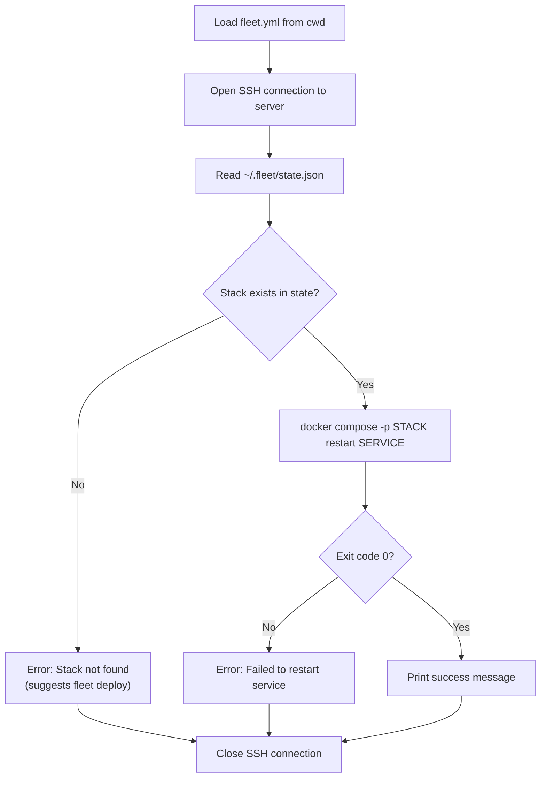

# Restart Operation

The `fleet restart` command restarts a single service within a running stack.
It is the lightest-touch lifecycle operation -- it does not modify [Caddy routes](../caddy-proxy/overview.md),
Docker networks, volumes, or [Fleet state](../state-management/overview.md). The restarted container keeps its
network identity, so reverse proxy routes remain valid throughout.

## What it does

The restart operation runs `docker compose -p <stack> restart <service>` on the
remote server over SSH. This sends `SIGTERM` to the container, waits for it to
stop, then starts it again using the same container definition.

**Source**: `src/restart/restart.ts`

## What it does NOT do

- Does **not** remove or re-register Caddy reverse proxy routes
- Does **not** modify `~/.fleet/state.json`
- Does **not** pull new images or apply configuration changes
- Does **not** affect other services in the stack

## Why Caddy routes are not touched

When `docker compose restart` restarts a container, the container retains its
network identity within the Docker Compose project network. The container name
and its DNS entry on the `fleet-proxy` Docker network remain the same. Since
Caddy routes reference the upstream by container hostname (e.g.,
`<stack>-<service>-1:<port>`), the routes continue to resolve correctly after
the restart.

By contrast, `stop` and `teardown` halt or remove containers entirely. This
makes the upstream unreachable, so leaving stale routes would produce
`502 Bad Gateway` errors from Caddy.

## Why state is not updated

The restart operation does not change the deployment -- the same image, the same
configuration, and the same routes are all still in effect. The server state
file records what is *deployed*, not what is *running*. Since a restart does not
change the deployment, updating state would be incorrect.

## Execution flow

### Step-by-step

1. **Load configuration** (`src/restart/restart.ts:28-29`): Reads `fleet.yml`
   from the current directory using `loadFleetConfig()`.
2. **SSH connect** (`src/restart/restart.ts:33`): Opens a connection to the
   remote server using `createConnection(config.server)`.
3. **Read state** (`src/restart/restart.ts:38`): Fetches and parses
   `~/.fleet/state.json` from the server.
4. **Validate stack** (`src/restart/restart.ts:41-46`): Confirms the stack name
   exists in state. If not found, throws an error suggesting `fleet deploy`.
5. **Restart service** (`src/restart/restart.ts:50`): Runs
   `docker compose -p <stack> restart <service>` via SSH.
6. **Close connection** (`src/restart/restart.ts:64-66`): The connection is
   closed in a `finally` block, ensuring cleanup even on failure.

## When to use restart

- A service is misbehaving (memory leak, stuck process) but its configuration
  has not changed
- You want the fastest recovery with no proxy downtime
- You need to clear in-memory state for a single service
- You want to verify that a service can start cleanly

## When NOT to use restart

- You have changed `docker-compose.yml` or environment variables -- use
  `fleet deploy` instead, since `docker compose restart` does not pick up
  compose file changes. See the [Deploy Sequence](../deploy/deploy-sequence.md)
  for details.
- You need to restart the entire stack -- run `fleet restart` for each
  service, or use `fleet stop` followed by `fleet deploy`
- You want to apply a new container image -- use `fleet deploy` which handles
  image pulling and selective redeployment

## Important limitation

From the [Docker Compose CLI reference](https://docs.docker.com/reference/cli/docker/compose/restart/):

> If you make changes to your `compose.yml` configuration, these changes are
> not reflected after running this command. For example, changes to environment
> variables (which are added after a container is built, but before the
> container's command is executed) are not updated after restarting.

This means `fleet restart` is only useful for restarting a service with its
*existing* configuration. For configuration changes, always use `fleet deploy`.

## Error handling

If the `docker compose restart` command returns a non-zero exit code, the
operation throws an error with the stderr output from Docker Compose. Common
causes:

- The named service does not exist in the compose project
- The Docker daemon is not running
- The compose project has no running containers

The outer `try/catch` block catches all errors, prints the failure message, and
exits with code 1. The SSH connection is always closed in the `finally` block.

## Related documentation

- [Stack Lifecycle Overview](./overview.md) -- comparison of all three operations
- [Stop Operation](./stop.md) -- stops the entire stack and removes routes
- [Teardown Operation](./teardown.md) -- destroys containers and networks
- [Failure Modes and Recovery](./failure-modes.md) -- troubleshooting guide
- [Stack Lifecycle Integrations](./integrations.md) -- external dependencies
- [SSH Connection Layer](../ssh-connection/overview.md) -- how remote commands are executed
- [Server State Management](../state-management/overview.md) -- how state is structured
- [Deploy Sequence](../deploy/deploy-sequence.md) -- the full deploy pipeline
  (use instead of restart for config changes)
- [Environment and Secrets](../env-secrets/overview.md) -- use `fleet env` +
  `fleet restart` to update secrets without redeploying
- [Configuration Overview](../configuration/overview.md) -- `fleet.yml`
  configuration reference
- [CLI Integrations](../cli-commands/integrations.md) -- how operational
  commands interact with Docker Compose and Caddy
- [Process Status](../process-status/overview.md) -- check container status
  after restart with `fleet ps`
