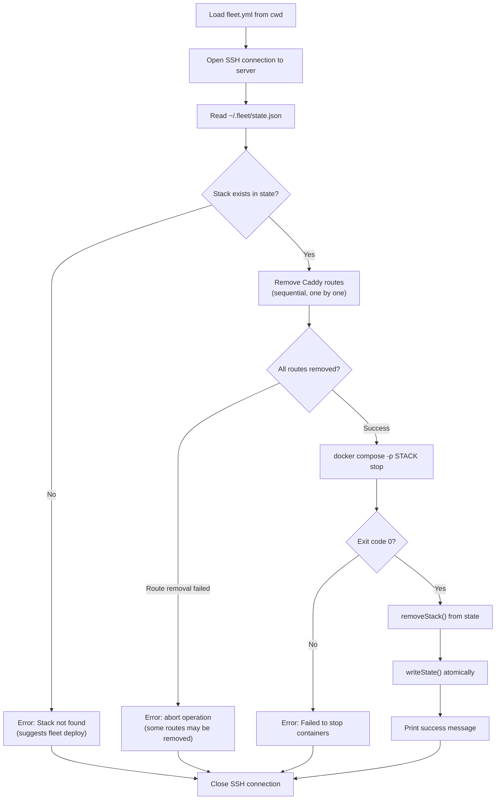

# Stop Operation

The `fleet stop` command halts all containers in a deployed stack and removes
its Caddy reverse proxy routes, but preserves containers, networks, images,
and volumes on disk. It is the intermediate lifecycle operation -- more
destructive than `restart` (which only touches a single service) but less
destructive than `teardown` (which removes containers and networks entirely).

## What it does

The stop operation performs three actions in sequence:

1. **Removes Caddy routes** -- deletes each route from the Caddy reverse proxy
   via its admin API
2. **Stops containers** -- runs `docker compose -p <stack> stop` to halt all
   containers
3. **Removes the stack from state** -- deletes the stack entry from
   [`~/.fleet/state.json`](../state-management/schema-reference.md) and writes the updated file atomically

**Source**: `src/stop/stop.ts`

## What it preserves

- **Containers** -- stopped containers remain on disk; they can be listed with
  `docker ps -a` on the server
- **Networks** -- the Docker Compose project network is preserved
- **Images** -- container images are not removed
- **Named volumes** -- all volume data (databases, uploads, etc.) remains intact

## What it removes

- **Caddy routes** -- all routes for the stack are deleted from the Caddy admin
  API, meaning the stack's domains will no longer resolve
- **Fleet state entry** -- the stack is removed from `~/.fleet/state.json`, so
  `fleet ps` will no longer list it

## Docker Compose stop vs down

From the [Docker Compose CLI reference](https://docs.docker.com/reference/cli/docker/compose/stop/):

> Stops running containers without removing them. They can be started again
> with `docker compose start`.

This contrasts with `docker compose down` (used by `teardown`), which removes
containers and networks. The `stop` command only sends `SIGTERM` to each
container and waits for graceful shutdown.

**Key distinction**: Even though `docker compose stop` preserves containers,
Fleet removes the stack from its state file. This means the containers are
technically still on the server but Fleet no longer tracks them. A subsequent
`fleet deploy` is required to re-register the stack in Fleet's state.

## Execution flow



### Step-by-step

1. **Load configuration** (`src/stop/stop.ts:40-41`): Reads `fleet.yml` from
   the current directory.
2. **SSH connect** (`src/stop/stop.ts:45`): Opens a connection to the remote
   server.
3. **Read state** (`src/stop/stop.ts:50`): Fetches `~/.fleet/state.json`.
4. **Validate stack** (`src/stop/stop.ts:53-58`): Confirms the stack exists in
   state. Throws if not found.
5. **Remove Caddy routes** (`src/stop/stop.ts:12-22`): Iterates over
   `stackState.routes` and calls `buildRemoveRouteCommand(route.caddy_id)` for
   each route. The route ID follows the format `<stackName>__<serviceName>`
   (see `src/caddy/commands.ts:11-13`). Each removal is a `DELETE` request to
   the Caddy admin API at `http://localhost:2019/id/<caddy_id>`, executed via
   `docker exec fleet-proxy curl ...` on the server.
6. **Stop containers** (`src/stop/stop.ts:25`): Runs
   `docker compose -p <stackName> stop`.
7. **Update state** (`src/stop/stop.ts:66-67`): Calls `removeStack()` to
   create a new state object without the stack entry, then `writeState()` to
   persist it atomically (writes to a `.tmp` file then `mv`).
8. **Close connection** (`src/stop/stop.ts:81-83`): Always closed in `finally`.

## How Caddy route removal works

Each route in the stack's state has a `caddy_id` field (format:
`<stackName>__<serviceName>`). The removal command is:

```
docker exec fleet-proxy curl -s -f -X DELETE http://localhost:2019/id/<caddy_id>
```

This uses the [Caddy admin API's `@id` traversal feature](https://caddyserver.com/docs/api#using-id-in-json)
to delete a route by its ID without needing to know its position in the routes
array.

Routes are removed **sequentially** -- one at a time. If any route removal
fails (non-zero exit code from `curl`), the operation **aborts immediately**.
Routes already removed are not restored. See
[Failure Modes and Recovery](./failure-modes.md) for how to handle this.

## How state is updated

The `removeStack()` function (`src/state/state.ts:100-106`) creates a new state
object using the spread operator, excluding the named stack:

```
const { [name]: _, ...remainingStacks } = state.stacks;
return { ...state, stacks: remainingStacks };
```

This immutable pattern means the original state object is not modified. The
caller must pass the returned object to `writeState()` to persist the change.

The `writeState()` function (`src/state/state.ts:74-91`) writes atomically by:

1. Creating `~/.fleet/state.json.tmp` with the new content via heredoc
2. Using `mv` to atomically replace `~/.fleet/state.json`

This ensures the state file is never left in a partial-write state.

## When to use stop

- You want to temporarily halt a stack while preserving all data
- You plan to redeploy soon and want a clean starting point
- You want to free compute resources (CPU/memory) while keeping containers
  and volumes intact for potential forensic analysis
- You are troubleshooting and want the stack offline but recoverable

## When NOT to use stop

- You want a quick service recovery -- use `fleet restart` instead
- You want to permanently remove the stack -- use `fleet teardown` instead
- You want to free disk space -- `stop` preserves containers on disk; use
  `teardown` to remove them

## Related documentation

- [Stack Lifecycle Overview](./overview.md) -- comparison of all three operations
- [Restart Operation](./restart.md) -- lightest-touch restart
- [Teardown Operation](./teardown.md) -- full stack destruction
- [Failure Modes and Recovery](./failure-modes.md) -- troubleshooting guide
- [Operational CLI Commands](../cli-commands/operational-commands.md) -- `fleet stop`
  in the context of all operational commands
- [Caddy Reverse Proxy Configuration](../caddy-proxy/overview.md) -- how routes are
  managed via the admin API
- [Server State Management](../state-management/overview.md) -- how state is structured
  and persisted atomically
- [State Schema Reference](../state-management/schema-reference.md) -- the
  `RouteState` and `caddy_id` fields used during route removal
- [State Lifecycle](../state-management/state-lifecycle.md) -- how state
  transitions occur during stop and other lifecycle operations
- [Proxy Status and Reload](../proxy-status-reload/overview.md) -- how to
  inspect and repair Caddy routes after a partial stop failure
- [Deploy Sequence](../deploy/deploy-sequence.md) -- how to re-deploy a stack
  after stopping it
- [CLI Entry Point](../cli-entry-point/overview.md) -- `fleet stop` in the
  context of all Fleet CLI commands
