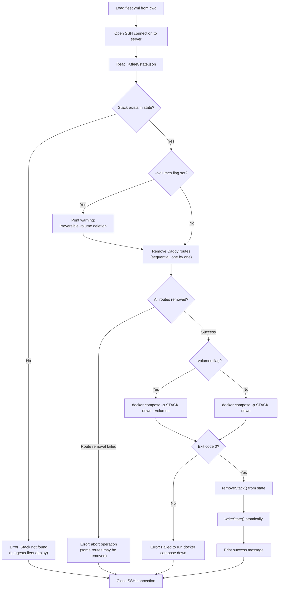

# Teardown Operation

The `fleet teardown` command is the most destructive lifecycle operation. It
removes [Caddy reverse proxy](../caddy-proxy/overview.md) routes, destroys
containers and networks via `docker compose down`, and removes the stack from
Fleet's [state file](../state-management/overview.md). With the optional
`--volumes` flag, it also deletes all persistent Docker volumes, permanently
destroying database data, uploaded files, and any other volume-backed storage.

## What it does

The teardown operation performs three actions in sequence:

1. **Removes Caddy routes** -- deletes each route from the Caddy reverse proxy
   via its admin API
2. **Destroys containers and networks** -- runs `docker compose -p <stack> down`
   (or `docker compose -p <stack> down --volumes`)
3. **Removes the stack from state** -- deletes the stack entry from
   `~/.fleet/state.json` and writes the updated file atomically (see
   [State Lifecycle](../state-management/state-lifecycle.md) for the full
   state flow during teardown)

**Source**: `src/teardown/teardown.ts`

## Docker Compose down: what is removed

From the [Docker Compose CLI reference](https://docs.docker.com/reference/cli/docker/compose/down/):

> Stops containers and removes containers, networks, volumes, and images
> created by `up`. By default, the only things removed are: containers for
> services defined in the Compose file, networks defined in the networks
> section of the Compose file, and the default network. Networks and volumes
> defined as external are never removed.

### Without `--volumes`

| Resource | Action |
|----------|--------|
| Containers | Removed |
| Project network | Removed |
| Named volumes | **Preserved** |
| Anonymous volumes | Not removed by default |
| Images | Preserved |

### With `--volumes`

| Resource | Action |
|----------|--------|
| Containers | Removed |
| Project network | Removed |
| Named volumes | **Removed (irreversible)** |
| Anonymous volumes | **Removed** |
| Images | Preserved |

**The `--volumes` flag permanently deletes all data stored in Docker volumes.**
This includes database files, uploaded content, session stores, and any other
persistent data. There is no undo.

## The `--volumes` flag warning

When `--volumes` is passed, Fleet prints an explicit warning before proceeding
(`src/teardown/teardown.ts:59-63`):

```
Warning: --volumes flag is set. This will irreversibly delete all persistent
volumes for stack "<stack>".
```

This warning appears before any destructive action is taken, giving the
operator a chance to verify the command is intentional.

## Execution flow



### Step-by-step

1. **Load configuration** (`src/teardown/teardown.ts:39-41`): Reads `fleet.yml`
   from the current directory.
2. **SSH connect** (`src/teardown/teardown.ts:45`): Opens a connection to the
   remote server.
3. **Read state and validate** (`src/teardown/teardown.ts:50-56`): Fetches
   `~/.fleet/state.json` and confirms the stack exists.
4. **Volume warning** (`src/teardown/teardown.ts:59-63`): If `--volumes` is set,
   prints an explicit warning about irreversible data loss.
5. **Remove Caddy routes** (`src/teardown/teardown.ts:13-20`): Iterates over
   `routes` and calls `buildRemoveRouteCommand(route.caddy_id)` for each.
   Routes are removed sequentially. A failure aborts the operation immediately.
6. **Docker compose down** (`src/teardown/teardown.ts:22-31`): Constructs the
   command with or without `--volumes` based on the flag, then executes it.
7. **Update state** (`src/teardown/teardown.ts:71-72`): Removes the stack from
   state and persists the update atomically.
8. **Close connection** (`src/teardown/teardown.ts:86-88`): Always closed in
   `finally`.

## How Caddy route removal works

Identical to the [stop operation's route removal](./stop.md#how-caddy-route-removal-works).
Each route is deleted via:

```
docker exec fleet-proxy curl -s -f -X DELETE http://localhost:2019/id/<caddy_id>
```

where `caddy_id` follows the format `<stackName>__<serviceName>`. Routes are
removed sequentially, and the first failure aborts the operation.

## What data is lost with `--volumes`

Docker named volumes typically store:

- **Database data** -- PostgreSQL, MySQL, MongoDB, Redis data directories
- **Uploaded files** -- user-uploaded content stored in volume-mounted paths
- **Application state** -- session stores, cache directories, queue data
- **Logs** -- if your compose file mounts a log volume

Before using `--volumes`, verify what volumes your compose file declares:

```bash
# SSH into the server and inspect the compose project's volumes
docker compose -p <stack> config --volumes
```

## The `fleet-proxy` network

The `fleet-proxy` Docker network is declared as `external: true` in the proxy's
compose file (see [Proxy Compose](../caddy-proxy/proxy-compose.md)). This means
`docker compose down` will **not** remove it, even during teardown. The network
is shared across all Fleet stacks and is only created during
[bootstrap](../bootstrap/bootstrap-sequence.md). This is by design -- removing
the shared network would break routing for all other deployed stacks.

## When to use teardown

- You are permanently removing a stack from the server
- You want to clean up containers and networks to free disk space
- You want a fully clean slate before redeploying from scratch

## When to use teardown --volumes

- You are decommissioning a stack and want no traces left
- You want to start completely fresh, including data
- **You understand this is irreversible** -- there is no undo for volume
  deletion

## When NOT to use teardown

- You want a quick service recovery -- use [`fleet restart`](./restart.md)
- You want to temporarily halt the stack but keep data for quick recovery --
  use [`fleet stop`](./stop.md)
- You only want to restart a single service -- use [`fleet restart`](./restart.md)

## Related documentation

- [Stack Lifecycle Overview](./overview.md) -- comparison of all three operations
- [Restart Operation](./restart.md) -- lightest-touch restart
- [Stop Operation](./stop.md) -- intermediate halt
- [Failure Modes and Recovery](./failure-modes.md) -- troubleshooting guide
- [Integrations Reference](./integrations.md) -- Docker Compose, Caddy, SSH,
  and state integrations for lifecycle operations
- [Caddy Admin API Reference](../caddy-proxy/caddy-admin-api.md) -- route
  deletion endpoint details
- [Caddy Reverse Proxy Troubleshooting](../caddy-proxy/troubleshooting.md) --
  debugging route removal failures
- [Deployment Troubleshooting](../deploy/troubleshooting.md) -- includes ghost
  route handling and state recovery after interrupted operations
- [Proxy Status Command](../proxy-status-reload/proxy-status.md) -- detecting
  ghost routes after failed teardown
- [Server State Management](../state-management/overview.md) -- how state is
  structured and persisted atomically
- [State Lifecycle](../state-management/state-lifecycle.md) -- state flow during
  stop and teardown
- [Operational CLI Commands](../cli-commands/operational-commands.md) -- full
  CLI reference for teardown and other lifecycle commands
