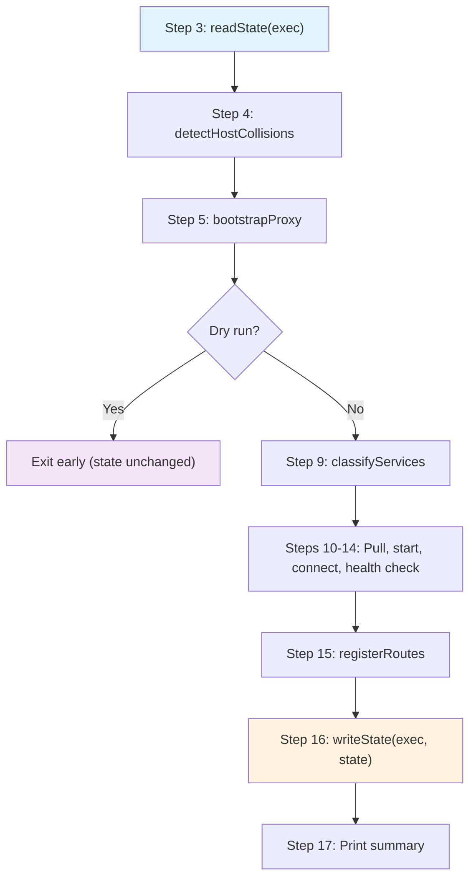
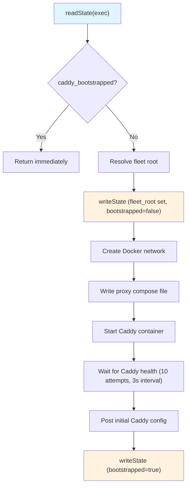
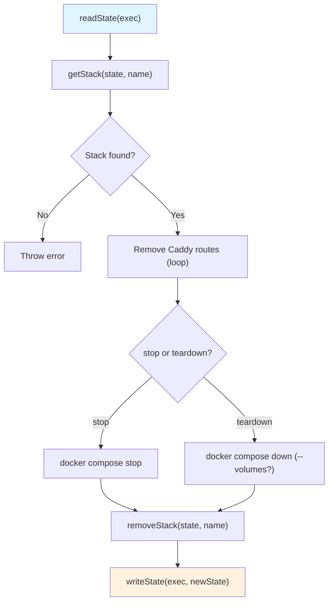
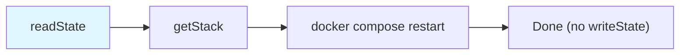
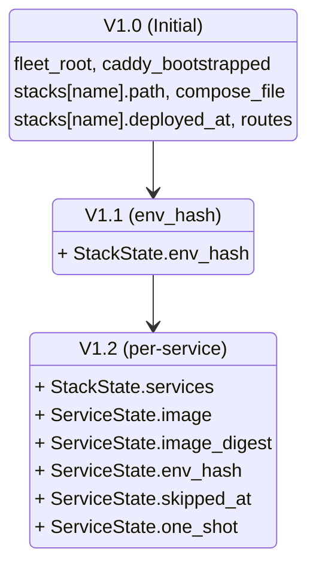
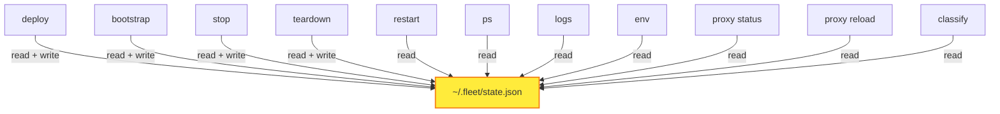
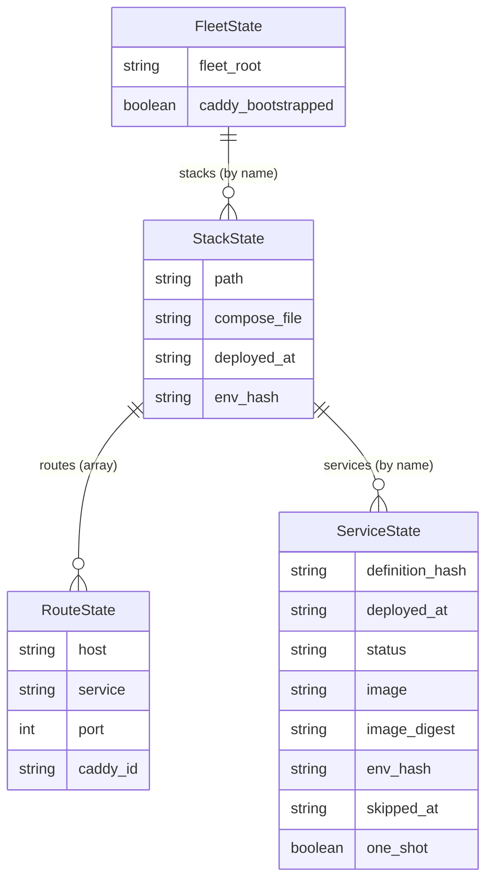
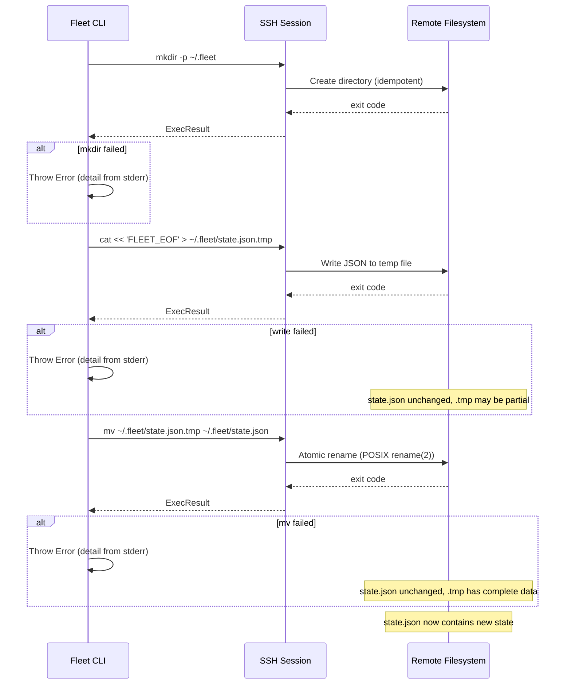

# State Lifecycle

This page documents how `FleetState` flows through the deployment pipeline
and other Fleet operations. The state file is the central coordination point
for nearly every Fleet command.

## State across the deploy pipeline

The deploy pipeline (`src/deploy/deploy.ts`) reads state once at the beginning
and writes it once at the end. Between those two points, multiple modules
inspect and mutate the in-memory state object.

### Detailed state mutations during deploy

| Step | Module | State interaction | Description |
|---|---|---|---|
| 3 | `deploy/deploy.ts:71` | **Read** | Load full `FleetState` from `~/.fleet/state.json` |
| 4 | `deploy/helpers.ts:60-82` | Read-only | Scan `state.stacks` for host collisions with incoming routes |
| 5 | `deploy/helpers.ts:90-134` | Read + Write | If `caddy_bootstrapped` is false, resolve fleet root, bootstrap Caddy, and return updated state with `caddy_bootstrapped: true` and `fleet_root` set |
| 9 | `deploy/classify.ts:43-104` | Read-only | Compare candidate hashes against `stackState.services` to classify each service as deploy/restart/skip |
| 10-14 | Various | N/A | Docker operations (no state interaction) |
| 15 | `deploy/helpers.ts:361-403` | N/A | Register routes with Caddy API (returns `RouteState[]` for state) |
| 16 | `deploy/deploy.ts:367-385` | **Write** | Construct new `StackState` with routes, services, and timestamp; merge into `FleetState`; write to disk |

### Critical gap: steps 12-16

If the deploy fails between step 12 (starting containers) and step 16
(writing state), containers are running but state is stale. This means:

- The next `fleet ps` may not show the new services correctly
- The next `fleet deploy` will re-classify services based on outdated hashes
- Route registrations (step 15) are live in Caddy but not recorded in state

Recovery: re-run `fleet deploy`. The pipeline will detect running containers,
recompute hashes, and write correct state. See
[Deploy Failure Recovery](../deploy/failure-recovery.md) for more recovery
scenarios and [Deployment Troubleshooting](../deploy/troubleshooting.md) for
step-by-step error diagnosis.

## State across bootstrap

The bootstrap sequence (`src/bootstrap/bootstrap.ts`) performs two state
writes: once to persist the resolved fleet root, and once to mark bootstrap
complete.

The two-phase write pattern means that if bootstrap fails after step E but
before step K, the fleet root is persisted but `caddy_bootstrapped` remains
false. The next bootstrap attempt will retry from step F (Docker network
creation), reusing the already-resolved fleet root.

## State across stop and teardown

Both `stop` and `teardown` follow the same pattern: read state, validate the
stack exists, remove Caddy routes, stop/destroy containers, remove the stack
from state, and write. See [Teardown Operation](../stack-lifecycle/teardown.md)
and [Stop Operation](../stack-lifecycle/stop.md) for full details.

**Failure points**: If Caddy route removal fails (step E), the operation
aborts immediately. State is NOT updated, leaving the server in a partially
modified state where some routes may have been removed but containers are
still running.

## State across restart

Restart is the simplest lifecycle operation. It reads state to validate the
stack exists but does **not** write state afterward -- a container restart
does not change the deployment metadata.

## Read-only vs. read-write commands

Understanding which commands mutate state is important for debugging and
auditing:

| Command | Reads state | Writes state | Notes |
|---|---|---|---|
| `fleet deploy` | Yes | Yes | Writes at step 16 with full stack metadata |
| `fleet stop` | Yes | Yes | Removes the stack from state |
| `fleet teardown` | Yes | Yes | Removes the stack from state |
| `fleet restart` | Yes | No | Validates stack exists, no state change |
| `fleet ps` | Yes | No | Displays stack/service info |
| `fleet logs` | Yes | No | Validates stack exists for project name |
| `fleet env` | Yes | No | Looks up stack directory path (see [Environment and Secrets Overview](../env-secrets/overview.md)) |
| `fleet proxy status` | Yes | No | Reconciles live Caddy routes with state (see [Proxy Status](../proxy-status-reload/proxy-status.md)) |
| `fleet proxy reload` | Yes | No | Reads routes from state, reloads in Caddy |
| Bootstrap | Yes | Yes | Sets `fleet_root` and `caddy_bootstrapped` |

## Schema evolution timeline

The state schema has evolved across Fleet versions. Fields are added as
optional in the Zod schema to maintain backward compatibility:

When reading older state files:

- **V1.0 files**: Pass validation because `env_hash` and `services` are
  optional in the Zod schema. `fleet ps` falls back to stack-level
  `deployed_at` when `services` is absent (`src/ps/ps.ts:150-172`). See
  [State Version Compatibility](../process-status/state-version-compatibility.md)
  for details on how `ps` handles each version.
- **V1.1 files**: Pass validation. Per-service classification works for
  existing services but treats all as "new" since there is no stored
  `ServiceState` to compare against.
- **V1.2+ files**: Full functionality including selective deploy with
  per-service hash comparison.

New fields are populated on the next deployment and persisted via `writeState`.
No explicit migration step is required -- the schema evolves naturally as
stacks are redeployed.

## State as coordination point

The state file serves as the sole coordination mechanism between Fleet's
various subsystems:

This architecture means:

- **All deployment knowledge is in one place**: There is no split-brain
  between separate databases or services.
- **State loss is recoverable**: Re-running `fleet deploy` reconstructs state
  from the actual Docker containers and current configuration.
- **Debugging is straightforward**: `cat ~/.fleet/state.json` shows exactly
  what Fleet believes about the server.

## Data model structure

The state model is hierarchical. Different modules operate on different
levels of this hierarchy:

Module-level access patterns by data tier:

| Data tier | Modules that read/write | Purpose |
|---|---|---|
| `FleetState` (top-level) | bootstrap, deploy | `caddy_bootstrapped` flag, `fleet_root` path |
| `StackState` | deploy, stop, teardown, ps, env | Stack paths, timestamps, env hashes |
| `ServiceState` | deploy (classify), ps | Per-service hash comparison, status display |
| `RouteState` | deploy (route registration), teardown (route removal), proxy status/reload | Caddy route identifiers for admin API operations |

## Atomic write protocol

The `writeState` function in `src/state/state.ts:74-97` implements a
three-step crash-safe write protocol over SSH:

Each step is a separate SSH `exec` call with independent error handling.
At no point can `state.json` contain partial data -- readers always see
either the complete previous state or the complete new state. See the
[operations guide](./operations-guide.md#ssh-connection-drops-during-write)
for failure mode analysis at each stage.

## Related documentation

- [State management overview](./overview.md) -- architecture and design
  decisions
- [State schema reference](./schema-reference.md) -- field-by-field
  documentation
- [Operations guide](./operations-guide.md) -- inspect, back up, and recover
  state
- [Deployment pipeline](../deployment-pipeline.md) -- the 17-step deploy
  sequence
- [Deploy Sequence](../deploy/deploy-sequence.md) -- detailed step-by-step
  deploy flow
- [Deploy Failure Recovery](../deploy/failure-recovery.md) -- recovering from
  mid-deploy failures
- [Bootstrap Integrations](../bootstrap/bootstrap-integrations.md) -- how
  bootstrap writes initial state
- [Stack Lifecycle Overview](../stack-lifecycle/overview.md) -- how stop,
  teardown, and restart interact with state
- [Teardown Operation](../stack-lifecycle/teardown.md) -- stack removal and
  state cleanup
- [State Version Compatibility](../process-status/state-version-compatibility.md)
  -- how `fleet ps` handles different state versions
- [Fleet Root Directory Layout](../fleet-root/directory-layout.md) -- the
  filesystem layout that state references
- [SSH Connection API](../ssh-connection/connection-api.md) -- the `ExecFn`
  interface used by `readState` and `writeState` for remote execution
- [Environment and Secrets Overview](../env-secrets/overview.md) -- how
  `fleet env` reads state to locate stack directories
- [Proxy Status Command](../proxy-status-reload/proxy-status.md) -- how proxy
  status reconciles live Caddy routes against state
