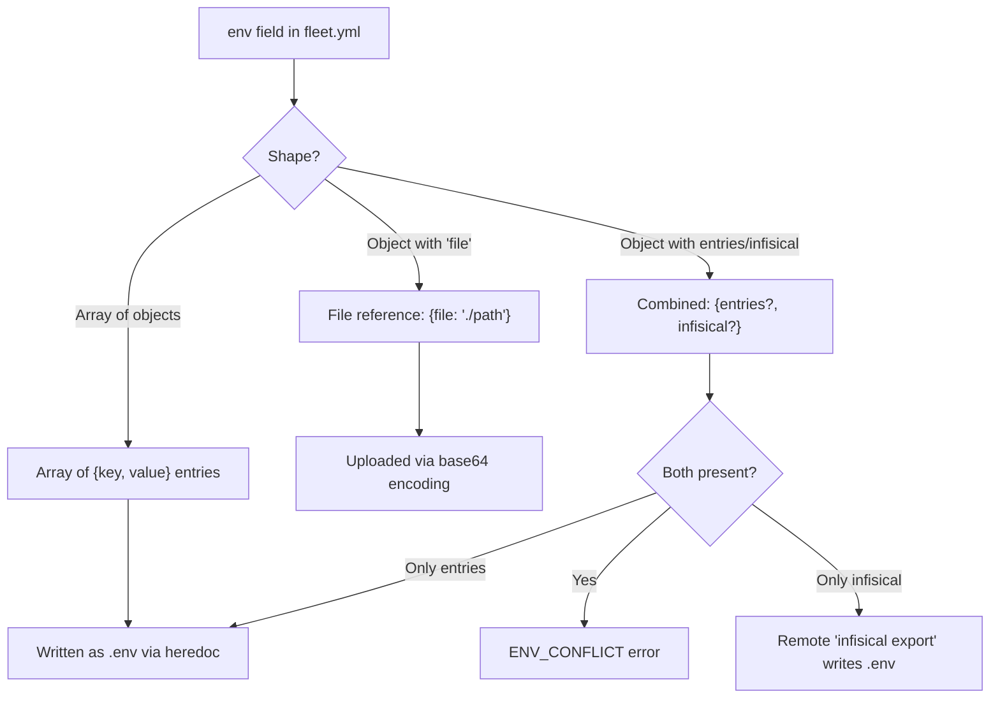

# Fleet Configuration Checks

Fleet configuration checks validate the `FleetConfig` object produced by parsing
`fleet.yml`. These checks run first in the validation pipeline, before any
compose-level checks. They verify stack naming, environment variable
configuration, domain names, port numbers, and route uniqueness.

Source: `src/validation/fleet-checks.ts`

## How the FleetConfig is loaded

Before validation runs, the `fleet.yml` file is loaded and parsed by the
[configuration module](../configuration/overview.md):

1. `loadFleetConfig(filePath)` reads the YAML file from disk
   (`src/config/loader.ts:9`).
2. The YAML is parsed with the `yaml` library (`src/config/loader.ts:16`).
3. The parsed object is validated against the Zod schema
   `fleetConfigSchema` (`src/config/schema.ts:53-59`).
4. If the Zod schema validation fails, a formatted error is thrown before
   the validation checks ever run.

This means the validation checks in this module can assume the config is
structurally valid Zod output. They focus on **semantic** correctness that
the schema cannot express.

## Stack name validation

**Function**: `checkInvalidStackName(config)` at `src/validation/fleet-checks.ts:97-108`

**What it checks**: The `config.stack.name` field against `STACK_NAME_REGEX`,
defined in `src/config/schema.ts:46` as `/^[a-z\d][a-z\d-]*$/`.

**Why the regex is stricter than Docker Compose**: Docker Compose project names
allow lowercase letters, digits, dashes, and underscores, and must begin with a
lowercase letter or digit. Fleet's pattern omits underscores. This extra
restriction exists because the stack name is used in multiple contexts:

- As the Docker Compose project name (`-p` flag), which becomes a prefix in
  container names: `{stack}-{service}-1`
- As part of the Caddy route identifier: `{stack}__{service}`
  (see `src/caddy/commands.ts:11-13`)
- As a directory name on the remote server under the Fleet root:
  `{fleet_root}/stacks/{stack}/`

Using only lowercase alphanumeric and hyphens ensures compatibility across all
these contexts without escaping or transformation.

## Environment conflict detection

**Function**: `checkEnvConflict(config)` at `src/validation/fleet-checks.ts:4-25`

**What it checks**: Whether both `env.entries` (inline key-value pairs) and
`env.infisical` (Infisical secrets manager) are simultaneously configured with
non-empty values.

### The three env configuration shapes

The `env` field in `fleet.yml` is a Zod union of three shapes
(`src/config/schema.ts:57`). See
[Environment Configuration Shapes](../env-secrets/env-configuration-shapes.md)
for detailed examples of each shape:

The conflict check uses defensive type narrowing because the union type requires
runtime discrimination:

1. Check that `config.env` exists.
2. Check it is not an array (eliminating the first union branch).
3. Check it does not have a `file` property (eliminating the second branch).
4. Check that both `entries` and `infisical` are present and non-empty.

If all conditions hold, the check produces an error-severity `ENV_CONFLICT`
finding.

### Severity rationale

This is an **error**, not a warning. The runtime behavior when both are set is
that `env.infisical` overwrites the file created by `env.entries` --- a silent
data loss scenario. Blocking deployment is the correct response.

## FQDN validation

**Function**: `checkFqdnFormat(routes)` at `src/validation/fleet-checks.ts:47-60`

**What it checks**: Each route's `domain` field against RFC 1035 FQDN rules.

### The isValidFqdn algorithm

The helper function at `src/validation/fleet-checks.ts:27-45` implements:

1. **Length check**: Total domain length must be 1--253 characters.
2. **Label count**: Must have at least 2 labels (e.g., `a.b` is valid,
   `localhost` is not).
3. **Per-label validation**: Each label must be 1--63 characters and match
   `/^[a-zA-Z0-9]([a-zA-Z0-9-]{0,61}[a-zA-Z0-9])?$/`.

### What this does NOT support

| Feature | Supported? | Details |
|---------|------------|---------|
| Wildcard domains (`*.example.com`) | No | The `*` character fails the label regex |
| Internationalized domain names (IDN) | No | Unicode characters are rejected; punycode-encoded ASCII equivalents are accepted |
| Trailing dot (`example.com.`) | No | Creates an empty final label which fails validation |
| Single-label domains (`localhost`) | No | Requires at least 2 labels |

These limitations are intentional for Fleet's use case: routes map to Caddy
reverse proxy host matchers, which operate on standard ASCII FQDNs. If wildcard
or IDN support becomes necessary, the `isValidFqdn` function would need
modification.

## Port range validation

**Function**: `checkPortRange(routes)` at `src/validation/fleet-checks.ts:62-75`

**What it checks**: Each route's `port` field is between 1 and 65535 inclusive.

This port is the **container-internal** port that the Caddy reverse proxy
forwards traffic to. It is not a host port --- it corresponds to the port the
service listens on inside its Docker container. This is the `target` port in
Docker Compose port mapping terminology.

## Duplicate host detection

**Function**: `checkDuplicateHosts(routes)` at `src/validation/fleet-checks.ts:77-95`

**What it checks**: No two routes in the same `fleet.yml` file use the same
`domain` value.

The check counts occurrences of each domain and reports any domain that appears
more than once. The error message includes the count of duplicates.

**Note on cross-stack collisions**: This check only detects duplicates within a
single `fleet.yml`. Cross-stack host collisions (where two different stacks try
to claim the same domain) are handled separately during
[deployment](../deploy/deploy-sequence.md) by the
`detectHostCollisions` function in `src/deploy/helpers.ts:60-82`, which compares
against all stacks recorded in the [server state file](../state-management/overview.md).

## Related documentation

- [Validation Overview](./overview.md)
- [Validation Codes Reference](./validation-codes.md) -- Full catalog of codes
  and resolutions.
- [Compose Configuration Checks](./compose-checks.md) -- Checks against Docker
  Compose file structure.
- [Validation Troubleshooting](./troubleshooting.md) -- Diagnosing validation
  failures.
- [Fleet Configuration Schema](../configuration/overview.md) -- The Zod schema that
  defines valid `fleet.yml` structure.
- [Configuration Schema Reference](../configuration/schema-reference.md) --
  Field-by-field specification of all config fields.
- [Environment and Secrets Overview](../env-secrets/overview.md) -- The three
  env configuration shapes validated by `checkEnvConflict`.
- [Caddy Proxy Overview](../caddy-proxy/overview.md) -- Why ports 80/443 are
  reserved and how Caddy route IDs use stack names.
- [Deploy Sequence](../deploy/deploy-sequence.md) -- Validation runs at Step 1
  of the deploy pipeline.
- [Project Init Utility Functions](../project-init/utility-functions.md) --
  `slugify()` uses the same `STACK_NAME_REGEX`.
