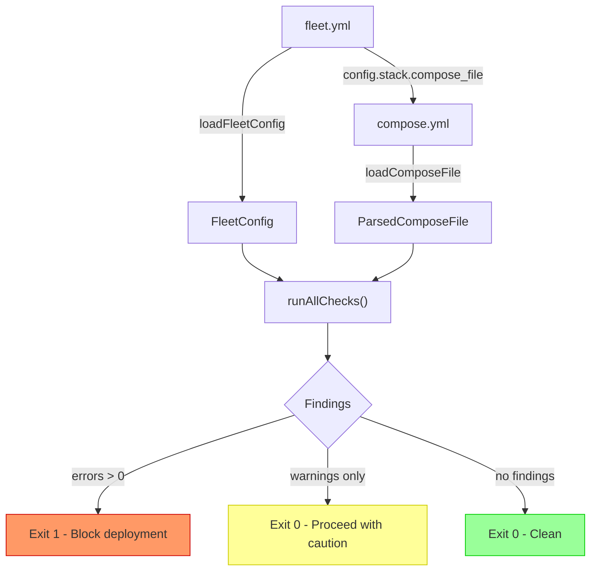

# Configuration and Compose Validation

Fleet's validation layer is a pre-flight check system that catches misconfigurations
in both the Fleet configuration file (`fleet.yml`) and the referenced Docker Compose
file before a deployment can proceed. It runs 10 distinct checks across two data
sources, producing structured findings with error codes, human-readable messages,
and actionable resolutions.

## Why validation exists

Deploying a misconfigured stack to a remote server is expensive to debug. A bad
domain name, a port conflict with the [reverse proxy](../caddy-proxy/overview.md), or a missing service reference
can leave the server in a partially deployed state that requires manual SSH
intervention. The validation layer prevents these issues by failing fast with
clear diagnostics.

## How validation fits into Fleet

Validation runs in two contexts:

1. **Explicitly via `fleet validate`** --- The standalone CLI command that operators
   run to check configuration before deploying. See
   [validate command](./validate-command.md).

2. **Automatically during `fleet deploy`** --- The [deployment pipeline](../deployment-pipeline.md) calls
   `runAllChecks()` at Step 1 (`src/deploy/deploy.ts:49`). See the
   [deploy sequence](../deploy/deploy-sequence.md) for where validation fits
   in the 17-step pipeline. If any error-severity
   findings exist, the deploy aborts before opening an SSH connection. Warnings
   are collected and displayed in the deployment summary but do not block
   deployment.

## Architecture

The validation system is split into four source files:

| File | Purpose |
|------|---------|
| `src/validation/types.ts` | Defines the `Finding` interface, `Severity` type, and all error `Codes` |
| `src/validation/fleet-checks.ts` | Checks that operate on the `FleetConfig` object (domains, ports, stack name, env conflicts) |
| `src/validation/compose-checks.ts` | Checks that operate on the `ParsedComposeFile` (reserved ports, missing services, image/build, restart policies) |
| `src/validation/index.ts` | Barrel exports and the `runAllChecks()` orchestrator |
| `src/commands/validate.ts` | CLI command registration and output formatting |

### Check execution order

`runAllChecks()` in `src/validation/index.ts:27-38` runs checks in a fixed order.
There is no dependency between checks --- each receives the same input and produces
an independent list of findings. The results are concatenated into a single array.

1. `checkInvalidStackName(config)`
2. `checkEnvConflict(config)`
3. `checkFqdnFormat(config.routes)`
4. `checkPortRange(config.routes)`
5. `checkDuplicateHosts(config.routes)`
6. `checkReservedPortConflicts(compose)`
7. `checkServiceNotFound(config, compose)`
8. `checkPortExposed(compose)`
9. `checkNoImageOrBuild(compose)`
10. `checkOneShotNoMaxAttempts(compose)`

Fleet-level checks (1--5) run before compose-level checks (6--10), but this
ordering has no functional impact --- all checks execute regardless of earlier
findings.

## Extending validation

The check list in `runAllChecks()` is hard-coded. There is no plugin mechanism,
check registry, or hook system for adding custom checks without modifying
`src/validation/index.ts`. To add a new check:

1. Define a function in `fleet-checks.ts` or `compose-checks.ts` (or a new file)
   that accepts `FleetConfig` and/or `ParsedComposeFile` and returns `Finding[]`.
2. Add a new code constant to the `Codes` object in `types.ts`.
3. Add the check call to the `runAllChecks()` function in `index.ts`.
4. Export the function from `index.ts`.

## Cross-group dependencies

- **[Configuration](../configuration/)** --- Provides `loadFleetConfig`, `FleetConfig`,
  `RouteConfig`, and `STACK_NAME_REGEX`.
- **[Compose Parsing](../compose/overview.md)** --- Provides `loadComposeFile`,
  `ParsedComposeFile`, and query functions (`serviceExists`,
  `findServicesWithoutImageOrBuild`, `findHostPortBindings`,
  `findReservedPortConflicts`).
- **[Deployment Pipeline](../deployment-pipeline.md)** --- Calls `runAllChecks()` at
  Step 1 of the deploy sequence.
- **[CLI Entry Point](../cli-entry-point/)** --- Registers the `validate` subcommand.
- **[Caddy Reverse Proxy](../caddy-proxy/)** --- Architectural dependency: the port
  80/443 reservation checks exist because the Caddy proxy claims these ports.

## Related pages

- [Validation Codes Reference](./validation-codes.md) --- Complete catalog of all
  error and warning codes with triggers and resolutions.
- [Fleet Configuration Checks](./fleet-checks.md) --- Checks against `fleet.yml`
  values.
- [Compose Configuration Checks](./compose-checks.md) --- Checks against Docker
  Compose file structure.
- [Validate Command](./validate-command.md) --- CLI usage and behavior.
- [Troubleshooting](./troubleshooting.md) --- Common validation failures and how
  to fix them.
- [Configuration Loading and Validation](../configuration/loading-and-validation.md) ---
  How the config loader processes and validates `fleet.yml` before validation
  checks run.
- [Project Initialization Overview](../project-init/overview.md) --- How
  `fleet init` generates `fleet.yml` that is subsequently validated.
- [Deploy Sequence](../deploy/deploy-sequence.md) --- The 17-step pipeline
  where validation runs as Step 1.
- [Project Init Integrations](../project-init/integrations.md) --- How project
  initialization integrates with validation and other Fleet subsystems.
